# 通用算法库 (algo-prod) - 架构设计

本文档提供 algo-prod 通用算法库的架构设计，涵盖距离计算、量化器、K-Means 聚类、基础数据结构等核心模块。

---

## 项目信息

- **名称**: algo-prod 通用算法库
- **类型**: 向量检索基础设施 + 通用数据结构与算法
- **语言**: C11
- **构建系统**: CMake 3.20+

---

## 1. 子系统架构概览

algo-prod 算法库作为向量索引系统的底层基础设施，提供距离计算、向量量化、聚类算法和基础数据结构四大核心能力。

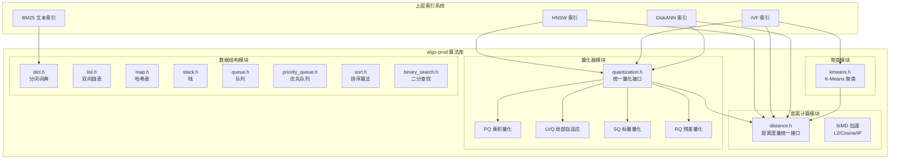

---

## 2. 距离计算模块

距离计算是向量索引系统的核心基础，所有近似最近邻搜索算法（HNSW、IVF、DiskANN）都需要通过距离度量判断向量间的相似性。本模块屏蔽不同距离度量的实现差异，并提供统一的接口。

### 2.1 距离度量类型

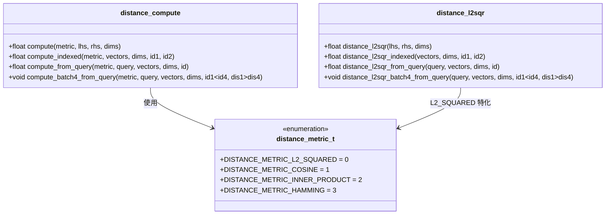

**距离度量说明**:

| 度量类型 | 适用场景 | 数学定义 |
|----------|----------|----------|
| L2_SQUARED | 通用向量检索，HNSW/IVF 默认距离 | `||lhs - rhs||_2^2` |
| COSINE | 文本/语义向量，归一化后等价于 L2 | `1 - (lhs . rhs) / (||lhs|| * ||rhs||)` |
| INNER_PRODUCT | 推荐系统、最大内积搜索 (MIPS) | `lhs . rhs` |
| HAMMING | 二值向量、哈希签名 | 对应位不同的数量 |

### 2.2 距离计算流程

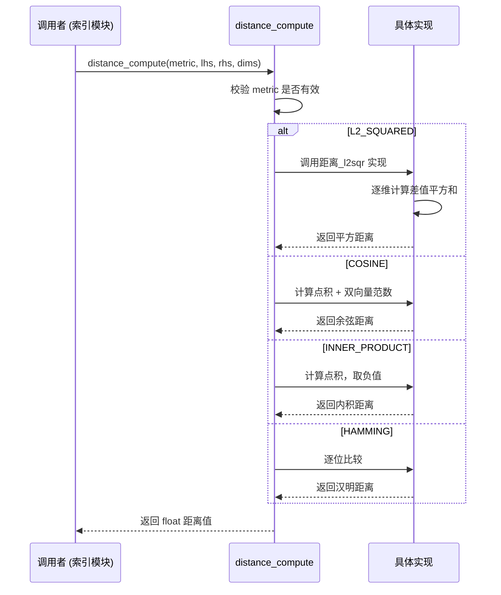

**批处理接口**: `distance_compute_batch4_from_query` 一次计算查询向量与 4 个基向量的距离，利用 SIMD 和循环展开减少函数调用开销，在 HNSW 搜索的关键路径上提升性能。

---

## 3. 量化器模块

量化器通过降低向量精度来减少内存占用和加速距离计算，是 IVF、DiskANN 等索引支持大规模数据集的核心依赖。

### 3.1 量化器架构

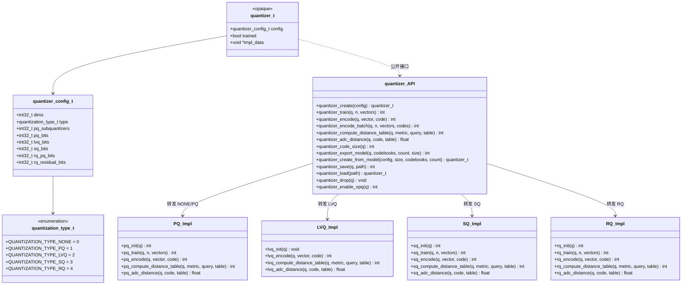

### 3.2 量化流程

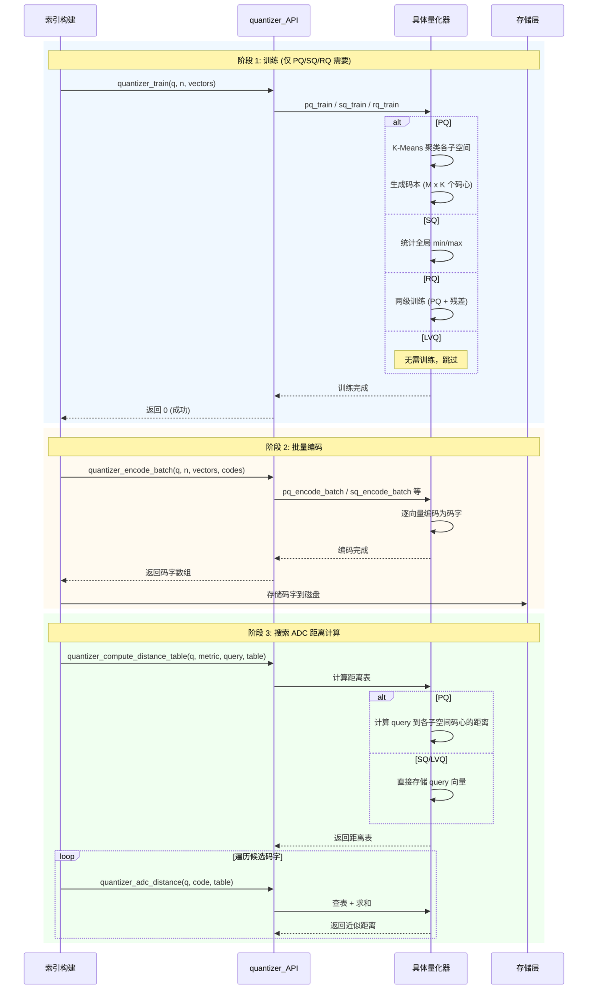

### 3.3 量化类型对比

| 量化类型 | 压缩率 | 召回率 | 训练成本 | 适用场景 | 码字大小 |
|----------|--------|--------|----------|----------|----------|
| **PQ** | 高 (8x~32x) | 中 (85%~95%) | 高 (K-Means) | 内存受限、大规模索引 | `ceil(M * bits / 8)` |
| **LVQ** | 中 (4x~8x) | 高 (95%~99%) | 无 | DiskANN、SSD 索引 | `8 + dims * bits / 8` |
| **SQ** | 高 (4x~8x) | 中 (80%~90%) | 低 (min/max) | 快速原型、简单量化 | `8 + dims * bits / 8` |
| **RQ** | 最高 (16x~64x) | 低 (70%~85%) | 高 (两级) | 极端压缩、粗排 | `M + ceil(M * residual_bits / 8)` |

**关键设计决策**:

1. **统一接口**: 所有量化器通过 `quantizer_t` 不透明指针和统一 API 暴露，索引模块无需感知具体实现
2. **ADC (Asymmetric Distance Computation)**: 查询时使用原始向量，数据库向量使用码字，减少量化误差
3. **距离表预计算**: PQ/SQ 在搜索前预计算查询向量到码心的距离表，O(1) 查表加速
4. **OPQ 优化**: 可选的 PCA 旋转，使各子空间方差均衡，提升 PQ 精度

---

## 4. K-Means 聚类模块

K-Means 聚类是 IVF 索引的核心依赖，用于将向量空间划分为 K 个聚类中心（倒排桶），实现粗量化。

### 4.1 K-Means 参数结构

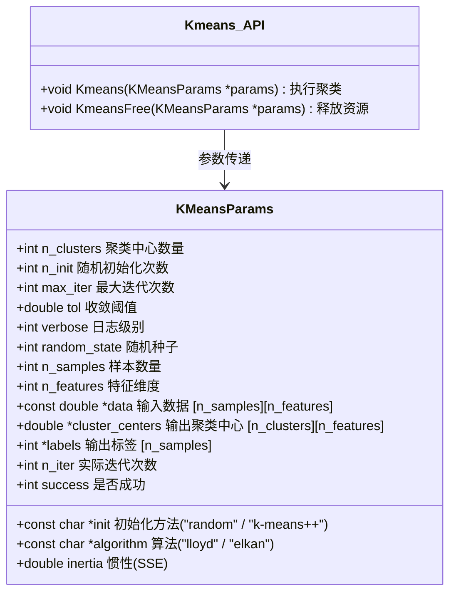

### 4.2 K-Means 执行流程

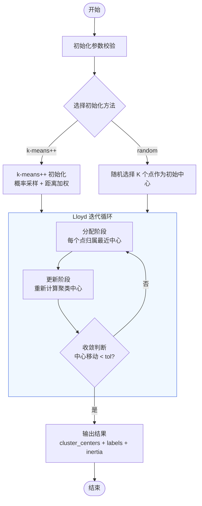

---

## 5. 基础数据结构模块

本模块提供通用的数据结构和算法，供上层模块（索引、量化器、应用层）使用。

### 5.1 容器结构概览

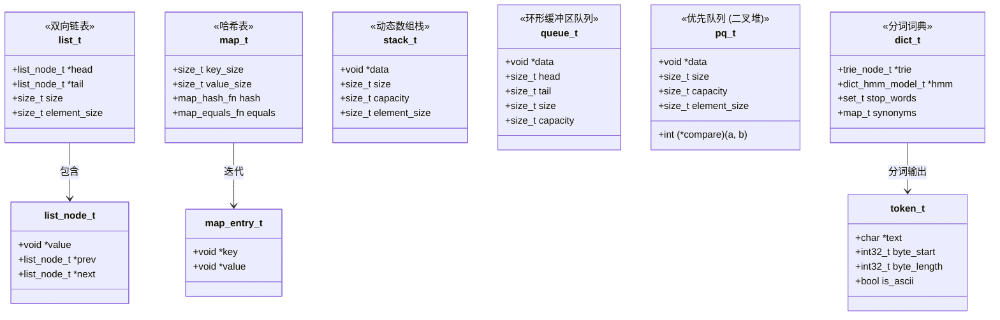

### 5.2 排序算法体系

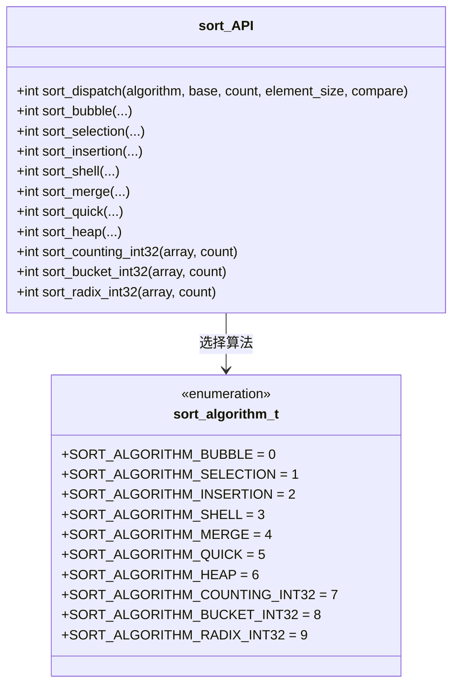

**排序算法选择指南**:

| 算法 | 稳定性 | 时间复杂度 | 空间复杂度 | 适用场景 |
|------|--------|------------|------------|----------|
| Bubble | 稳定 | O(n²) | O(1) | 教学、极小规模 |
| Selection | 不稳定 | O(n²) | O(1) | 实现简单、交换成本高 |
| Insertion | 稳定 | O(n²)，最好 O(n) | O(1) | 小数组、近乎有序 |
| Shell | 不稳定 | O(n log n) ~ O(n²) | O(1) | 中等规模、原地排序 |
| Merge | 稳定 | O(n log n) | O(n) | 需要稳定性、可预测性能 |
| Quick | 不稳定 | 平均 O(n log n)，最坏 O(n²) | O(log n) | 通用排序、平均最快 |
| Heap | 不稳定 | O(n log n) | O(1) | 需要上界、原地排序 |
| Counting | 稳定 | O(n + k) | O(k) | 值域小的整数 |
| Bucket | 不稳定 | 平均 O(n + k) | O(n + k) | 均匀分布整数 |
| Radix | 稳定 | O(d(n + r)) | O(n + r) | 定长整数 |

### 5.3 二分查找接口

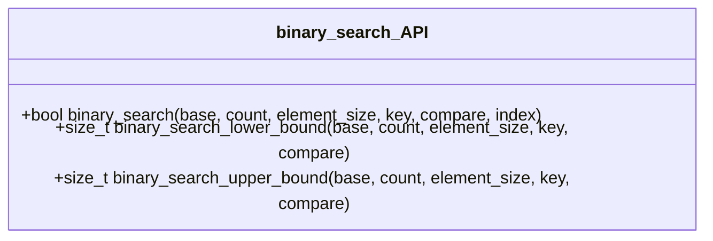

**接口说明**:
- `binary_search`: 标准二分查找，返回是否存在及位置
- `lower_bound`: 返回第一个 ≥ key 的位置
- `upper_bound`: 返回第一个 > key 的位置

---

## 6. 模块间依赖关系

algo-prod 算法库作为基础设施，为上层索引系统提供核心能力。

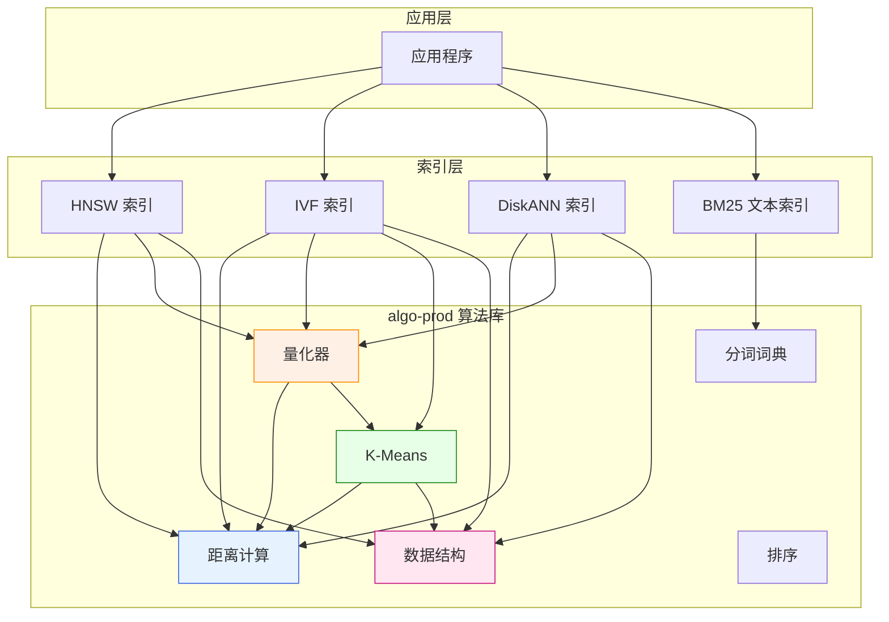

**依赖说明**:

1. **距离计算**: 所有向量索引的核心依赖，无外部依赖
2. **量化器**: 依赖距离计算，内部可选依赖 K-Means（PQ/RQ）
3. **K-Means**: 依赖距离计算，用于 IVF 聚类和 PQ 码本训练
4. **数据结构**: 无外部依赖，被索引层广泛使用
5. **分词词典**: BM25 文本索引专用，支持中文分词

---

## 7. 关键代码位置

| 模块 | 头文件 | 源文件 | 说明 |
|------|--------|--------|------|
| **距离计算** | `engineering/include/algo-prod/distance/distance.h` | `engineering/src/algo-prod/distance/distance.c` | L2/Cosine/IP/Hamming 距离 |
| **量化器统一接口** | `engineering/include/algo-prod/quantization/quantization.h` | `engineering/src/algo-prod/quantization/quantization.c` | 量化器 API |
| **PQ 量化** | `engineering/include/algo-prod/quantization/pq.h` | `engineering/src/algo-prod/quantization/pq.c` | 乘积量化 |
| **LVQ 量化** | `engineering/include/algo-prod/quantization/lvq.h` | `engineering/src/algo-prod/quantization/lvq.c` | 局部自适应量化 |
| **SQ 量化** | `engineering/include/algo-prod/quantization/sq.h` | `engineering/src/algo-prod/quantization/sq.c` | 标量量化 |
| **RQ 量化** | `engineering/include/algo-prod/quantization/rq.h` | `engineering/src/algo-prod/quantization/rq.c` | 残差量化 (RabitQ) |
| **K-Means** | `engineering/include/algo-prod/Kmeans/kmeans.h` | `engineering/src/algo-prod/Kmeans/kmeans.c` | K-Means 聚类 |
| **分词词典** | `engineering/include/algo-prod/dict/dict.h` | `engineering/src/algo-prod/dict/dict_*.c` | 中文分词 + HMM |
| **双向链表** | `engineering/include/algo-prod/list/list.h` | `engineering/src/algo-prod/list/list.c` | 双向链表 |
| **哈希表** | `engineering/include/algo-prod/map/map.h` | `engineering/src/algo-prod/map/map.c` | 哈希表 |
| **栈** | `engineering/include/algo-prod/stack/stack.h` | `engineering/src/algo-prod/stack/stack.c` | 动态数组栈 |
| **队列** | `engineering/include/algo-prod/queue/queue.h` | `engineering/src/algo-prod/queue/queue.c` | 环形缓冲区队列 |
| **优先队列** | `engineering/include/algo-prod/priority_queue/priority_queue.h` | `engineering/src/algo-prod/priority_queue/priority_queue.c` | 二叉堆优先队列 |
| **排序** | `engineering/include/algo-prod/sort/sort.h` | `engineering/src/algo-prod/sort/sort.c` | 10 种排序算法 |
| **二分查找** | `engineering/include/algo-prod/binary_search/binary_search.h` | `engineering/src/algo-prod/binary_search/binary_search.c` | 二分查找 |

---

## 相关文档

- [AGENTS.md](../../../AGENTS.md) - 项目构建指南
- [CLAUDE.md](../../../CLAUDE.md) - 项目说明文档
- [索引系统架构](../index/README.md) - 向量索引架构设计
- [存储架构](../../storage-architecture.md) - 存储引擎详细说明