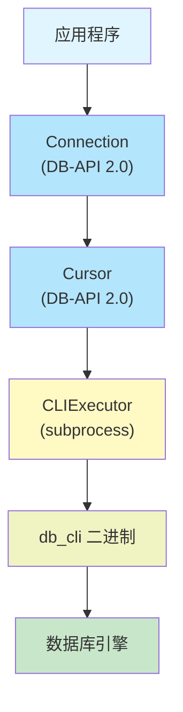
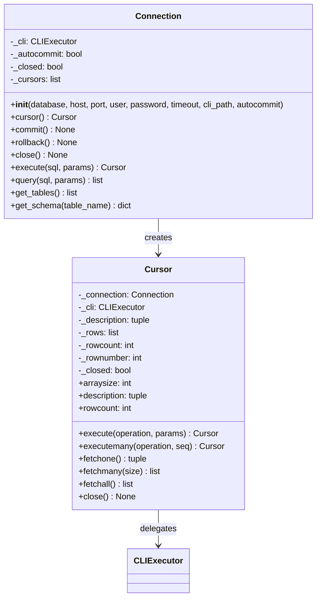
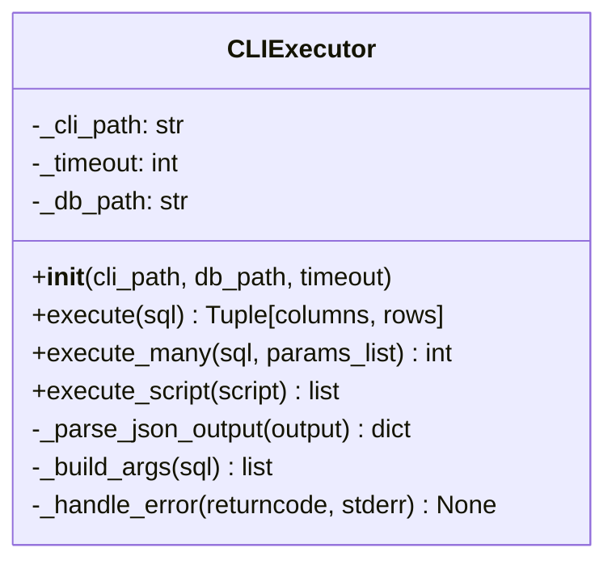
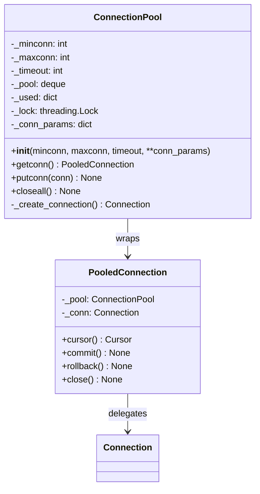
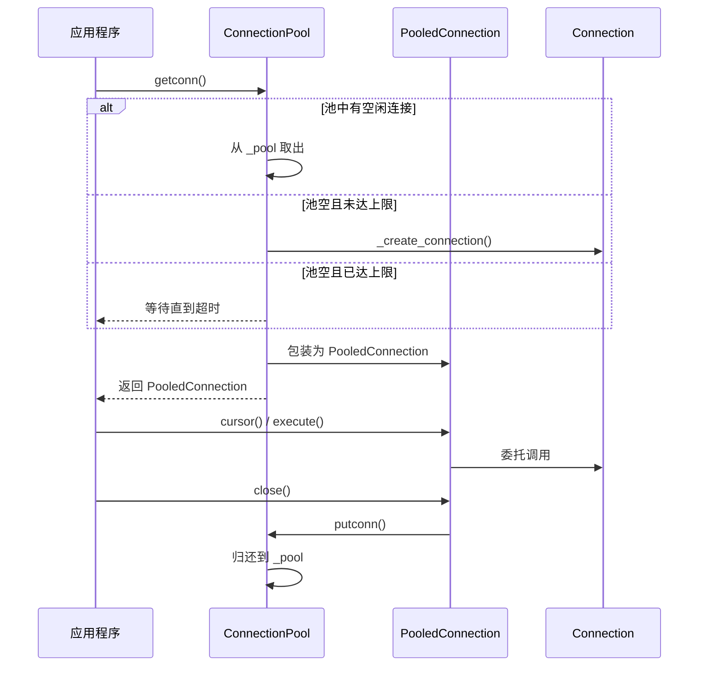
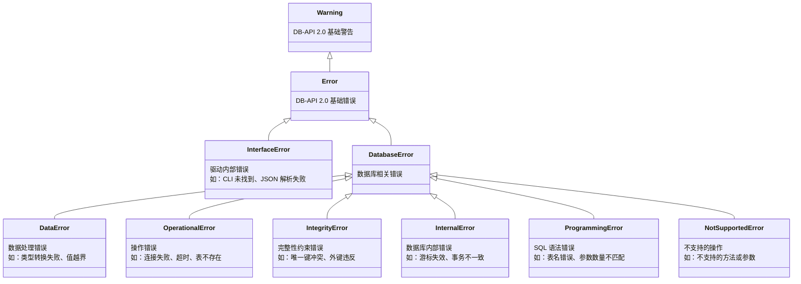
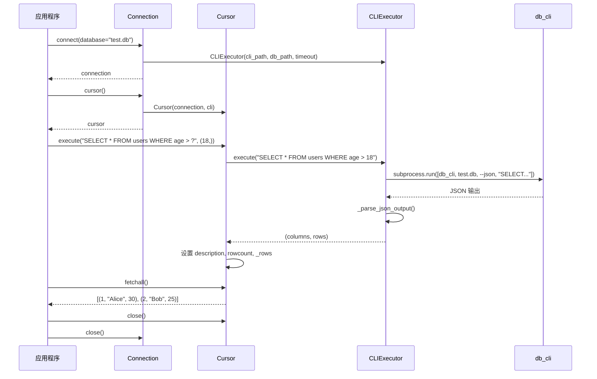

# db_driver 架构设计文档

> Python 3 数据库驱动，遵循 DB-API 2.0 (PEP 249) 规范，通过 CLI 执行器与数据库引擎通信。

## 1. 架构概览

db_driver 采用分层代理架构，将 DB-API 2.0 标准接口映射到 CLI 子进程调用，实现 Python 应用与 C 数据库引擎的解耦通信。



**调用链路**：应用程序通过 `connect()` 获取 Connection，创建 Cursor 执行 SQL；Cursor 委托 CLIExecutor 启动 db_cli 子进程，解析 JSON 输出，将结果封装为 DB-API 2.0 标准返回值。

**设计决策**：
- **子进程代理而非 C 扩展**：避免 Python/C 绑定的编译依赖和跨平台问题，db_cli 作为稳定契约层隔离两端
- **JSON 序列化**：db_cli 输出 JSON 格式，CLIExecutor 解析后转换为 Python 原生类型，简单可靠
- **超时控制**：subprocess 层面强制超时，防止数据库引擎阻塞导致 Python 进程挂起

## 2. DB-API 2.0 接口

严格遵循 PEP 249 规范，提供 Connection 和 Cursor 两个核心对象。



### Connection 构造参数

| 参数 | 类型 | 默认值 | 说明 |
|------|------|--------|------|
| `database` | str | 必填 | 数据库文件路径 |
| `host` | str | `"localhost"` | 服务器地址（预留） |
| `port` | int | `5432` | 服务器端口（预留） |
| `user` | str | `None` | 用户名（预留） |
| `password` | str | `None` | 密码（预留） |
| `timeout` | int | `30` | SQL 执行超时（秒） |
| `cli_path` | str | `None` | db_cli 二进制路径，None 则自动查找 |
| `autocommit` | bool | `False` | 自动提交模式 |

### Cursor 核心属性

| 属性 | 类型 | 说明 |
|------|------|------|
| `description` | tuple of 7-tuples | 结果列描述 `(name, type_code, display_size, internal_size, precision, scale, null_ok)` |
| `arraysize` | int | `fetchmany()` 默认批量大小，默认 1 |
| `rowcount` | int | 最近操作影响的行数，-1 表示未知 |

### 便捷方法

- `execute(sql, params)` — Connection 级别的快捷执行，内部创建临时 Cursor
- `query(sql, params)` — 执行并直接返回全部结果行，无需手动 fetch
- `get_tables()` — 返回当前数据库的表名列表
- `get_schema(table_name)` — 返回指定表的列定义字典
## 3. CLI 执行器

CLIExecutor 是 db_driver 的核心适配层，封装 subprocess 调用，将 SQL 请求转换为 CLI 命令并解析结果。



```mermaid
sequenceDiagram
    participant Cursor
    participant CLIExecutor
    participant Process as db_cli (subprocess)
    participant Engine as 数据库引擎

    Cursor->>CLIExecutor: execute("SELECT * FROM t")
    CLIExecutor->>CLIExecutor: _build_args(sql)
    CLIExecutor->>Process: subprocess.run([db_cli, db, --json, sql], timeout=30)
    Process->>Engine: 执行 SQL
    Engine-->>Process: 结果行
    Process-->>CLIExecutor: stdout JSON
    CLIExecutor->>CLIExecutor: _parse_json_output(output)
    CLIExecutor-->>Cursor: (columns, rows)
    Cursor->>Cursor: 缓存结果到 _rows```

### CLI 调用约定

db_cli 命令行格式：

```bash
db_cli <database_path> --json <sql_statement>
```

**JSON 输出格式**：

```json
{
  "columns": ["id", "name", "age"],
  "rows": [[1, "Alice", 30], [2, "Bob", 25]],
  "rowcount": 2,
  "status": "OK"
}
```

**错误输出格式**：

```json
{
  "error": "table not found: users",
  "code": 1
}
```

### 超时与错误处理

- subprocess 调用设置 `timeout` 参数，超时抛出 `subprocess.TimeoutExpired`，转换为 `OperationalError`
- db_cli 非零退出码触发 `_handle_error()`，根据 stderr 内容映射到对应异常类型
- JSON 解析失败抛出 `InterfaceError`，表示驱动与 CLI 版本不兼容

## 4. 连接池

连接池复用 Connection 对象，避免频繁创建/销毁子进程的开销。





### 连接池参数

| 参数 | 类型 | 默认值 | 说明 |
|------|------|--------|------|
| `minconn` | int | `1` | 初始连接数 |
| `maxconn` | int | `5` | 最大连接数 |
| `timeout` | int | `30` | 获取连接超时（秒） |
| `**conn_params` | dict | — | 传递给 Connection 的参数 |

### PooledConnection 语义

- `close()` 不关闭底层 Connection，而是归还到池
- 连接池 `closeall()` 才真正关闭所有底层连接
- 线程安全：内部使用 `threading.Lock` 保护 `_pool` 和 `_used`
## 5. 异常体系

遵循 PEP 249 定义的异常层次，与 DB-API 2.0 标准完全对齐。



### 异常映射规则

| db_cli 错误 | Python 异常 |
|-------------|------------|
| CLI 二进制未找到 | `InterfaceError` |
| JSON 输出解析失败 | `InterfaceError` |
| 连接超时 / 子进程超时 | `OperationalError` |
| 表不存在 / 列不存在 | `ProgrammingError` |
| 唯一键冲突 | `IntegrityError` |
| 类型转换失败 | `DataError` |
| 未知数据库错误 | `DatabaseError` |
## 6. 使用示例

### 基本查询流程



### 代码示例

**基本用法**：

```python
from db_driver import connect

# 连接数据库
conn = connect(database="test.db")
cursor = conn.cursor()

# 创建表
cursor.execute("""
    CREATE TABLE users (
        id INTEGER PRIMARY KEY,
        name TEXT NOT NULL,
        age INTEGER
    )
""")

# 插入数据
cursor.execute("INSERT INTO users (name, age) VALUES (?, ?)", ("Alice", 30))
cursor.executemany("INSERT INTO users (name, age) VALUES (?, ?)",
                   [("Bob", 25), ("Charlie", 35)])
conn.commit()

# 查询
cursor.execute("SELECT * FROM users WHERE age > ?", (20,))
for row in cursor.fetchall():
    print(row)

cursor.close()
conn.close()
```
**连接池用法**：

```python
from db_driver.pool import ConnectionPool

pool = ConnectionPool(minconn=2, maxconn=10, database="test.db")

conn = pool.getconn()
try:
    cursor = conn.cursor()
    cursor.execute("SELECT COUNT(*) FROM users")
    count = cursor.fetchone()[0]
    cursor.close()
finally:
    conn.close()  # 归还到池

pool.closeall()  # 程序退出时关闭所有连接
```

**便捷方法**：

```python
conn = connect(database="test.db")

# 直接执行与查询
conn.execute("CREATE TABLE IF NOT EXISTS items (id INTEGER, name TEXT)")
rows = conn.query("SELECT * FROM items")

# 获取数据库结构
tables = conn.get_tables()
schema = conn.get_schema("users")
```

## 7. 关键代码位置

| 文件 | 用途 | 关键组件 |
|------|------|---------|
| `engineering/apps/db_driver/__init__.py` | 模块入口 | `connect()` 工厂函数 |
| `engineering/apps/db_driver/connection.py` | DB-API Connection | `Connection` 类 + 便捷方法 |
| `engineering/apps/db_driver/cursor.py` | DB-API Cursor | `Cursor` 类，委托 CLIExecutor |
| `engineering/apps/db_driver/cli.py` | CLI 执行器 | `CLIExecutor`，subprocess + JSON 解析 |
| `engineering/apps/db_driver/pool.py` | 连接池 | `ConnectionPool`, `PooledConnection` |
| `engineering/apps/db_driver/exceptions.py` | 异常层次 | 12 个异常类，PEP 249 对齐 |

---

> 版本：2026-07-16 | PEP 249 参考：https://peps.python.org/pep-0249/