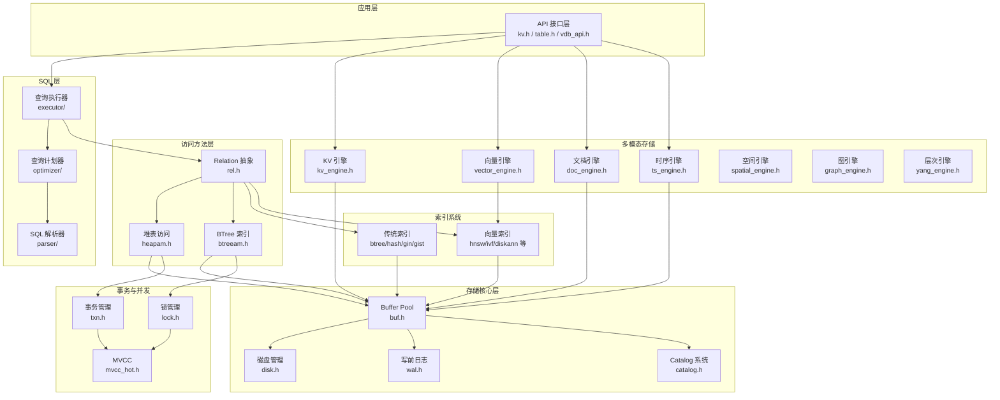
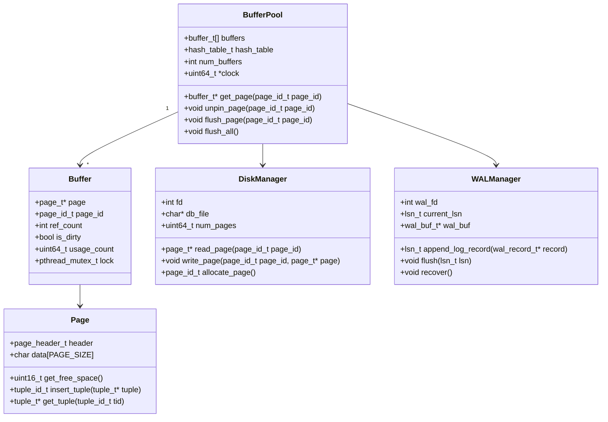
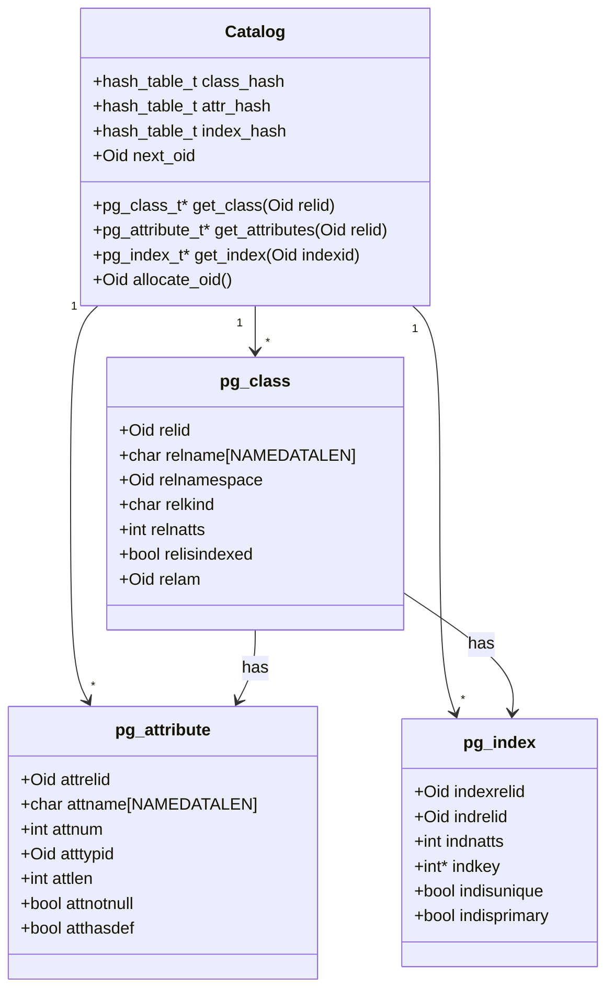
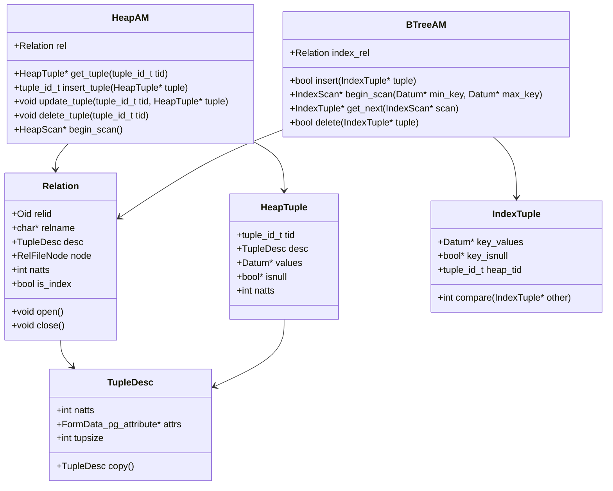
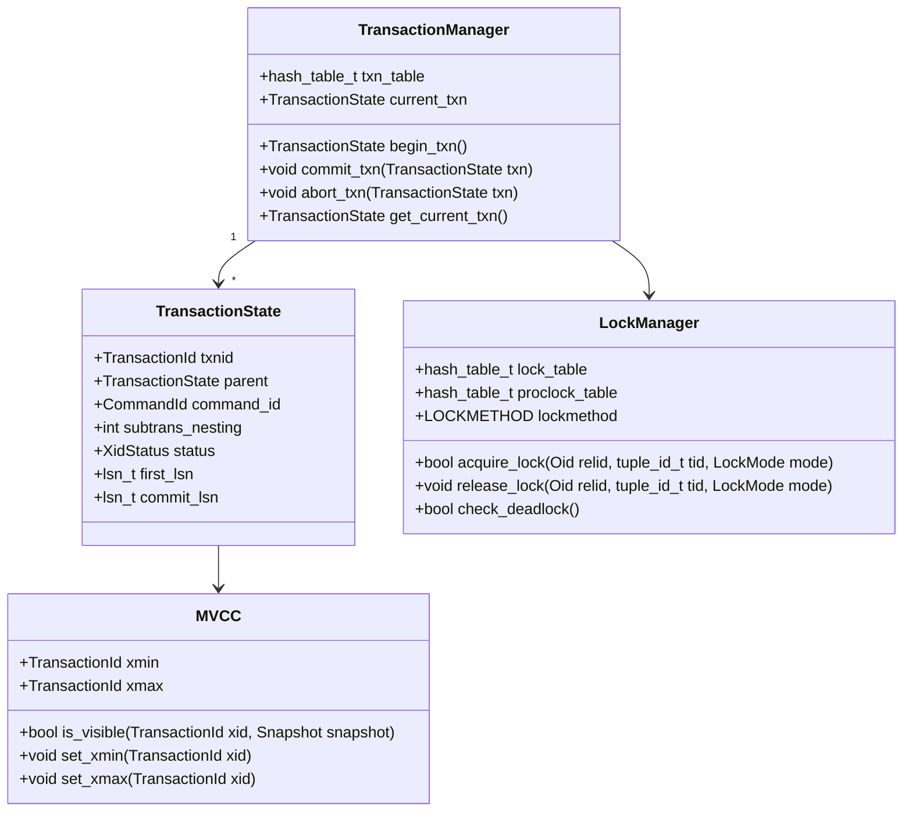
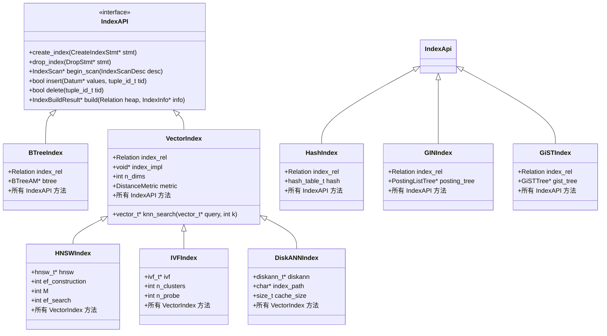
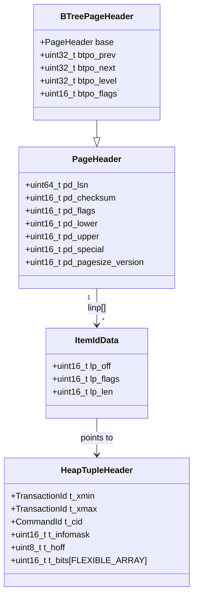
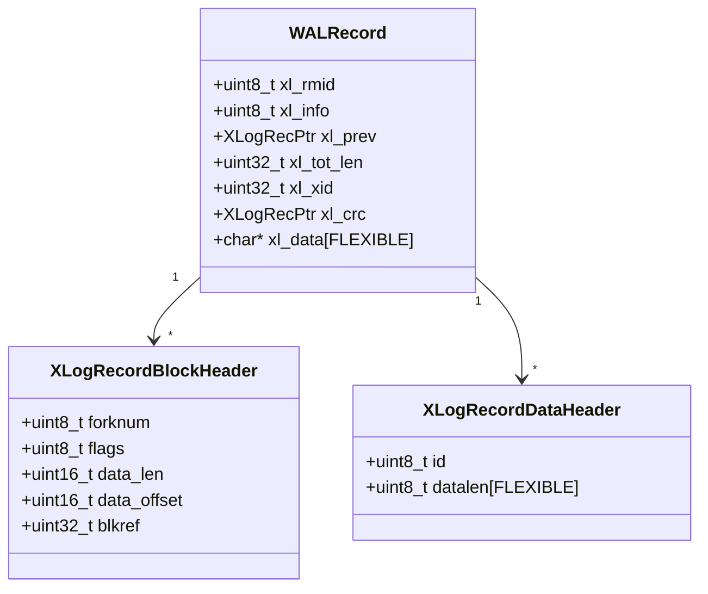
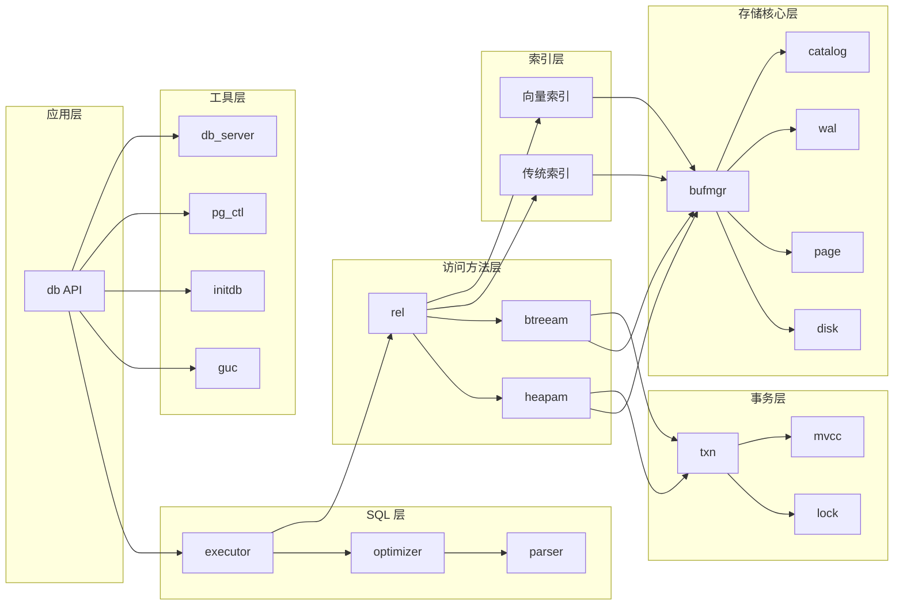

# db 数据库存储引擎 - 逻辑视图

## 概述

本文档描述 db 数据库存储引擎的逻辑视图，展示系统的静态结构、核心组件及其关系。

---

## 一、系统分层架构

---

## 二、核心组件类图

### 2.1 存储核心层

### 2.2 Catalog 系统

### 2.3 访问方法层

### 2.4 事务与并发

---

## 三、索引系统结构

---

## 四、多模态存储引擎

```mermaid
classDiagram
    class StorageEngine {
        <<interface>>
        +void* open(const char* path)
        +void close(void* handle)
        +int insert(void* handle, const void* key, const void* value)
        +int query(void* handle, const void* key, void** value)
        +int delete(void* handle, const void* key)
        +int scan(void* handle, void** results, int limit)
    }

    class KVEngine {
        +kv_t* kv
        +所有 StorageEngine 方法
        +int put(const char* key, const char* value)
        +int get(const char* key, char** value)
    }

    class VectorEngine {
        +vector_db_t* vdb
        +所有 StorageEngine 方法
        +int insert_vector(uint64_t id, float* vec, int dim)
        +int knn_search(float* query, int k, uint64_t* results)
        +int create_index(IndexConfig* config)
    }

    class DocEngine {
        +doc_db_t* doc_db
        +所有 StorageEngine 方法
        +int insert_doc(const char* id, const char* json)
        +int query_jsonpath(const char* path, char** result)
    }

    class TimeSeriesEngine {
        +ts_db_t* ts_db
        +所有 StorageEngine 方法
        +int insert_series(uint64_t metric_id, timestamp_t ts, double value)
        +int aggregate_series(uint64_t metric_id, timestamp_t start, timestamp_t end, AggFunc func)
    }

    class SpatialEngine {
        +spatial_db_t* spatial_db
        +所有 StorageEngine 方法
        +int insert_point(uint64_t id, double x, double y)
        +int query_bbox(double min_x, double min_y, double max_x, double max_y, uint64_t* results)
    }

    class GraphEngine {
        +graph_db_t* graph_db
        +所有 StorageEngine 方法
        +int insert_vertex(uint64_t id, const char* label, void* properties)
        +int insert_edge(uint64_t from, uint64_t to, const char* label)
        +int traverse(uint64_t start, int depth, TraverseResult** results)
    }

    class YangEngine {
        +yang_db_t* yang_db
        +所有 StorageEngine 方法
        +int insert_node(const char* path, const char* value)
        +int get_node(const char* path, char** value)
        +int traverse_path(const char* path, char** results)
    }

    StorageEngine <|-- KVEngine
    StorageEngine <|-- VectorEngine
    StorageEngine <|-- DocEngine
    StorageEngine <|-- TimeSeriesEngine
    StorageEngine <|-- SpatialEngine
    StorageEngine <|-- GraphEngine
    StorageEngine <|-- YangEngine

    VectorEngine --> VectorIndex : uses
```

---

## 五、核心数据结构

### 5.1 页面结构

### 5.2 WAL 记录结构

---

## 六、模块依赖关系

---

## 七、关键代码位置

| 组件 | 头文件 | 源文件 |
|------|--------|--------|
| Buffer Pool | `engineering/include/db/buf.h` | `engineering/src/db/storage/buffer/` |
| Disk Manager | `engineering/include/db/disk.h` | `engineering/src/db/storage/kv/` |
| Catalog | `engineering/include/db/catalog.h` | `engineering/src/db/storage/catalog/` |
| WAL | `engineering/include/db/wal.h` | `engineering/src/db/storage/wal/` |
| Heap AM | `engineering/include/db/heapam.h` | `engineering/src/db/executor/graph/sql/heapam.c` |
| BTree AM | `engineering/include/db/btreeam.h` | `engineering/src/db/index/btree/` |
| Relation | `engineering/include/db/rel.h` | `engineering/src/db/executor/graph/sql/rel.c` |
| Transaction | `engineering/include/db/txn.h` | `engineering/src/db/txn/` |
| Lock Manager | `engineering/include/db/lock.h` | `engineering/src/db/concurrency/` |
| GUC Config | `engineering/include/db/guc.h` | `engineering/src/db/bgworker/` |

---

## 八、设计决策

### 8.1 分层架构

**决策**: 采用 PostgreSQL 风格的分层架构
**原因**:
- 清晰的职责分离
- 便于独立测试和优化
- 支持多种访问方法共用存储层

### 8.2 Buffer Pool 实现

**决策**: 采用 Clock-Sweep 置换算法 + Hash 表查找
**原因**:
- PostgreSQL 成熟实践
- 平衡性能与实现复杂度
- 支持并发访问

### 8.3 多模态存储

**决策**: 统一 StorageEngine 接口，各引擎独立实现
**原因**:
- 支持不同数据模型的特定优化
- 统一 API 降低使用复杂度
- 便于扩展新的存储引擎