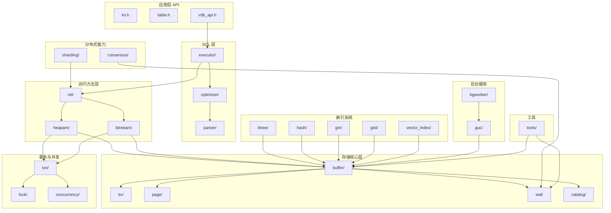
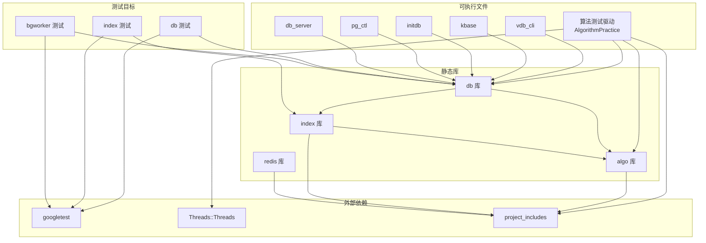
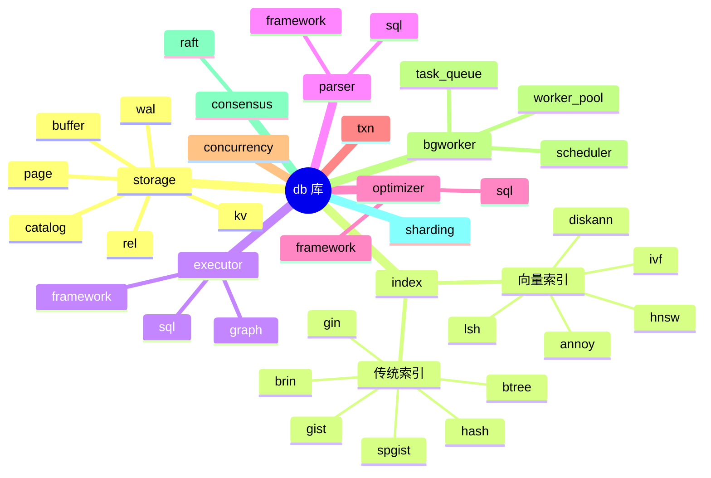
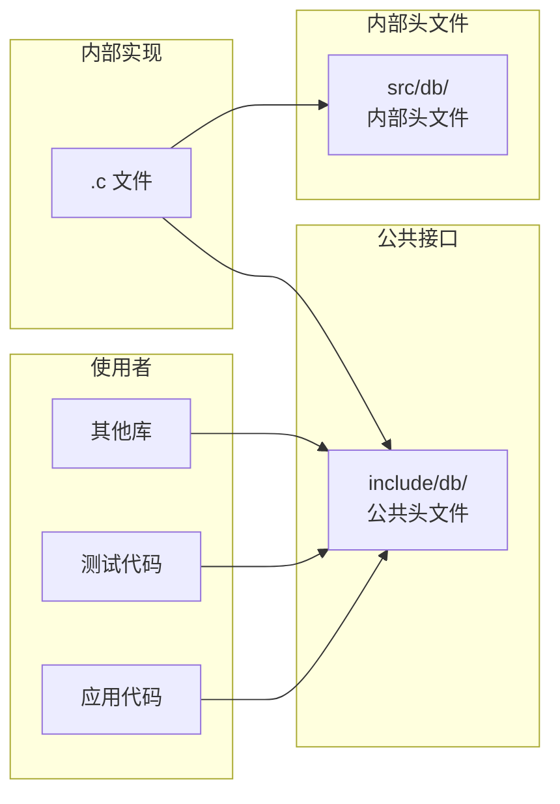
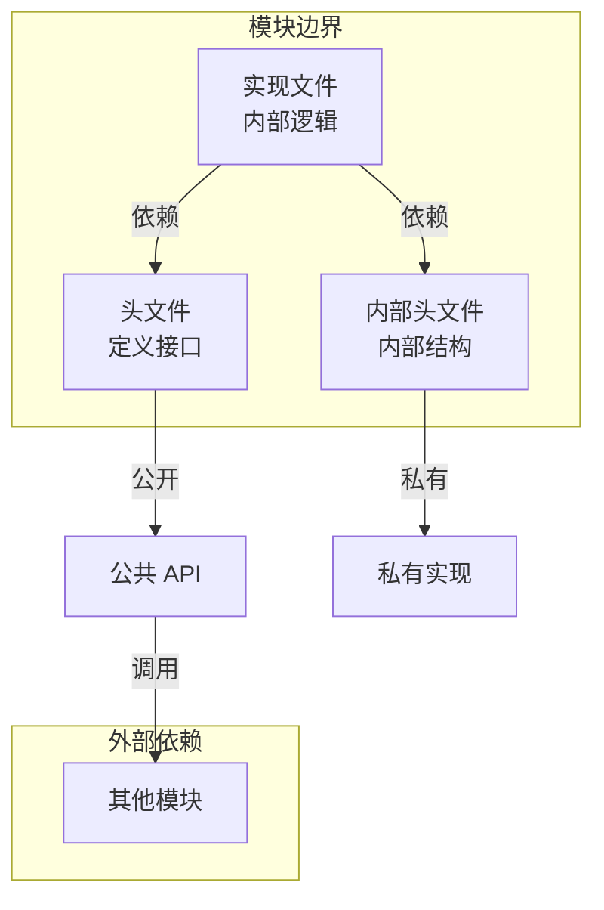
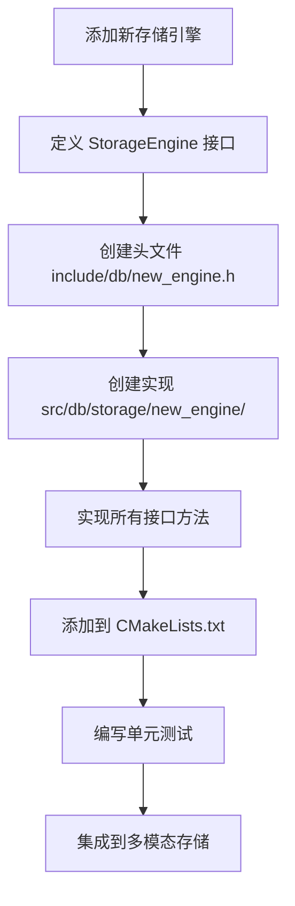
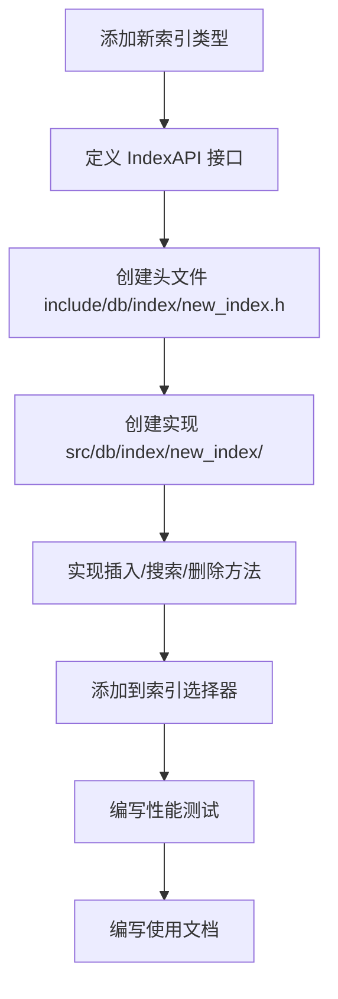

# db 数据库存储引擎 - 开发视图

## 概述

本文档描述 db 数据库存储引擎的开发视图，展示系统的代码组织、模块划分和构建结构。

---

## 一、源码目录结构

```
engineering/
├── include/db/           # 公共头文件（约 80 个 .h 文件）
│   ├── buf.h             # Buffer Pool 接口
│   ├── catalog.h         # Catalog 系统接口
│   ├── disk.h            # 磁盘管理接口
│   ├── heapam.h          # 堆表访问方法
│   ├── btreeam.h         # BTree 索引访问方法
│   ├── rel.h             # Relation 抽象
│   ├── txn.h             # 事务管理接口
│   ├── lock.h            # 锁管理接口
│   ├── wal.h             # WAL 接口
│   ├── guc.h             # GUC 配置接口
│   ├── sql/              # SQL 层头文件
│   │   ├── sql_parser.h
│   │   ├── sql_planner.h
│   │   ├── sql_executor.h
│   │   └── ...
│   ├── index/            # 索引系统头文件
│   │   ├── index.h
│   │   ├── btree/
│   │   ├── hash/
│   │   ├── vector_index/
│   │   └── ...
│   └── ...
│
├── src/db/               # 源文件（约 200+ 个 .c 文件）
│   ├── core/             # 核心模块
│   │   ├── guc.c         # GUC 配置实现
│   │   ├── initdb.c      # 初始化工具
│   │   ├── pg_ctl.c      # 服务控制工具
│   │   └── db_server.c   # Wire 协议服务器
│   │
│   ├── storage/          # 存储核心层
│   │   ├── buffer/       # Buffer Pool 实现
│   │   ├── catalog/      # Catalog 系统实现
│   │   ├── kv/           # KV 存储实现
│   │   ├── page/         # 页面管理实现
│   │   ├── rel/          # Relation 实现
│   │   ├── wal/          # WAL 日志实现
│   │   ├── lock/         # 锁管理实现
│   │   ├── txn/          # 事务管理实现
│   │   └── ...
│   │
│   ├── index/            # 索引系统
│   │   ├── btree/        # BTree 索引
│   │   ├── hash/         # Hash 索引
│   │   ├── gin/          # GIN 索引
│   │   ├── gist/         # GiST 索引
│   │   ├── vector_index/ # 向量索引（33 种）
│   │   │   ├── hnsw/
│   │   │   ├── ivf/
│   │   │   ├── diskann/
│   │   │   └── ...
│   │   └── ...
│   │
│   ├── executor/         # SQL 执行器
│   │   ├── framework/    # 执行器框架
│   │   ├── graph/        # 图执行计划
│   │   ├── rag/          # RAG 执行器
│   │   └── sql/          # SQL 执行节点
│   │
│   ├── parser/           # SQL 解析器
│   │   ├── framework/
│   │   ├── graph/
│   │   └── sql/
│   │
│   ├── optimizer/        # 查询优化器
│   │   ├── framework/
│   │   ├── graph/
│   │   └── sql/
│   │
│   ├── txn/              # 事务管理
│   │   └── ...
│   │
│   ├── concurrency/      # 并发控制
│   │   └── ...
│   │
│   ├── bgworker/         # 后台工作进程
│   │   ├── scheduler.c   # 任务调度器
│   │   ├── task_queue.c  # 任务队列
│   │   └── worker_pool.c # 工作线程池
│   │
│   ├── consensus/        # 分布式共识
│   │   └── ...
│   │
│   ├── sharding/         # 分片路由
│   │   └── ...
│   │
│   ├── tools/            # 工具模块
│   │   └── ...
│   │
│   └── utils/            # 工具函数
│       └── ...
│
└── test/db/              # 测试文件
    ├── storage/          # 存储层测试
    ├── index/            # 索引测试
    ├── executor/         # 执行器测试
    ├── bgworker/         # bgworker 测试
    ├── cceh_test.cpp     # CCEH 哈希测试
    ├── buf_test.cpp      # Buffer Pool 测试
    └── ...
```

---

## 二、模块依赖关系图



---

## 三、构建架构

### 3.1 CMake 目标依赖图



### 3.2 核心库构成



---

## 四、模块职责划分

### 4.1 存储核心层

| 模块 | 职责 | 关键文件 |
|------|------|----------|
| **buffer** | Buffer Pool 管理，页面缓存，Clock-Sweep 置换 | `bufmgr.c`, `buf_table.c` |
| **catalog** | 系统表管理，OID 分配，元数据缓存 | `catalog.c`, `pg_class.c`, `pg_attribute.c` |
| **kv** | 磁盘文件管理，页面读写 | `disk.c`, `kv_engine.c` |
| **page** | 页面结构管理，空闲空间管理 | `page.c` |
| **rel** | Relation 抽象，表打开/关闭 | `rel.c` |
| **wal** | WAL 日志管理，日志回放 | `wal.c`, `wal_buf.c` |

### 4.2 访问方法层

| 模块 | 职责 | 关键文件 |
|------|------|----------|
| **heapam** | 堆表访问方法，元组 CRUD | `heapam.c`, `heap_update.c` |
| **btreeam** | BTree 索引访问方法 | `btreeam.c`, `btree_insert.c`, `btree_search.c` |
| **rel** | Relation 抽象层，扫描接口 | `rel.c` |

### 4.3 SQL 层

| 模块 | 职责 | 关键文件 |
|------|------|----------|
| **parser** | SQL 词法/语法/语义分析 | `sql_parser.c`, `scan.c`, `gram.c` |
| **optimizer** | 查询优化，成本估算 | `optimizer.c`, `cost.c`, `paths.c` |
| **executor** | 查询执行，执行节点 | `executor.c`, `nodeSeqscan.c`, `nodeHashjoin.c` |

### 4.4 索引系统

| 模块 | 职责 | 关键文件 |
|------|------|----------|
| **btree** | BTree 索引实现 | `btree.c`, `btree_insert.c`, `btree_search.c` |
| **hash** | Hash 索引实现 | `hash.c`, `hashfunc.c` |
| **gin** | GIN 倒排索引 | `gin.c`, `gin_entry.c`, `gin_posting.c` |
| **gist** | GiST 通用搜索树 | `gist.c`, `gist_support.c` |
| **vector_index** | 33 种向量索引 | `hnsw/`, `ivf/`, `diskann/`, ... |

### 4.5 事务与并发

| 模块 | 职责 | 关键文件 |
|------|------|----------|
| **txn** | 事务管理，事务状态 | `txn.c`, `xact.c` |
| **lock** | 锁管理，死锁检测 | `lock.c`, `deadlock.c` |
| **concurrency** | MVCC 实现 | `mvcc.c`, `snapshot.c` |

### 4.6 分布式能力

| 模块 | 职责 | 关键文件 |
|------|------|----------|
| **sharding** | 数据分片，路由策略 | `shard.c`, `router.c` |
| **consensus** | Raft 共识协议 | `raft.c`, `raft_log.c`, `raft_state.c` |

### 4.7 后台服务

| 模块 | 职责 | 关键文件 |
|------|------|----------|
| **bgworker** | 后台任务调度，统计收集 | `scheduler.c`, `task_queue.c`, `worker_pool.c` |
| **guc** | 配置参数管理 | `guc.c`, `guc_tables.c` |

---

## 五、代码组织原则

### 5.1 头文件策略



**原则**：
- `include/db/` 只暴露稳定的公共 API
- 内部实现细节放在 `src/db/*/` 的私有头文件
- 模块间通过公共接口通信，避免直接访问内部结构

### 5.2 模块化设计



**原则**：
- 每个模块有清晰的职责边界
- 模块间通过定义良好的接口通信
- 内部实现可以自由修改，不影响公共 API

---

## 六、测试代码结构

```
engineering/test/db/
├── storage/              # 存储层测试
│   ├── buf_test.cpp      # Buffer Pool 测试
│   ├── disk_test.cpp     # 磁盘管理测试
│   ├── wal_test.cpp      # WAL 日志测试
│   ├── catalog_test.cpp  # Catalog 测试
│   └── ...
│
├── index/                # 索引测试
│   ├── btree_test.cpp    # BTree 索引测试
│   ├── hash_test.cpp     # Hash 索引测试
│   ├── hnsw_test.cpp     # HNSW 索引测试
│   ├── ivf_test.cpp      # IVF 索引测试
│   ├── sift_test/        # SIFT 数据集测试
│   │   ├── CMakeLists.txt
│   │   ├── hnsw_trace_100.c
│   │   ├── sift_recall_bruteforce_gt.c
│   │   └── ...
│   └── ...
│
├── executor/             # 执行器测试
│   ├── executor_test.cpp
│   └── ...
│
├── bgworker/             # bgworker 测试
│   ├── bgworker_test.cpp
│   └── cceh_shrink_test.cpp
│
├── txn/                  # 事务测试
│   ├── txn_test.cpp
│   └── ...
│
└── integration/          # 集成测试
    ├── storage_integration_test.cpp
    └── ...
```

---

## 七、构建配置

### 7.1 CMake 变量

| 变量 | 默认值 | 说明 |
|------|--------|------|
| `ENGINEERING_BUILD` | ON | 构建工程轨道 |
| `LEARNING_BUILD` | OFF | 构建学习轨道 |
| `CMAKE_BUILD_TYPE` | Debug | 构建类型 |
| `CMAKE_C_STANDARD` | 11 | C 标准 |
| `CMAKE_CXX_STANDARD` | 17 | C++ 标准 |

### 7.2 编译选项

```cmake
# 工程 CMake 工具
engineering/cmake/ProjectUtils.cmake

# 辅助函数
add_project_test(name VAR)    # 创建 gtest 测试目标
add_project_library(name VAR) # 创建静态库目标

# 编译标志
-Wall -Wextra -Werror
-std=c11 (C 文件)
-std=c++17 (C++ 文件)
```

---

## 八、代码风格规范

### 8.1 命名规范

| 类型 | 规范 | 示例 |
|------|------|------|
| 函数名 | 小写+下划线 | `buffer_get_page()` |
| 类型名 | 小写+下划线+_t 后缀 | `buffer_t` |
| 宏定义 | 大写+下划线 | `BUFFER_SIZE` |
| 枚举值 | 大写+下划线 | `BUFFER_OK` |
| 全局变量 | g_ 前缀 | `g_buffer_pool` |
| 结构体字段 | 小写+下划线 | `page_id` |

### 8.2 文件组织

```c
/* 文件头注释 */
/* engineering/src/db/storage/buffer/bufmgr.c */

#include "db/buf.h"        /* 公共头文件 */
#include "buf_internal.h"  /* 内部头文件 */

/* 宏定义 */
#define DEFAULT_BUFFER_SIZE 1024

/* 类型定义 */
typedef struct buffer_pool_t {
    /* 字段 */
} buffer_pool_t;

/* 静态函数声明 */
static void buffer_evict(buffer_pool_t *pool);

/* 公共函数实现 */
buffer_t *buffer_get_page(buffer_pool_t *pool, page_id_t page_id) {
    /* 实现 */
}

/* 静态函数实现 */
static void buffer_evict(buffer_pool_t *pool) {
    /* 实现 */
}
```

---

## 九、依赖关系矩阵

| 模块 | buf | disk | page | wal | catalog | rel | heapam | btreeam | txn | lock |
|------|-----|------|------|-----|---------|-----|--------|---------|-----|------|
| **buf** | - | ✓ | ✓ | ✓ | - | - | - | - | - | - |
| **disk** | - | - | ✓ | - | - | - | - | - | - | - |
| **page** | - | - | - | - | - | - | - | - | - | - |
| **wal** | - | - | ✓ | - | - | - | - | - | - | - |
| **catalog** | ✓ | - | - | - | - | - | - | - | - | - |
| **rel** | ✓ | - | - | - | ✓ | - | - | - | - | - |
| **heapam** | ✓ | - | - | - | - | ✓ | - | - | ✓ | ✓ |
| **btreeam** | ✓ | - | - | - | - | ✓ | - | - | ✓ | ✓ |
| **txn** | - | - | - | ✓ | - | - | - | - | - | - |
| **lock** | - | - | - | - | - | - | - | - | ✓ | - |

**说明**：
- ✓ 表示直接依赖
- 空白表示无依赖
- 避免循环依赖

---

## 十、模块扩展指南

### 10.1 添加新的存储引擎



### 10.2 添加新的索引类型



---

## 十一、关键代码位置速查

| 功能 | 头文件 | 源文件 |
|------|--------|--------|
| Buffer Pool | `include/db/buf.h` | `src/db/storage/buffer/` |
| Catalog | `include/db/catalog.h` | `src/db/storage/catalog/` |
| Disk Manager | `include/db/disk.h` | `src/db/storage/kv/` |
| WAL | `include/db/wal.h` | `src/db/storage/wal/` |
| Heap AM | `include/db/heapam.h` | `src/db/executor/graph/sql/` |
| BTree AM | `include/db/btreeam.h` | `src/db/index/btree/` |
| Relation | `include/db/rel.h` | `src/db/executor/graph/sql/` |
| Transaction | `include/db/txn.h` | `src/db/txn/` |
| Lock Manager | `include/db/lock.h` | `src/db/concurrency/` |
| GUC Config | `include/db/guc.h` | `src/db/bgworker/` |
| bgworker | `include/db/bgworker.h` | `src/db/bgworker/` |
| SQL Parser | `include/db/sql/sql_parser.h` | `src/db/parser/` |
| SQL Planner | `include/db/sql/sql_planner.h` | `src/db/optimizer/` |
| SQL Executor | `include/db/sql/sql_executor.h` | `src/db/executor/` |
| VDB API | `include/db/vdb_api.h` | `src/db/api/` |