# db 数据库存储引擎 - 物理视图

## 概述

本文档描述 db 数据库存储引擎的物理视图，展示系统的部署拓扑、运行环境和资源分配。

---

## 一、部署拓扑架构

### 1.1 单节点部署

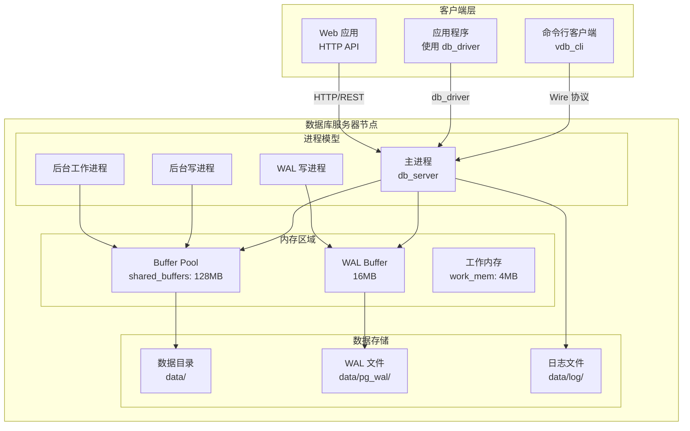

### 1.2 分布式部署架构

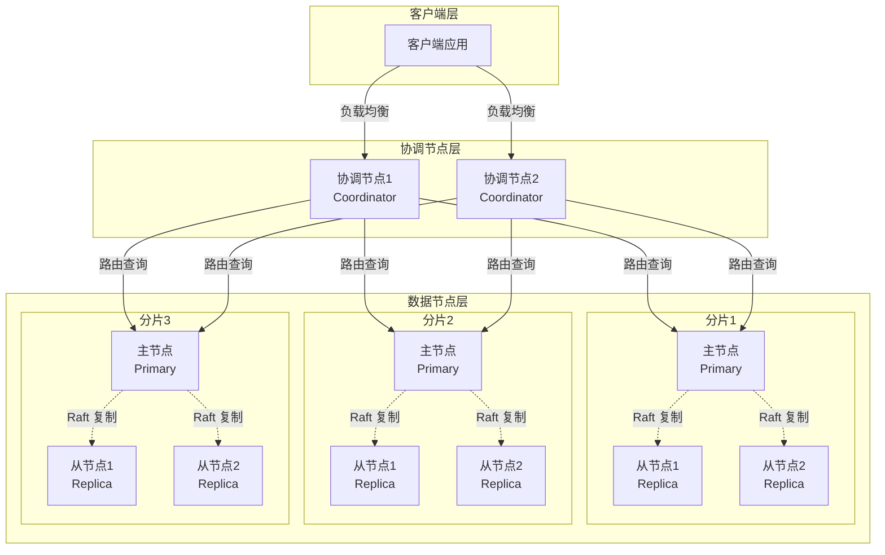

---

## 二、进程/线程模型

### 2.1 单节点进程架构

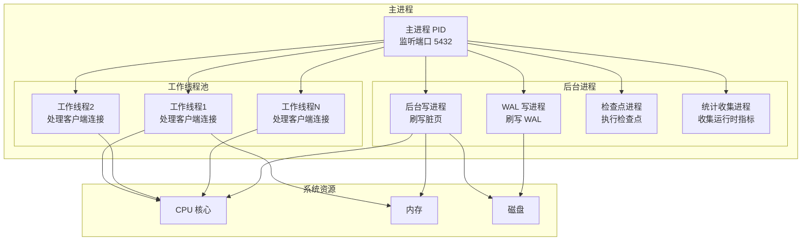

### 2.2 连接处理模型

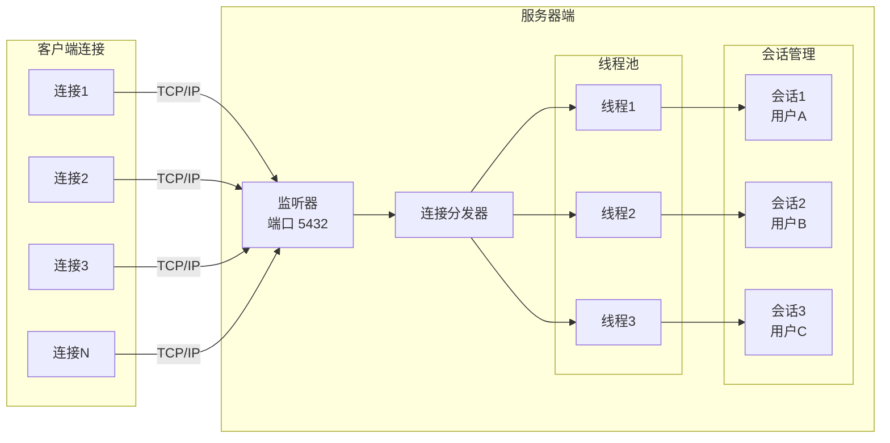

---

## 三、内存布局

### 3.1 内存区域划分

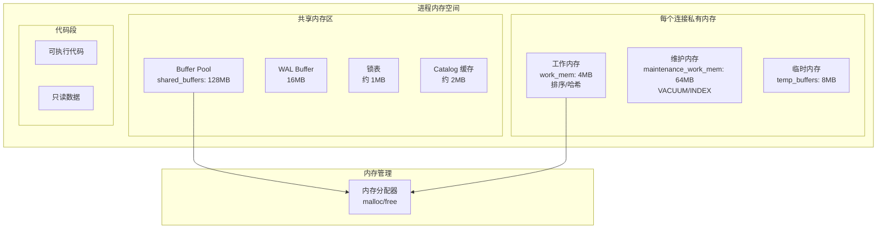

### 3.2 Buffer Pool 内存结构

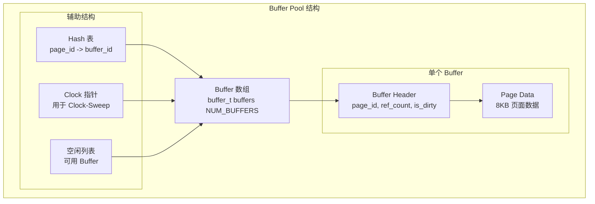

---

## 四、磁盘存储布局

### 4.1 数据目录结构

```
data/                           # 数据目录
├── postgresql.conf             # 主配置文件
├── pg_hba.conf                 # 访问控制配置
├── postmaster.pid              # 主进程 PID 文件
├── postmaster.opts             # 启动参数
│
├── base/                       # 数据库文件
│   ├── 1/                      # 数据库 OID=1 (template1)
│   │   ├── 1259                # pg_class 表文件
│   │   ├── 1259_fsm            # pg_class FSM 文件
│   │   ├── 1259_vm             # pg_class VM 文件
│   │   └── ...
│   ├── 13067/                  # 用户数据库
│   │   ├── 16384               # 用户表文件
│   │   ├── 16384_fsm
│   │   ├── 16384_vm
│   │   ├── 16385               # 索引文件
│   │   └── ...
│   └── ...
│
├── global/                     # 全局数据
│   ├── pg_control              # 控制文件
│   ├── pg_filenode.map         # 文件节点映射
│   └── ...
│
├── pg_wal/                     # WAL 日志
│   ├── 000000010000000000000001    # WAL 段文件
│   ├── 000000010000000000000002
│   ├── archive_status/         # 归档状态
│   └── ...
│
├── pg_xact/                    # 事务提交日志
│   ├── 0000
│   └── ...
│
├── log/                        # 服务器日志
│   ├── postgresql-2026-07-16.log
│   └── ...
│
└── pg_stat/                    # 统计数据
    ├── pgstat.stat
    └── ...
```

### 4.2 文件存储格式

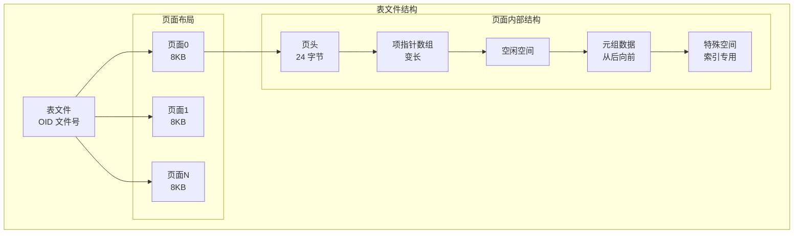

### 4.3 WAL 文件格式

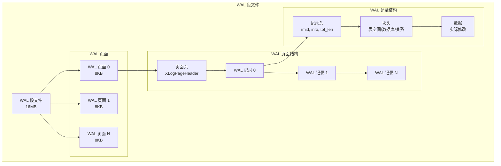

---

## 五、网络通信

### 5.1 Wire 协议架构

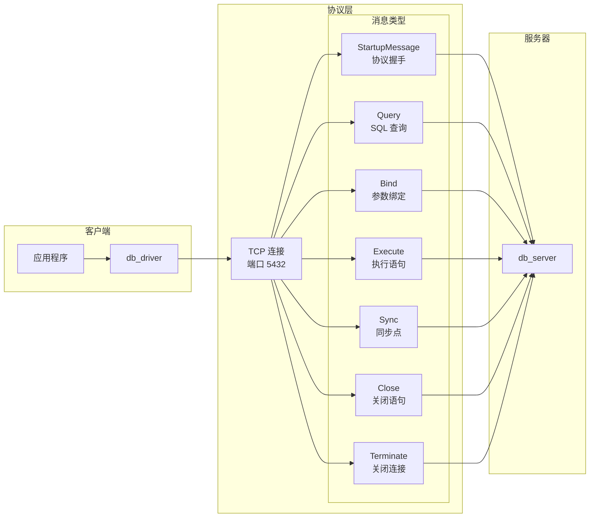

### 5.2 消息流程示例

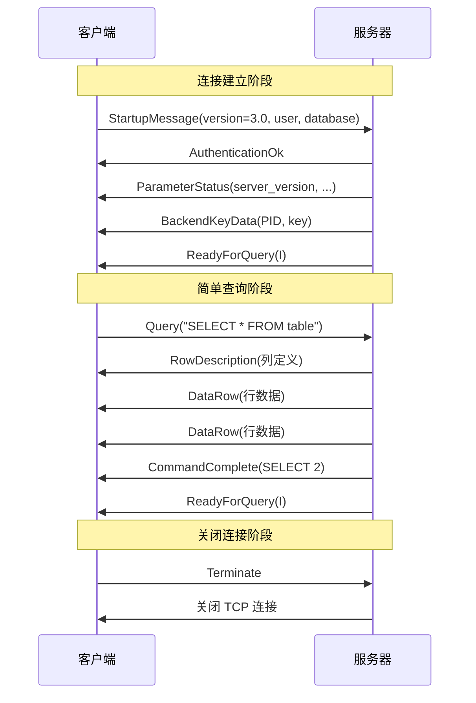

---

## 六、资源配置

### 6.1 GUC 配置参数

| 参数类别 | 参数名 | 默认值 | 说明 |
|----------|--------|--------|------|
| **连接** | `port` | 5432 | 监听端口 |
| | `listen_addresses` | '*' | 监听地址 |
| | `max_connections` | 100 | 最大连接数 |
| **内存** | `shared_buffers` | 128MB | Buffer Pool 大小 |
| | `work_mem` | 4MB | 排序/哈希内存 |
| | `maintenance_work_mem` | 64MB | 维护操作内存 |
| | `wal_buffers` | 16MB | WAL Buffer 大小 |
| **WAL** | `wal_level` | replica | WAL 级别 |
| | `fsync` | on | 强制刷写 |
| | `synchronous_commit` | on | 同步提交 |
| | `checkpoint_timeout` | 5min | 检查点间隔 |
| **日志** | `log_destination` | stderr | 日志目标 |
| | `logging_collector` | off | 日志收集器 |
| | `log_level` | info | 日志级别 |

### 6.2 资源限制

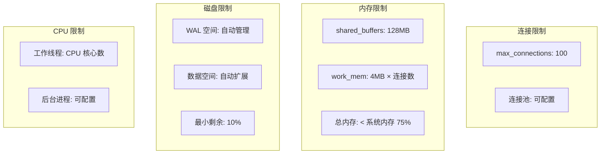

---

## 七、容灾与高可用

### 7.1 主从复制架构

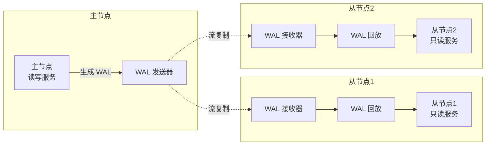

### 7.2 故障切换流程

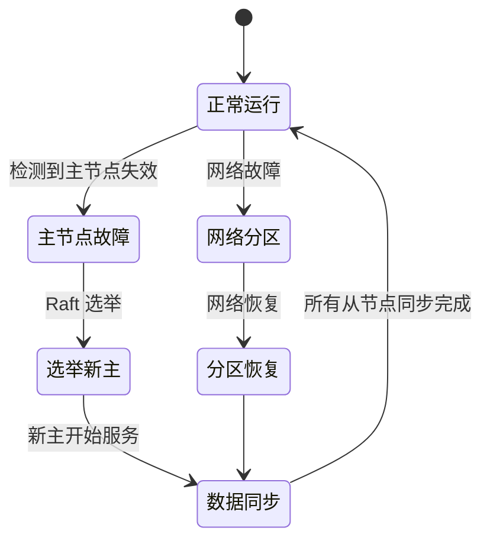

---

## 八、监控与诊断

### 8.1 监控指标

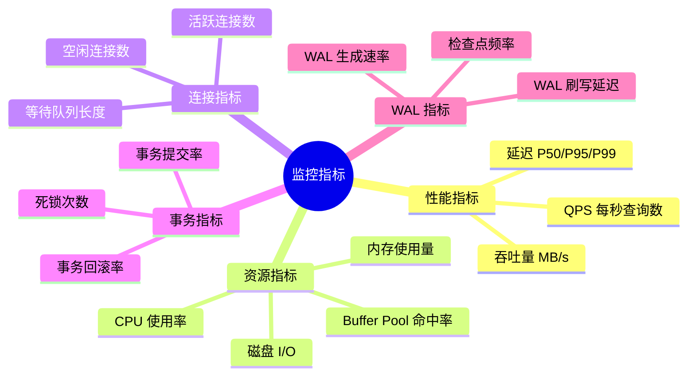

### 8.2 诊断工具

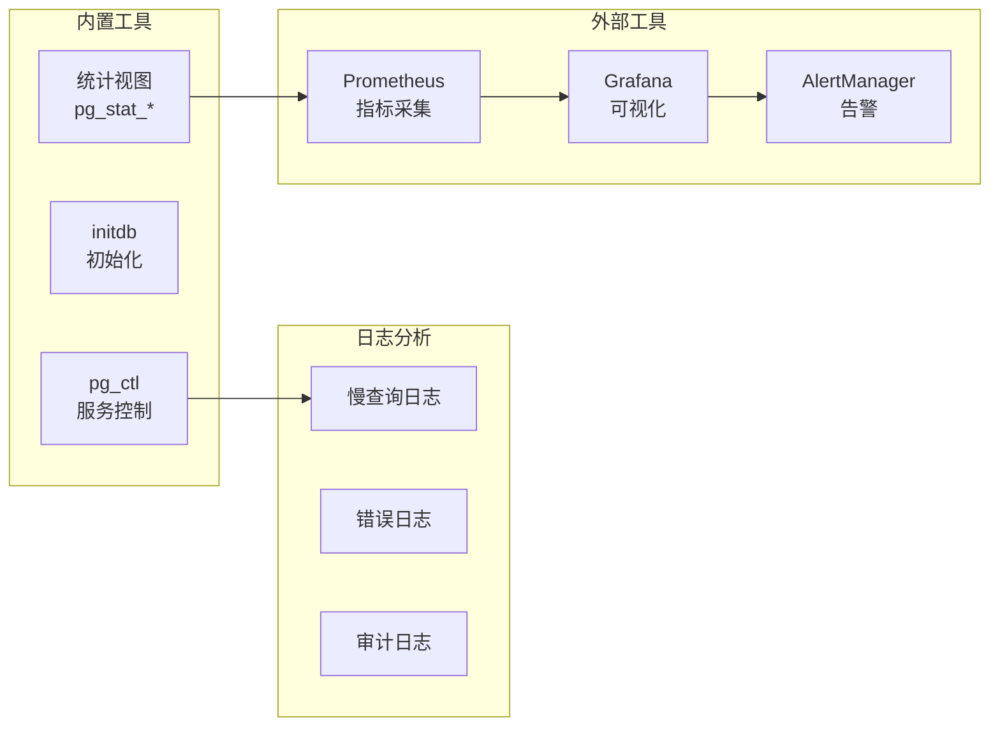

---

## 九、安全配置

### 9.1 访问控制

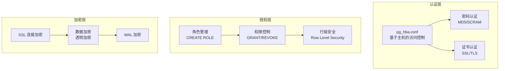

### 9.2 pg_hba.conf 示例

```
# TYPE  DATABASE        USER            ADDRESS                 METHOD
local   all             all                                     trust
host    all             all             127.0.0.1/32            md5
host    all             all             ::1/128                 md5
hostssl all             all             0.0.0.0/0               scram-sha-256
```

---

## 十、性能调优参数

### 10.1 内存调优

| 参数 | 推荐值 | 调优说明 |
|------|--------|----------|
| `shared_buffers` | 系统内存 25% | 不超过系统内存 40% |
| `work_mem` | 4MB - 64MB | 根据并发查询数调整 |
| `maintenance_work_mem` | 512MB - 1GB | VACUUM/INDEX 创建时使用 |
| `wal_buffers` | 16MB - 64MB | 大批量写入时增加 |
| `effective_cache_size` | 系统内存 75% | 查询优化器参考值 |

### 10.2 WAL 调优

| 参数 | 推荐值 | 调优说明 |
|------|--------|----------|
| `wal_level` | replica | 主从复制时使用 |
| `synchronous_commit` | on | 高可靠性场景 |
| | off | 高性能场景，可能丢事务 |
| `wal_compression` | on | 压缩 WAL，节省空间 |
| `checkpoint_completion_target` | 0.9 | 平滑刷写脏页 |

### 10.3 并发调优

| 参数 | 推荐值 | 调优说明 |
|------|--------|----------|
| `max_connections` | 100 - 200 | 根据应用需求 |
| `max_worker_processes` | CPU 核心数 | 并行查询使用 |
| `max_parallel_workers_per_gather` | 2 - 4 | 单个查询并行度 |
| `max_parallel_workers` | CPU 核心数 | 总并行工作线程 |

---

## 十一、运行环境要求

### 11.1 操作系统支持

| 系统 | 版本 | 说明 |
|------|------|------|
| **Linux** | Ubuntu 20.04+, CentOS 7+ | 推荐生产环境 |
| **Windows** | Windows 10/11, Server 2016+ | 开发测试环境 |
| **macOS** | 10.15+ | 开发测试环境 |

### 11.2 硬件要求

| 资源 | 最低配置 | 推荐配置 |
|------|----------|----------|
| **CPU** | 2 核 | 8+ 核 |
| **内存** | 4 GB | 16+ GB |
| **磁盘** | 20 GB | SSD 100+ GB |
| **网络** | 100 Mbps | 1 Gbps |

### 11.3 编译依赖

| 依赖 | 版本 | 说明 |
|------|------|------|
| **CMake** | 3.20+ | 构建系统 |
| **GCC** | 9.0+ | Linux 编译器 |
| **MSVC** | 2019+ | Windows 编译器 |
| **Clang** | 10.0+ | macOS 编译器 |
| **GoogleTest** | vendored | 测试框架 |

---

## 十二、关键代码位置

| 功能 | 源文件 |
|------|--------|
| 主服务器 | `engineering/src/db/core/db_server.c` |
| pg_ctl 控制 | `engineering/src/db/core/pg_ctl.c` |
| initdb 初始化 | `engineering/src/db/core/initdb.c` |
| GUC 配置 | `engineering/src/db/bgworker/guc.c` |
| Wire 协议 | `engineering/include/db/sql/pgwire.h` |
| WAL 写入 | `engineering/src/db/storage/wal/` |
| 检查点 | `engineering/src/db/storage/wal/checkpoint.c` |
| 流复制 | `engineering/src/db/replication/` |
| Raft 共识 | `engineering/src/db/consensus/raft.c` |
