# db 数据库存储引擎 - 场景视图

## 概述

本文档描述 db 数据库存储引擎的场景视图，展示系统的核心用例和用户交互流程。

---

## 一、用户角色与用例概览

### 1.1 用户角色

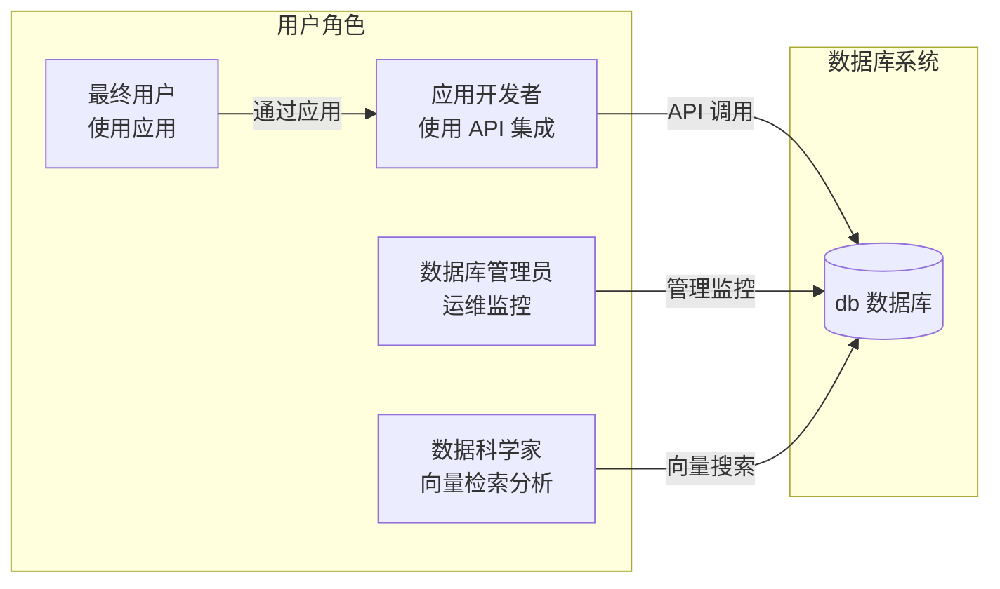
```mermaid
flowchart LR
    subgraph "用户角色"
        APP_DEV[应用开发者<br/>使用 API 集成]
        DBA[数据库管理员<br/>运维监控]
        DATA_SCIENTIST[数据科学家<br/>向量检索分析]
        END_USER[最终用户<br/>使用应用]
    end

    subgraph "数据库系统"
        DB[(db 数据库)]
    end

    APP_DEV -->|API 调用| DB
    DBA -->|管理监控| DB
    DATA_SCIENTIST -->|向量搜索| DB
    END_USER -->|通过应用| APP_DEV
```

### 1.2 核心用例图

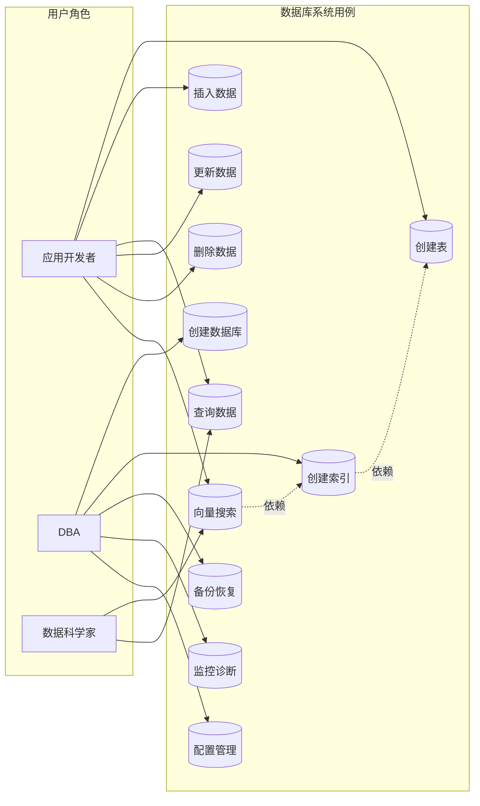
```mermaid
flowchart LR
    subgraph "用户角色"
        ACTOR_APP[应用开发者]
        ACTOR_DBA[DBA]
        ACTOR_DS[数据科学家]
    end

    subgraph "数据库系统用例"
        UC_CREATE_DB[(创建数据库)]
        UC_CREATE_TABLE[(创建表)]
        UC_INSERT[(插入数据)]
        UC_QUERY[(查询数据)]
        UC_UPDATE[(更新数据)]
        UC_DELETE[(删除数据)]
        UC_CREATE_INDEX[(创建索引)]
        UC_VECTOR_SEARCH[(向量搜索)]
        UC_BACKUP[(备份恢复)]
        UC_MONITOR[(监控诊断)]
        UC_CONFIG[(配置管理)]
    end

    ACTOR_APP --> UC_CREATE_TABLE
    ACTOR_APP --> UC_INSERT
    ACTOR_APP --> UC_QUERY
    ACTOR_APP --> UC_UPDATE
    ACTOR_APP --> UC_DELETE
    ACTOR_APP --> UC_VECTOR_SEARCH

    ACTOR_DBA --> UC_CREATE_DB
    ACTOR_DBA --> UC_CREATE_INDEX
    ACTOR_DBA --> UC_BACKUP
    ACTOR_DBA --> UC_MONITOR
    ACTOR_DBA --> UC_CONFIG

    ACTOR_DS --> UC_VECTOR_SEARCH
    ACTOR_DS --> UC_QUERY

    UC_CREATE_INDEX -.->|依赖| UC_CREATE_TABLE
    UC_VECTOR_SEARCH -.->|依赖| UC_CREATE_INDEX
```

---

## 二、场景 1：数据库初始化

### 2.1 场景描述

**角色**: DBA
**目标**: 初始化一个新的数据库实例
**前置条件**: 系统已安装，数据目录不存在

### 2.2 场景流程

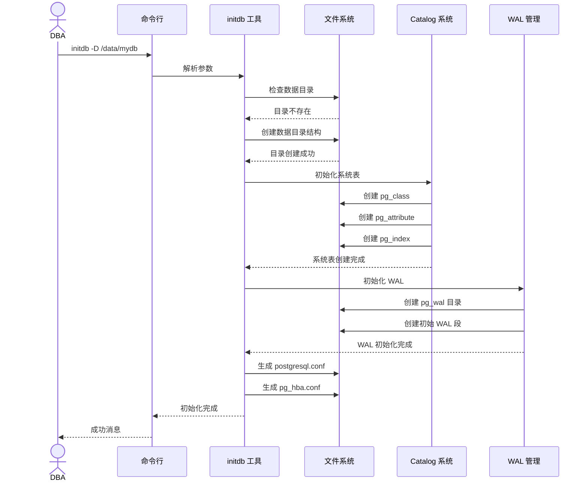
```mermaid
sequenceDiagram
    actor DBA as DBA
    participant CLI as 命令行
    participant InitDB as initdb 工具
    participant FS as 文件系统
    participant Catalog as Catalog 系统
    participant WAL as WAL 管理

    DBA->>CLI: initdb -D /data/mydb
    CLI->>InitDB: 解析参数

    InitDB->>FS: 检查数据目录
    FS-->>InitDB: 目录不存在

    InitDB->>FS: 创建数据目录结构
    FS-->>InitDB: 目录创建成功

    InitDB->>Catalog: 初始化系统表
    Catalog->>FS: 创建 pg_class
    Catalog->>FS: 创建 pg_attribute
    Catalog->>FS: 创建 pg_index
    Catalog-->>InitDB: 系统表创建完成

    InitDB->>WAL: 初始化 WAL
    WAL->>FS: 创建 pg_wal 目录
    WAL->>FS: 创建初始 WAL 段
    WAL-->>InitDB: WAL 初始化完成

    InitDB->>FS: 生成 postgresql.conf
    InitDB->>FS: 生成 pg_hba.conf

    InitDB-->>CLI: 初始化完成
    CLI-->>DBA: 成功消息
```

### 2.3 异常流程

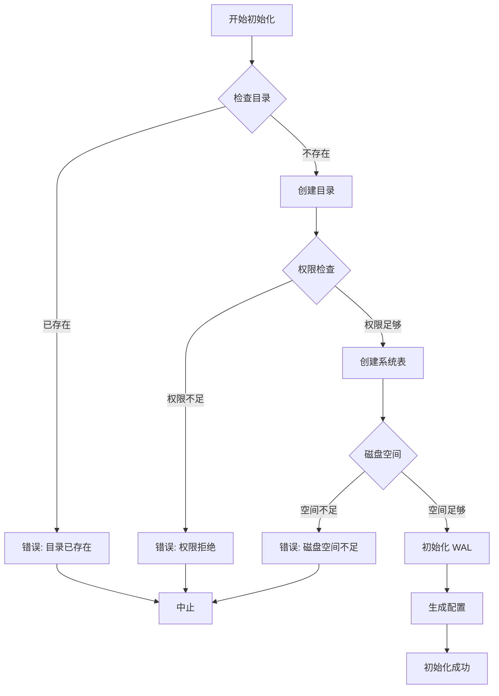
```mermaid
flowchart TD
    Start[开始初始化] --> CheckDir{检查目录}
    CheckDir -->|已存在| Error1[错误: 目录已存在]
    CheckDir -->|不存在| CreateDir[创建目录]

    CreateDir --> CheckPerm{权限检查}
    CheckPerm -->|权限不足| Error2[错误: 权限拒绝]
    CheckPerm -->|权限足够| CreateSysTables[创建系统表]

    CreateSysTables --> CheckSpace{磁盘空间}
    CheckSpace -->|空间不足| Error3[错误: 磁盘空间不足]
    CheckSpace -->|空间足够| InitWAL[初始化 WAL]

    InitWAL --> GenConfig[生成配置]
    GenConfig --> Success[初始化成功]

    Error1 --> Abort[中止]
    Error2 --> Abort
    Error3 --> Abort
```

---

## 三、场景 2：SQL 查询执行

### 3.1 场景描述

**角色**: 应用开发者
**目标**: 执行 SQL 查询获取数据
**前置条件**: 已连接数据库，表已创建

### 3.2 场景流程

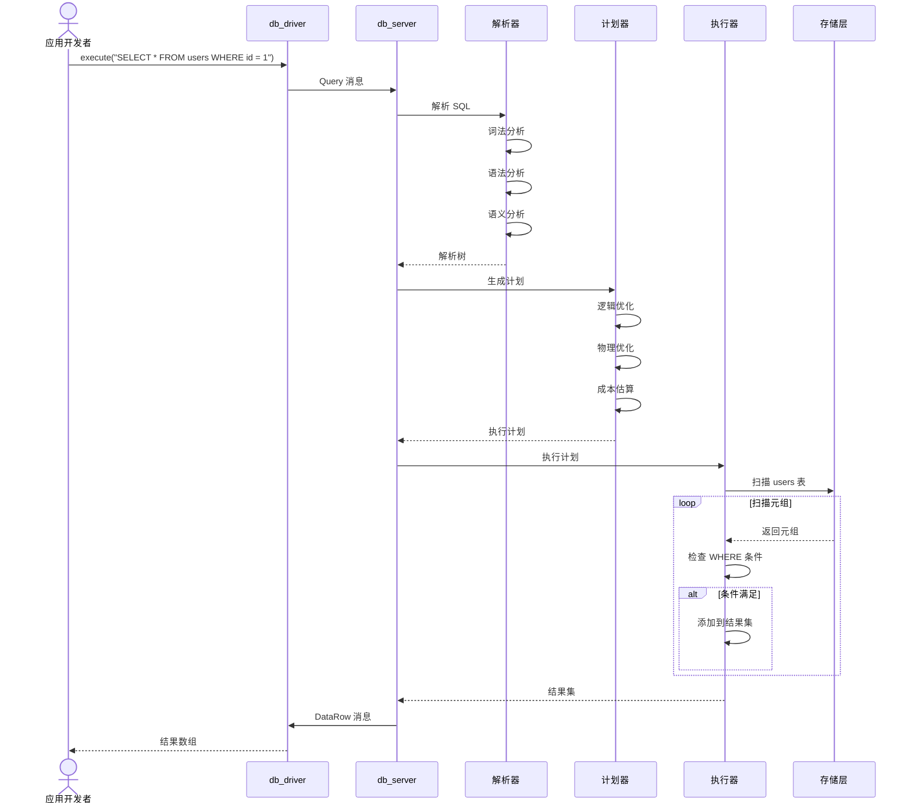
```mermaid
sequenceDiagram
    actor App as 应用开发者
    participant Driver as db_driver
    participant Server as db_server
    participant Parser as 解析器
    participant Planner as 计划器
    participant Executor as 执行器
    participant Storage as 存储层

    App->>Driver: execute("SELECT * FROM users WHERE id = 1")
    Driver->>Server: Query 消息

    Server->>Parser: 解析 SQL
    Parser->>Parser: 词法分析
    Parser->>Parser: 语法分析
    Parser->>Parser: 语义分析
    Parser-->>Server: 解析树

    Server->>Planner: 生成计划
    Planner->>Planner: 逻辑优化
    Planner->>Planner: 物理优化
    Planner->>Planner: 成本估算
    Planner-->>Server: 执行计划

    Server->>Executor: 执行计划
    Executor->>Storage: 扫描 users 表

    loop 扫描元组
        Storage-->>Executor: 返回元组
        Executor->>Executor: 检查 WHERE 条件
        alt 条件满足
            Executor->>Executor: 添加到结果集
        end
    end

    Executor-->>Server: 结果集
    Server->>Driver: DataRow 消息
    Driver-->>App: 结果数组
```

---

## 四、场景 3：向量相似搜索

### 4.1 场景描述

**角色**: 数据科学家
**目标**: 执行向量相似搜索找到最近的向量
**前置条件**: 向量索引已创建，数据已插入

### 4.2 场景流程

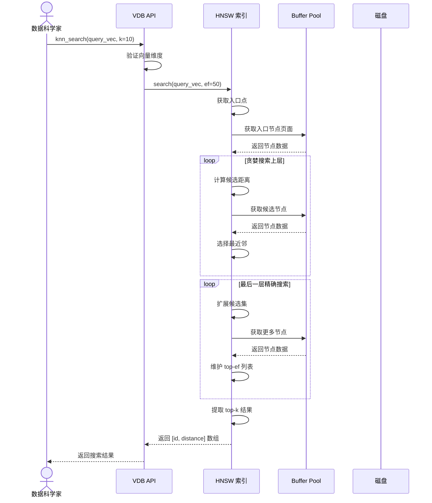
```mermaid
sequenceDiagram
    actor DS as 数据科学家
    participant API as VDB API
    participant HNSW as HNSW 索引
    participant Buffer as Buffer Pool
    participant Disk as 磁盘

    DS->>API: knn_search(query_vec, k=10)

    API->>API: 验证向量维度
    API->>HNSW: search(query_vec, ef=50)

    HNSW->>HNSW: 获取入口点
    HNSW->>Buffer: 获取入口节点页面
    Buffer-->>HNSW: 返回节点数据

    loop 贪婪搜索上层
        HNSW->>HNSW: 计算候选距离
        HNSW->>Buffer: 获取候选节点
        Buffer-->>HNSW: 返回节点数据
        HNSW->>HNSW: 选择最近邻
    end

    loop 最后一层精确搜索
        HNSW->>HNSW: 扩展候选集
        HNSW->>Buffer: 获取更多节点
        Buffer-->>HNSW: 返回节点数据
        HNSW->>HNSW: 维护 top-ef 列表
    end

    HNSW->>HNSW: 提取 top-k 结果
    HNSW-->>API: 返回 [id, distance] 数组
    API-->>DS: 返回搜索结果
```

### 4.3 索引创建子场景

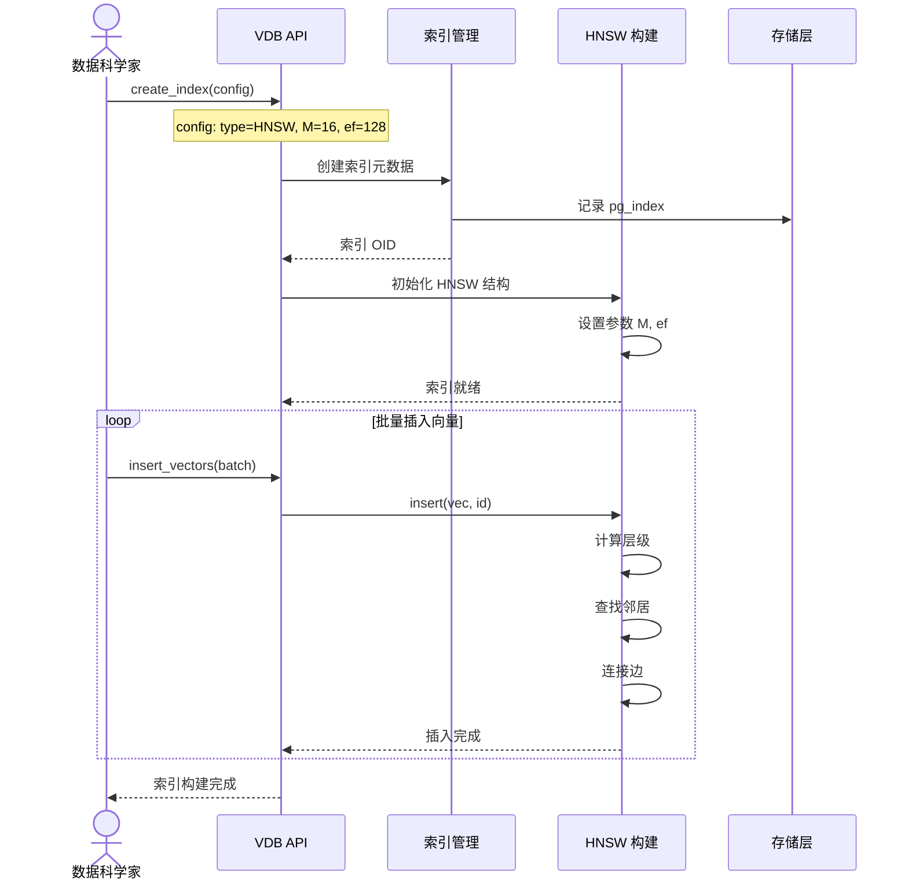
```mermaid
sequenceDiagram
    actor DS as 数据科学家
    participant API as VDB API
    participant Index as 索引管理
    participant HNSW as HNSW 构建
    participant Storage as 存储层

    DS->>API: create_index(config)
    Note over API: config: type=HNSW, M=16, ef=128

    API->>Index: 创建索引元数据
    Index->>Storage: 记录 pg_index
    Index-->>API: 索引 OID

    API->>HNSW: 初始化 HNSW 结构
    HNSW->>HNSW: 设置参数 M, ef
    HNSW-->>API: 索引就绪

    loop 批量插入向量
        DS->>API: insert_vectors(batch)
        API->>HNSW: insert(vec, id)
        HNSW->>HNSW: 计算层级
        HNSW->>HNSW: 查找邻居
        HNSW->>HNSW: 连接边
        HNSW-->>API: 插入完成
    end

    API-->>DS: 索引构建完成
```

---

## 五、场景 4：事务提交

### 5.1 场景描述

**角色**: 应用开发者
**目标**: 提交一个包含多个操作的事务
**前置条件**: 事务已开始

### 5.2 场景流程

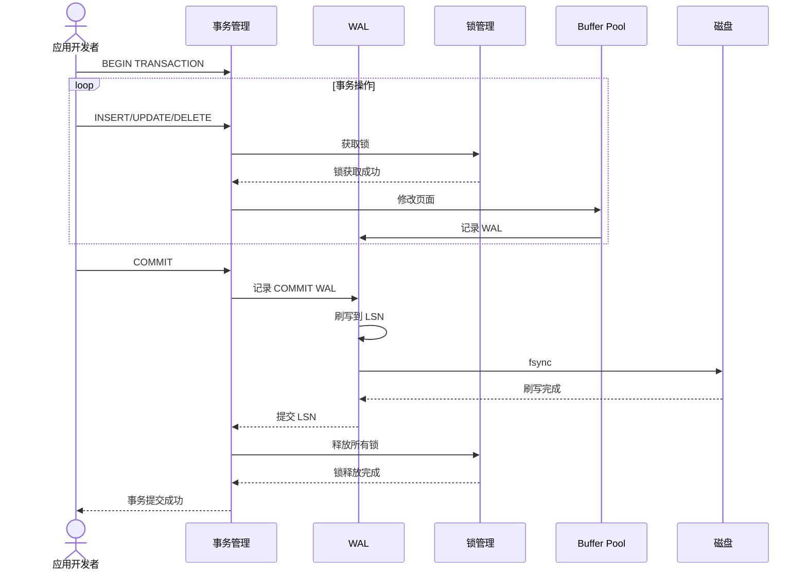
```mermaid
sequenceDiagram
    actor App as 应用开发者
    participant TXN as 事务管理
    participant WAL as WAL
    participant Lock as 锁管理
    participant Buffer as Buffer Pool
    participant Disk as 磁盘

    App->>TXN: BEGIN TRANSACTION

    loop 事务操作
        App->>TXN: INSERT/UPDATE/DELETE
        TXN->>Lock: 获取锁
        Lock-->>TXN: 锁获取成功
        TXN->>Buffer: 修改页面
        Buffer->>WAL: 记录 WAL
    end

    App->>TXN: COMMIT

    TXN->>WAL: 记录 COMMIT WAL
    WAL->>WAL: 刷写到 LSN
    WAL->>Disk: fsync
    Disk-->>WAL: 刷写完成
    WAL-->>TXN: 提交 LSN

    TXN->>Lock: 释放所有锁
    Lock-->>TXN: 锁释放完成

    TXN-->>App: 事务提交成功
```

### 5.3 事务回滚场景

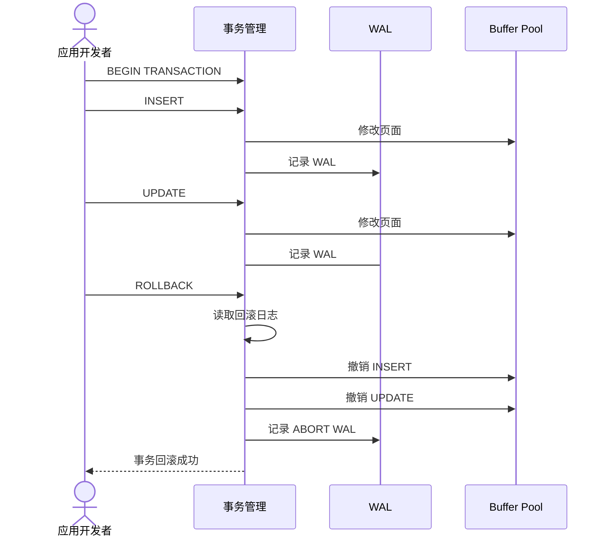
```mermaid
sequenceDiagram
    actor App as 应用开发者
    participant TXN as 事务管理
    participant WAL as WAL
    participant Buffer as Buffer Pool

    App->>TXN: BEGIN TRANSACTION

    App->>TXN: INSERT
    TXN->>Buffer: 修改页面
    TXN->>WAL: 记录 WAL

    App->>TXN: UPDATE
    TXN->>Buffer: 修改页面
    TXN->WAL: 记录 WAL

    App->>TXN: ROLLBACK

    TXN->>TXN: 读取回滚日志
    TXN->>Buffer: 撤销 INSERT
    TXN->>Buffer: 撤销 UPDATE
    TXN->>WAL: 记录 ABORT WAL

    TXN-->>App: 事务回滚成功
```

---

## 六、场景 5：数据库备份与恢复

### 6.1 场景描述

**角色**: DBA
**目标**: 备份数据库并在需要时恢复
**前置条件**: 数据库运行正常

### 6.2 物理备份场景

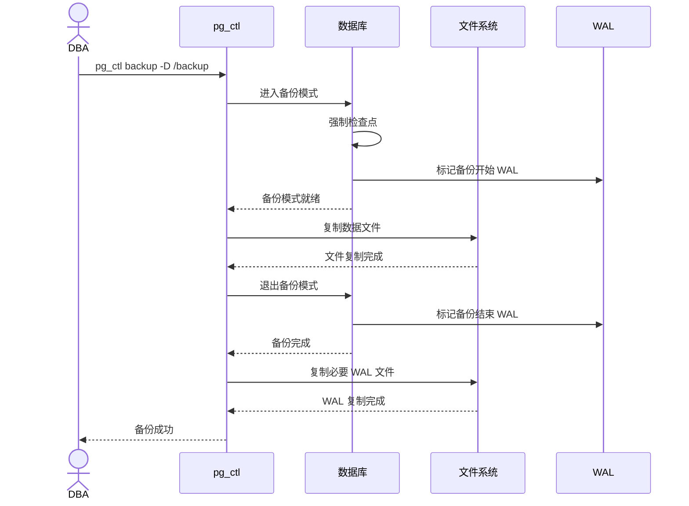
```mermaid
sequenceDiagram
    actor DBA as DBA
    participant pg_ctl as pg_ctl
    participant DB as 数据库
    participant FS as 文件系统

    DBA->>pg_ctl: pg_ctl backup -D /backup

    pg_ctl->>DB: 进入备份模式
    DB->>DB: 强制检查点
    DB->>WAL: 标记备份开始 WAL
    DB-->>pg_ctl: 备份模式就绪

    pg_ctl->>FS: 复制数据文件
    FS-->>pg_ctl: 文件复制完成

    pg_ctl->>DB: 退出备份模式
    DB->>WAL: 标记备份结束 WAL
    DB-->>pg_ctl: 备份完成

    pg_ctl->>FS: 复制必要 WAL 文件
    FS-->>pg_ctl: WAL 复制完成

    pg_ctl-->>DBA: 备份成功
```

### 6.3 恢复场景

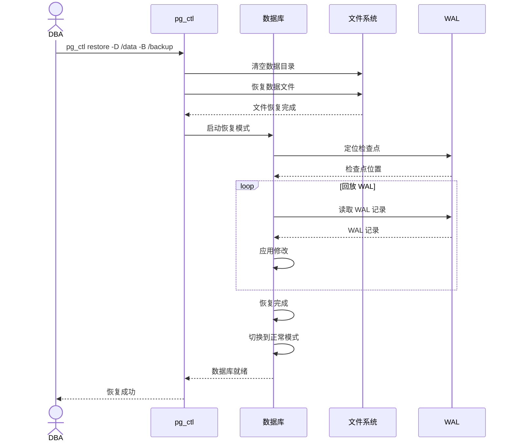
```mermaid
sequenceDiagram
    actor DBA as DBA
    participant pg_ctl as pg_ctl
    participant DB as 数据库
    participant FS as 文件系统
    participant WAL as WAL

    DBA->>pg_ctl: pg_ctl restore -D /data -B /backup

    pg_ctl->>FS: 清空数据目录
    pg_ctl->>FS: 恢复数据文件
    FS-->>pg_ctl: 文件恢复完成

    pg_ctl->>DB: 启动恢复模式
    DB->>WAL: 定位检查点
    WAL-->>DB: 检查点位置

    loop 回放 WAL
        DB->>WAL: 读取 WAL 记录
        WAL-->>DB: WAL 记录
        DB->>DB: 应用修改
    end

    DB->>DB: 恢复完成
    DB->>DB: 切换到正常模式
    DB-->>pg_ctl: 数据库就绪

    pg_ctl-->>DBA: 恢复成功
```

---

## 七、场景 6：系统监控与诊断

### 7.1 场景描述

**角色**: DBA
**目标**: 监控数据库运行状态，诊断性能问题
**前置条件**: 数据库运行中

### 7.2 性能监控场景

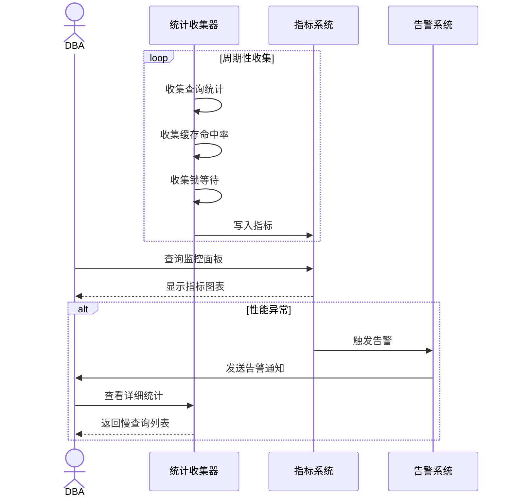
```mermaid
sequenceDiagram
    actor DBA as DBA
    participant Stats as 统计收集器
    participant Metrics as 指标系统
    participant Alert as 告警系统

    loop 周期性收集
        Stats->>Stats: 收集查询统计
        Stats->>Stats: 收集缓存命中率
        Stats->>Stats: 收集锁等待
        Stats->>Metrics: 写入指标
    end

    DBA->>Metrics: 查询监控面板
    Metrics-->>DBA: 显示指标图表

    alt 性能异常
        Metrics->>Alert: 触发告警
        Alert->>DBA: 发送告警通知
        DBA->>Stats: 查看详细统计
        Stats-->>DBA: 返回慢查询列表
    end
```

### 7.3 死锁诊断场景

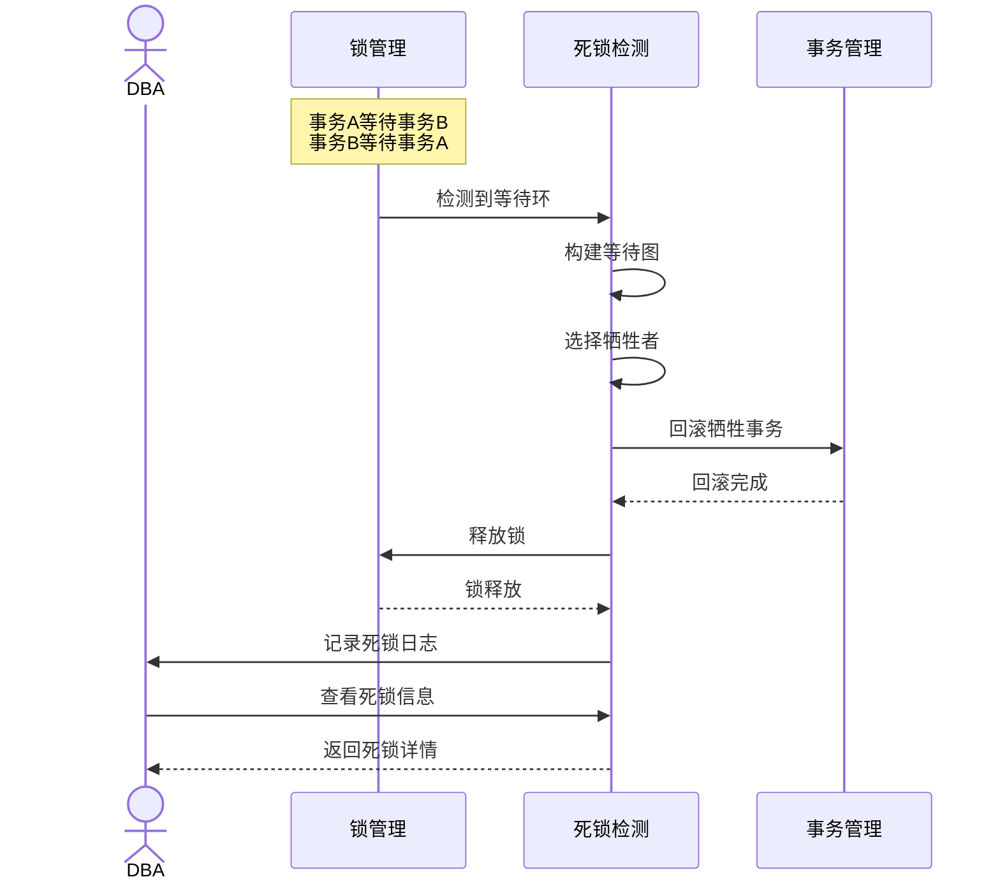
```mermaid
sequenceDiagram
    actor DBA as DBA
    participant Lock as 锁管理
    participant Deadlock as 死锁检测
    participant TXN as 事务管理

    Note over Lock: 事务A等待事务B<br/>事务B等待事务A

    Lock->>Deadlock: 检测到等待环
    Deadlock->>Deadlock: 构建等待图
    Deadlock->>Deadlock: 选择牺牲者
    Deadlock->>TXN: 回滚牺牲事务
    TXN-->>Deadlock: 回滚完成
    Deadlock->>Lock: 释放锁
    Lock-->>Deadlock: 锁释放

    Deadlock->>DBA: 记录死锁日志
    DBA->>Deadlock: 查看死锁信息
    Deadlock-->>DBA: 返回死锁详情
```

---

## 八、场景 7：索引创建与维护

### 8.1 场景描述

**角色**: DBA
**目标**: 为大表创建索引，提升查询性能
**前置条件**: 表已存在，数据量大

### 8.2 索引创建场景

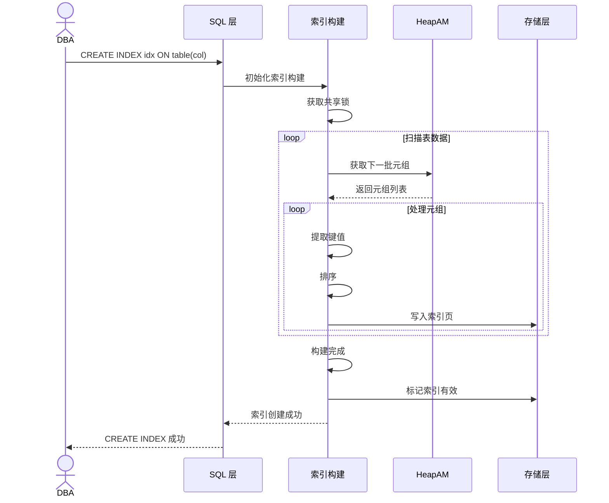
```mermaid
sequenceDiagram
    actor DBA as DBA
    participant SQL as SQL 层
    participant Index as 索引构建
    participant Heap as HeapAM
    participant Storage as 存储层

    DBA->>SQL: CREATE INDEX idx ON table(col)
    SQL->>Index: 初始化索引构建

    Index->>Index: 获取共享锁

    loop 扫描表数据
        Index->>Heap: 获取下一批元组
        Heap-->>Index: 返回元组列表

        loop 处理元组
            Index->>Index: 提取键值
            Index->>Index: 排序
            Index->>Storage: 写入索引页
        end
    end

    Index->>Index: 构建完成
    Index->>Storage: 标记索引有效
    Index-->>SQL: 索引创建成功
    SQL-->>DBA: CREATE INDEX 成功
```

---

## 九、场景 8：分布式查询

### 9.1 场景描述

**角色**: 应用开发者
**目标**: 在分布式环境中执行跨分片查询
**前置条件**: 数据已分片，协调节点已配置

### 9.2 分布式查询场景

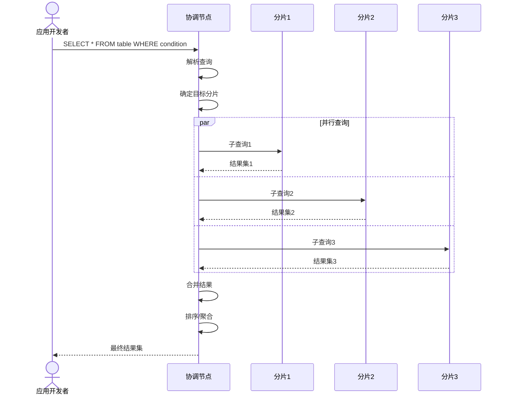
```mermaid
sequenceDiagram
    actor App as 应用开发者
    participant Coord as 协调节点
    participant Shard1 as 分片1
    participant Shard2 as 分片2
    participant Shard3 as 分片3

    App->>Coord: SELECT * FROM table WHERE condition

    Coord->>Coord: 解析查询
    Coord->>Coord: 确定目标分片

    par 并行查询
        Coord->>Shard1: 子查询1
        Shard1-->>Coord: 结果集1
    and
        Coord->>Shard2: 子查询2
        Shard2-->>Coord: 结果集2
    and
        Coord->>Shard3: 子查询3
        Shard3-->>Coord: 结果集3
    end

    Coord->>Coord: 合并结果
    Coord->>Coord: 排序/聚合

    Coord-->>App: 最终结果集
```

---

## 十、场景 9：连接池管理

### 10.1 场景描述

**角色**: 应用开发者
**目标**: 使用连接池提高并发性能
**前置条件**: db_driver 已集成

### 10.2 连接池场景

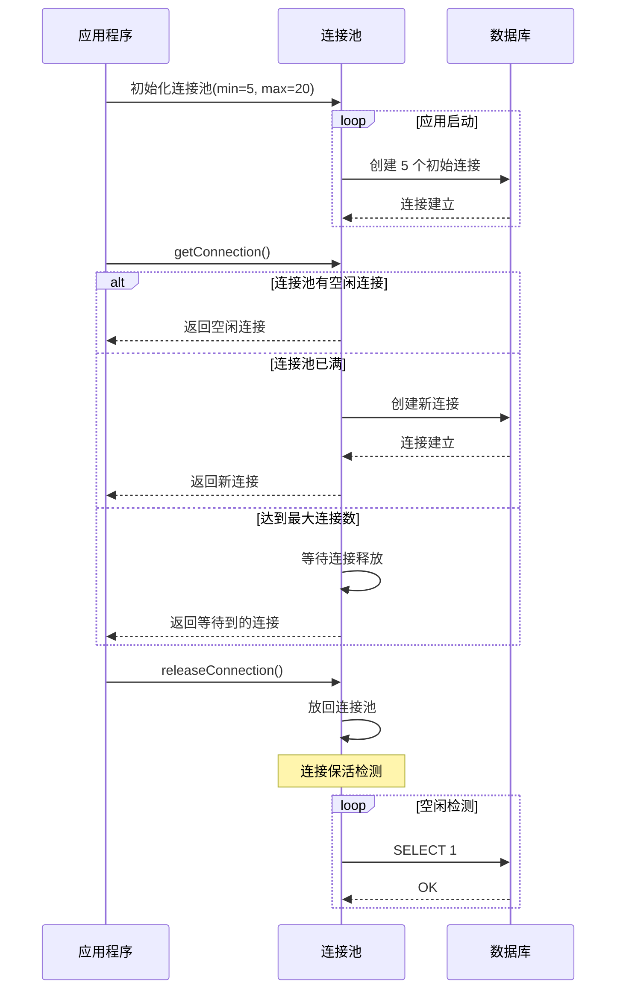
```mermaid
sequenceDiagram
    participant App as 应用程序
    participant Pool as 连接池
    participant DB as 数据库

    App->>Pool: 初始化连接池(min=5, max=20)

    loop 应用启动
        Pool->>DB: 创建 5 个初始连接
        DB-->>Pool: 连接建立
    end

    App->>Pool: getConnection()
    alt 连接池有空闲连接
        Pool-->>App: 返回空闲连接
    else 连接池已满
        Pool->>DB: 创建新连接
        DB-->>Pool: 连接建立
        Pool-->>App: 返回新连接
    else 达到最大连接数
        Pool->>Pool: 等待连接释放
        Pool-->>App: 返回等待到的连接
    end

    App->>Pool: releaseConnection()
    Pool->>Pool: 放回连接池

    Note over Pool: 连接保活检测

    loop 空闲检测
        Pool->>DB: SELECT 1
        DB-->>Pool: OK
    end
```

---

## 十一、场景 10：数据导入导出

### 11.1 场景描述

**角色**: 数据科学家
**目标**: 批量导入向量数据到数据库
**前置条件**: 表已创建，数据文件已准备

### 11.2 批量导入场景

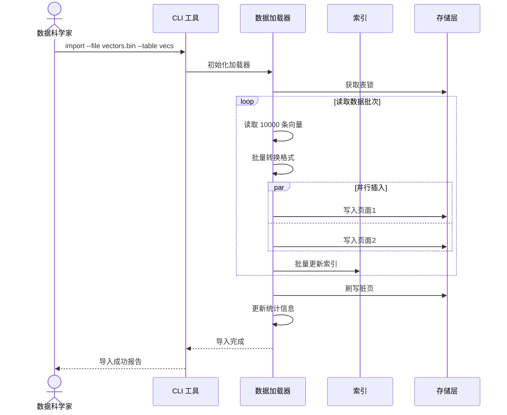
```mermaid
sequenceDiagram
    actor DS as 数据科学家
    participant CLI as CLI 工具
    participant Loader as 数据加载器
    participant Index as 索引
    participant Storage as 存储层

    DS->>CLI: import --file vectors.bin --table vecs

    CLI->>Loader: 初始化加载器
    Loader->>Storage: 获取表锁

    loop 读取数据批次
        Loader->>Loader: 读取 10000 条向量
        Loader->>Loader: 批量转换格式

        par 并行插入
            Loader->>Storage: 写入页面1
        and
            Loader->>Storage: 写入页面2
        end

        Loader->>Index: 批量更新索引
    end

    Loader->>Storage: 刷写脏页
    Loader->>Loader: 更新统计信息
    Loader-->>CLI: 导入完成
    CLI-->>DS: 导入成功报告
```

---

## 十二、用例优先级矩阵

| 用例 | 频率 | 重要性 | 复杂度 | 优先级 |
|------|------|--------|--------|--------|
| SQL 查询执行 | 高 | 高 | 中 | P0 |
| 数据插入 | 高 | 高 | 中 | P0 |
| 向量相似搜索 | 高 | 高 | 高 | P0 |
| 事务提交 | 高 | 高 | 高 | P0 |
| 索引创建 | 中 | 高 | 高 | P1 |
| 数据库初始化 | 低 | 高 | 低 | P1 |
| 备份恢复 | 低 | 高 | 中 | P1 |
| 性能监控 | 中 | 中 | 中 | P2 |
| 分布式查询 | 中 | 中 | 高 | P2 |
| 数据导入导出 | 中 | 中 | 中 | P2 |
| 连接池管理 | 高 | 中 | 低 | P2 |

---

## 十三、非功能性需求映射

| 非功能性需求 | 相关场景 | 实现机制 |
|-------------|----------|----------|
| **性能** | SQL 查询、向量搜索 | Buffer Pool、索引优化 |
| **可靠性** | 事务提交、备份恢复 | WAL、检查点、复制 |
| **可扩展性** | 分布式查询 | 分片、协调器 |
| **可用性** | 备份恢复、故障切换 | Raft 共识、主从复制 |
| **安全性** | 连接池、访问控制 | SSL、认证、授权 |
| **可维护性** | 性能监控、诊断 | 统计收集、日志系统 |

---

## 十四、关键代码位置

| 场景 | 相关源文件 |
|------|-----------|
| 数据库初始化 | `engineering/src/db/core/initdb.c` |
| SQL 查询执行 | `engineering/src/db/executor/` |
| 向量相似搜索 | `engineering/src/db/index/vector_index/hnsw/` |
| 事务提交 | `engineering/src/db/txn/` |
| 备份恢复 | `engineering/src/db/core/pg_ctl.c` |
| 性能监控 | `engineering/src/db/bgworker/` |
| 索引创建 | `engineering/src/db/index/` |
| 分布式查询 | `engineering/src/db/sharding/` |
| Wire 协议 | `engineering/include/db/sql/pgwire.h` |
