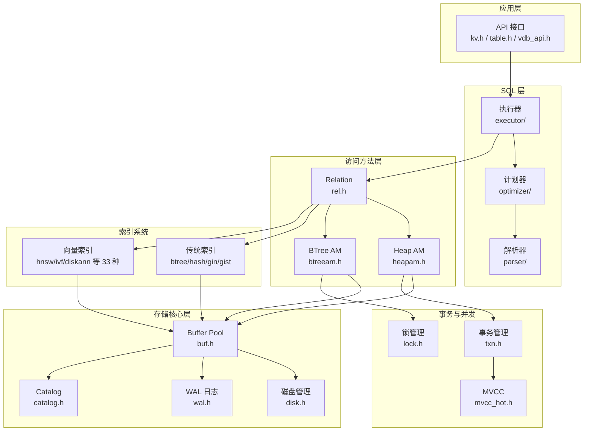

# db 数据库存储引擎 - 架构概览

本文档提供 db 数据库存储引擎的架构概览，汇总各视图的关键信息。

---

## 项目信息

- **名称**: db 数据库存储引擎
- **类型**: PostgreSQL 风格存储引擎 + 向量数据库能力
- **语言**: C11 / C++17
- **构建系统**: CMake 3.20+

---

## 视图索引

| 视图 | 文件 | 说明 |
|------|------|------|
| **逻辑视图** | [01-logical-view.md](01-logical-view.md) | 静态结构、核心组件、类图 |
| **过程视图** | [02-process-view.md](02-process-view.md) | 运行时行为、并发模型、核心流程 |
| **开发视图** | [03-development-view.md](03-development-view.md) | 代码组织、模块划分、构建结构 |
| **物理视图** | [04-physical-view.md](04-physical-view.md) | 部署拓扑、运行环境、资源配置 |
| **场景视图** | [05-scenario-view.md](05-scenario-view.md) | 核心用例、用户交互、业务流程 |

---

## 核心架构图

### 系统分层架构

---

## 子系统清单

| 子系统 | 说明 | 详细文档 |
|--------|------|----------|
| **存储核心** | Buffer Pool、磁盘管理、页面管理、WAL、Catalog | [storage/](storage/) |
| **访问方法层** | Relation 抽象、HeapAM、BTreeAM | [access-methods/](access-methods/) |
| **Catalog 系统** | 系统表、OID 管理、元数据缓存 | [catalog/](catalog/) |
| **SQL 层** | 解析器、计划器、执行器 | [sql-layer/](sql-layer/) |
| **事务与并发** | 事务管理、锁管理、MVCC | [transaction/](transaction/) |
| **索引系统** | 传统索引、向量索引（33 种） | [index/](index/) |
| **多模态存储** | KV/向量/文档/时序/空间/图/层次引擎 | [multi-modal/](multi-modal/) |
| **分布式能力** | 分片路由、分布式事务、Raft 共识 | [distributed/](distributed/) |
| **后台工作** | 任务调度、统计收集、worker 池 | [bgworker/](bgworker/) |

---

## 关键技术决策

| 决策点 | 选择 | 原因 |
|--------|------|------|
| 分层架构 | PostgreSQL 风格 | 清晰职责分离、便于测试优化 |
| Buffer Pool | Clock-Sweep + Hash 表 | 平衡性能与复杂度、成熟实践 |
| WAL | 顺序写 + fsync | 高可靠性、支持恢复 |
| MVCC | 多版本并发控制 | 高并发、读写不阻塞 |
| 向量索引 | HNSW + IVF + DiskANN 等 33 种 | 覆盖不同场景需求 |
| 分布式共识 | Raft | 简单可靠、工业验证 |

---

## 核心指标

| 指标 | 数值 |
|------|------|
| 源文件数量 | ~200+ .c 文件 |
| 头文件数量 | ~80 .h 文件 |
| 索引类型 | 33 种向量索引 + 传统索引 |
| 多模态引擎 | 7 种存储引擎 |
| 测试文件 | 40+ 测试文件 |
| 代码行数 | ~50,000+ 行 |

---

## 快速导航

### 按角色

- **应用开发者**: [场景视图 - SQL 查询执行](05-scenario-view.md#三场景-2sql-查询执行)
- **数据科学家**: [场景视图 - 向量相似搜索](05-scenario-view.md#四场景-3向量相似搜索)
- **DBA**: [场景视图 - 数据库初始化](05-scenario-view.md#二场景-1数据库初始化)

### 按功能

- **存储引擎**: [存储核心子系统](storage/)
- **向量检索**: [索引系统 - 向量索引](index/)
- **事务处理**: [事务与并发子系统](transaction/)
- **分布式**: [分布式能力子系统](distributed/)

---

## 相关文档

- [AGENTS.md](../../../AGENTS.md) - 项目构建指南
- [CLAUDE.md](../../../CLAUDE.md) - 项目说明文档
- [storage-architecture.md](../../storage-architecture.md) - 存储架构详细说明
