# 访问方法层 - 架构设计

## 概述

访问方法层（Access Method Layer）是 db 数据库存储引擎的核心抽象层，负责统一管理表、索引等数据对象的存储和访问。参考 PostgreSQL 的 Relation + HeapAM + BTreeAM 设计。

---

## 一、子系统架构概览

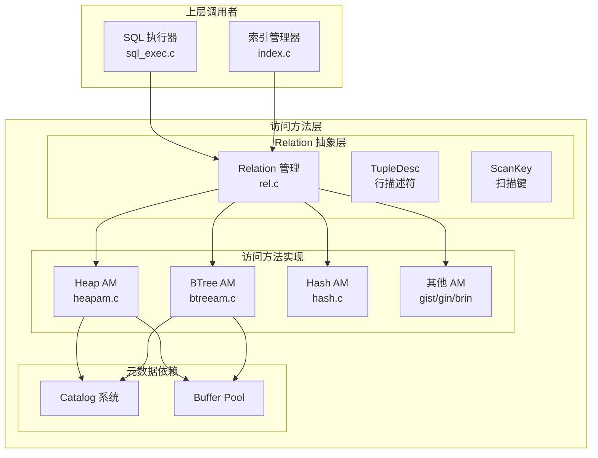

---

## 二、Relation 抽象

### 2.1 Relation 核心结构

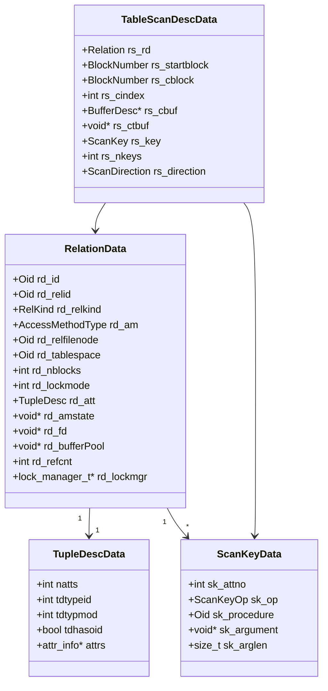

### 2.2 Relation 生命周期

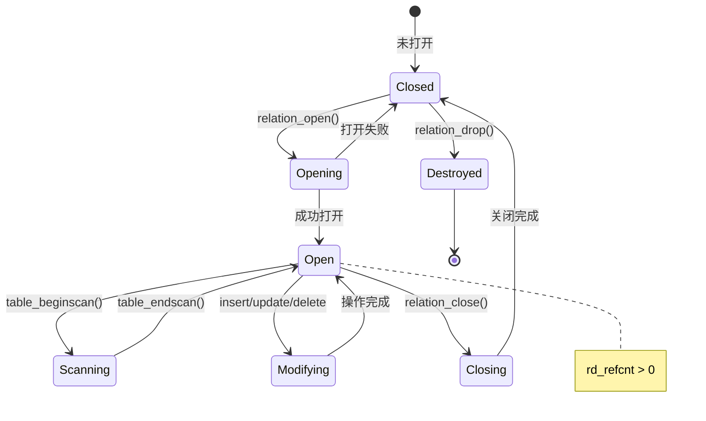

---

## 三、Heap AM（堆表访问方法）

### 3.1 Heap AM 结构

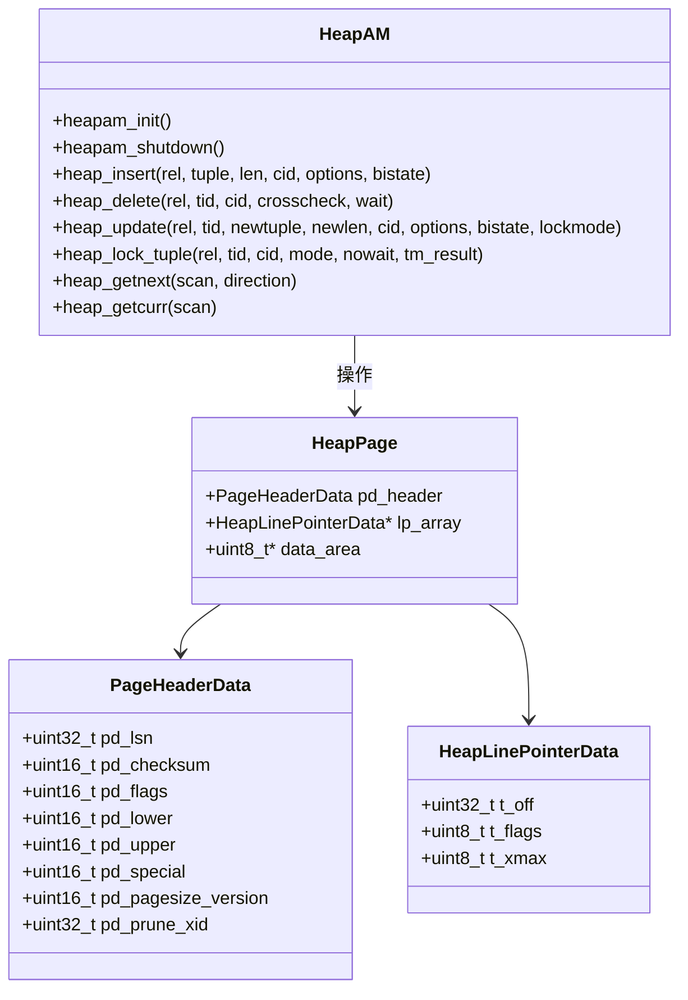

### 3.2 堆页面布局

### 3.3 元组插入流程

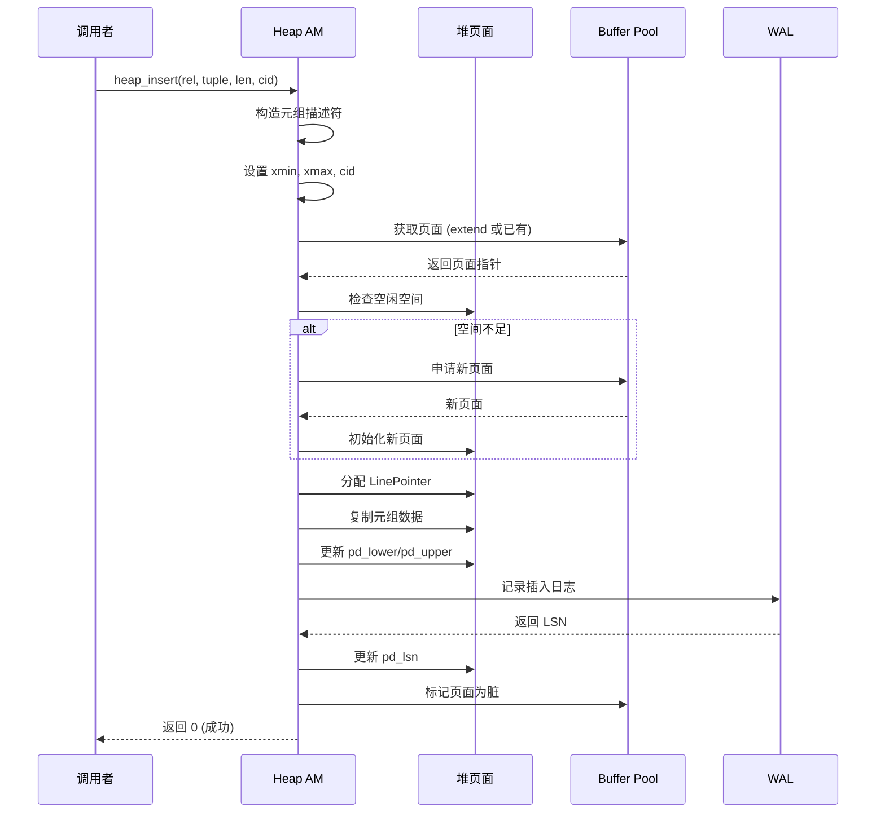

### 3.4 表扫描流程

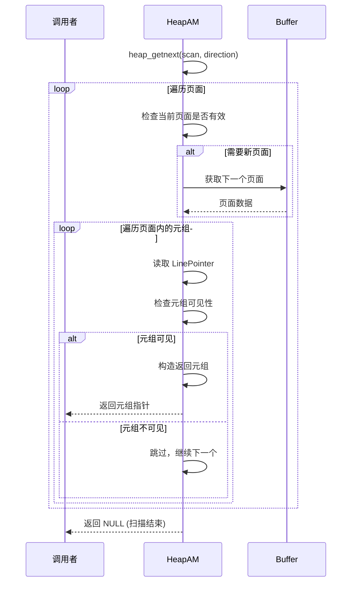

---

## 四、BTree AM（BTree 索引访问方法）

### 4.1 BTree 结构

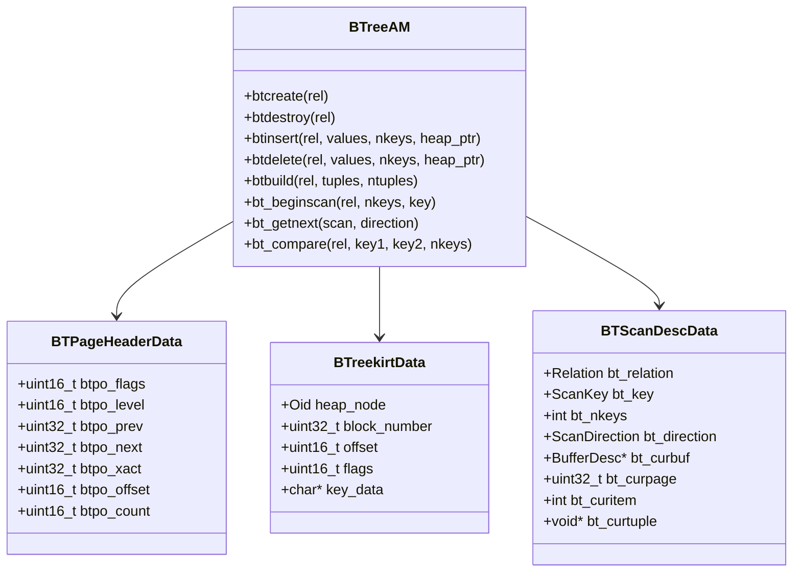

### 4.2 BTree 结构示意图

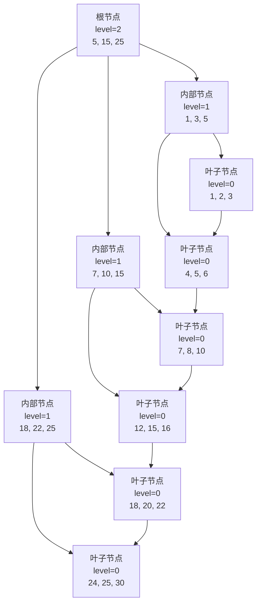

### 4.3 BTree 插入流程

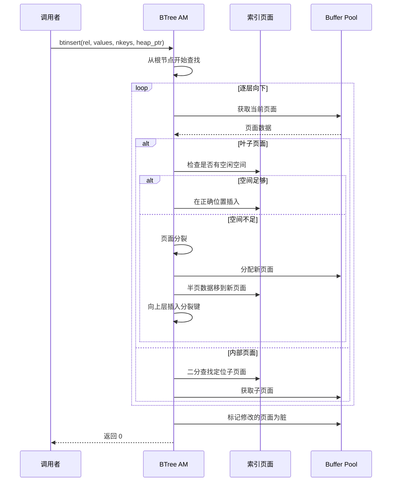

### 4.4 BTree 索引扫描

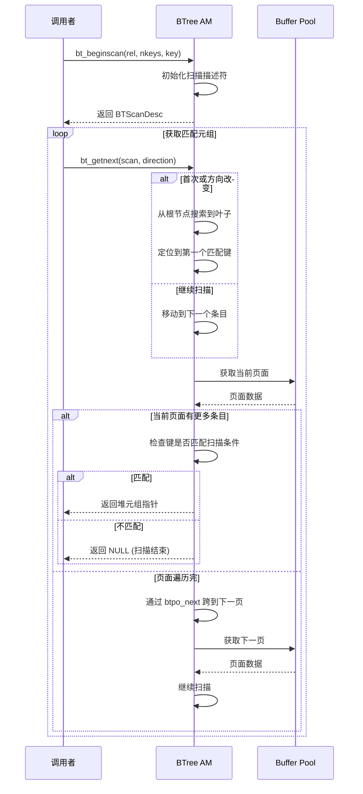

---

## 五、访问方法接口统一

### 5.1 AM 接口表

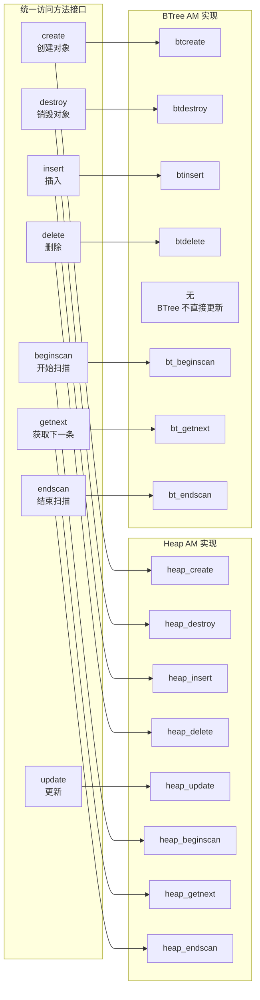

### 5.2 扫描方向枚举

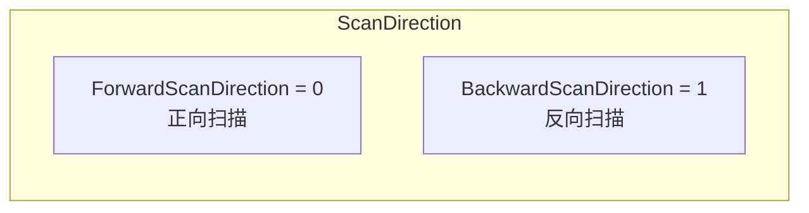

---

## 六、索引扫描

### 6.1 索引扫描流程

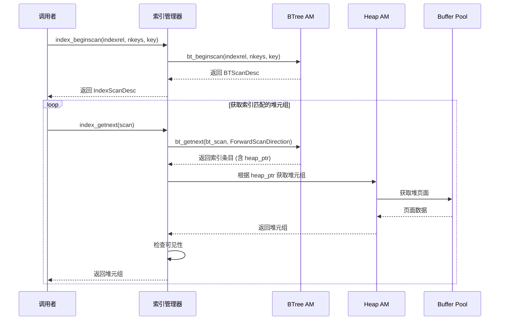

---

## 七、模块依赖与统计

### 7.1 依赖关系

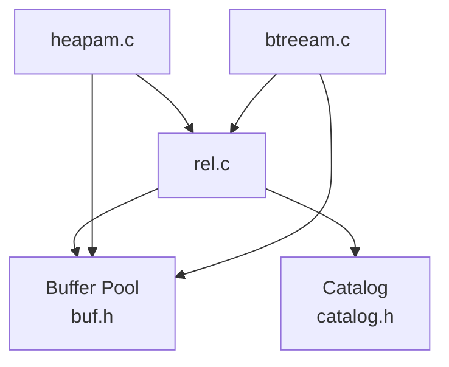

### 7.2 统计信息

| 统计项 | Heap AM | BTree AM |
|--------|---------|----------|
| 插入次数 | `inserts` | `insertions` |
| 删除次数 | `deletes` | `deletions` |
| 更新次数 | `updates` | - |
| 元组读取数 | `tuples_read` | - |
| 索引扫描次数 | - | `index_scans` |
| 索引元组数 | - | `index_tuples` |
| 索引页面数 | - | `index_pages` |
| 死亡元组 | `dead_tuples` | - |
| HOT 更新次数 | `tuples_hot_updated` | - |

---

## 八、关键代码位置

| 功能 | 头文件 | 源文件 |
|------|--------|--------|
| Relation 抽象 | `engineering/include/db/rel.h` | `engineering/src/db/rel/rel.c` |
| Heap AM | `engineering/include/db/heapam.h` | `engineering/src/db/access_methods/heapam.c` |
| BTree AM | `engineering/include/db/btreeam.h` | `engineering/src/db/access_methods/btreeam.c` |
| 索引扫描 | `engineering/include/db/rel.h` | `engineering/src/db/rel/rel.c` |