# 后台任务调度器 - 架构设计

## 概述

后台任务调度器（bgworker）负责管理数据库中的周期性后台任务，包括索引维护、统计信息收集、CCEH 哈希表缩容等。采用单线程事件循环 + 任务槽位的架构，类似 PostgreSQL 的 bgworker 机制。

---

## 一、子系统架构概览

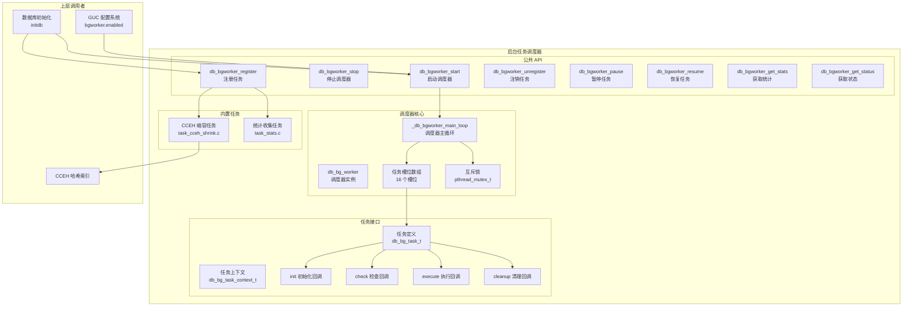

---

## 二、核心数据结构

### 2.1 调度器结构

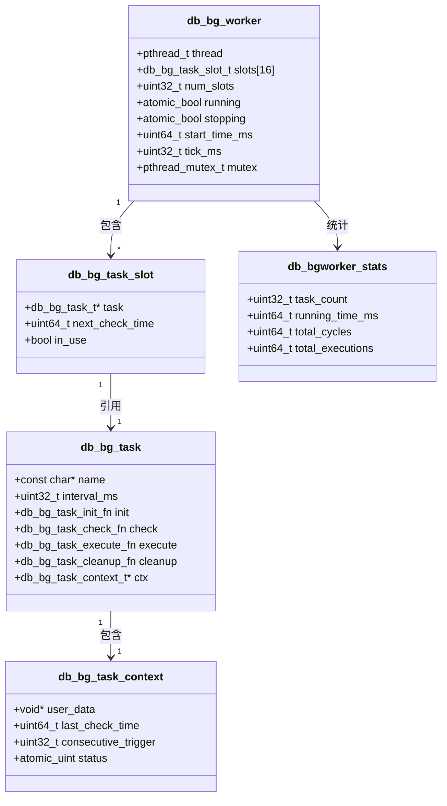

### 2.2 任务状态机

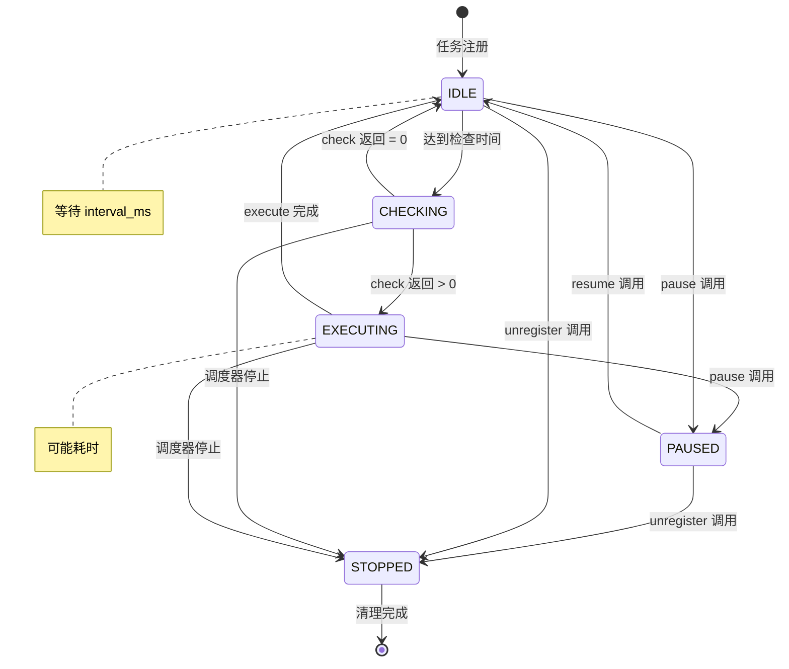

---

## 三、调度器主循环

### 3.1 主循环流程

```mermaid
flowchart TD
    Start[调度器主循环启动] --> Loop{atomic_load running?}

    Loop -->|是| Tick[等待 tick_ms<br/>默认 1000ms]

    Tick --> Lock[加锁]
    Lock --> Iterate[遍历所有槽位]

    Iterate --> CheckSlot{slot in_use?}

    CheckSlot -->|否| NextSlot[下一个槽位]
    NextSlot --> Iterate

    CheckSlot -->|是| CheckTime{当前时间 >=<br/>next_check_time?}

    CheckTime -->|否| NextSlot

    CheckTime -->|是| SetChecking[设置状态: CHECKING]
    SetChecking --> Unlock[解锁]

    Unlock --> CallCheck[调用 task->check(ctx)]

    CallCheck --> CheckResult{返回值}

    CheckResult -->|> 0 满足条件| SetExecuting[设置状态: EXECUTING]
    CheckResult -->|= 0 不满足| SetIdle1[设置状态: IDLE]

    SetExecuting --> CallExecute[调用 task->execute(ctx)]
    CallExecute --> SetIdle2[设置状态: IDLE]

    SetIdle1 --> UpdateNextCheck[更新 next_check_time<br/>= 当前时间 + interval_ms]
    SetIdle2 --> UpdateNextCheck

    UpdateNextCheck --> Lock2[加锁]
    Lock2 --> Loop

    Loop -->|否| Stop[停止调度器]
    Stop --> Cleanup[清理所有任务]
    Cleanup --> Done[调度器退出]
```

### 3.2 主循环序列图

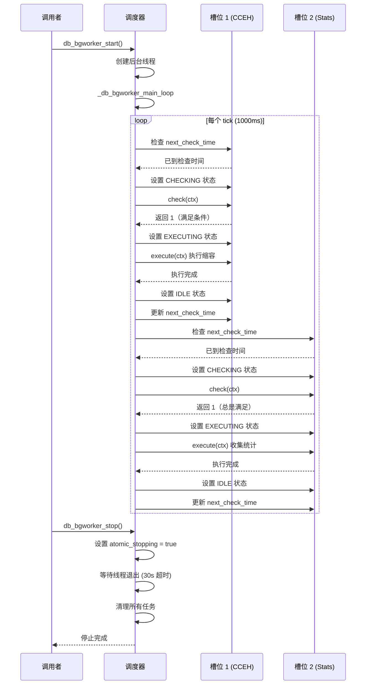

---

## 四、任务生命周期

### 4.1 任务注册流程

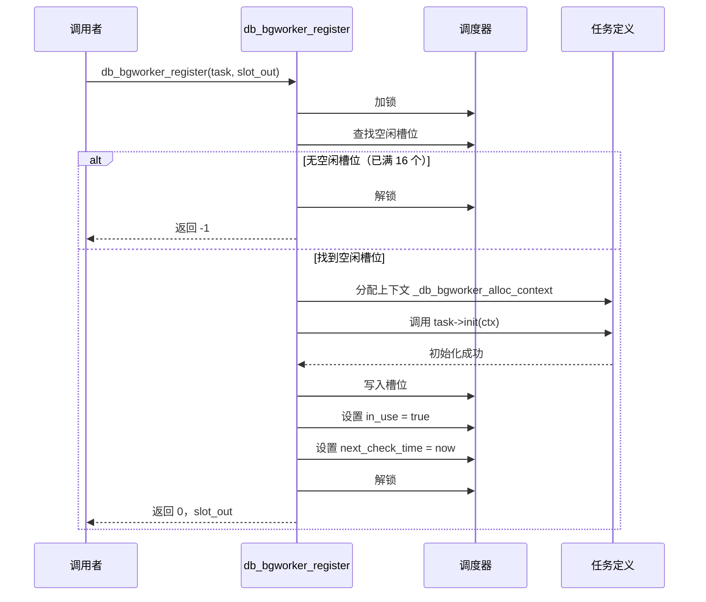

### 4.2 任务注销流程

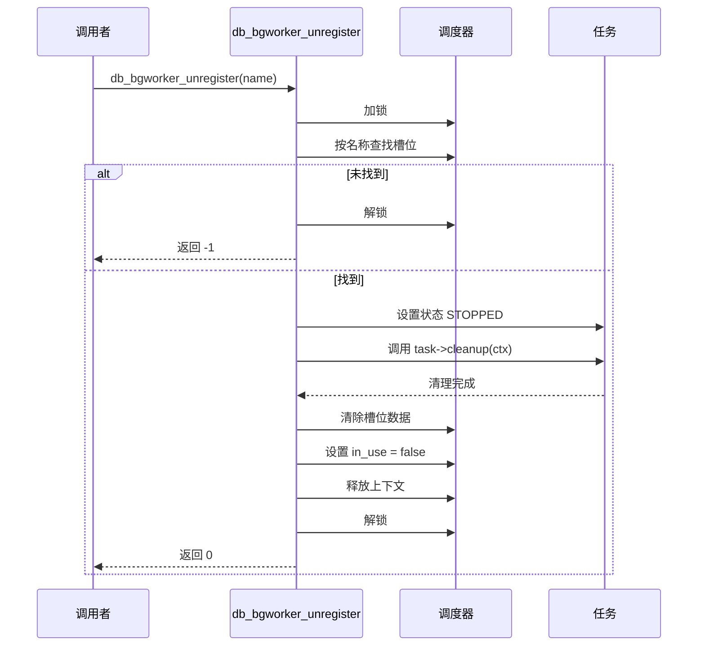

### 4.3 任务暂停/恢复

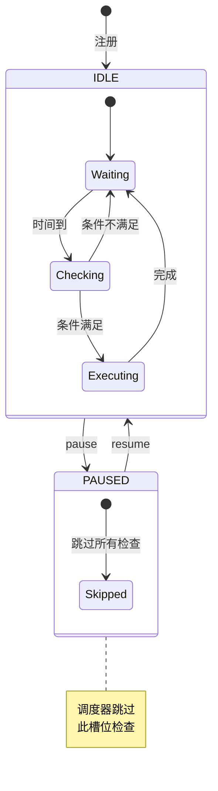

---

## 五、内置任务

### 5.1 CCEH 缩容任务

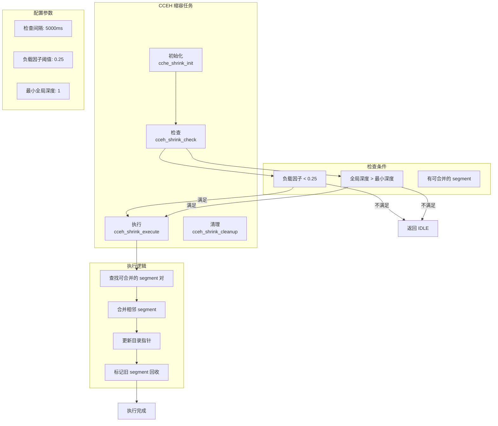

### 5.2 统计收集任务

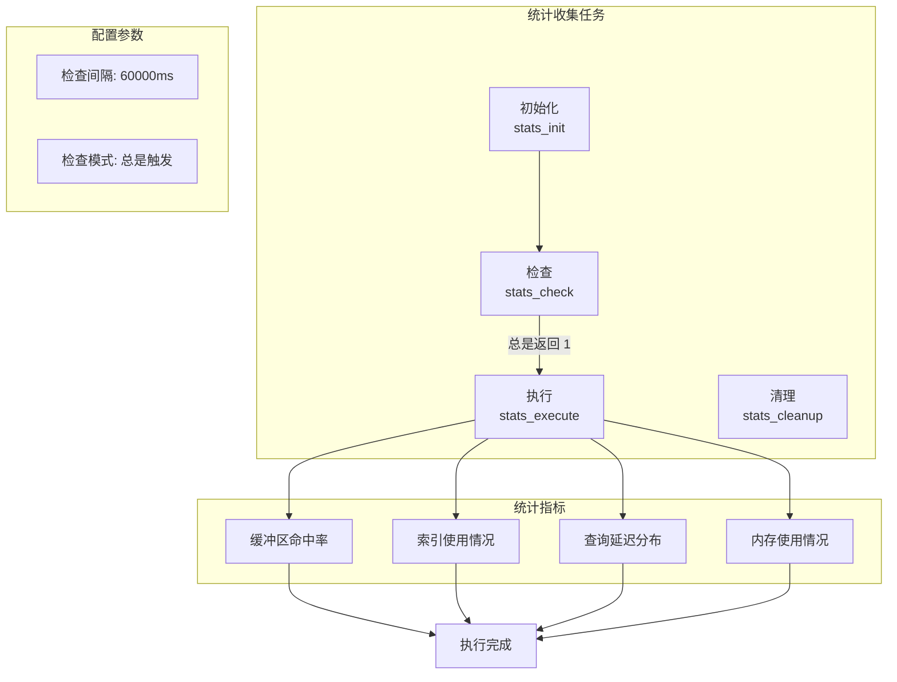

---

## 六、线程模型

### 6.1 线程交互

```mermaid
flowchart TB
    subgraph "主线程"
        APP[应用程序]
        API_CALL[API 调用<br/>register/unregister/pause/resume]
    end

    subgraph "后台线程"
        SCHEDULER[调度器主循环]
        TASK1[CCEH 缩容任务]
        TASK2[统计收集任务]
    end

    APP -->|db_bgworker_start| SCHEDULER
    APP -->|db_bgworker_stop| SCHEDULER
    API_CALL -->|互斥锁| SCHEDULER
    SCHEDULER -->|检查| TASK1
    SCHEDULER -->|检查| TASK2

    note right of SCHEDULER: 单线程事件循环<br/>无锁内部执行
    note left of API_CALL: 需要加锁<br/>保护槽位访问
```

### 6.2 并发安全

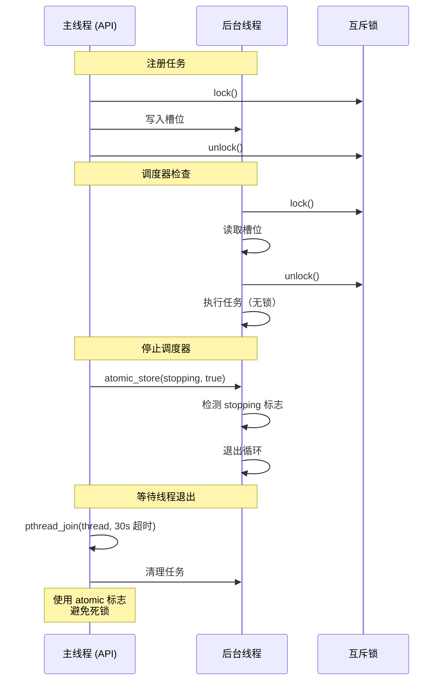

---

## 七、配置与集成

### 7.1 GUC 集成

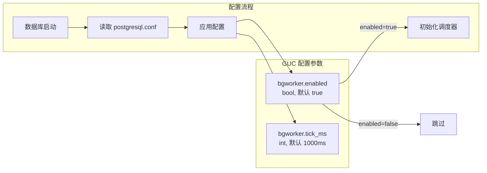

### 7.2 启动/停止流程

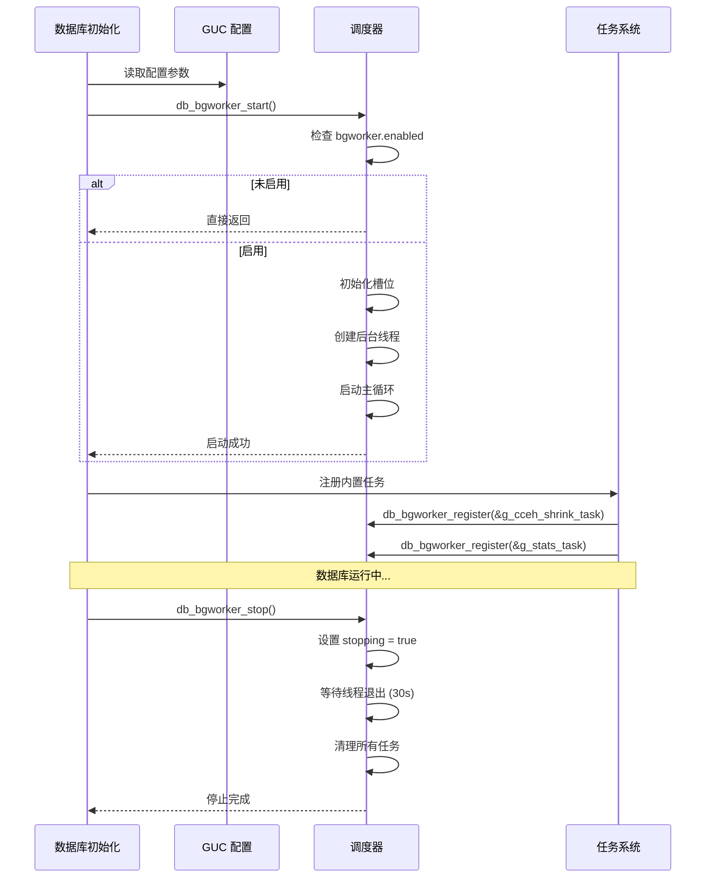

---

## 八、性能指标

| 指标 | 目标值 | 说明 |
|------|--------|------|
| 最大任务数 | 16 | 槽位数量 |
| 检查间隔 | 1-60000 ms | 可配置 |
| 线程模型 | 1 后台线程 | 单线程事件循环 |
| 槽位安全 | 互斥锁保护 | 读写分离 |
| 停止超时 | 30 s | 等待任务执行完成 |
| 状态切换 | 原子操作 | atomic_uint |

---

## 九、关键代码位置

| 功能 | 文件 |
|------|------|
| 公共 API | `engineering/include/db/bgworker.h` |
| 调度器实现 | `engineering/src/db/bgworker/bgworker.c` |
| API 实现 | `engineering/src/db/bgworker/bgworker_api.c` |
| 内部数据结构 | `engineering/src/db/bgworker/bgworker_internal.h` |
| 任务接口定义 | `engineering/src/db/bgworker/tasks/task_iface.h` |
| CCEH 缩容任务 | `engineering/src/db/bgworker/tasks/task_cceh_shrink.c` |
| 统计收集任务 | `engineering/src/db/bgworker/tasks/task_stats.c` |
| GUC 配置 | `engineering/src/db/bgworker/bgworker_config.c` |