# Catalog 子系统 - 架构设计

## 概述

Catalog 子系统是数据库的元数据管理中心，维护所有数据库对象（表、列、索引、类型、命名空间）的系统表。参考 PostgreSQL 的 pg_class、pg_attribute、pg_index 等系统表设计。

---

## 一、子系统架构概览

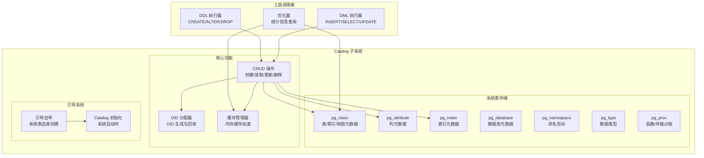

---

## 二、系统表结构

### 2.1 系统表关系图

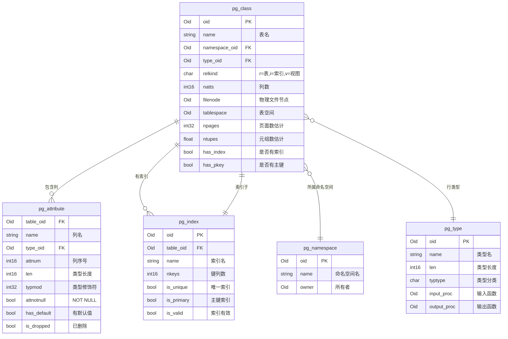

### 2.2 系统表数据流

```mermaid
flowchart TB
    subgraph "创建表数据流"
        CREATE[CREATE TABLE] --> NEW_OID[OID 分配器<br/>分配表 OID]
        NEW_OID --> NEW_FILENODE[OID 分配器<br/>分配 filenode]
        NEW_FILENODE --> INSERT_CLASS[插入 pg_class 记录]
        INSERT_CLASS --> INSERT_ATTR[循环插入 pg_attribute 记录<br/>每列一条]
        INSERT_ATTR --> DONE[创建完成]
    end

    subgraph "创建索引数据流"
        CREATE_IDX[CREATE INDEX] --> IDX_OID[OID 分配器<br/>分配索引 OID]
        IDX_OID --> INSERT_INDEX[插入 pg_index 记录]
        INSERT_INDEX --> UPDATE_CLASS[更新 pg_class<br/>has_index = true]
        UPDATE_CLASS --> IDX_DONE[索引创建完成]
    end

    subgraph "查询元数据"
        QUERY[查询请求] --> LOOKUP[按名称或 OID 查找]
        LOOKUP --> CACHE{缓存命中?}
        CACHE -->|命中| RETURN[返回元数据]
        CACHE -->|未命中| SCAN_CLASS[扫描 pg_class]
        SCAN_CLASS --> SCAN_ATTR[扫描 pg_attribute]
        SCAN_ATTR --> UPDATE_CACHE[更新缓存]
        UPDATE_CACHE --> RETURN
    end
```

---

## 三、OID 分配

### 3.1 OID 分配器

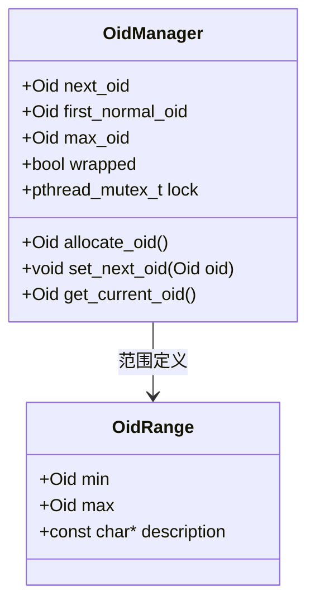

### 3.2 OID 分配范围

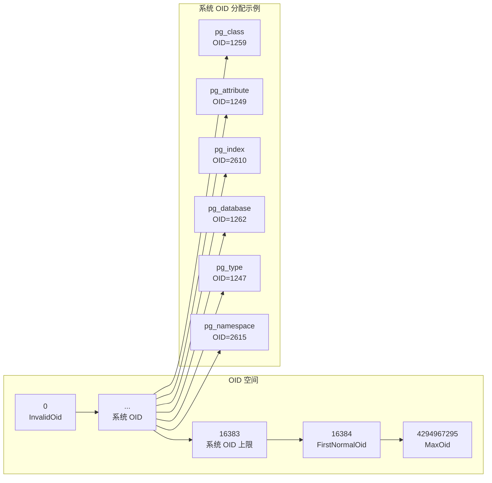

---

## 四、缓存管理

### 4.1 缓存架构

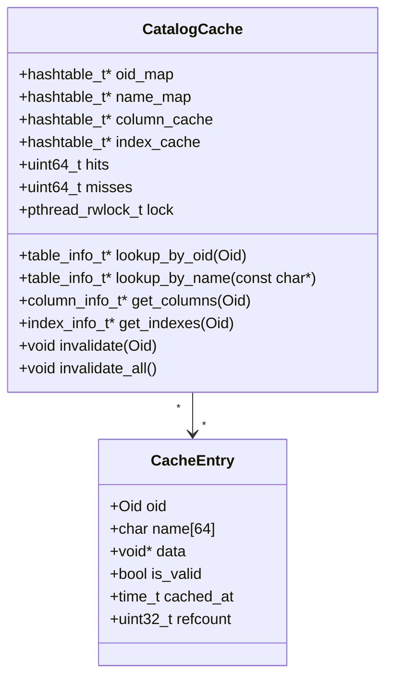

### 4.2 缓存生命周期

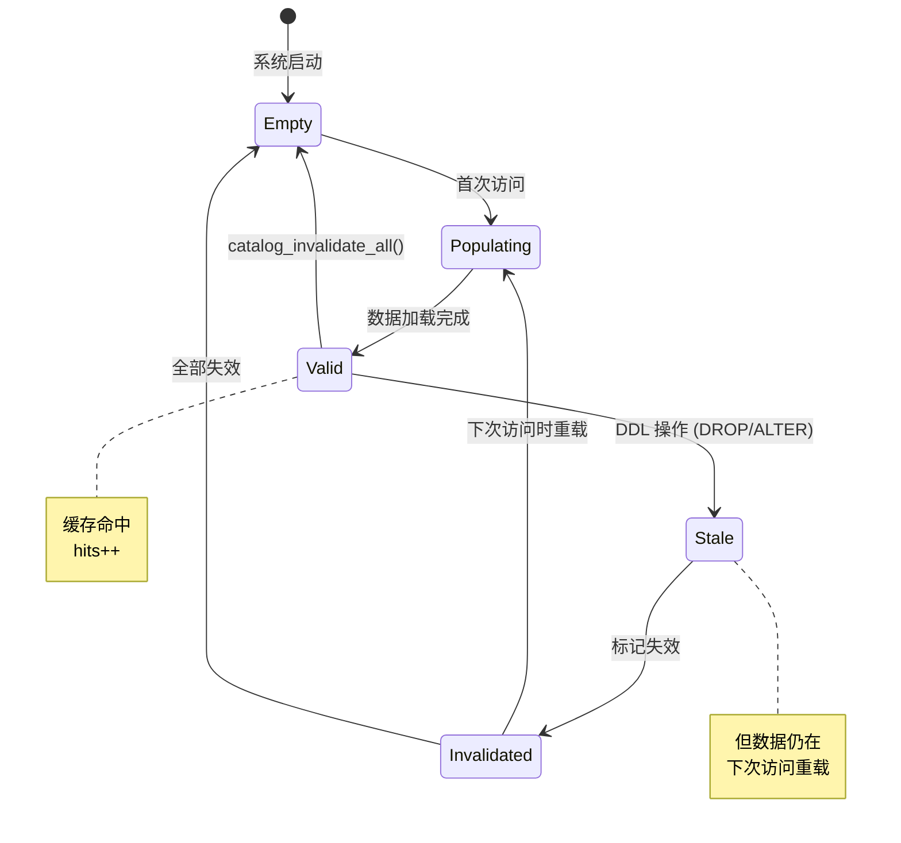

### 4.3 缓存失效触发

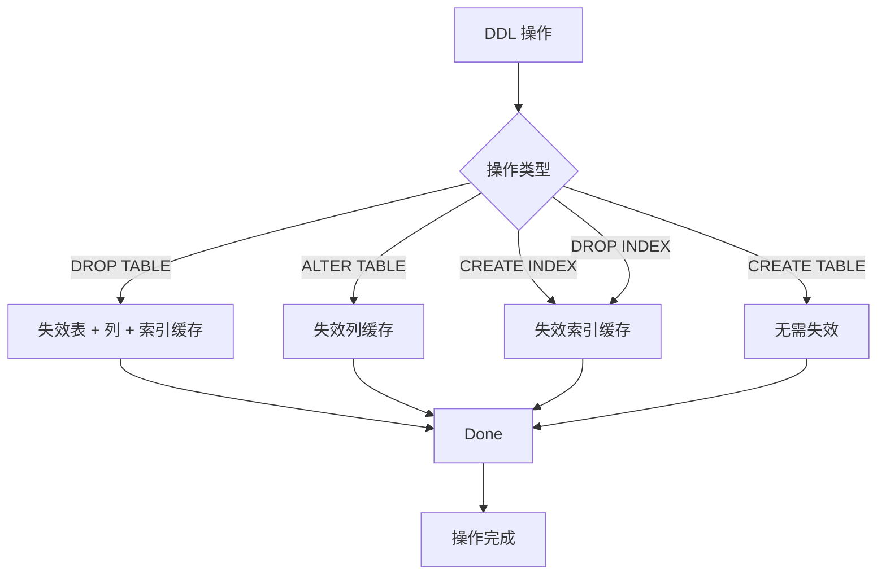

---

## 五、Catalog 操作流程

### 5.1 创建表流程

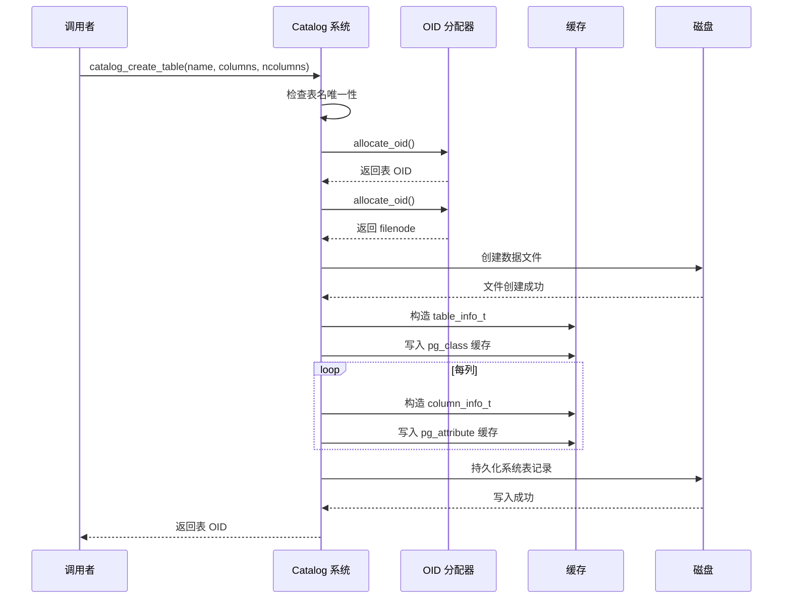

### 5.2 查找表流程

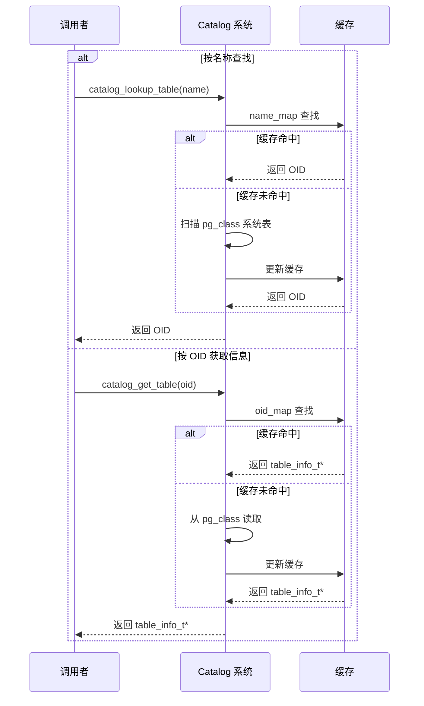

### 5.3 获取列信息流程

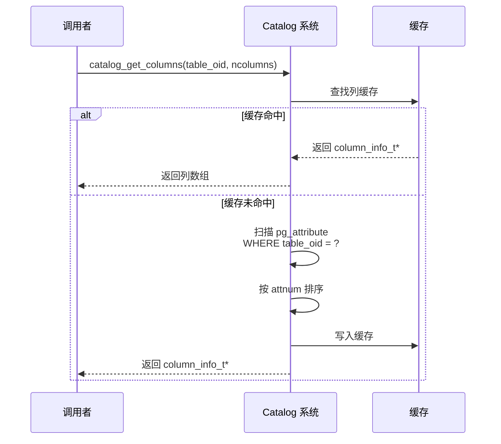

---

## 六、Catalog 结果码

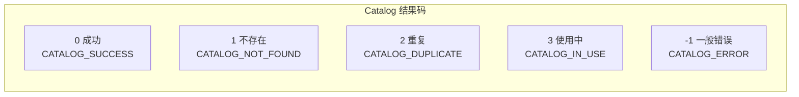

---

## 七、性能指标

| 指标 | 目标值 | 说明 |
|------|--------|------|
| 表查找 (按 OID) | O(1) | Hash 缓存 |
| 表查找 (按名称) | O(1) | Hash 缓存 |
| 列信息获取 | O(1) | 缓存命中 |
| 索引信息获取 | O(1) | 缓存命中 |
| 缓存命中率 | > 99% | 启动后稳定 |
| OID 分配 | O(1) | 原子递增 |
| 系统表插入 | < 1ms | 顺序追加 |
| 缓存失效 | O(1) | 标记删除 |

---

## 八、关键代码位置

| 功能 | 头文件 | 源文件 |
|------|--------|--------|
| Catalog 公共接口 | `engineering/include/db/catalog.h` | `engineering/src/db/storage/catalog/catalog.c` |
| Catalog 内部实现 | `engineering/include/db/storage/catalog/catalog.h` | `engineering/src/db/storage/catalog/catalog.c` |
| 缓存管理 | `engineering/include/db/catalog.h` | `engineering/src/db/storage/catalog/catalog.c` |
| OID 分配 | `engineering/include/db/catalog.h` | `engineering/src/db/storage/catalog/catalog.c` |