# 分布式能力子系统 - 架构设计

## 概述

分布式能力子系统为 db 数据库存储引擎提供水平扩展能力，包括数据分片（Sharding）和 Raft 共识协议两大核心模块。分片模块负责数据的水平拆分与路由，Raft 模块保障分布式环境下的数据一致性与高可用。

---

## 一、子系统架构概览

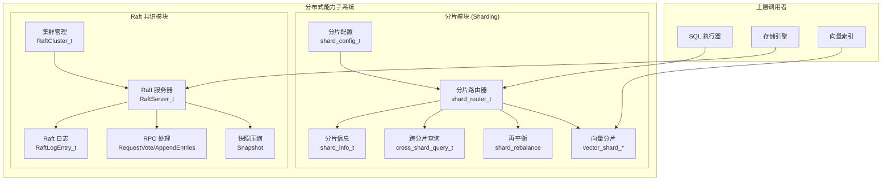

---

## 二、分片模块

### 2.1 分片配置与策略

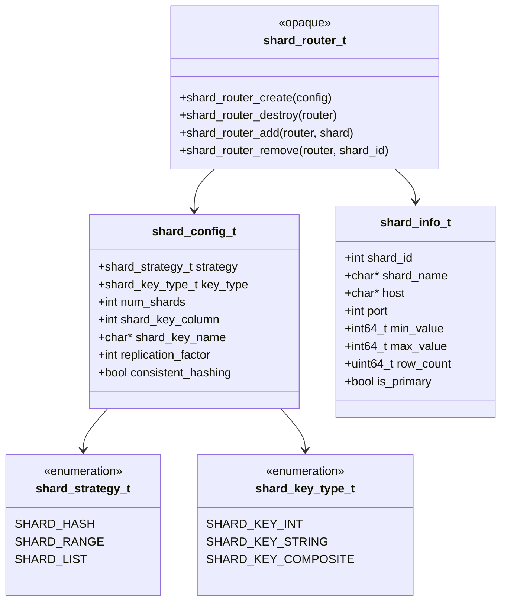

### 2.2 分片策略对比

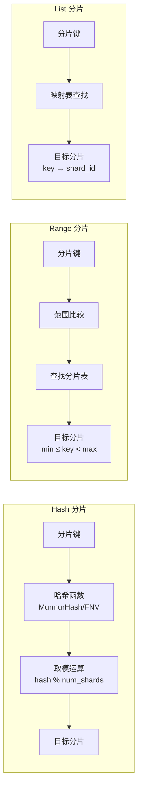

| 策略 | 适用场景 | 优点 | 缺点 |
|------|---------|------|------|
| **Hash** | 随机访问、均匀分布 | 数据均匀、实现简单 | 范围查询需扫描全部分片 |
| **Range** | 范围查询、时间序列 | 范围查询高效 | 可能数据倾斜 |
| **List** | 地域分布、业务隔离 | 业务语义清晰 | 需要手动管理映射 |

### 2.3 分片路由流程

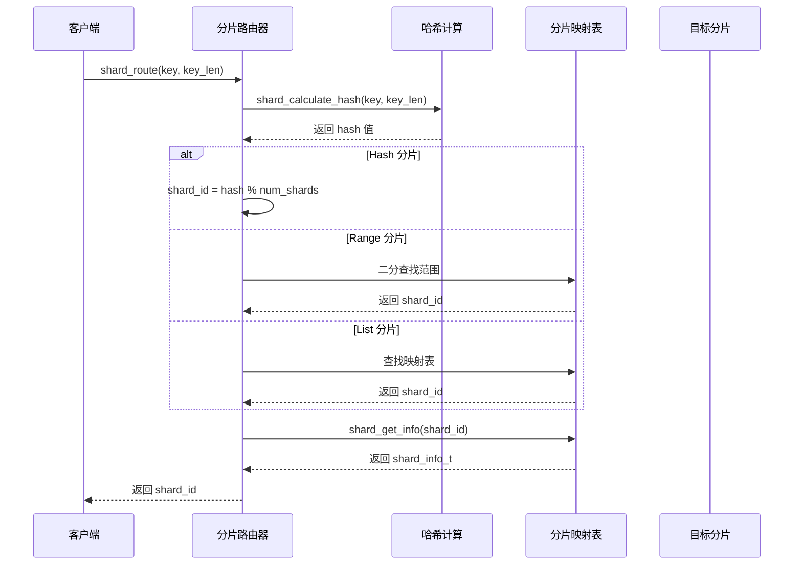

### 2.4 跨分片查询

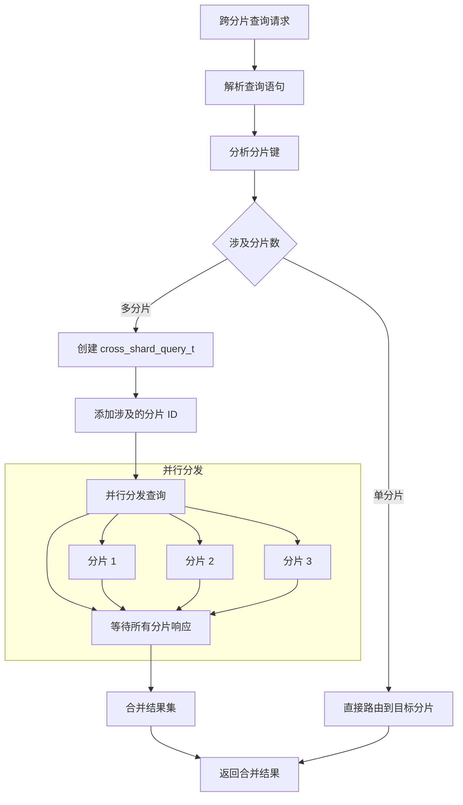

### 2.5 跨分片查询结构

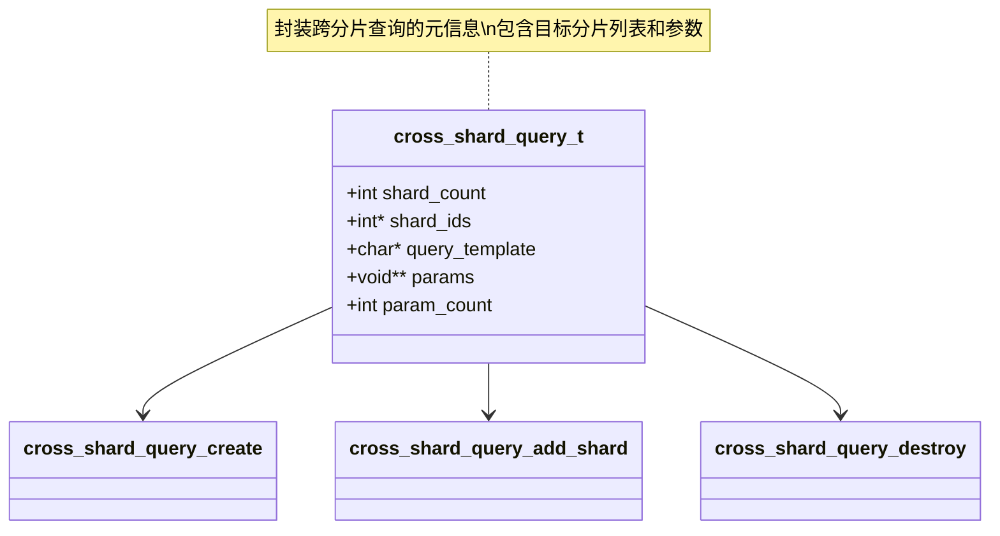

### 2.6 向量分片支持

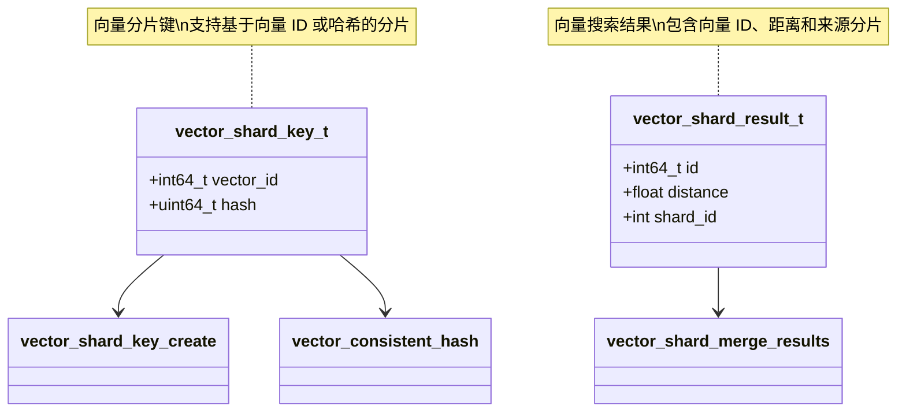

### 2.7 向量搜索路由与合并

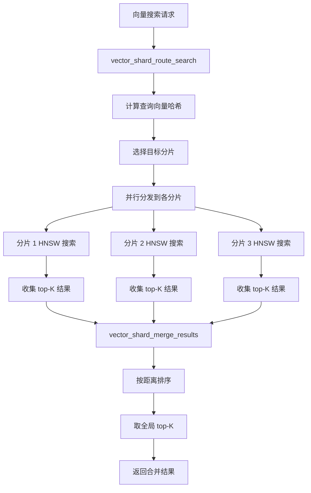

### 2.8 分片再平衡

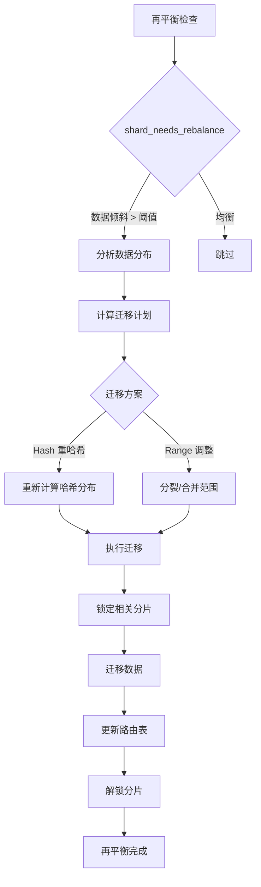

---

## 三、Raft 共识模块

### 3.1 角色状态机

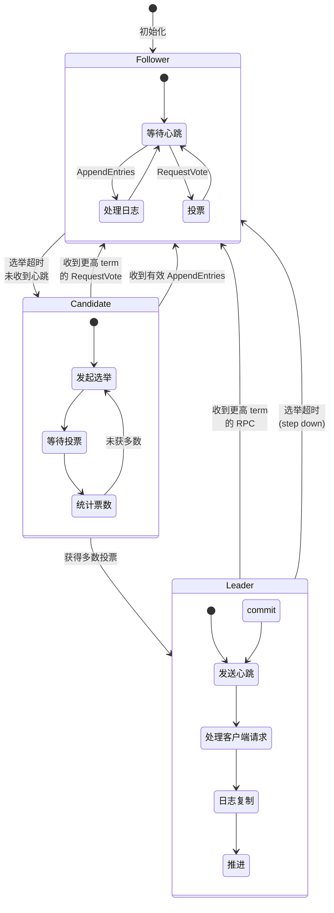

### 3.2 核心数据结构

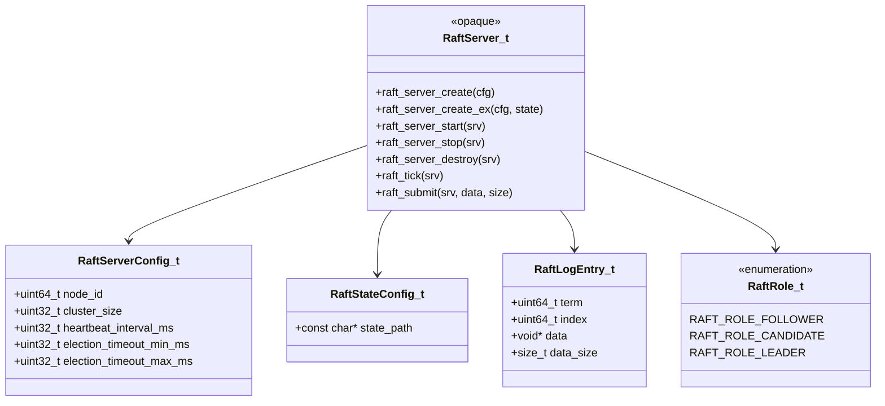

### 3.3 Raft 服务器配置

| 配置项 | 默认值 | 说明 |
|--------|--------|------|
| `node_id` | 必填 | 节点唯一标识符 |
| `cluster_size` | 必填 | 集群节点总数，用于 quorum 计算 |
| `heartbeat_interval_ms` | 150 | Leader 心跳间隔 |
| `election_timeout_min_ms` | 1000 | 选举超时下限 |
| `election_timeout_max_ms` | 2000 | 选举超时上限 |
| `state_path` | NULL | 持久化路径，NULL 表示纯内存模式 |

### 3.4 选举流程

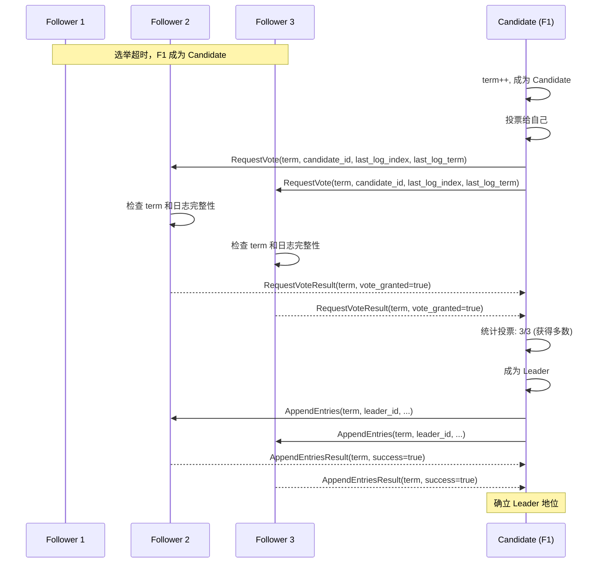

### 3.5 日志复制流程

```mermaid
sequenceDiagram
    participant Client as 客户端
    participant Leader as Leader
    participant F1 as Follower 1
    participant F2 as Follower 2
    participant Log as 日志存储

    Client->>Leader: 提交命令 (data)

    Leader->>Log: 追加日志条目 (term, index, data)
    Log-->>Leader: 返回 index

    Note over Leader: 初始化 next_index[], match_index[]

    Leader->>F1: AppendEntries(term, leader_id, prev_log_index, prev_log_term, entries, leader_commit)
    Leader->>F2: AppendEntries(term, leader_id, prev_log_index, prev_log_term, entries, leader_commit)

    F1->>F1: 检查 prev_log_index/term
    F2->>F2: 检查 prev_log_index/term

    F1->>Log: 追加日志条目
    F2->>Log: 追加日志条目

    F1-->>Leader: AppendEntriesResult(term, success=true, match_index)
    F2-->>Leader: AppendEntriesResult(term, success=true, match_index)

    Leader->>Leader: 更新 match_index[]

    Leader->>Leader: 计算 commit_index<br/>(match_index 排序取中位数)

    Note over Leader: commit_index 推进

    Leader->>Leader: 应用已提交日志到状态机

### 3.6 RPC 消息类型

```mermaid
classDiagram
    class RaftRPCType_t {
        <<enumeration>>
        RAFT_RPC_REQUEST_VOTE
        RAFT_RPC_APPEND_ENTRIES
    }

    class RaftRequestVoteArgs_t {
        +uint64_t term
        +uint64_t candidate_id
        +uint64_t last_log_index
        +uint64_t last_log_term
    }

    class RaftRequestVoteResult_t {
        +uint64_t term
        +bool vote_granted
    }

    class RaftAppendEntriesArgs_t {
        +uint64_t term
        +uint64_t leader_id
        +uint64_t prev_log_index
        +uint64_t prev_log_term
        +uint64_t leader_commit
        +const RaftLogEntry_t* entries
        +size_t entry_count
    }

    class RaftAppendEntriesResult_t {
        +uint64_t term
        +bool success
        +uint64_t match_index
    }

    RaftRPCType_t --> RaftRequestVoteArgs_t
    RaftRPCType_t --> RaftAppendEntriesArgs_t
    RaftRequestVoteArgs_t --> RaftRequestVoteResult_t
    RaftAppendEntriesArgs_t --> RaftAppendEntriesResult_t
```

### 3.7 Snapshot 与日志压缩

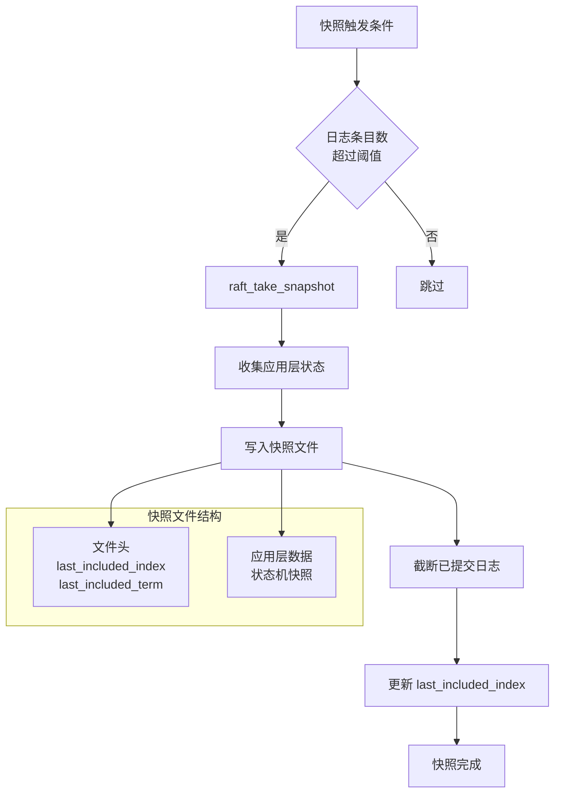

### 3.8 快照安装流程

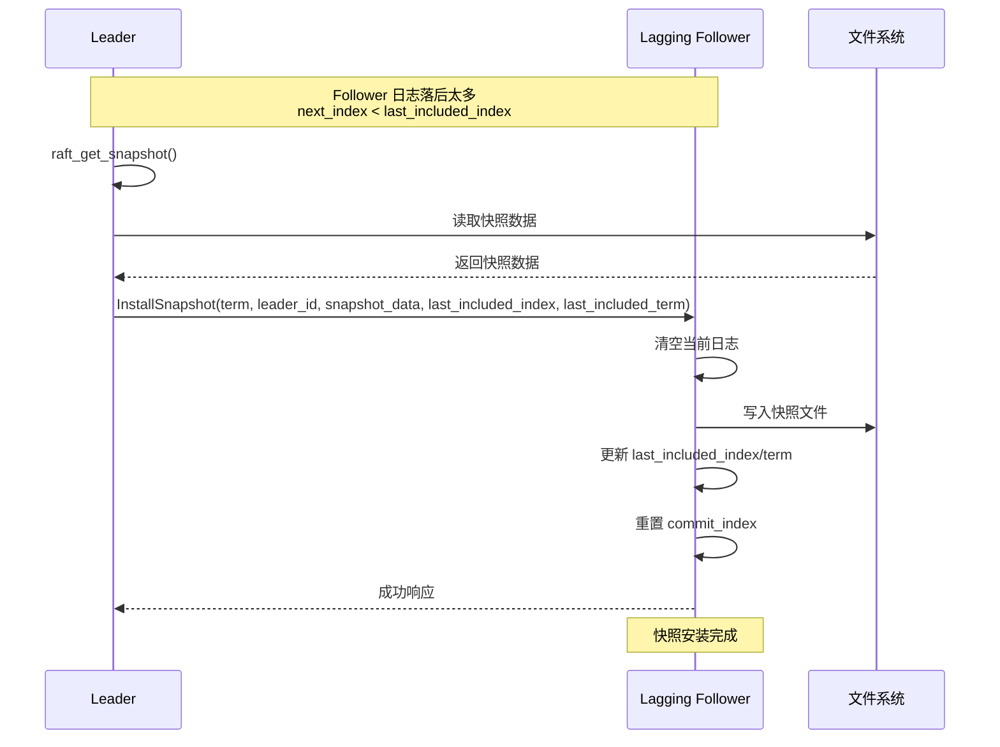

### 3.9 集群管理

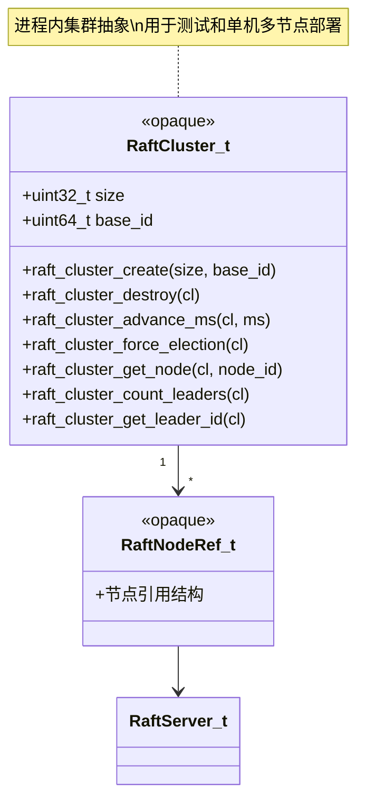

### 3.10 集群时间推进

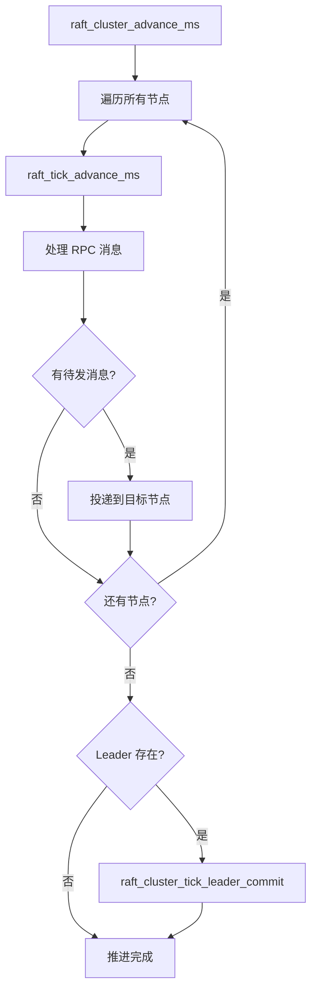

---

## 四、持久化与状态管理

### 4.1 状态持久化流程

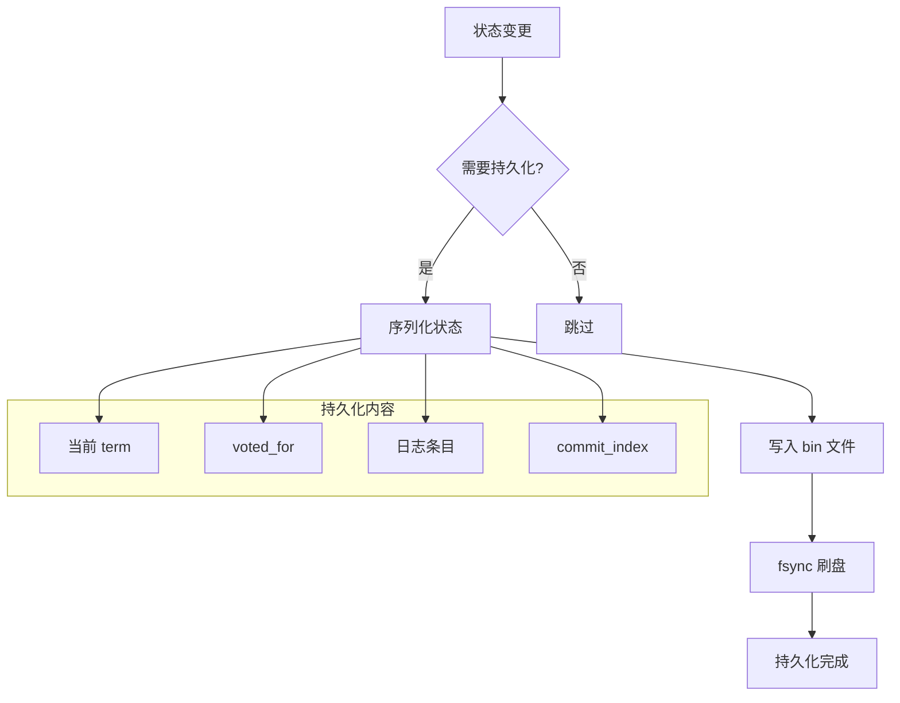

### 4.2 启动恢复流程

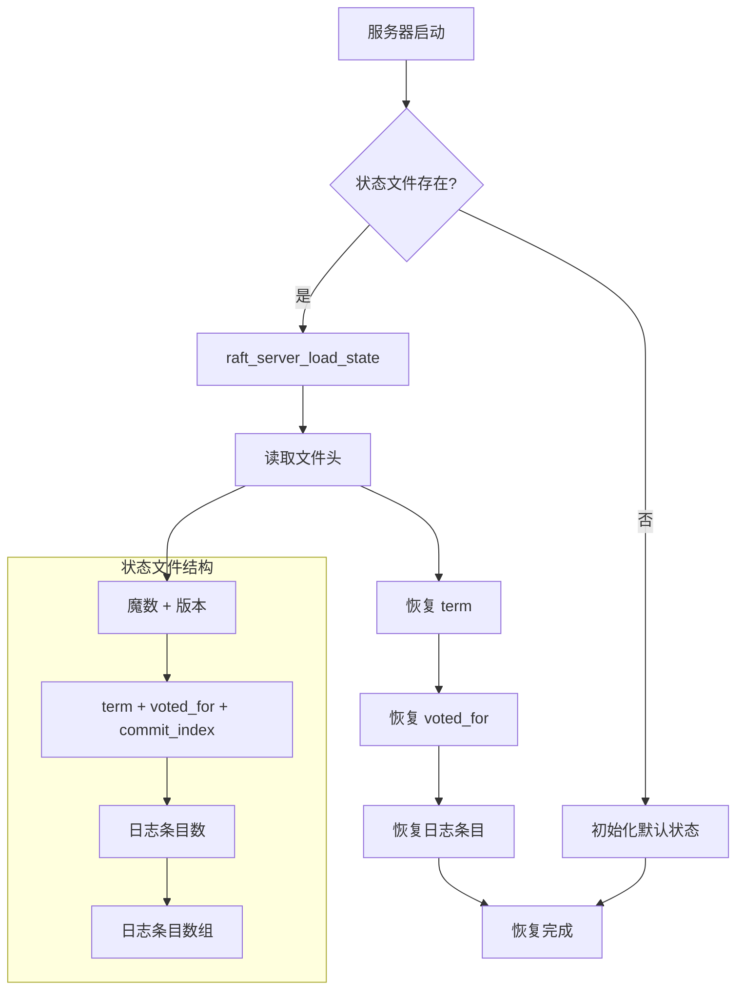

### 4.3 状态管理与持久化关系

```mermaid
erDiagram
    RAFT_STATE {
        uint64_t current_term
        uint64_t voted_for
        uint64_t commit_index
        uint64_t last_applied
    }

    RAFT_LOG {
        uint64_t term PK
        uint64_t index PK
        blob data
        size_t data_size
    }

    SNAPSHOT {
        uint64_t last_included_index PK
        uint64_t last_included_term
        blob snapshot_data
        size_t data_size
    }

    RAFT_STATE ||--o{ RAFT_LOG : contains
    RAFT_STATE ||--o| SNAPSHOT : references

    RAFT_LOG {
        note "日志条目按 index 排序"
    }

    SNAPSHOT {
        note "快照包含 last_included_index 之前的状态"
    }
```

---

## 五、分片与 Raft 协作

### 5.1 分片副本管理

```mermaid
flowchart TB
    subgraph "分片 1 (Shard 1)"
        S1_P1[Primary<br/>Leader]
        S1_R1[Replica 1<br/>Follower]
        S1_R2[Replica 2<br/>Follower]
    end

    subgraph "分片 2 (Shard 2)"
        S2_P1[Primary<br/>Leader]
        S2_R1[Replica 1<br/>Follower]
        S2_R2[Replica 2<br/>Follower]
    end

    subgraph "Raft Group 1"
        S1_P1 --> S1_R1
        S1_P1 --> S1_R2
    end

    subgraph "Raft Group 2"
        S2_P1 --> S2_R1
        S2_P1 --> S2_R2
    end

    S1_R1 --> S1_P1: 投票
    S1_R2 --> S1_P1: 投票
    S2_R1 --> S2_P1: 投票
    S2_R2 --> S2_P1: 投票
```

### 5.2 写请求处理流程

```mermaid
sequenceDiagram
    participant Client as 客户端
    participant Router as 分片路由器
    participant Leader as 分片 Leader
    participant Raft as Raft 模块
    participant Follower as 分片 Follower

    Client->>Router: 写请求 (key, value)

    Router->>Router: shard_route(key)
    Router-->>Client: 返回 shard_id

    Client->>Leader: 发送写请求到分片 Leader

    Leader->>Raft: raft_submit(data)

    Raft->>Raft: 追加日志
    Raft->>Follower: AppendEntries RPC

    Follower->>Follower: 追加日志
    Follower-->>Raft: success=true

    Raft->>Raft: 推进 commit_index
    Raft-->>Leader: 返回 index

    Leader->>Leader: 应用到状态机
    Leader-->>Client: 写入成功
```

### 5.3 读请求处理流程

```mermaid
sequenceDiagram
    participant Client as 客户端
    participant Router as 分片路由器
    participant Node as 分片节点

    Client->>Router: 读请求 (key)

    Router->>Router: shard_route(key)
    Router-->>Client: 返回 shard_id

    Client->>Node: 发送读请求到分片节点

    Node->>Node: 检查是否为 Leader

    alt 是 Leader
        Node->>Node: 直接读取
        Node-->>Client: 返回结果
    else 是 Follower
        Node->>Node: 检查租约有效性

        alt 租约有效
            Node->>Node: 读取本地数据
            Node-->>Client: 返回结果
        else 租约过期
            Node-->>Client: 重定向到 Leader
        end
    end
```

---

## 六、关键设计决策

### 6.1 分片策略选择

| 场景 | 推荐策略 | 原因 |
|------|---------|------|
| **OLTP 交易系统** | Hash 分片 | 随机访问、均匀分布 |
| **时序数据** | Range 分片 | 时间范围查询高效 |
| **多租户系统** | List 分片 | 租户隔离、业务语义清晰 |
| **向量搜索** | 一致性哈希 | 减少扩容时的数据迁移 |

### 6.2 Raft 配置建议

| 集群规模 | 心跳间隔 | 选举超时 | 说明 |
|---------|---------|---------|------|
| **3 节点** | 100-150ms | 1-2s | 小集群，快速故障检测 |
| **5 节点** | 150-200ms | 2-3s | 标准配置，平衡性能与稳定性 |
| **7+ 节点** | 200-300ms | 3-5s | 大集群，避免频繁选举 |

### 6.3 性能优化点

```mermaid
flowchart LR
    subgraph "分片优化"
        SHARD_OPT1[预计算路由缓存]
        SHARD_OPT2[异步跨分片查询]
        SHARD_OPT3[批量再平衡]
    end

    subgraph "Raft 优化"
        RAFT_OPT1[批量日志提交]
        RAFT_OPT2[异步日志复制]
        RAFT_OPT3[快照压缩]
    end

    SHARD_OPT1 --> PERF[性能提升]
    SHARD_OPT2 --> PERF
    SHARD_OPT3 --> PERF
    RAFT_OPT1 --> PERF
    RAFT_OPT2 --> PERF
    RAFT_OPT3 --> PERF
```

---

## 七、性能指标

### 7.1 分片模块指标

| 指标 | 目标值 | 说明 |
|------|--------|------|
| 路由计算延迟 | < 1 μs | Hash 分片 |
| 路由计算延迟 | < 10 μs | Range/List 分片 |
| 跨分片查询延迟 | < 100 ms | 3 分片并行 |
| 再平衡数据迁移 | > 100 MB/s | 网络带宽限制 |

### 7.2 Raft 模块指标

| 指标 | 目标值 | 说明 |
|------|--------|------|
| Leader 选举时间 | < 3s | 故障检测 + 选举 |
| 日志提交延迟 | < 10 ms | 多数节点确认 |
| 吞吐量 | > 10,000 ops/s | 小日志条目 |
| 快照创建时间 | < 1s | 1GB 状态机 |

---

## 八、限制与未实现功能

| 功能 | 状态 | 说明 |
|------|------|------|
| 分布式事务 | ❌ 未实现 | dist_txn.h 未开发 |
| 协调节点 | ❌ 未实现 | coordinator.h 未开发 |
| PreVote | ❌ 未实现 | 简化版 Raft |
| Joint Consensus | ❌ 未实现 | 配置变更简化 |
| 日志持久化 | ✅ 已实现 | raft_server_save/load_state |
| Snapshot | ✅ 已实现 | raft_take/install/get_snapshot |
| 集群管理 | ✅ 已实现 | RaftCluster_t 进程内集群 |

---

## 九、关键代码位置

| 功能 | 头文件 | 源文件 |
|------|--------|--------|
| 分片策略与配置 | `engineering/include/db/sharding/sharding.h` | `engineering/src/db/sharding/` |
| Raft 服务器 | `engineering/include/db/consensus/raft.h` | `engineering/src/db/consensus/raft.c` |
| Raft 集群 | `engineering/include/db/consensus/raft_cluster.h` | `engineering/src/db/consensus/raft_cluster.c` |
| 分片测试 | - | `engineering/test/db/sharding/` |
| Raft 测试 | - | `engineering/test/db/consensus/` |

---

## 十、相关文档

- [存储核心子系统](../storage/README.md) - 底层存储支持
- [事务与并发子系统](../transaction/README.md) - 本地事务支持
- [索引系统](../index/README.md) - 向量索引支持
- [架构概览](../README.md) - 整体架构
