# 索引系统 - 架构设计

## 概述

索引系统管理所有索引类型，包括传统索引（B+树、哈希、位图、GIN、GiST 等）和向量索引（HNSW、IVF、DiskANN、PQ 等 33 种），提供统一的索引创建、查询、维护和持久化接口。

---

## 一、子系统架构概览

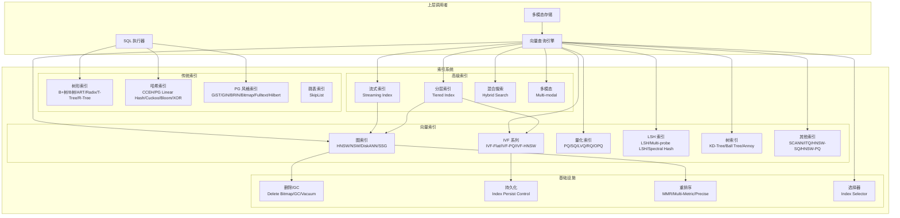
```mermaid
flowchart TB
    subgraph "索引系统"
        subgraph "传统索引"
            TREE_IDX[树形索引<br/>B+树/B树/ART/Radix/T-Tree/R-Tree]
            HASH_IDX[哈希索引<br/>CCEH/PG Linear Hash/Cuckoo/Bloom/XOR]
            PG_IDX[PG 风格索引<br/>GiST/GIN/BRIN/Bitmap/Fulltext/Hilbert]
            SKIP[跳表索引<br/>SkipList]
        end

        subgraph "向量索引"
            VEC_GRAPH[图索引<br/>HNSW/NSW/DiskANN/SSG]
            VEC_IVF[IVF 系列<br/>IVF-Flat/IVF-PQ/IVF-HNSW]
            VEC_QUANT[量化索引<br/>PQ/SQ/LVQ/RQ/OPQ]
            VEC_LSH[LSH 索引<br/>LSH/Multi-probe LSH/Spectral Hash]
            VEC_TREE[树索引<br/>KD-Tree/Ball Tree/Annoy]
            VEC_OTHER[其他索引<br/>SCANN/ITQ/HNSW-SQ/HNSW-PQ]
        end

        subgraph "高级索引"
            STREAMING[流式索引<br/>Streaming Index]
            TIERED[分层索引<br/>Tiered Index]
            HYBRID[混合搜索<br/>Hybrid Search]
            MULTIMODAL[多模态<br/>Multi-modal]
        end

        subgraph "基础设施"
            DELETE[删除/GC<br/>Delete Bitmap/GC/Vacuum]
            PERSIST[持久化<br/>Index Persist Control]
            RERANKER[重排序<br/>MMR/Multi-Metric/Precise]
            SELECTOR[选择器<br/>Index Selector]
        end
    end

    subgraph "上层调用者"
        SQL[SQL 执行器]
        VEC_QUERY[向量查询引擎]
        MM_STORAGE[多模态存储]
    end

    SQL --> TREE_IDX
    SQL --> HASH_IDX
    SQL --> PG_IDX
    VEC_QUERY --> VEC_GRAPH
    VEC_QUERY --> VEC_IVF
    VEC_QUERY --> VEC_QUANT
    VEC_QUERY --> VEC_LSH
    VEC_QUERY --> VEC_TREE
    VEC_QUERY --> VEC_OTHER
    VEC_QUERY --> STREAMING
    VEC_QUERY --> TIERED
    VEC_QUERY --> HYBRID
    VEC_QUERY --> MULTIMODAL
    MM_STORAGE --> VEC_QUERY
    STREAMING --> VEC_GRAPH
    TIERED --> VEC_GRAPH
    TIERED --> VEC_IVF
    VEC_IVF --> PERSIST
    VEC_GRAPH --> DELETE
    VEC_GRAPH --> RERANKER
    VEC_QUERY --> SELECTOR
```

---

## 二、传统索引

### 2.1 传统索引分类

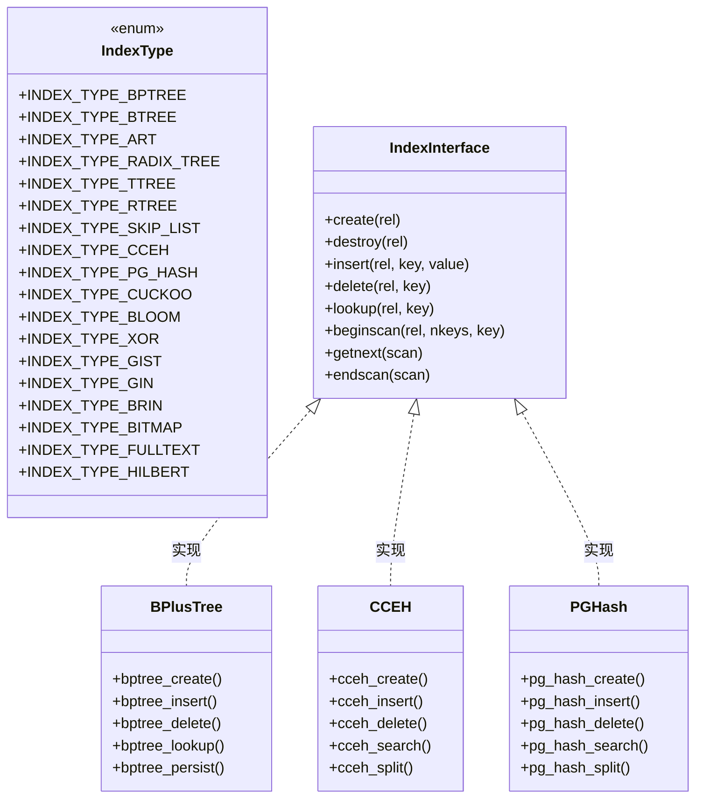
```mermaid
classDiagram
    class IndexType {
        <<enum>>
        +INDEX_TYPE_BPTREE
        +INDEX_TYPE_BTREE
        +INDEX_TYPE_ART
        +INDEX_TYPE_RADIX_TREE
        +INDEX_TYPE_TTREE
        +INDEX_TYPE_RTREE
        +INDEX_TYPE_SKIP_LIST
        +INDEX_TYPE_CCEH
        +INDEX_TYPE_PG_HASH
        +INDEX_TYPE_CUCKOO
        +INDEX_TYPE_BLOOM
        +INDEX_TYPE_XOR
        +INDEX_TYPE_GIST
        +INDEX_TYPE_GIN
        +INDEX_TYPE_BRIN
        +INDEX_TYPE_BITMAP
        +INDEX_TYPE_FULLTEXT
        +INDEX_TYPE_HILBERT
    }

    class IndexInterface {
        +create(rel)
        +destroy(rel)
        +insert(rel, key, value)
        +delete(rel, key)
        +lookup(rel, key)
        +beginscan(rel, nkeys, key)
        +getnext(scan)
        +endscan(scan)
    }

    class BPlusTree {
        +bptree_create()
        +bptree_insert()
        +bptree_delete()
        +bptree_lookup()
        +bptree_persist()
    }

    class CCEH {
        +cceh_create()
        +cceh_insert()
        +cceh_delete()
        +cceh_search()
        +cceh_split()
    }

    class PGHash {
        +pg_hash_create()
        +pg_hash_insert()
        +pg_hash_delete()
        +pg_hash_search()
        +pg_hash_split()
    }

    IndexInterface <|.. BPlusTree : 实现
    IndexInterface <|.. CCEH : 实现
    IndexInterface <|.. PGHash : 实现
```

### 2.2 树形索引

| 索引类型 | 文件 | 核心特性 | 典型场景 |
|---------|------|---------|---------|
| **B+树** | `bplus_tree/bptree.h` | 有序、范围扫描、持久化 | 主键索引、聚簇索引 |
| **B树** | `btree/btree.h` | 有序、内部节点也存数据 | 文件系统目录 |
| **ART** | `art/art.h` | 自适应基数树、前缀压缩 | 字符串索引（URL、IP） |
| **Radix Tree** | `radix_tree/radix_tree.h` | 基数树、按位比较 | IP 路由、前缀匹配 |
| **T-Tree** | `ttree/ttree.h` | 平衡树、内存优化 | 内存数据库索引 |
| **R-Tree** | `rtree/rtree.h` | 空间范围搜索 | GIS 边界框查询 |
| **Skip List** | `skip_list/skip_list.h` | 概率平衡、支持并发 | 内存 KV 排序索引 |

### 2.3 哈希索引

| 索引类型 | 文件 | 核心特性 | 典型场景 |
|---------|------|---------|---------|
| **CCEH** | `hash/cceh.h` | 可扩展哈希、分段扩展 | 高并发 KV 存储 |
| **PG Linear Hash** | `hash/pg_hash.h` | 线性哈希、增量分裂 | 哈希索引 |
| **Cuckoo** | `hash/cuckoo.h` | 布谷鸟哈希、O(1) 最坏 | 精确查找 |
| **Bloom** | `hash/bloom.h` | 布隆过滤器、概率性 | 存在性检查 |
| **XOR Filter** | `hash/xor_filter.h` | XOR 过滤器、紧凑 | 空间敏感场景 |

### 2.4 PG 风格索引

| 索引类型 | 文件 | 核心特性 | 典型场景 |
|---------|------|---------|---------|
| **GiST** | `gist/gist.h` | 通用搜索树、可扩展 | 全文搜索、空间搜索 |
| **GIN** | `gin/gin.h` | 倒排索引、多值键 | 全文搜索、JSONB |
| **BRIN** | `brin/brin.h` | 块范围索引、压缩 | 大表顺序数据 |
| **Bitmap** | `bitmap/bitmap_index.h` | 位图索引 | 低基数列 |
| **Fulltext** | `fulltext/fulltext.h` | 全文检索 | 文本搜索 |
| **Hilbert** | `hilbert.h` | 希尔伯特曲线 | 多维空间排序 |

---

## 三、向量索引

### 3.1 向量索引架构

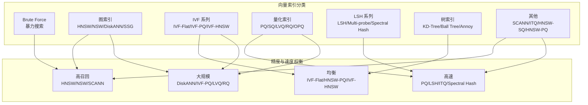
```mermaid
flowchart TB
    subgraph "向量索引分类"
        BRUTE[Brute Force<br/>暴力搜索]
        GRAPH[图索引<br/>HNSW/NSW/DiskANN/SSG]
        IVF[IVF 系列<br/>IVF-Flat/IVF-PQ/IVF-HNSW]
        QUANT[量化索引<br/>PQ/SQ/LVQ/RQ/OPQ]
        LSH[LSH 系列<br/>LSH/Multi-probe/Spectral Hash]
        TREE[树索引<br/>KD-Tree/Ball Tree/Annoy]
        OTHER[其他<br/>SCANN/ITQ/HNSW-SQ/HNSW-PQ]
    end

    subgraph "精度与速度权衡"
        HIGH_RECALL[高召回<br/>HNSW/NSW/SCANN]
        BALANCE[均衡<br/>IVF-Flat/HNSW-PQ/IVF-HNSW]
        HIGH_SPEED[高速<br/>PQ/LSH/ITQ/Spectral Hash]
        LARGE_SCALE[大规模<br/>DiskANN/IVF-PQ/LVQ/RQ]
    end

    BRUTE --> HIGH_RECALL
    GRAPH --> HIGH_RECALL
    GRAPH --> LARGE_SCALE
    IVF --> BALANCE
    IVF --> LARGE_SCALE
    QUANT --> HIGH_SPEED
    QUANT --> LARGE_SCALE
    LSH --> HIGH_SPEED
    TREE --> BALANCE
    OTHER --> HIGH_RECALL
    OTHER --> HIGH_SPEED
```

### 3.2 图索引

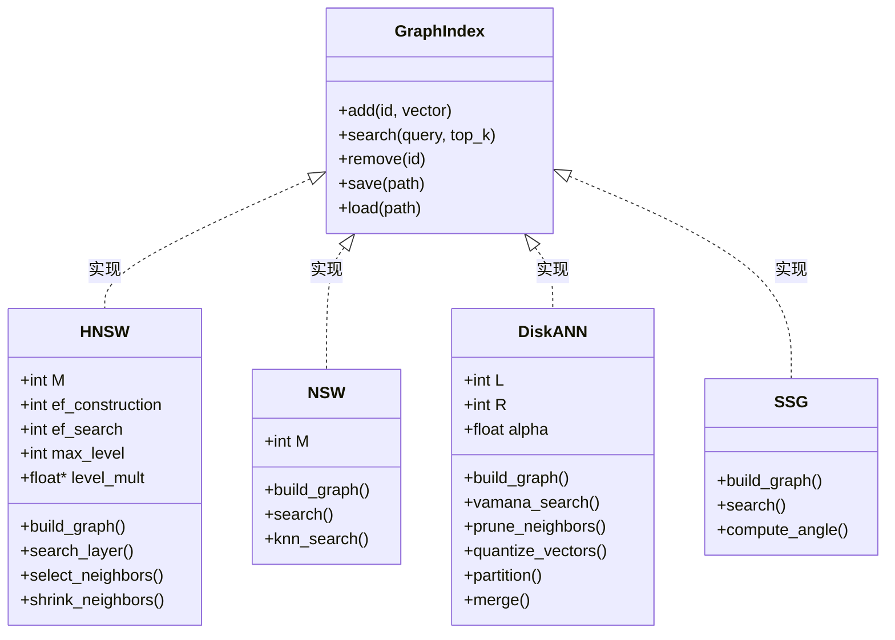
```mermaid
classDiagram
    class GraphIndex {
        +add(id, vector)
        +search(query, top_k)
        +remove(id)
        +save(path)
        +load(path)
    }

    class HNSW {
        +int M
        +int ef_construction
        +int ef_search
        +int max_level
        +float* level_mult
        +build_graph()
        +search_layer()
        +select_neighbors()
        +shrink_neighbors()
    }

    class NSW {
        +int M
        +build_graph()
        +search()
        +knn_search()
    }

    class DiskANN {
        +int L
        +int R
        +float alpha
        +build_graph()
        +vamana_search()
        +prune_neighbors()
        +quantize_vectors()
        +partition()
        +merge()
    }

    class SSG {
        +build_graph()
        +search()
        +compute_angle()
    }

    GraphIndex <|.. HNSW : 实现
    GraphIndex <|.. NSW : 实现
    GraphIndex <|.. DiskANN : 实现
    GraphIndex <|.. SSG : 实现
```

### 3.3 HNSW 插入流程

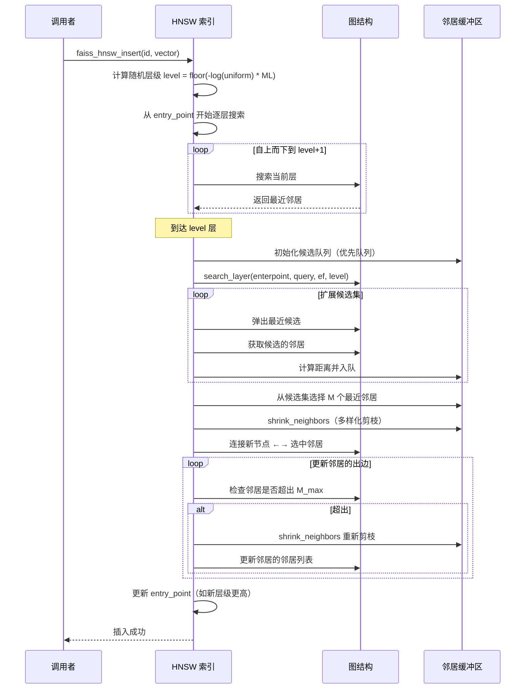
```mermaid
sequenceDiagram
    participant Caller as 调用者
    participant HNSW as HNSW 索引
    participant Graph as 图结构
    participant Buffer as 邻居缓冲区

    Caller->>HNSW: faiss_hnsw_insert(id, vector)

    HNSW->>HNSW: 计算随机层级 level = floor(-log(uniform) * ML)

    HNSW->>HNSW: 从 entry_point 开始逐层搜索

    loop 自上而下到 level+1
        HNSW->>Graph: 搜索当前层
        Graph-->>HNSW: 返回最近邻居
    end

    Note over HNSW: 到达 level 层

    HNSW->>Buffer: 初始化候选队列（优先队列）
    HNSW->>Graph: search_layer(enterpoint, query, ef, level)

    loop 扩展候选集
        HNSW->>Graph: 弹出最近候选
        HNSW->>Graph: 获取候选的邻居
        HNSW->>Buffer: 计算距离并入队
    end

    HNSW->>Buffer: 从候选集选择 M 个最近邻居
    HNSW->>Buffer: shrink_neighbors（多样化剪枝）

    HNSW->>Graph: 连接新节点 ←→ 选中邻居

    loop 更新邻居的出边
        HNSW->>Graph: 检查邻居是否超出 M_max
        alt 超出
            HNSW->>Buffer: shrink_neighbors 重新剪枝
            HNSW->>Graph: 更新邻居的邻居列表
        end
    end

    HNSW->>HNSW: 更新 entry_point（如新层级更高）
    HNSW-->>Caller: 插入成功
```

### 3.4 IVF 系列

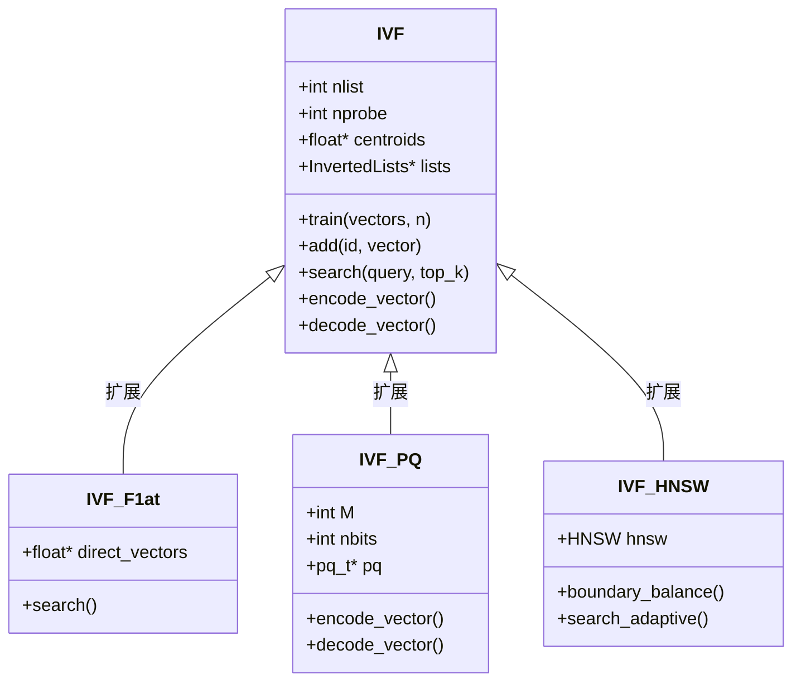
```mermaid
classDiagram
    class IVF {
        +int nlist
        +int nprobe
        +float* centroids
        +InvertedLists* lists
        +train(vectors, n)
        +add(id, vector)
        +search(query, top_k)
        +encode_vector()
        +decode_vector()
    }

    class IVF_F1at {
        +float* direct_vectors
        +search()
    }

    class IVF_PQ {
        +int M
        +int nbits
        +pq_t* pq
        +encode_vector()
        +decode_vector()
    }

    class IVF_HNSW {
        +HNSW hnsw
        +boundary_balance()
        +search_adaptive()
    }

    IVF <|-- IVF_F1at : 扩展
    IVF <|-- IVF_PQ : 扩展
    IVF <|-- IVF_HNSW : 扩展
```

### 3.5 量化索引

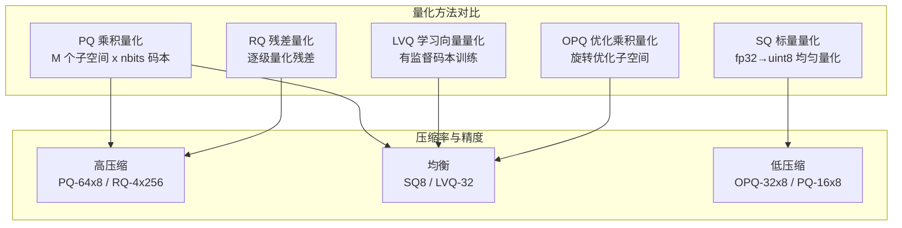
```mermaid
flowchart TB
    subgraph "量化方法对比"
        PQ[PQ 乘积量化<br/>M 个子空间 x nbits 码本]
        SQ[SQ 标量量化<br/>fp32→uint8 均匀量化]
        LVQ[LVQ 学习向量量化<br/>有监督码本训练]
        RQ[RQ 残差量化<br/>逐级量化残差]
        OPQ[OPQ 优化乘积量化<br/>旋转优化子空间]
    end

    subgraph "压缩率与精度"
        HIGH_COMP[高压缩<br/>PQ-64x8 / RQ-4x256]
        BALANCE[均衡<br/>SQ8 / LVQ-32]
        LOW_COMP[低压缩<br/>OPQ-32x8 / PQ-16x8]
    end

    PQ --> HIGH_COMP
    PQ --> BALANCE
    RQ --> HIGH_COMP
    LVQ --> BALANCE
    SQ --> LOW_COMP
    OPQ --> BALANCE
```

### 3.6 向量索引速查表

| 类别 | 索引 | 文件 | 搜索复杂度 | 精度 | 构建时间 |
|------|------|------|-----------|------|---------|
| **图** | HNSW | `hnsw/faiss_hnsw.h` | O(log N) | ★★★★★ | ★★★☆☆ |
| **图** | NSW | `nsw/nsw.h` | O(log N) | ★★★★☆ | ★★★☆☆ |
| **图** | DiskANN | `diskann/diskann.h` | O(log N) | ★★★★☆ | ★★★★★ |
| **图** | SSG | `ssg/ssg.h` | O(log N) | ★★★★☆ | ★★★★☆ |
| **IVF** | IVF-Flat | `ivf_flat/ivf_flat.h` | O(nlist/nprobe) | ★★★★☆ | ★★★☆☆ |
| **IVF** | IVF-PQ | `ivf_pq/ivf_pq.h` | O(nlist/nprobe) | ★★★☆☆ | ★★★★☆ |
| **IVF** | IVF-HNSW | `ivf_hnsw/ivf_hnsw.h` | O(log N) | ★★★★★ | ★★★★☆ |
| **量化** | PQ | `pq/pq.h` | O(M) | ★★★☆☆ | ★★★★☆ |
| **量化** | SQ | `sq/sq.h` | O(d) | ★★★☆☆ | ★☆☆☆☆ |
| **量化** | LVQ | `lvq/lvq.h` | O(d) | ★★★★☆ | ★★★★☆ |
| **量化** | RQ | `rq/rq.h` | O(M) | ★★★★☆ | ★★★★★ |
| **量化** | OPQ | `opq/opq.h` | O(M) | ★★★★☆ | ★★★★★ |
| **LSH** | LSH | `lsh/lsh.h` | O(1) | ★★☆☆☆ | ★★☆☆☆ |
| **LSH** | Multi-probe LSH | `lsh_multiprobe/lsh_multiprobe.h` | O(1) | ★★★☆☆ | ★★☆☆☆ |
| **LSH** | Spectral Hash | `spectral_hash/spectral_hash.h` | O(k) | ★★★☆☆ | ★★★★☆ |
| **树** | KD-Tree | `kd_tree/kd_tree.h` | O(log N) | ★★★★☆ | ★★★☆☆ |
| **树** | Ball Tree | `ball_tree/ball_tree.h` | O(log N) | ★★★★☆ | ★★★☆☆ |
| **树** | Annoy | `annoy/annoy.h` | O(log N) | ★★★☆☆ | ★★★★☆ |
| **其他** | SCANN | `scann/scann.h` | O(M) | ★★★★☆ | ★★★★★ |
| **其他** | ITQ | `itq/itq.h` | O(k) | ★★★☆☆ | ★★★★☆ |
| **其他** | HNSW-SQ | `hnsw_sq/hnsw_sq.h` | O(log N) | ★★★★☆ | ★★★☆☆ |
| **其他** | HNSW-PQ | `hnsw_pq/hnsw_pq.h` | O(log N) | ★★★★☆ | ★★★☆☆ |
| **其他** | BM25 | `BM25/bm25.h` | O(d) | N/A | ★★★★☆ |
| **其他** | Milvus IVF | `milvus_ivf/milvus_ivf.h` | O(nlist/nprobe) | ★★★★☆ | ★★★☆☆ |

---

## 四、高级索引

### 4.1 流式索引

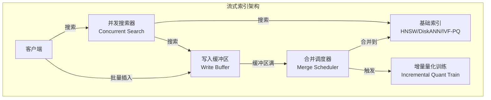
```mermaid
flowchart TB
    subgraph "流式索引架构"
        CLIENT[客户端]
        WB[写入缓冲区<br/>Write Buffer]
        BASE[基础索引<br/>HNSW/DiskANN/IVF-PQ]
        MERGE[合并调度器<br/>Merge Scheduler]
        CONCURRENT[并发搜索器<br/>Concurrent Search]
        INCR_QUANT[增量量化训练<br/>Incremental Quant Train]
    end

    CLIENT -->|批量插入| WB
    WB -->|缓冲区满| MERGE
    MERGE -->|合并到| BASE
    MERGE -->|触发| INCR_QUANT
    CLIENT -->|搜索| CONCURRENT
    CONCURRENT -->|搜索| BASE
    CONCURRENT -->|搜索| WB
```

### 4.2 分层索引

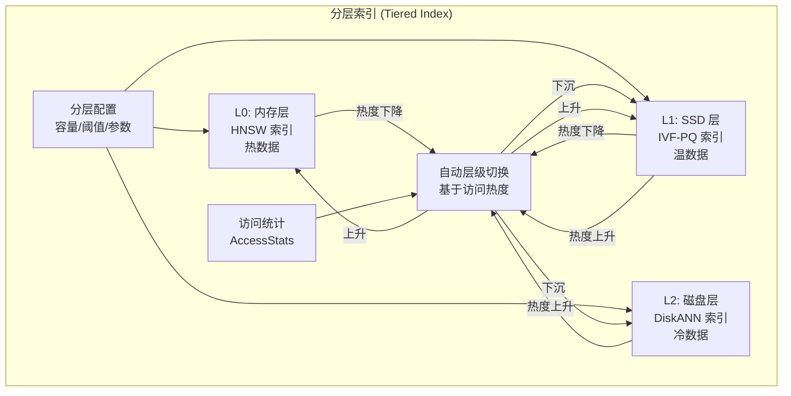
```mermaid
flowchart TB
    subgraph "分层索引 (Tiered Index)"
        TIER_CONFIG[分层配置<br/>容量/阈值/参数]

        L0[L0: 内存层<br/>HNSW 索引<br/>热数据]
        L1[L1: SSD 层<br/>IVF-PQ 索引<br/>温数据]
        L2[L2: 磁盘层<br/>DiskANN 索引<br/>冷数据]

        AUTO_SWITCH[自动层级切换<br/>基于访问热度]
        STATS[访问统计<br/>AccessStats]
    end

    TIER_CONFIG --> L0
    TIER_CONFIG --> L1
    TIER_CONFIG --> L2

    L0 -->|热度下降| AUTO_SWITCH
    AUTO_SWITCH -->|下沉| L1
    L1 -->|热度下降| AUTO_SWITCH
    AUTO_SWITCH -->|下沉| L2
    L2 -->|热度上升| AUTO_SWITCH
    AUTO_SWITCH -->|上升| L1
    L1 -->|热度上升| AUTO_SWITCH
    AUTO_SWITCH -->|上升| L0

    STATS --> AUTO_SWITCH
```

### 4.3 分层索引搜索流程

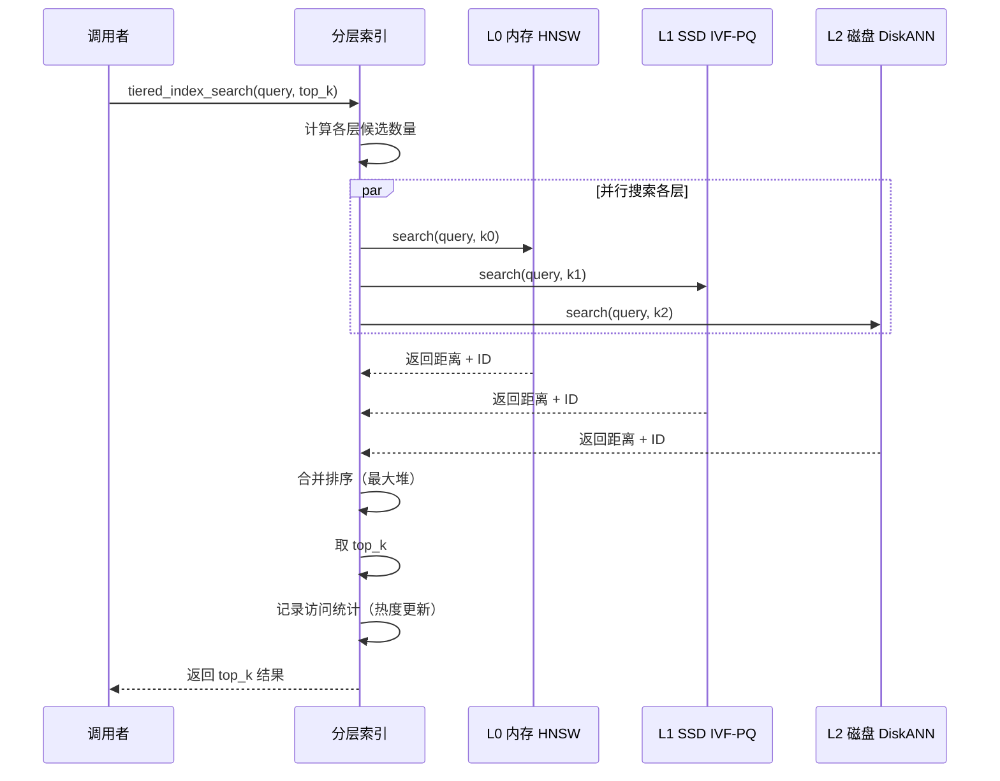
```mermaid
sequenceDiagram
    participant Caller as 调用者
    participant Tiered as 分层索引
    participant L0 as L0 内存 HNSW
    participant L1 as L1 SSD IVF-PQ
    participant L2 as L2 磁盘 DiskANN

    Caller->>Tiered: tiered_index_search(query, top_k)

    Tiered->>Tiered: 计算各层候选数量

    par 并行搜索各层
        Tiered->>L0: search(query, k0)
        Tiered->>L1: search(query, k1)
        Tiered->>L2: search(query, k2)
    end

    L0-->>Tiered: 返回距离 + ID
    L1-->>Tiered: 返回距离 + ID
    L2-->>Tiered: 返回距离 + ID

    Tiered->>Tiered: 合并排序（最大堆）
    Tiered->>Tiered: 取 top_k
    Tiered->>Tiered: 记录访问统计（热度更新）

    Tiered-->>Caller: 返回 top_k 结果
```

### 4.4 混合搜索

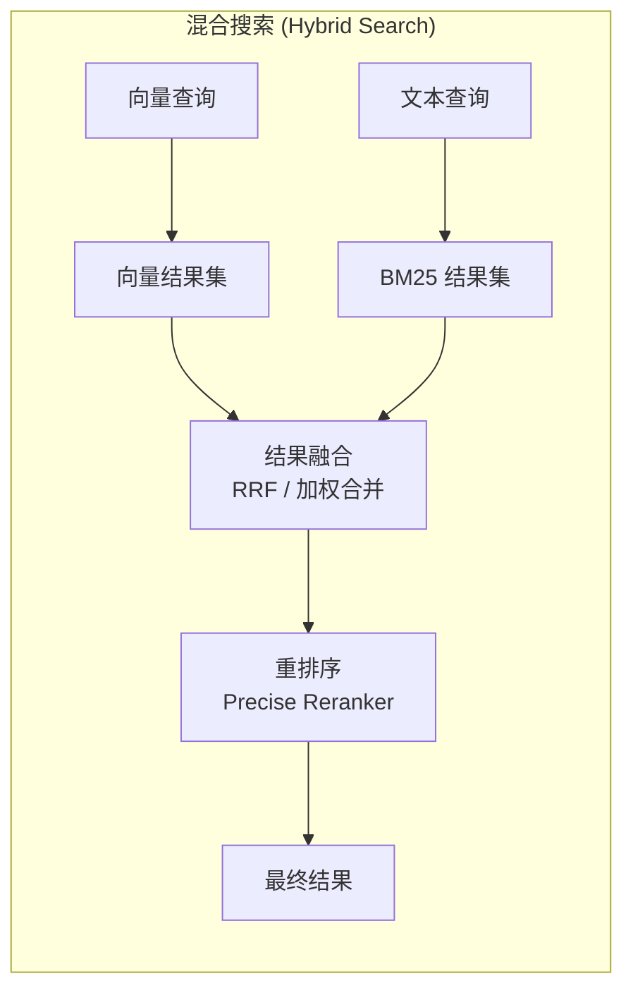
```mermaid
flowchart LR
    subgraph "混合搜索 (Hybrid Search)"
        VEC_QUERY[向量查询]
        TEXT_QUERY[文本查询]

        VEC_RES[向量结果集]
        BM25_RES[BM25 结果集]

        FUSION[结果融合<br/>RRF / 加权合并]
        RERANK[重排序<br/>Precise Reranker]
        FINAL[最终结果]
    end

    VEC_QUERY --> VEC_RES
    TEXT_QUERY --> BM25_RES
    VEC_RES --> FUSION
    BM25_RES --> FUSION
    FUSION --> RERANK
    RERANK --> FINAL
```

### 4.5 多模态索引

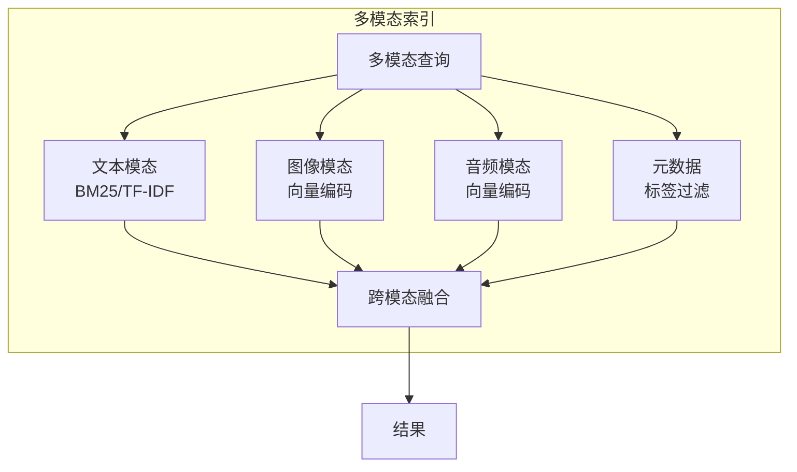
```mermaid
flowchart TB
    subgraph "多模态索引"
        QUERY[多模态查询]

        TEXT[文本模态<br/>BM25/TF-IDF]
        IMAGE[图像模态<br/>向量编码]
        AUDIO[音频模态<br/>向量编码]
        METADATA[元数据<br/>标签过滤]

        FUSION[跨模态融合]
    end

    QUERY --> TEXT
    QUERY --> IMAGE
    QUERY --> AUDIO
    QUERY --> METADATA
    TEXT --> FUSION
    IMAGE --> FUSION
    AUDIO --> FUSION
    METADATA --> FUSION
    FUSION --> RESULT[结果]
```

---

## 五、删除与 GC

### 5.1 删除体系

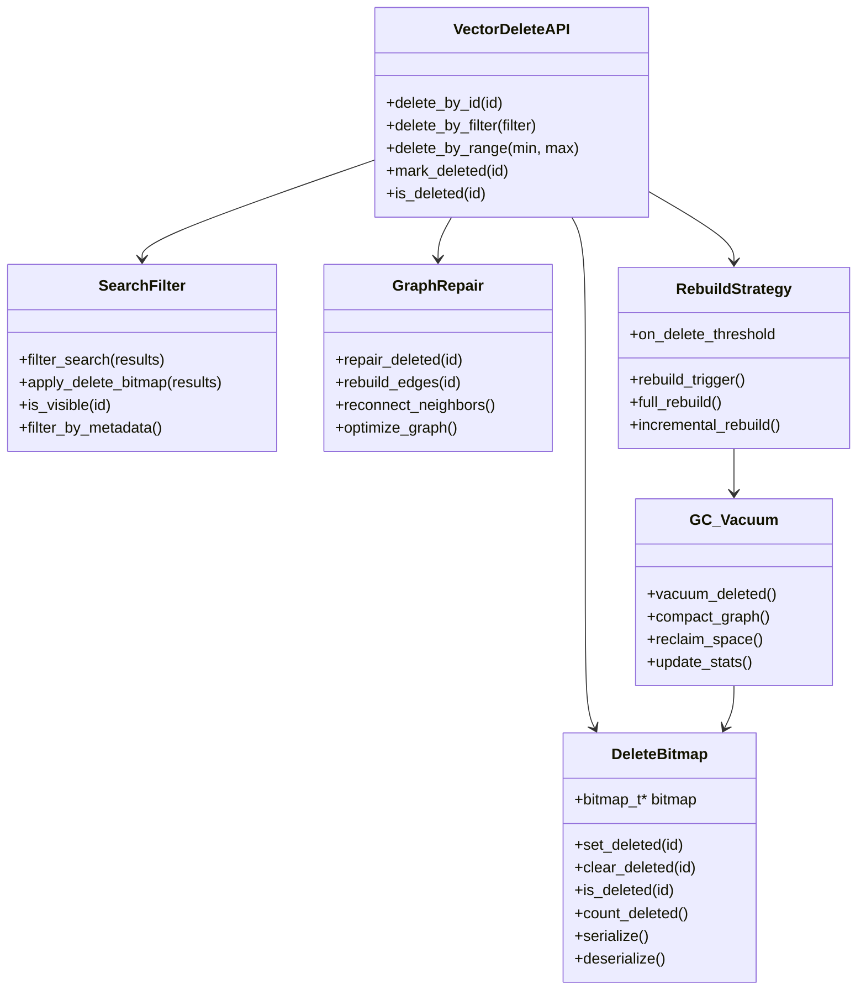
```mermaid
classDiagram
    class VectorDeleteAPI {
        +delete_by_id(id)
        +delete_by_filter(filter)
        +delete_by_range(min, max)
        +mark_deleted(id)
        +is_deleted(id)
    }

    class DeleteBitmap {
        +bitmap_t* bitmap
        +set_deleted(id)
        +clear_deleted(id)
        +is_deleted(id)
        +count_deleted()
        +serialize()
        +deserialize()
    }

    class SearchFilter {
        +filter_search(results)
        +apply_delete_bitmap(results)
        +is_visible(id)
        +filter_by_metadata()
    }

    class GraphRepair {
        +repair_deleted(id)
        +rebuild_edges(id)
        +reconnect_neighbors()
        +optimize_graph()
    }

    class RebuildStrategy {
        +on_delete_threshold
        +rebuild_trigger()
        +full_rebuild()
        +incremental_rebuild()
    }

    class GC_Vacuum {
        +vacuum_deleted()
        +compact_graph()
        +reclaim_space()
        +update_stats()
    }

    VectorDeleteAPI --> DeleteBitmap
    VectorDeleteAPI --> SearchFilter
    VectorDeleteAPI --> GraphRepair
    VectorDeleteAPI --> RebuildStrategy
    GC_Vacuum --> DeleteBitmap
    RebuildStrategy --> GC_Vacuum
```

### 5.2 删除与 GC 流程

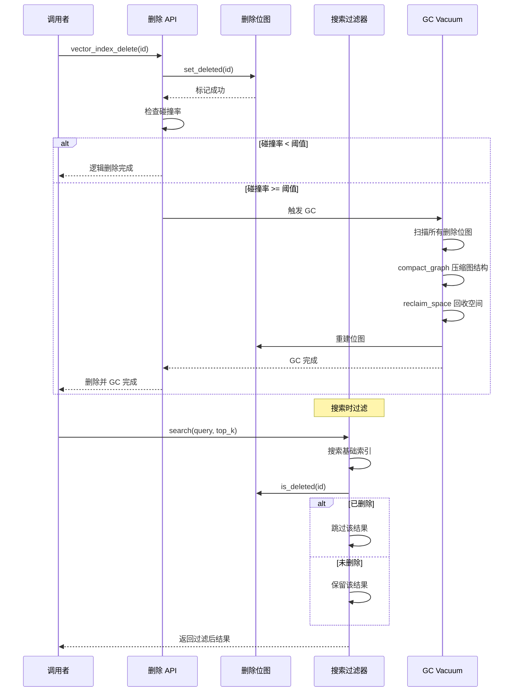
```mermaid
sequenceDiagram
    participant Caller as 调用者
    participant API as 删除 API
    participant Bitmap as 删除位图
    participant Search as 搜索过滤器
    participant GC as GC Vacuum

    Caller->>API: vector_index_delete(id)

    API->>Bitmap: set_deleted(id)
    Bitmap-->>API: 标记成功

    API->>API: 检查碰撞率

    alt 碰撞率 < 阈值
        API-->>Caller: 逻辑删除完成
    else 碰撞率 >= 阈值
        API->>GC: 触发 GC
        GC->>GC: 扫描所有删除位图
        GC->>GC: compact_graph 压缩图结构
        GC->>GC: reclaim_space 回收空间
        GC->>Bitmap: 重建位图
        GC-->>API: GC 完成
        API-->>Caller: 删除并 GC 完成
    end

    Note over Search: 搜索时过滤

    Caller->>Search: search(query, top_k)
    Search->>Search: 搜索基础索引
    Search->>Bitmap: is_deleted(id)
    alt 已删除
        Search->>Search: 跳过该结果
    else 未删除
        Search->>Search: 保留该结果
    end
    Search-->>Caller: 返回过滤后结果
```

---

## 六、重排序引擎

### 6.1 重排序架构

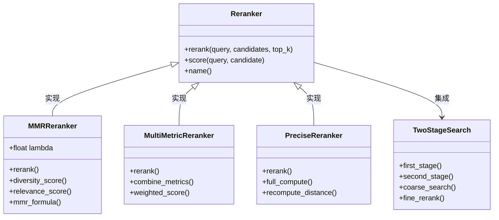
```mermaid
classDiagram
    class Reranker {
        +rerank(query, candidates, top_k)
        +score(query, candidate)
        +name()
    }

    class MMRReranker {
        +float lambda
        +rerank()
        +diversity_score()
        +relevance_score()
        +mmr_formula()
    }

    class MultiMetricReranker {
        +rerank()
        +combine_metrics()
        +weighted_score()
    }

    class PreciseReranker {
        +rerank()
        +full_compute()
        +recompute_distance()
    }

    class TwoStageSearch {
        +first_stage()
        +second_stage()
        +coarse_search()
        +fine_rerank()
    }

    Reranker <|-- MMRReranker : 实现
    Reranker <|-- MultiMetricReranker : 实现
    Reranker <|-- PreciseReranker : 实现
    Reranker --> TwoStageSearch : 集成
```

### 6.2 两阶段搜索流程

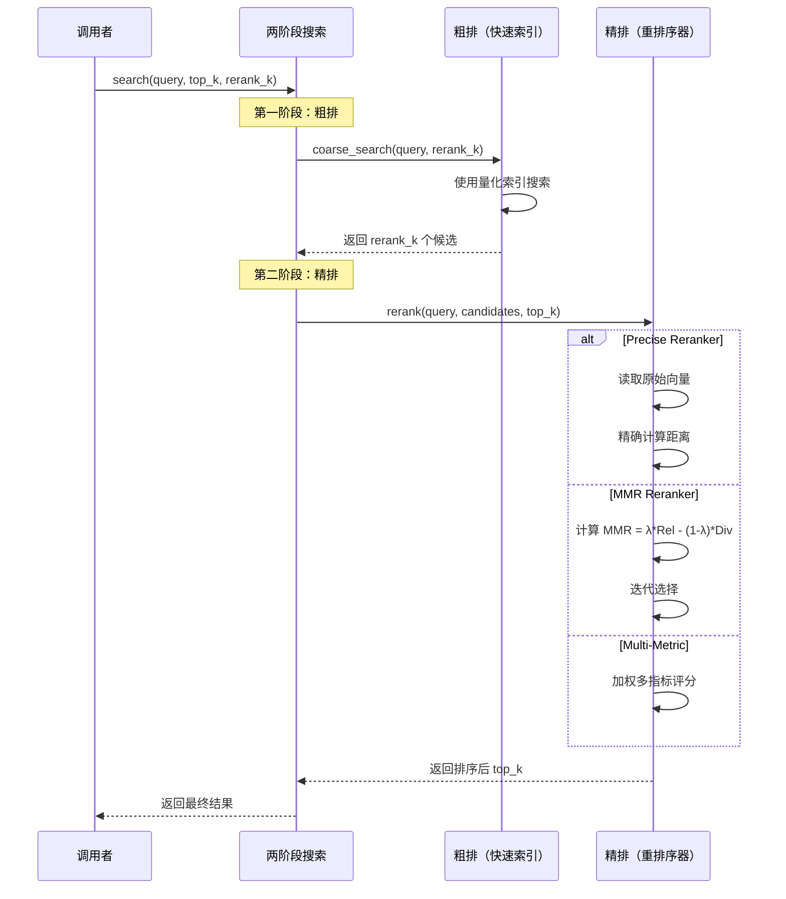
```mermaid
sequenceDiagram
    participant Caller as 调用者
    participant TwoStage as 两阶段搜索
    participant Coarse as 粗排（快速索引）
    participant Reranker as 精排（重排序器）

    Caller->>TwoStage: search(query, top_k, rerank_k)

    Note over TwoStage: 第一阶段：粗排
    TwoStage->>Coarse: coarse_search(query, rerank_k)
    Coarse->>Coarse: 使用量化索引搜索
    Coarse-->>TwoStage: 返回 rerank_k 个候选

    Note over TwoStage: 第二阶段：精排
    TwoStage->>Reranker: rerank(query, candidates, top_k)

    alt Precise Reranker
        Reranker->>Reranker: 读取原始向量
        Reranker->>Reranker: 精确计算距离
    else MMR Reranker
        Reranker->>Reranker: 计算 MMR = λ*Rel - (1-λ)*Div
        Reranker->>Reranker: 迭代选择
    else Multi-Metric
        Reranker->>Reranker: 加权多指标评分
    end

    Reranker-->>TwoStage: 返回排序后 top_k
    TwoStage-->>Caller: 返回最终结果
```

---

## 七、持久化与配置

### 7.1 持久化控制

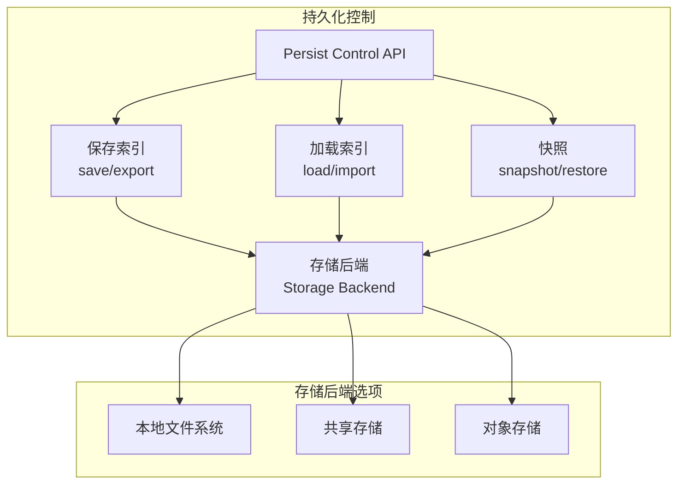
```mermaid
flowchart TB
    subgraph "持久化控制"
        PERSIST_API[Persist Control API]

        SAVE[保存索引<br/>save/export]
        LOAD[加载索引<br/>load/import]
        SNAPSHOT[快照<br/>snapshot/restore]

        BACKEND[存储后端<br/>Storage Backend]
    end

    subgraph "存储后端选项"
        LOCAL[本地文件系统]
        SHARED[共享存储]
        OBJECT[对象存储]
    end

    PERSIST_API --> SAVE
    PERSIST_API --> LOAD
    PERSIST_API --> SNAPSHOT
    SAVE --> BACKEND
    LOAD --> BACKEND
    SNAPSHOT --> BACKEND
    BACKEND --> LOCAL
    BACKEND --> SHARED
    BACKEND --> OBJECT
```

### 7.2 索引配置

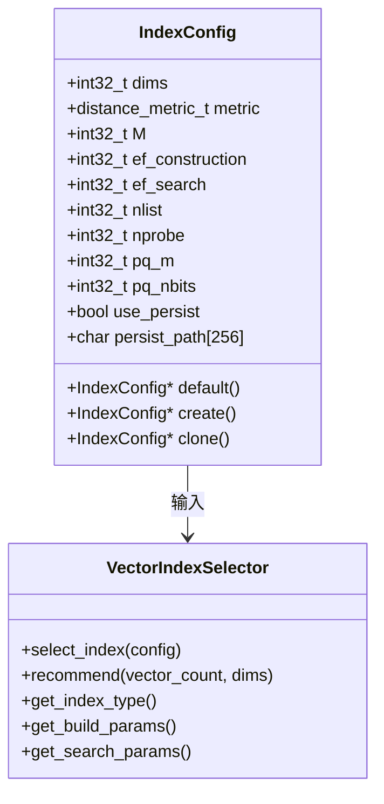
```mermaid
classDiagram
    class IndexConfig {
        +int32_t dims
        +distance_metric_t metric
        +int32_t M
        +int32_t ef_construction
        +int32_t ef_search
        +int32_t nlist
        +int32_t nprobe
        +int32_t pq_m
        +int32_t pq_nbits
        +bool use_persist
        +char persist_path[256]
        +IndexConfig* default()
        +IndexConfig* create()
        +IndexConfig* clone()
    }

    class VectorIndexSelector {
        +select_index(config)
        +recommend(vector_count, dims)
        +get_index_type()
        +get_build_params()
        +get_search_params()
    }

    IndexConfig --> VectorIndexSelector : 输入
```

---

## 八、索引选择器

### 8.1 索引选择策略

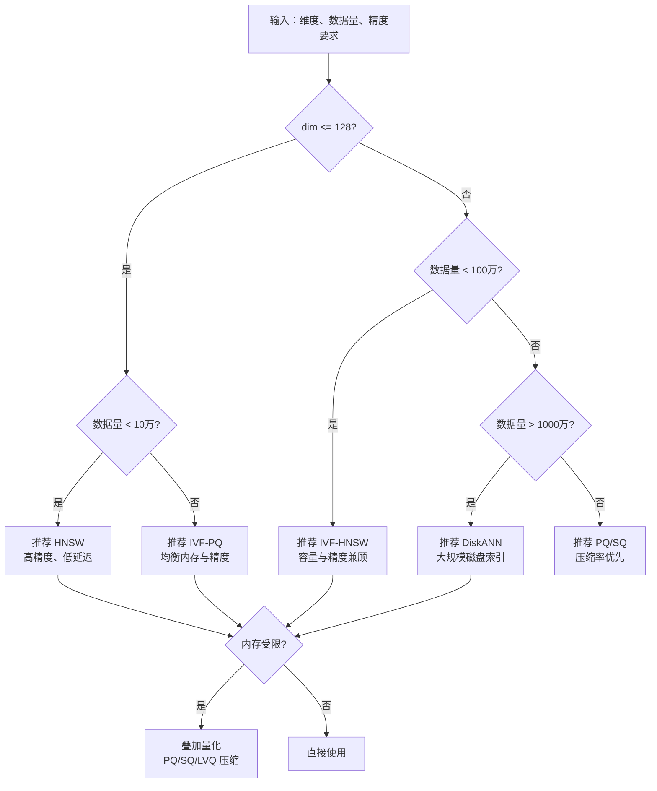
```mermaid
flowchart TD
    Start[输入：维度、数据量、精度要求] --> CheckDim{dim <= 128?}

    CheckDim -->|是| CheckCount{数据量 < 10万?}
    CheckDim -->|否| CheckCountLarge{数据量 < 100万?}

    CheckCount -->|是| RecHNSW[推荐 HNSW<br/>高精度、低延迟]
    CheckCount -->|否| RecIVF[推荐 IVF-PQ<br/>均衡内存与精度]

    CheckCountLarge -->|是| RecIVF_HNSW[推荐 IVF-HNSW<br/>容量与精度兼顾]
    CheckCountLarge -->|否| CheckScale{数据量 > 1000万?}

    CheckScale -->|是| RecDiskANN[推荐 DiskANN<br/>大规模磁盘索引]
    CheckScale -->|否| RecPQ[推荐 PQ/SQ<br/>压缩率优先]

    RecHNSW --> CheckMemory{内存受限?}
    RecIVF --> CheckMemory
    RecIVF_HNSW --> CheckMemory
    RecDiskANN --> CheckMemory

    CheckMemory -->|是| AddQuant[叠加量化<br/>PQ/SQ/LVQ 压缩]
    CheckMemory -->|否| Direct[直接使用]
```

---

## 九、关键代码位置

### 9.1 传统索引

| 索引类型 | 头文件 | 源文件 |
|---------|--------|--------|
| B+树 | `engineering/include/db/index/bplus_tree/bptree.h` | `engineering/src/db/index/bplus_tree/` |
| B树 | `engineering/include/db/index/btree/btree.h` | `engineering/src/db/index/btree/` |
| ART | `engineering/include/db/index/art/art.h` | `engineering/src/db/index/art/` |
| Radix Tree | `engineering/include/db/index/radix_tree/radix_tree.h` | `engineering/src/db/index/radix_tree/` |
| T-Tree | `engineering/include/db/index/ttree/ttree.h` | `engineering/src/db/index/ttree/` |
| R-Tree | `engineering/include/db/index/rtree/rtree.h` | `engineering/src/db/index/rtree/` |
| Skip List | `engineering/include/db/index/skip_list/skip_list.h` | `engineering/src/db/index/skip_list/` |
| CCEH | `engineering/include/db/index/hash/cceh.h` | `engineering/src/db/index/hash/cceh/` |
| PG Hash | `engineering/include/db/index/hash/pg_hash.h` | `engineering/src/db/index/hash/pg_hash/` |
| Cuckoo | `engineering/include/db/index/hash/cuckoo.h` | `engineering/src/db/index/hash/cuckoo/` |
| Bloom | `engineering/include/db/index/hash/bloom.h` | `engineering/src/db/index/hash/bloom/` |
| XOR | `engineering/include/db/index/hash/xor_filter.h` | `engineering/src/db/index/hash/xor_filter/` |
| GiST | `engineering/include/db/index/gist/gist.h` | `engineering/src/db/index/gist/` |
| GIN | `engineering/include/db/index/gin/gin.h` | `engineering/src/db/index/gin/` |
| BRIN | `engineering/include/db/index/brin/brin.h` | `engineering/src/db/index/brin/` |
| Bitmap | `engineering/include/db/index/bitmap/bitmap_index.h` | `engineering/src/db/index/bitmap/` |
| Fulltext | `engineering/include/db/index/fulltext/fulltext.h` | `engineering/src/db/index/fulltext/` |
| Hilbert | `engineering/include/db/index/hilbert.h` | `engineering/src/db/index/hilbert/` |

### 9.2 向量索引

| 索引类型 | 头文件 | 源文件 |
|---------|--------|--------|
| HNSW | `engineering/include/db/index/vector_index/hnsw/faiss_hnsw.h` | `engineering/src/db/index/vector_index/hnsw/` |
| NSW | `engineering/include/db/index/vector_index/nsw/nsw.h` | `engineering/src/db/index/vector_index/nsw/` |
| DiskANN | `engineering/include/db/index/vector_index/diskann/diskann.h` | `engineering/src/db/index/vector_index/diskann/` |
| SSG | `engineering/include/db/index/vector_index/ssg/ssg.h` | `engineering/src/db/index/vector_index/ssg/` |
| IVF-Flat | `engineering/include/db/index/vector_index/ivf_flat/ivf_flat.h` | `engineering/src/db/index/vector_index/ivf_flat/` |
| IVF-PQ | `engineering/include/db/index/vector_index/ivf_pq/ivf_pq.h` | `engineering/src/db/index/vector_index/ivf_pq/` |
| IVF-HNSW | `engineering/include/db/index/vector_index/ivf_hnsw/ivf_hnsw.h` | `engineering/src/db/index/vector_index/ivf_hnsw/` |
| PQ | `engineering/include/db/index/vector_index/pq/pq.h` | `engineering/src/db/index/vector_index/pq/` |
| SQ | `engineering/include/db/index/vector_index/sq/sq.h` | `engineering/src/db/index/vector_index/sq/` |
| LVQ | `engineering/include/db/index/vector_index/lvq/lvq.h` | `engineering/src/db/index/vector_index/lvq/` |
| RQ | `engineering/include/db/index/vector_index/rq/rq.h` | `engineering/src/db/index/vector_index/rq/` |
| OPQ | `engineering/include/db/index/vector_index/opq/opq.h` | `engineering/src/db/index/vector_index/opq/` |
| LSH | `engineering/include/db/index/vector_index/lsh/lsh.h` | `engineering/src/db/index/vector_index/lsh/` |
| Multi-probe LSH | `engineering/include/db/index/vector_index/lsh_multiprobe/lsh_multiprobe.h` | `engineering/src/db/index/vector_index/lsh_multiprobe/` |
| Spectral Hash | `engineering/include/db/index/vector_index/spectral_hash/spectral_hash.h` | `engineering/src/db/index/vector_index/spectral_hash/` |
| KD-Tree | `engineering/include/db/index/vector_index/kd_tree/kd_tree.h` | `engineering/src/db/index/vector_index/kd_tree/` |
| Ball Tree | `engineering/include/db/index/vector_index/ball_tree/ball_tree.h` | `engineering/src/db/index/vector_index/ball_tree/` |
| Annoy | `engineering/include/db/index/vector_index/annoy/annoy.h` | `engineering/src/db/index/vector_index/annoy/` |
| SCANN | `engineering/include/db/index/vector_index/scann/scann.h` | `engineering/src/db/index/vector_index/scann/` |
| ITQ | `engineering/include/db/index/vector_index/itq/itq.h` | `engineering/src/db/index/vector_index/itq/` |
| HNSW-SQ | `engineering/include/db/index/vector_index/hnsw_sq/hnsw_sq.h` | `engineering/src/db/index/vector_index/hnsw_sq/` |
| HNSW-PQ | `engineering/include/db/index/vector_index/hnsw_pq/hnsw_pq.h` | `engineering/src/db/index/vector_index/hnsw_pq/` |
| BM25 | `engineering/include/db/index/vector_index/BM25/bm25.h` | `engineering/src/db/index/vector_index/BM25/` |
| Milvus IVF | `engineering/include/db/index/vector_index/milvus_ivf/milvus_ivf.h` | `engineering/src/db/index/vector_index/milvus_ivf/` |

### 9.3 高级索引及基础设施

| 功能 | 头文件 | 源文件 |
|------|--------|--------|
| 流式索引 | `engineering/include/db/index/vector_index/streaming/streaming_index.h` | `engineering/src/db/index/vector_index/streaming/` |
| 分层索引 | `engineering/include/db/index/vector_index/tiered_index.h` | `engineering/src/db/index/vector_index/tiered_index.c` |
| 混合搜索 | `engineering/include/db/index/vector_index/hybrid_search.h` | `engineering/src/db/index/vector_index/hybrid_search.c` |
| 多模态 | `engineering/include/db/index/vector_index/multimodal/multimodal.h` | `engineering/src/db/index/vector_index/multimodal/` |
| 删除/GC | `engineering/include/db/index/vector_index/delete/vector_index_delete_api.h` | `engineering/src/db/index/vector_index/delete/` |
| 重排序 | `engineering/include/db/index/vector_index/reranker/reranker.h` | `engineering/src/db/index/vector_index/reranker/` |
| 持久化 | `engineering/include/db/index/index_persist_control.h` | `engineering/src/db/index/` |
| 配置 | `engineering/include/db/index/index_config.h` | `engineering/src/db/index/` |
| 选择器 | `engineering/include/db/index/vector_index/vector_index_selector.h` | `engineering/src/db/index/vector_index/` |
| 存储后端 | `engineering/include/db/index/storage_backend.h` | `engineering/src/db/index/` |
| 向量引用 | `engineering/include/db/index/vector_ref.h` | `engineering/src/db/index/` |
| C API | `engineering/include/db/index/vector_index/vector_index_c_api.h` | `engineering/src/db/index/vector_index/` |