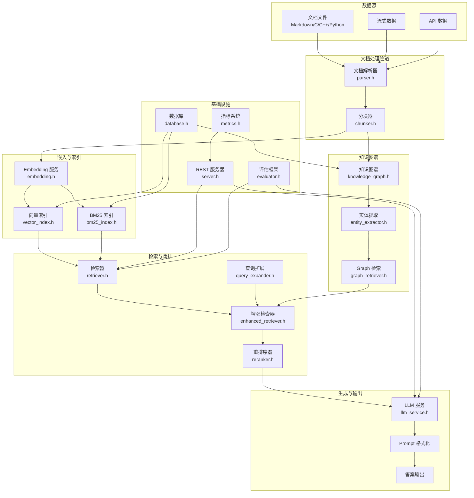
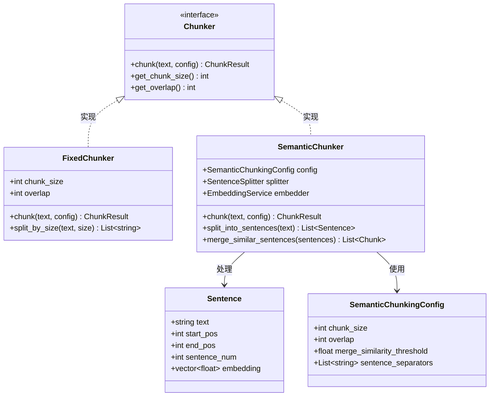
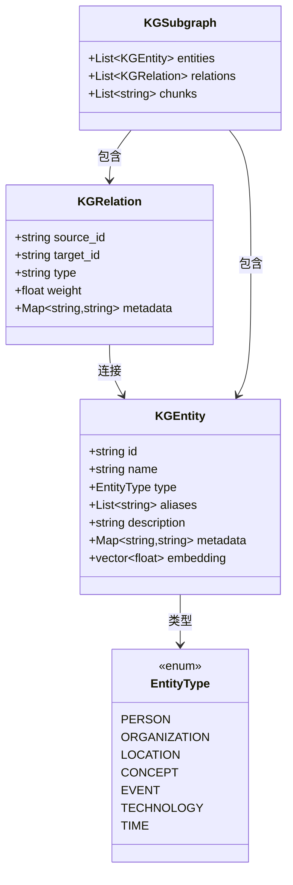
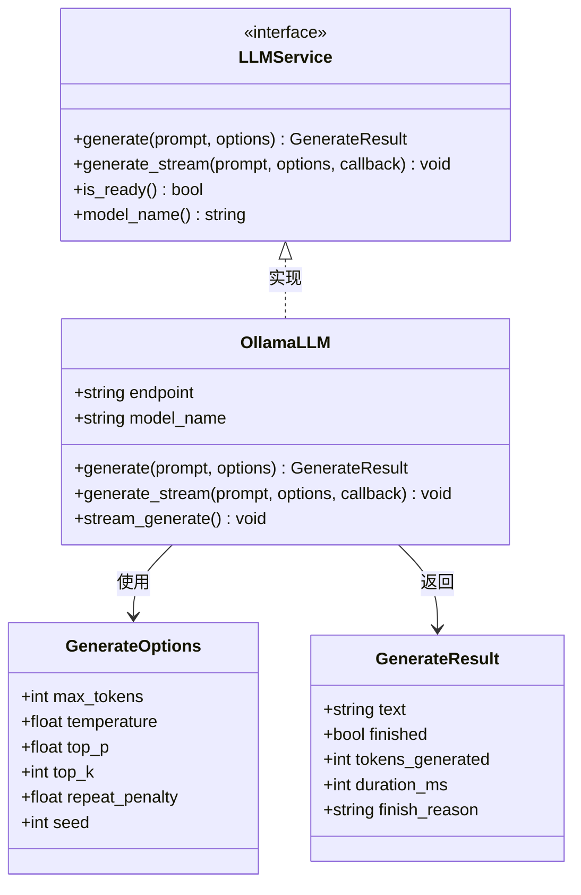

# RAG 子系统 - 架构设计

## 概述

RAG（Retrieval-Augmented Generation）子系统是 C++ 实现的端到端 RAG 引擎，位于 `engineering/rag/`。系统集成文档处理管道、向量索引、BM25 稀疏索引、混合检索、知识图谱、Embedding 服务和 LLM 服务，提供从文档入库到智能问答的完整能力。

---

## 一、子系统架构概览


---

## 二、文档处理管道

### 2.1 文档解析与分块



### 2.2 分块策略对比

```mermaid
flowchart TB
    subgraph "固定大小分块"
        FIXED_INPUT[输入文本]
        FIXED_SPLIT[按固定字符数分割<br/>chunk_size=500]
        FIXED_OVERLAP[添加重叠<br/>overlap=50]
        FIXED_CHUCKS[输出分块列表]
    end

    subgraph "语义分块"
        SEM_INPUT[输入文本]
        SEM_SENTENCE[句子分割<br/>按句号/问号/感叹号]
        SEM_EMBED[句子嵌入<br/>Sentence Embedding]
        SEM_SIM[计算相似度矩阵]
        SEM_MERGE[合并相似句子<br/>threshold=0.7]
        SEM_CHUNKS[输出语义分块]
    end

    FIXED_INPUT --> FIXED_SPLIT
    FIXED_SPLIT --> FIXED_OVERLAP
    FIXED_OVERLAP --> FIXED_CHUCKS

    SEM_INPUT --> SEM_SENTENCE
    SEM_SENTENCE --> SEM_EMBED
    SEM_EMBED --> SEM_SIM
    SEM_SIM --> SEM_MERGE
    SEM_MERGE --> SEM_CHUNKS
```



### 2.3 文档解析流程

```mermaid
sequenceDiagram
    participant Caller as 调用者
    participant Parser as 文档解析器
    participant Chunker as 分块器
    participant Index as 索引管理器

    Caller->>Parser: parse_document(file_path)

    Parser->>Parser: 检测文件类型
    Parser->>Parser: 读取文件内容

    alt Markdown 文件
        Parser->>Parser: 解析标题/段落/代码块
    else C/C++ 文件
        Parser->>Parser: 解析函数/类/注释
    else Python 文件
        Parser->>Parser: 解析函数/类/文档字符串
    end

    Parser->>Chunker: chunk(content, config)

    Chunker->>Chunker: 执行分块策略
    Chunker-->>Parser: 返回 Chunk 列表

    Parser->>Parser: 构造 Document 对象
    Parser->>Index: 返回 Document

    Parser-->>Caller: 解析完成
```---

## 三、索引模块

### 3.1 向量索引与 BM25

```mermaid
classDiagram
    class VirtualIndex {
        <<interface>>
        +init(config) bool
        +add(id, vector) bool
        +add_batch(vectors, ids) bool
        +search(query, top_k) SearchResult
        +get(id) vector
        +remove(id) bool
        +clear() void
        +save(path) bool
        +load(path) bool
    }

    class HNSWIndex {
        +HNSWConfig config
        +void* hnsw_graph
        +init(config) bool
        +add(id, vector) bool
        +search(query, top_k) SearchResult
        +save(path) bool
        +load(path) bool
    }

    class BM25Index {
        +BM25Config config
        +Map~id,doc~ docs
        +Map~term,stats~ term_stats
        +add(id, text) bool
        +search(query, top_k) SearchResult
        +save(path) bool
        +load(path) bool
        +get_doc_count() int
    }

    class HNSWConfig {
        +int dim
        +int max_elements
        +int M
        +int ef_construction
        +int ef_search
        +string space
    }

    class BM25Config {
        +float k1
        +float b
        +float avg_doc_length
        +bool enable_stemming
    }

    VirtualIndex <|.. HNSWIndex : 实现
    VirtualIndex <|.. BM25Index : 实现
    HNSWIndex --> HNSWConfig : 使用
    BM25Index --> BM25Config : 使用
```### 3.2 索引构建流程

```mermaid
sequenceDiagram
    participant Caller as 调用者
    participant Engine as RAG 引擎
    participant Chunker as 分块器
    participant Embed as Embedding 服务
    participant VecIdx as 向量索引
    participant BM25 as BM25 索引

    Caller->>Engine: index_document(file_path)

    Engine->>Engine: 解析文档
    Engine->>Chunker: chunk(content, config)
    Chunker-->>Engine: 返回 Chunk 列表

    loop 每个 Chunk
        Engine->>Embed: encode(chunk.content)
        Embed-->>Engine: 返回 embedding 向量

        Engine->>VecIdx: add(chunk.id, embedding)
        VecIdx-->>Engine: 添加成功

        Engine->>BM25: add(chunk.id, chunk.content)
        BM25-->>Engine: 添加成功
    end

    Engine->>Engine: 更新文档状态为 INDEXED
    Engine-->>Caller: 索引完成
```---

## 四、检索与重排序

### 4.1 检索器架构

```mermaid
classDiagram
    class Retriever {
        <<interface>>
        +retrieve(query, top_k) RetrievalResult
        +get_name() string
    }

    class HNSWRetriever {
        +HNSWIndex index
        +retrieve(query, top_k) RetrievalResult
        +search_index(query_vec, k) List~id,score~
    }

    class BM25Retriever {
        +BM25Index index
        +retrieve(query, top_k) RetrievalResult
        +search_index(query_text, k) List~id,score~
    }

    class HybridRetriever {
        +HNSWRetriever vec_retriever
        +BM25Retriever bm25_retriever
        +float vec_weight
        +float bm25_weight
        +retrieve(query, top_k) RetrievalResult
        +rrf_fusion(vec_results, bm25_results) List~id,score~
    }

    class RetrievalDetails {
        +string chunk_id
        +string content
        +float vector_score
        +float bm25_score
        +float combined_score
        +int rank
    }

    Retriever <|.. HNSWRetriever : 实现
    Retriever <|.. BM25Retriever : 实现
    Retriever <|.. HybridRetriever : 实现
    HybridRetriever --> HNSWRetriever : 组合
    HybridRetriever --> BM25Retriever : 组合
```

### 4.2 混合检索与 RRF 融合

```mermaid
flowchart TB
    subgraph "混合检索"
        QUERY[用户查询]
        VEC_RET[向量检索<br/>HNSWRetriever]
        BM25_RET[BM25 检索<br/>BM25Retriever]
    end

    subgraph "RRF 融合"
        VEC_RES[向量结果集<br/>id + rank]
        BM25_RES[BM25 结果集<br/>id + rank]
        RRF_SCORE[RRF 评分<br/>score = Σ 1/(k + rank)]
        MERGE[合并排序]
    end

    subgraph "输出"
        FINAL[最终结果<br/>top_k 条]
    end

    QUERY --> VEC_RET
    QUERY --> BM25_RET
    VEC_RET --> VEC_RES
    BM25_RET --> BM25_RES
    VEC_RES --> RRF_SCORE
    BM25_RES --> RRF_SCORE
    RRF_SCORE --> MERGE
    MERGE --> FINAL
```### 4.3 增强检索流程

```mermaid
sequenceDiagram
    participant Caller as 调用者
    participant Expander as 查询扩展器
    participant Retriever as 混合检索器
    participant Reranker as 重排序器
    participant MMR as MMR 多样性

    Caller->>Expander: expand_query(query)

    alt HyDE 扩展
        Expander->>Expander: 生成假设文档
        Expander->>Expander: 使用假设文档嵌入
    else 同义词扩展
        Expander->>Expander: 查找同义词
        Expander->>Expander: 构造扩展查询
    end

    Expander-->>Caller: 返回扩展查询列表

    Caller->>Retriever: retrieve(expanded_queries, recall_top_k)

    loop 每个扩展查询
        Retriever->>Retriever: 执行混合检索
    end

    Retriever->>Retriever: 合并去重
    Retriever-->>Caller: 返回候选结果

    Caller->>Reranker: rerank(query, candidates, top_k)

    alt Lightweight Reranker
        Reranker->>Reranker: 基于规则评分
    else BGE Cross-Encoder
        Reranker->>Reranker: 模型精排
    end

    Reranker-->>Caller: 返回重排结果

    Caller->>MMR: apply_mmr(results, lambda)

    MMR->>MMR: 计算多样性得分
    MMR->>MMR: 迭代选择最多样结果

    MMR-->>Caller: 返回最终结果
```### 4.4 查询扩展

```mermaid
classDiagram
    class QueryExpander {
        <<interface>>
        +expand(query) ExpansionResult
        +get_name() string
    }

    class HyDEExpander {
        +LLMService llm
        +expand(query) ExpansionResult
        +generate_hypothetical_doc(query) string
    }

    class SynonymExpander {
        +Map~term,synonyms~ synonym_dict
        +expand(query) ExpansionResult
        +lookup_synonyms(term) List~string~
    }

    class ExpansionResult {
        +string original_query
        +List~string~ expanded_queries
        +List~float~ weights
        +string method
    }

    QueryExpander <|.. HyDEExpander : 实现
    QueryExpander <|.. SynonymExpander : 实现
    HyDEExpander --> ExpansionResult : 生成
    SynonymExpander --> ExpansionResult : 生成
```

---

## 五、知识图谱

### 5.1 知识图谱结构



### 5.3 Graph 检索流程

```mermaid
sequenceDiagram
    participant Caller as 调用者
    participant GraphRet as Graph 检索器
    participant KG as 知识图谱
    participant EntityLink as 实体链接
    participant Subgraph as 子图扩展

    Caller->>GraphRet: graph_retrieve(query, config)

    GraphRet->>EntityLink: link_entities(query)
    EntityLink->>EntityLink: 识别查询中的实体
    EntityLink-->>GraphRet: 返回匹配实体列表

    GraphRet->>Subgraph: expand_subgraph(entities, max_hops)

    alt BFS 扩展
        Subgraph->>Subgraph: 广度优先遍历
    else DFS 扩展
        Subgraph->>Subgraph: 深度优先遍历
    else Random Walk
        Subgraph->>Subgraph: 随机游走
    end

    Subgraph->>KG: 获取实体和关系
    KG-->>Subgraph: 返回子图数据
    Subgraph-->>GraphRet: 返回 KGSubgraph

    GraphRet->>GraphRet: 计算子图相关性得分
    GraphRet->>GraphRet: 关联相关 chunks

    GraphRet-->>Caller: 返回 GraphRetrievalResult
```---

## 六、Embedding 与 LLM

### 6.1 Embedding 服务

```mermaid
classDiagram
    class EmbeddingService {
        <<interface>>
        +encode(text) vector~float~
        +encode_batch(texts) List~vector~float~~
        +dimension() int
        +is_ready() bool
        +model_name() string
    }

    class SimpleEmbedding {
        +int dim
        +encode(text) vector~float~
        +encode_batch(texts) List~vector~float~~
    }

    class BGEM3Embedding {
        +string model_path
        +int batch_size
        +int max_length
        +encode(text) vector~float~
        +encode_batch(texts) List~vector~float~~
    }

    class OllamaEmbedding {
        +string endpoint
        +string model_name
        +encode(text) vector~float~
        +encode_batch(texts) List~vector~float~~
    }

    class EmbeddingStats {
        +int total_encoded
        +int total_tokens
        +float avg_latency_ms
    }

    EmbeddingService <|.. SimpleEmbedding: 实现
    EmbeddingService <|.. BGEM3Embedding: 实现
    EmbeddingService <|.. OllamaEmbedding: 实现
    EmbeddingService --> EmbeddingStats : 统计
```

### 6.2 LLM 服务



---

## 七、核心引擎

### 7.1 引擎状态机

```mermaid
stateDiagram-v2
    [*] --> UNINITIALIZED: 创建引擎

    UNINITIALIZED --> INITIALIZING: initialize()
    INITIALIZING --> READY: 初始化成功
    INITIALIZING --> ERROR: 初始化失败

    READY --> INDEXING: index_document()
    INDEXING --> READY: 索引完成
    INDEXING --> ERROR: 索引失败

    READY --> QUERYING: search()
    QUERYING --> READY: 查询完成
    QUERYING --> ERROR: 查询失败

    READY --> CLEARING: clear()
    CLEARING --> READY: 清理完成

    ERROR --> READY: recover()
    ERROR --> [*]: shutdown()

    READY --> [*]: shutdown()
```### 7.2 引擎查询流程

```mermaid
sequenceDiagram
    participant Caller as 调用者
    participant Engine as RAGEngine
    participant Config as 配置管理器
    participant Embed as Embedding 服务
    participant Retriever as 检索器
    participant Reranker as 重排序器
    participant LLM as LLM 服务
    participant KG as 知识图谱

    Caller->>Engine: search(query)

    Engine->>Engine: 检查状态 (READY?)

    Engine->>Embed: encode(query)
    Embed-->>Engine: 返回 query_vector

    Engine->>Retriever: retrieve(query_vector, recall_top_k)

    par 并行检索
        Retriever->>Retriever: 向量检索
        Retriever->>Retriever: BM25 检索
    end

    Retriever-->>Engine: 返回候选 chunks

    opt 知识图谱增强
        Engine->>KG: graph_retrieve(query)
        KG-->>Engine: 返回相关子图
        Engine->>Engine: 合并图谱结果
    end

    Engine->>Reranker: rerank(query, candidates, top_k)
    Reranker-->>Engine: 返回重排结果

    Engine->>Engine: format_prompt(query, chunks)
    Engine->>LLM: generate(prompt, options)
    LLM-->>Engine: 返回生成答案

    Engine-->>Caller: 返回 RAGResult
```---

## 八、评估框架

```mermaid
classDiagram
    class RetrievalMetrics {
        +float recall_at_k
        +float mrr
        +float ndcg_at_k
        +float precision_at_k
    }

    class RAGEvaluation {
        +float faithfulness
        +float answer_relevance
        +float context_relevance
        +float ragas_score
    }

    class EvaluationResult {
        +string question
        +string answer
        +List~string~ contexts
        +List~string~ ground_truths
        +RetrievalMetrics retrieval_metrics
        +RAGEvaluation ragas_metrics
    }

    class Evaluator {
        +evaluate(questions, answers, contexts) EvaluationSummary
        +compute_retrieval_metrics() RetrievalMetrics
        +compute_ragas_metrics() RAGEvaluation
    }

    class EvaluationSummary {
        +float avg_recall_at_k
        +float avg_mrr
        +float avg_ndcg
        +float avg_faithfulness
        +float avg_answer_relevance
        +int total_questions
    }

    Evaluator --> EvaluationResult : 生成
    Evaluator --> EvaluationSummary : 聚合
    EvaluationResult --> RetrievalMetrics : 包含
    EvaluationResult --> RAGEvaluation : 包含
```

---

## 九、基础设施

### 9.1 REST API 服务器

```mermaid
flowchart TB
    subgraph "REST API 服务器"
        SERVER[Server<br/>server.h/cpp]

        HEALTH[/api/health<br/>健康检查]
        INDEX[/api/index<br/>文档索引]
        QUERY[/api/query<br/>查询接口]
        STATS[/api/stats<br/>统计信息]
    end

    subgraph "请求/响应"
        QUERY_REQ[QueryRequest<br/>query, top_k, options]
        QUERY_RES[QueryResponse<br/>answer, chunks, scores]
        CHUNK_REF[ChunkReference<br/>id, content, score, metadata]
    end

    CLIENT[客户端] --> SERVER
    SERVER --> HEALTH
    SERVER --> INDEX
    SERVER --> QUERY
    SERVER --> STATS

    QUERY_REQ --> QUERY
    QUERY --> QUERY_RES
    QUERY_RES --> CHUNK_REF
```### 9.2 数据库与指标

```mermaid
flowchart TB
    subgraph "数据库层 (database.h)"
        DB[SQLite 数据库]

        CHUNK_REPO[ChunkRepository<br/>chunk 表]
        DOC_REPO[DocumentRepository<br/>document 表]
        IDX_REPO[IndexRepository<br/>index 元数据]
    end

    subgraph "指标系统 (metrics.h)"
        METRICS_COLLECTOR[MetricsCollector]

        COUNTER[Counter<br/>请求计数/错误计数]
        GAUGE[Gauge<br/>当前连接数/队列长度]
        HISTOGRAM[Histogram<br/>延迟分布/响应大小]
        SUMMARY[Summary<br/>分位数统计]
    end

    subgraph "错误码系统"
        ERR_SYSTEM[系统错误]
        ERR_CONFIG[配置错误]
        ERR_MODEL[模型错误]
        ERR_INDEX[索引错误]
        ERR_DOCUMENT[文档错误]
        ERR_RETRIEVAL[检索错误]
        ERR_LLM[LLM 错误]
        ERR_USER[用户错误]
    end

    DB --> CHUNK_REPO
    DB --> DOC_REPO
    DB --> IDX_REPO

    METRICS_COLLECTOR --> COUNTER
    METRICS_COLLECTOR --> GAUGE
    METRICS_COLLECTOR --> HISTOGRAM
    METRICS_COLLECTOR --> SUMMARY
```

---

## 十、配置系统

### 10.1 配置结构

```mermaid
classDiagram
    class RAGConfig {
        +DataSourceConfig data_source
        +EmbeddingConfig embedding
        +LLMConfig llm
        +HNSWConfig hnsw
        +BM25Config bm25
        +ChunkingConfig chunking
        +RetrievalConfig retrieval
        +GraphConfig graph
        +ServerConfig server
    }

    class DataSourceConfig {
        +string path
        +List~string~ patterns
        +string file_type
        +bool recursive
    }

    class EmbeddingConfig {
        +string model_path
        +string model_type
        +int batch_size
        +int max_length
        +string device
        +int num_threads
    }

    class LLMConfig {
        +string model_path
        +string model_type
        +int n_ctx
        +int n_threads
        +int max_tokens
        +float temperature
        +float top_p
        +bool stream
    }

    class RetrievalConfig {
        +int recall_top_k
        +int return_top_k
        +bool enable_rerank
        +bool enable_mmr
        +float mmr_lambda
    }

    RAGConfig --> DataSourceConfig
    RAGConfig --> EmbeddingConfig
    RAGConfig --> LLMConfig
    RAGConfig --> RetrievalConfig
```---

## 十一、关键代码位置

### 11.1 核心模块

| 功能 | 头文件 | 源文件 |
|------|--------|--------|
| RAG 引擎 | `engineering/rag/include/engine.h` | `engineering/rag/src/engine.cpp` |
| 配置管理 | `engineering/rag/include/config.h` | `engineering/rag/src/config.cpp` |
| 核心类型 | `engineering/rag/include/types.h` | - |

### 11.2 文档处理

| 功能 | 头文件 | 源文件 |
|------|--------|--------|
| 文档解析器 | `engineering/rag/include/parser.h` | `engineering/rag/src/parser.cpp` |
| 分块器 | `engineering/rag/include/chunker.h` | `engineering/rag/src/chunker.cpp` |

### 11.3 索引模块

| 功能 | 头文件 | 源文件 |
|------|--------|--------|
| 向量索引 | `engineering/rag/include/vector_index.h` | `engineering/rag/src/vector_index.cpp` |
| BM25 索引 | `engineering/rag/include/bm25_index.h` | `engineering/rag/src/bm25_index.cpp` |

### 11.4 检索与重排

| 功能 | 头文件 | 源文件 |
|------|--------|--------|
| 检索器 | `engineering/rag/include/retriever.h` | `engineering/rag/src/retriever.cpp` |
| 增强检索器 | `engineering/rag/include/enhanced_retriever.h` | `engineering/rag/src/enhanced_retriever.cpp` |
| 重排序器 | `engineering/rag/include/reranker.h` | `engineering/rag/src/reranker.cpp` |
| 查询扩展 | `engineering/rag/include/query_expander.h` | `engineering/rag/src/query_expander.cpp` |

### 11.5 知识图谱

| 功能 | 头文件 | 源文件 |
|------|--------|--------|
| 知识图谱 | `engineering/rag/include/knowledge_graph.h` | `engineering/rag/src/knowledge_graph.cpp` |
| 实体提取 | `engineering/rag/include/entity_extractor.h` | `engineering/rag/src/entity_extractor.cpp` |
| Graph 检索 | `engineering/rag/include/graph_retriever.h` | `engineering/rag/src/graph_retriever.cpp` |
| Graph 支持 | `engineering/rag/include/graph_support.h` | `engineering/rag/src/graph_support.cpp` |

### 11.6 嵌入与 LLM

| 功能 | 头文件 | 源文件 |
|------|--------|--------|
| Embedding 服务 | `engineering/rag/include/embedding.h` | `engineering/rag/src/embedding.cpp` |
| LLM 服务 | `engineering/rag/include/llm_service.h` | `engineering/rag/src/llm_service.cpp` |
| Ollama Embedding | `engineering/rag/include/ollama_embedding.h` | `engineering/rag/src/ollama_embedding.cpp` |
| Ollama LLM | `engineering/rag/include/ollama_llm.h` | `engineering/rag/src/ollama_llm.cpp` |

### 11.7 基础设施

| 功能 | 头文件 | 源文件 |
|------|--------|--------|
| 数据库 | `engineering/rag/include/database.h` | `engineering/rag/src/database.cpp` |
| REST 服务器 | `engineering/rag/include/server.h` | `engineering/rag/src/server.cpp` |
| 日志系统 | `engineering/rag/include/logger.h` | `engineering/rag/src/logger.cpp` |
| 指标系统 | `engineering/rag/include/metrics.h` | `engineering/rag/src/metrics.cpp` |
| 错误处理 | `engineering/rag/include/error.h` | `engineering/rag/src/error.cpp` |
| 重试机制 | `engineering/rag/include/retry.h` | `engineering/rag/src/retry.cpp` |
| 评估框架 | `engineering/rag/include/evaluator.h` | `engineering/rag/src/evaluator.cpp` |
| CLI 接口 | `engineering/rag/include/cli.h` | `engineering/rag/src/cli.cpp` |
