# SQL 层 - 架构设计

## 概述

SQL 层负责 SQL 语句的解析、语义分析、优化和执行，是将 SQL 文本转换为存储层操作的完整处理管道。

---

## 一、子系统架构概览

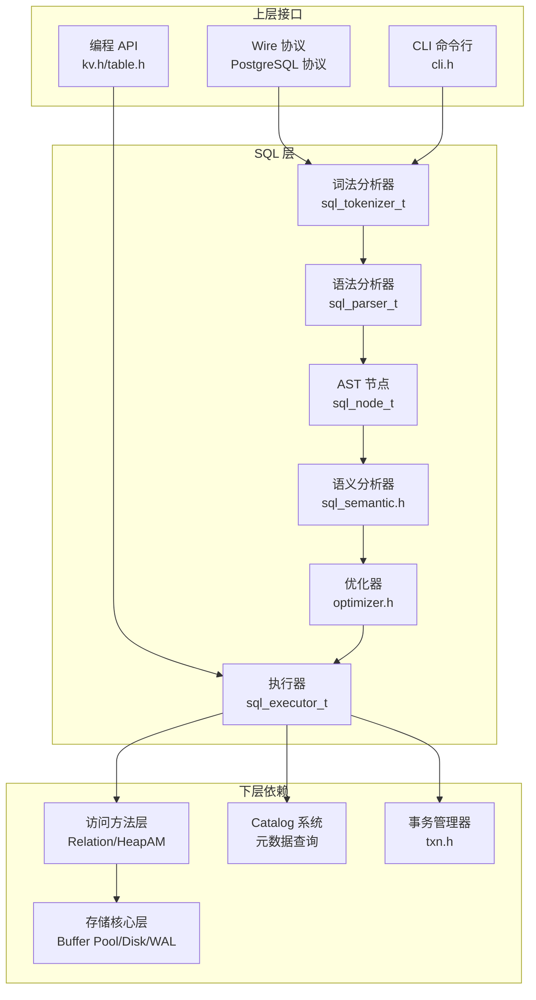

---

## 二、解析流程

### 2.1 完整处理管道

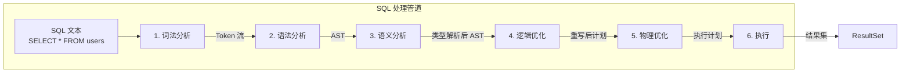

### 2.2 Token 类型

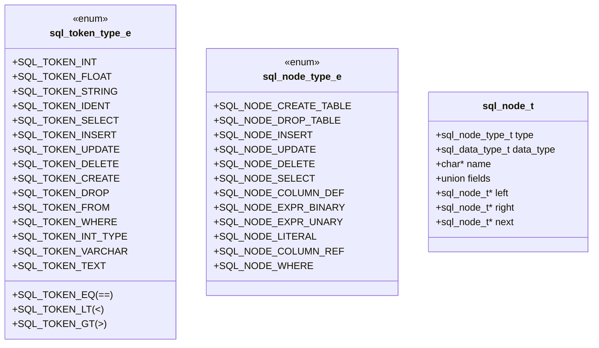

### 2.3 AST 结构示例

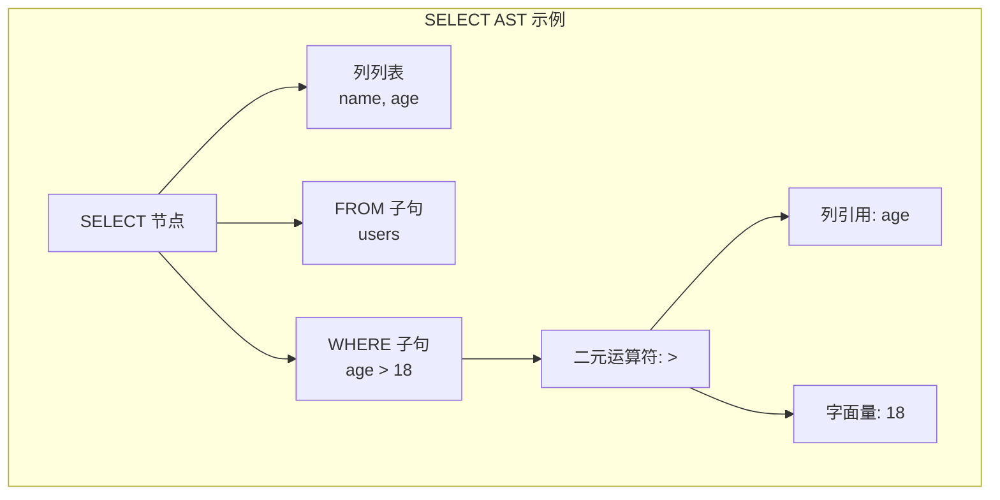

---

## 三、执行器架构

### 3.1 执行器结构

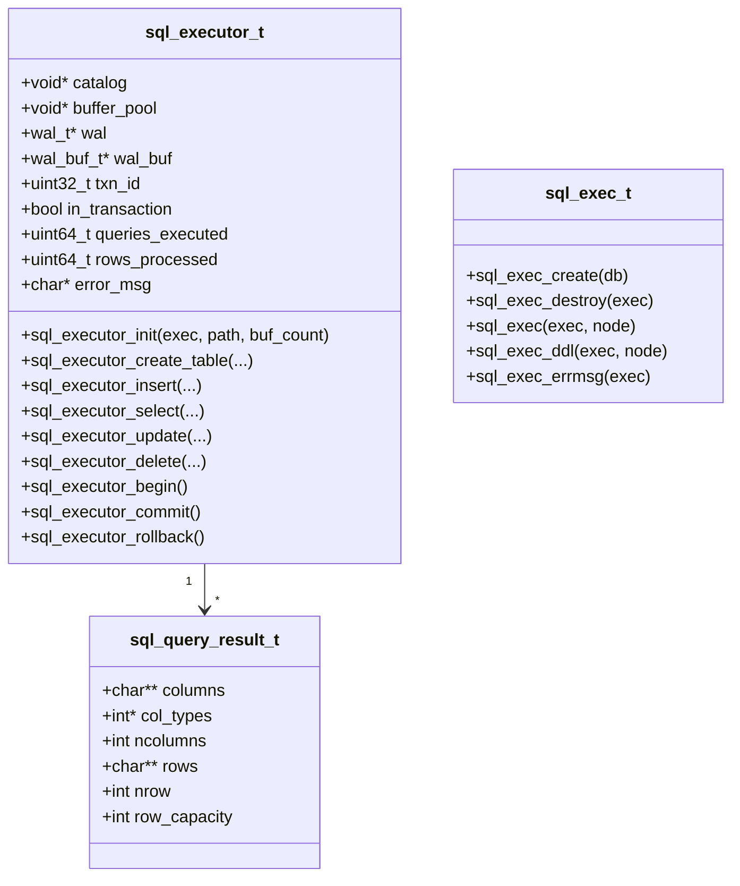

### 3.2 DDL 执行流程（CREATE TABLE）

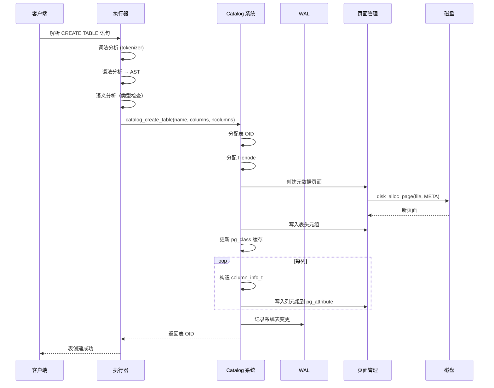

### 3.3 INSERT 执行流程

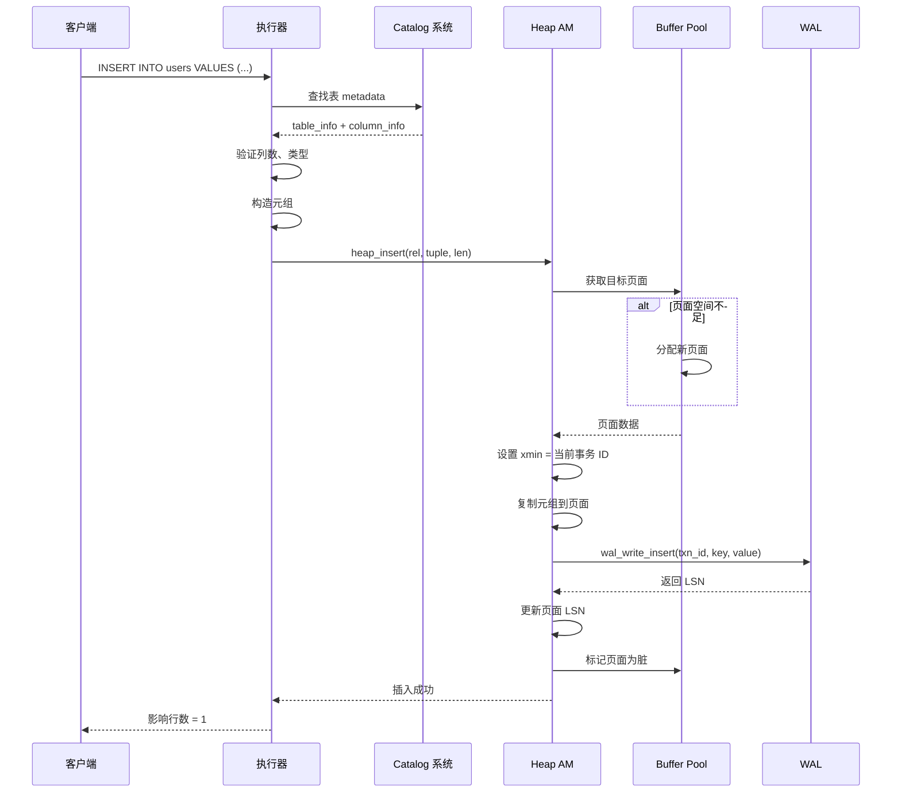

### 3.4 SELECT 执行流程

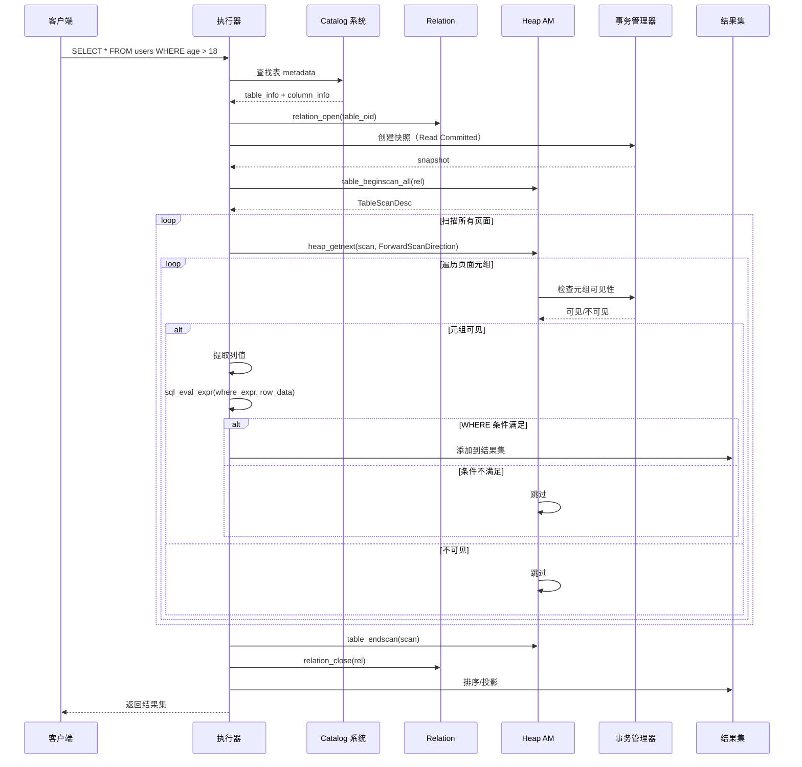

### 3.5 UPDATE 执行流程

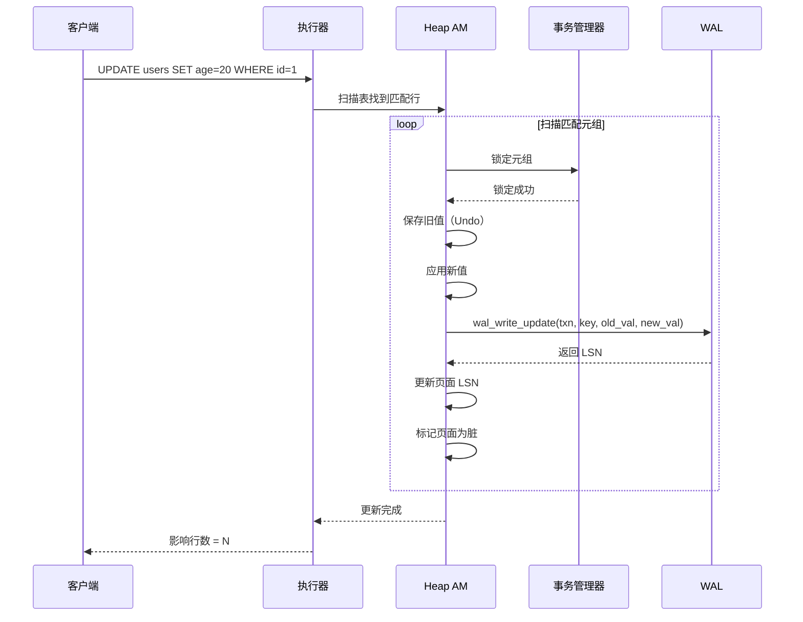

---

## 四、优化器

### 4.1 优化器结构

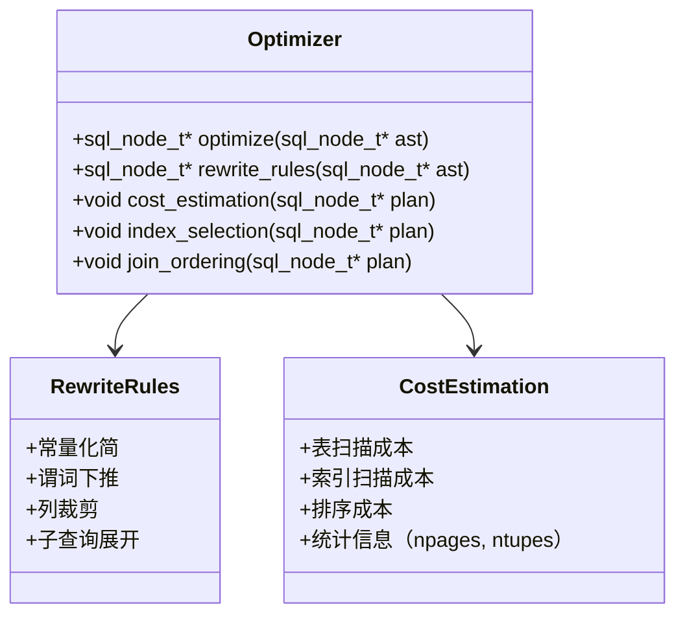

### 4.2 逻辑优化流程

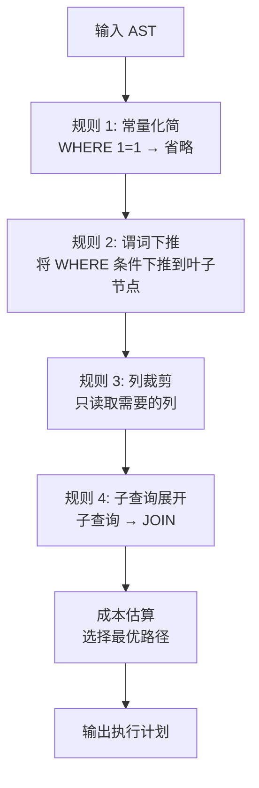

---

## 五、表达式求值

### 5.1 WHERE 条件求值

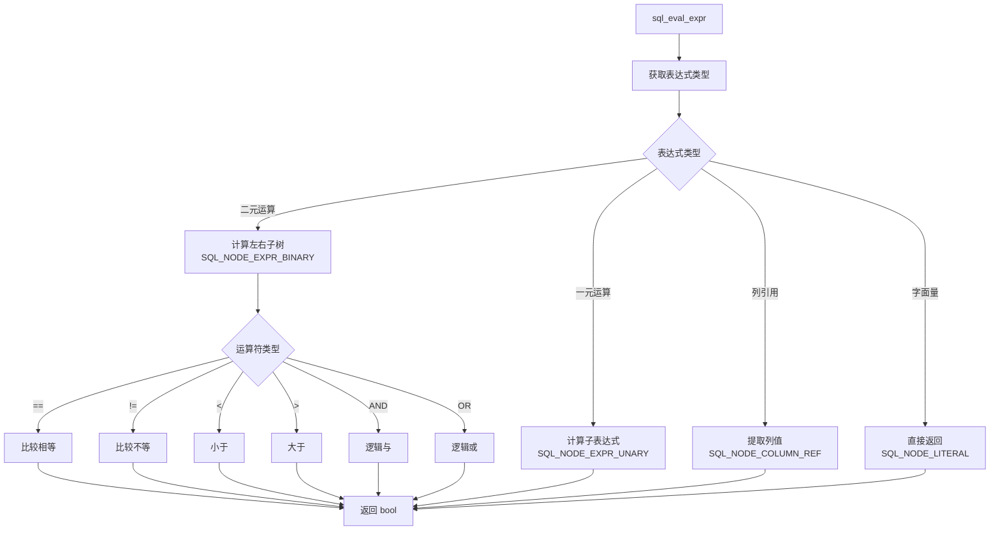

---

## 六、并发控制集成

### 6.1 事务内执行

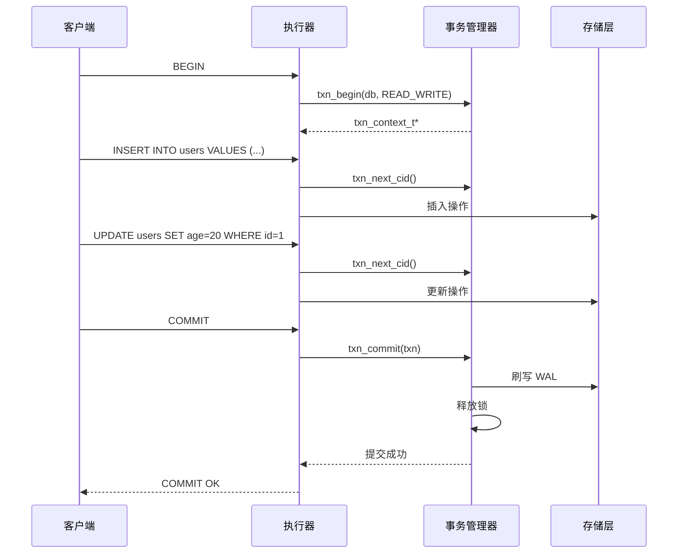

---

## 七、支持的 SQL 语句

| 类别 | 语句 | 说明 |
|------|------|------|
| **DDL** | `CREATE TABLE` | 创建表，支持列定义和主键 |
| | `DROP TABLE` | 删除表及其所有数据 |
| | `CREATE INDEX` | 创建索引 |
| | `DROP INDEX` | 删除索引 |
| **DML** | `INSERT INTO ... VALUES` | 插入数据 |
| | `UPDATE ... SET ... WHERE` | 更新数据 |
| | `DELETE FROM ... WHERE` | 删除数据 |
| | `SELECT ... FROM ... [WHERE ...]` | 查询数据 |
| **数据类型** | `INT`, `VARCHAR(n)`, `TEXT`, `BLOB` | 基本类型 |
| **表达式** | `=`, `!=`, `<`, `>`, `<=`, `>=` | 比较运算符 |
| | `AND`, `OR`, `NOT` | 逻辑运算符 |

---

## 八、关键代码位置

| 功能 | 头文件 | 源文件 |
|------|--------|--------|
| 词法分析 | `engineering/include/db/parser/sql/sql.h` | `engineering/src/db/parser/` |
| 语法分析 | `engineering/include/db/parser/sql/sql.h` | `engineering/src/db/parser/` |
| 语义分析 | `engineering/include/db/executor/sql/sql_semantic.h` | `engineering/src/db/executor/sql/` |
| 执行器 | `engineering/include/db/executor/sql/sql_executor.h` | `engineering/src/db/executor/sql/` |
| 优化器 | `engineering/include/db/optimizer/optimizer.h` | `engineering/src/db/optimizer/` |
| 表达式求值 | `engineering/include/db/executor/sql/sql_exec.h` | `engineering/src/db/executor/sql/` |