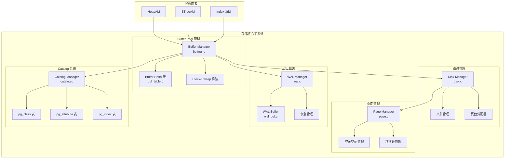

# 存储核心子系统 - 架构设计

## 概述

存储核心子系统是 db 数据库存储引擎的基础层，负责数据的持久化存储、内存缓存、日志管理和元数据管理。

---

## 一、子系统架构概览

---

## 二、模块清单

| 模块 | 核心文件 | 功能 |
|------|----------|------|
| **Buffer Pool** | `buf.h`, `bufmgr.c` | 页面缓存、Clock-Sweep 置换 |
| **Buffer Hash** | `buf_table.c` | page_id 到 buffer_id 的 Hash 映射 |
| **Disk Manager** | `disk.h`, `disk.c` | 文件读写、页面分配 |
| **Page Manager** | `page.h`, `page.c` | 页面结构、元组插入/读取 |
| **WAL Manager** | `wal.h`, `wal.c` | WAL 写入、检查点、恢复 |
| **WAL Buffer** | `wal_buf.h`, `wal_buf.c` | WAL 内存缓冲 |
| **Catalog** | `catalog.h`, `catalog.c` | 系统表管理、OID 分配 |

---

## 三、小特性索引

| 小特性 | 文档 | 说明 |
|--------|------|------|
| Buffer Pool 核心流程 | [buffer-pool.md](buffer-pool.md) | 页面获取、释放、置换 |
| Clock-Sweep 算法 | [clock-sweep.md](clock-sweep.md) | 页面置换策略 |
| 磁盘 I/O | [disk-io.md](disk-io.md) | 文件读写、页面分配 |
| 页面结构 | [page-structure.md](page-structure.md) | 页面布局、元组管理 |
| WAL 写入流程 | [wal-write.md](wal-write.md) | WAL 记录写入、刷写 |
| WAL 恢复流程 | [wal-recovery.md](wal-recovery.md) | 检查点回放、故障恢复 |
| Catalog 管理 | [catalog-mgmt.md](catalog-mgmt.md) | 系统表 CRUD、OID 分配 |

---

## 四、关键设计决策

### 4.1 Buffer Pool 设计

**决策**: 使用固定大小的 Buffer 数组 + Hash 表查找

**原因**:
- 固定数组便于内存管理和统计
- Hash 表提供 O(1) 的页面查找
- Clock-Sweep 算法平衡了访问频率和最近使用时间

### 4.2 WAL 设计

**决策**: WAL Buffer + 批量刷写

**原因**:
- 减少 fsync 调用次数，提高性能
- 支持组提交，多个事务共享一次刷写
- 保证 ACID 的 Durability 特性

### 4.3 Catalog 设计

**决策**: 内存缓存 + 磁盘持久化

**原因**:
- 频繁访问的元数据缓存在内存中
- 系统表变更记录 WAL，支持恢复
- Hash 表加速元数据查找

---

## 五、性能指标

| 指标 | 目标值 | 说明 |
|------|--------|------|
| Buffer Pool 命中率 | > 95% | 页面在缓存中的比例 |
| 页面获取延迟 | < 1ms | Buffer 命中时 |
| 页面获取延迟 | < 10ms | 需要从磁盘读取时 |
| WAL 刷写延迟 | < 5ms | fsync 调用 |
| 检查点间隔 | 5 分钟 | 平衡恢复时间和性能 |

---

## 六、相关代码位置

| 模块 | 头文件 | 源文件 |
|------|--------|--------|
| Buffer Pool | `engineering/include/db/buf.h` | `engineering/src/db/storage/buffer/` |
| Disk Manager | `engineering/include/db/disk.h` | `engineering/src/db/storage/kv/` |
| Page Manager | `engineering/include/db/page.h` | `engineering/src/db/storage/page/` |
| WAL | `engineering/include/db/wal.h` | `engineering/src/db/storage/wal/` |
| Catalog | `engineering/include/db/catalog.h` | `engineering/src/db/storage/catalog/` |
