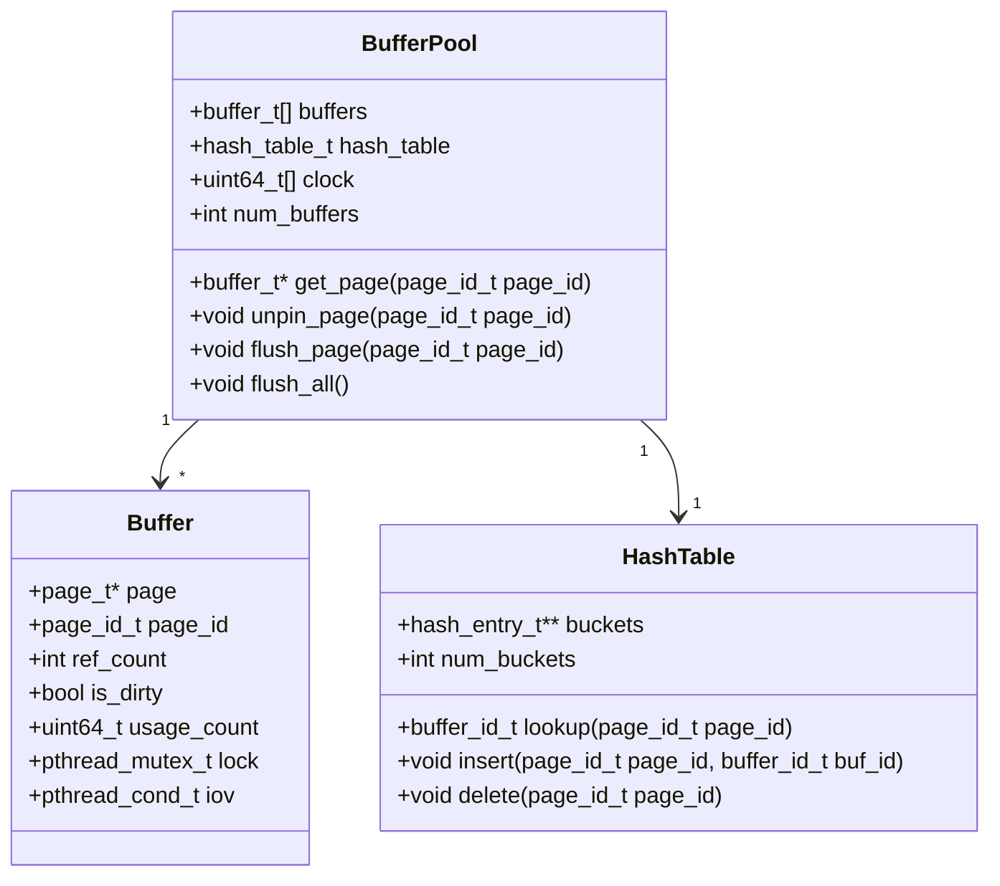
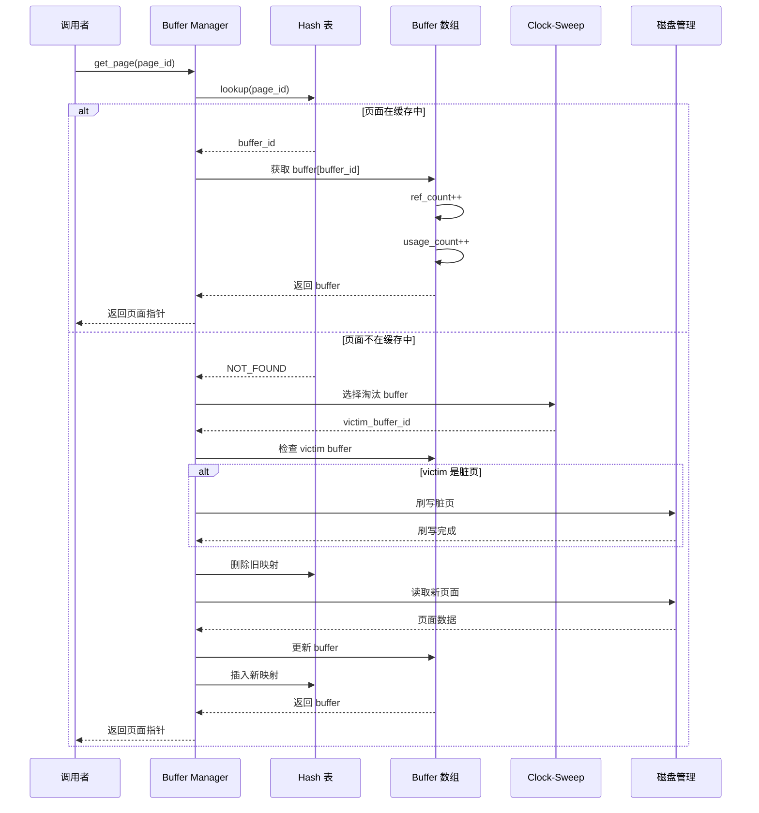
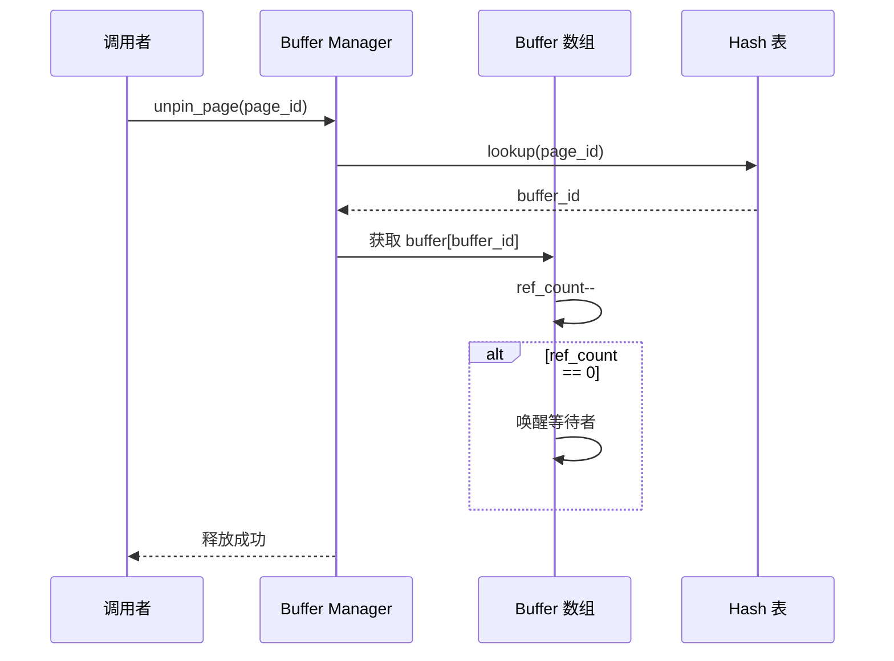
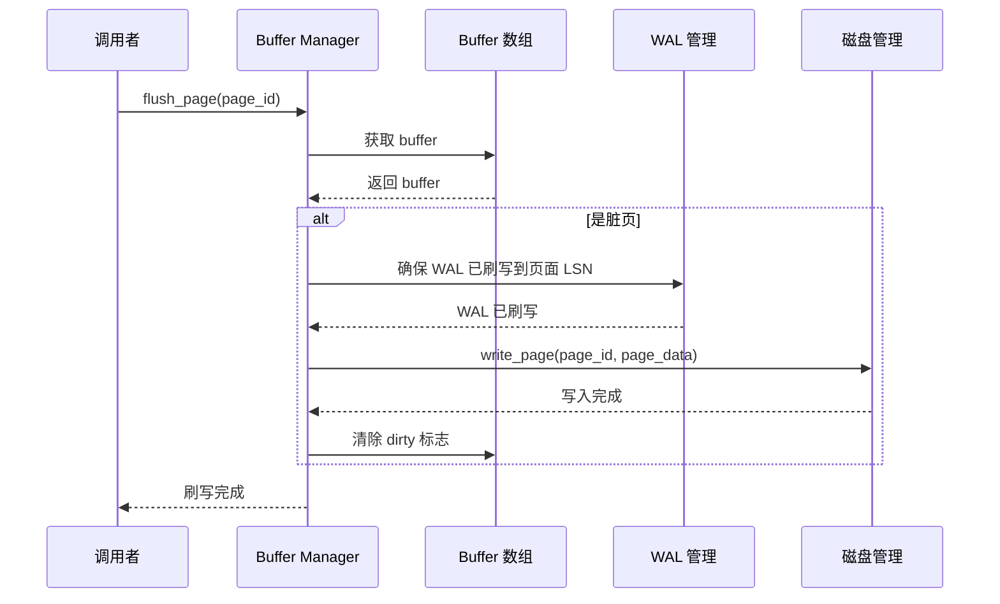
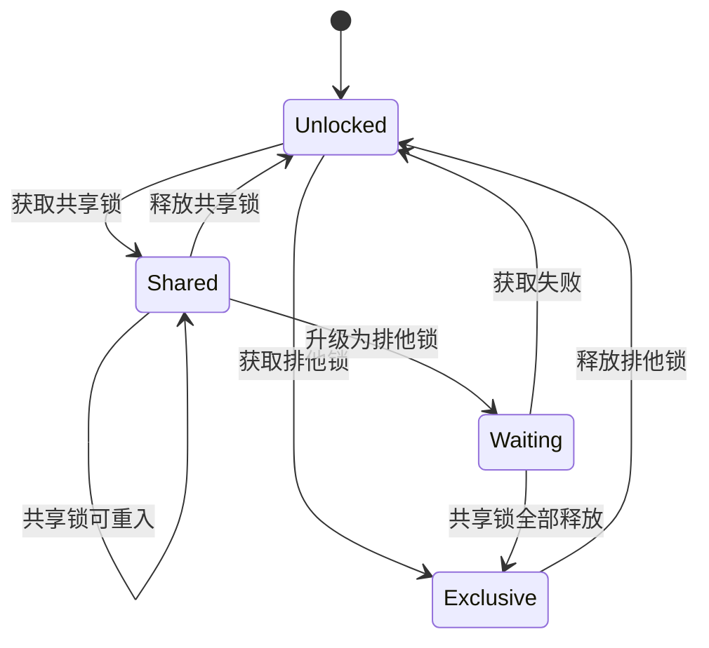
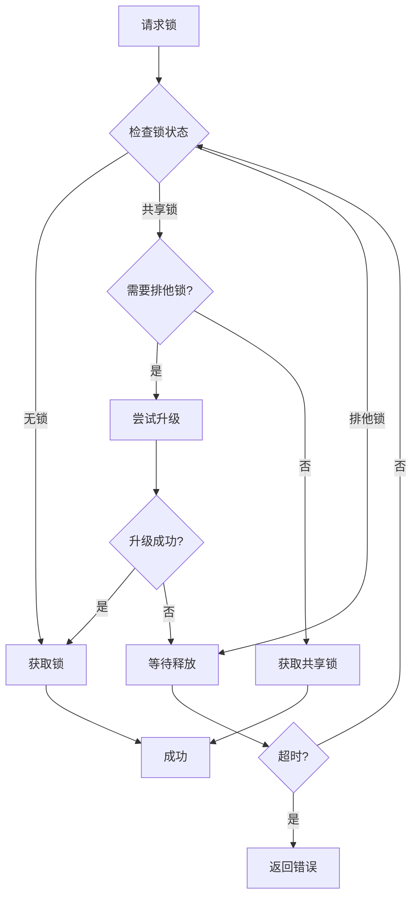
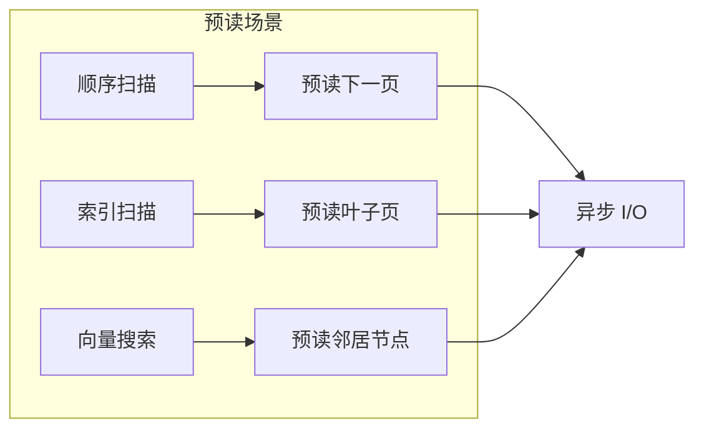
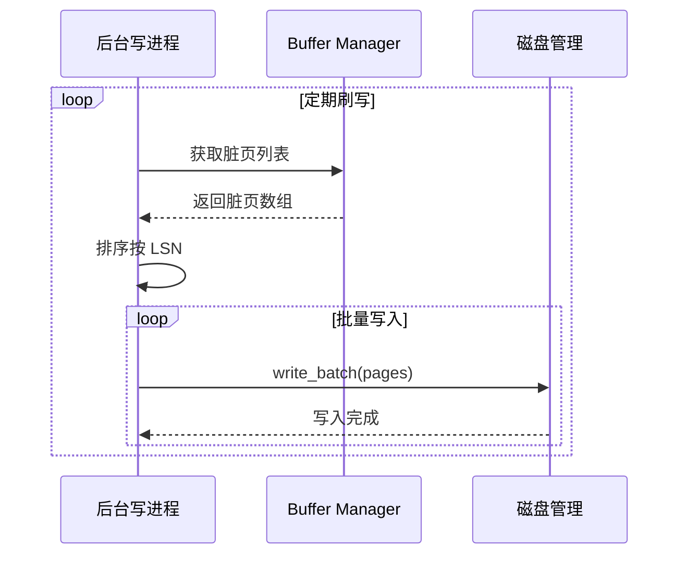

# Buffer Pool 核心流程

## 概述

本文档详细描述 Buffer Pool 的核心流程，包括页面获取、释放和置换。

---

## 一、Buffer Pool 结构图

---

## 二、页面获取流程

---

## 三、页面释放流程

---

## 四、脏页刷写流程

---

## 五、并发控制

### 5.1 Buffer 锁模型

### 5.2 死锁避免策略

---

## 六、性能优化点

### 6.1 预读策略

### 6.2 批量刷写

---

## 七、关键代码位置

| 功能 | 源文件 |
|------|--------|
| Buffer Pool 主逻辑 | `engineering/src/db/storage/buffer/bufmgr.c` |
| Hash 表实现 | `engineering/src/db/storage/buffer/buf_table.c` |
| Clock-Sweep 算法 | `engineering/src/db/storage/buffer/bufmgr.c` |
| 预读逻辑 | `engineering/src/db/storage/buffer/prefetch.c` |