# Catalog 管理

## 概述

本文档描述 Catalog 系统表的管理，包括系统表结构、CRUD 操作、缓存管理和 OID 分配。

---

## 一、系统表概览

### 1.1 核心系统表

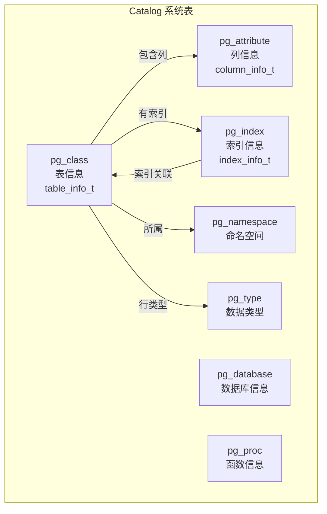

### 1.2 系统表关系

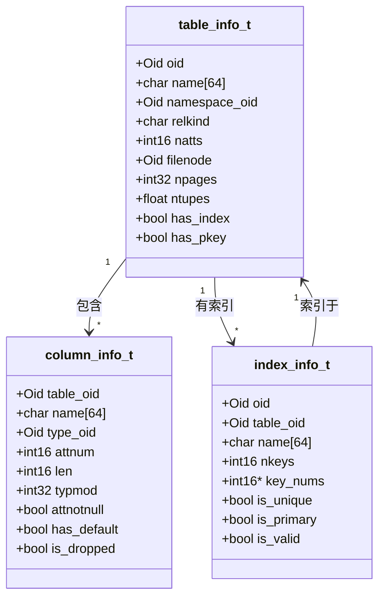

---

## 二、系统表存储

### 2.1 系统表物理存储

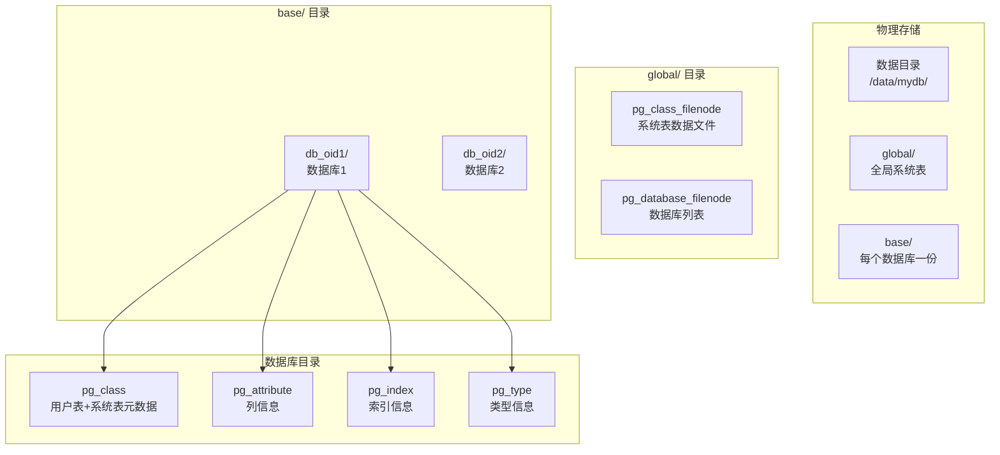

### 2.2 引导初始化

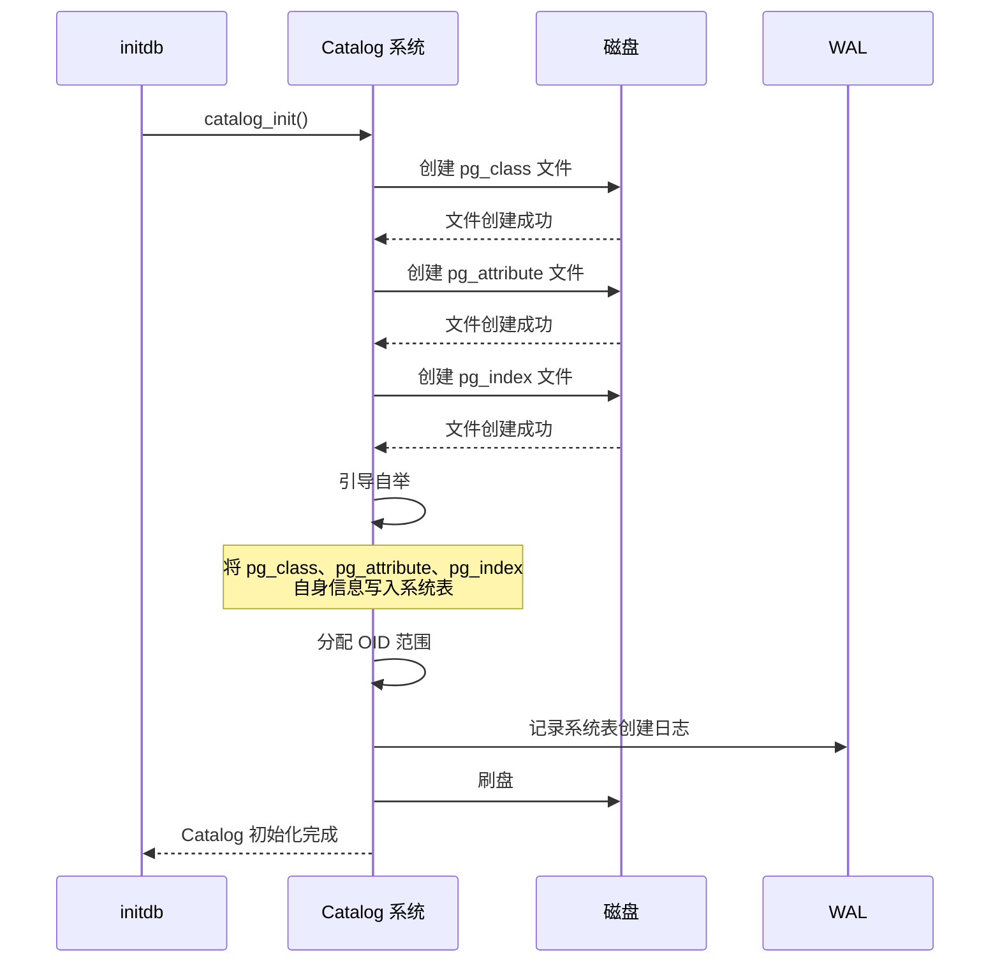

---

## 三、OID 分配

### 3.1 OID 分配策略

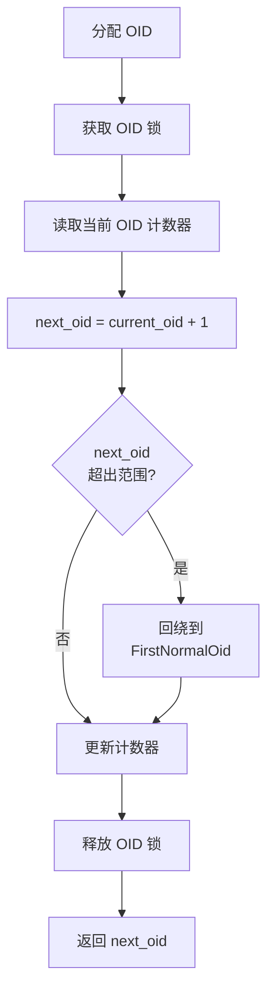

### 3.2 OID 命名空间

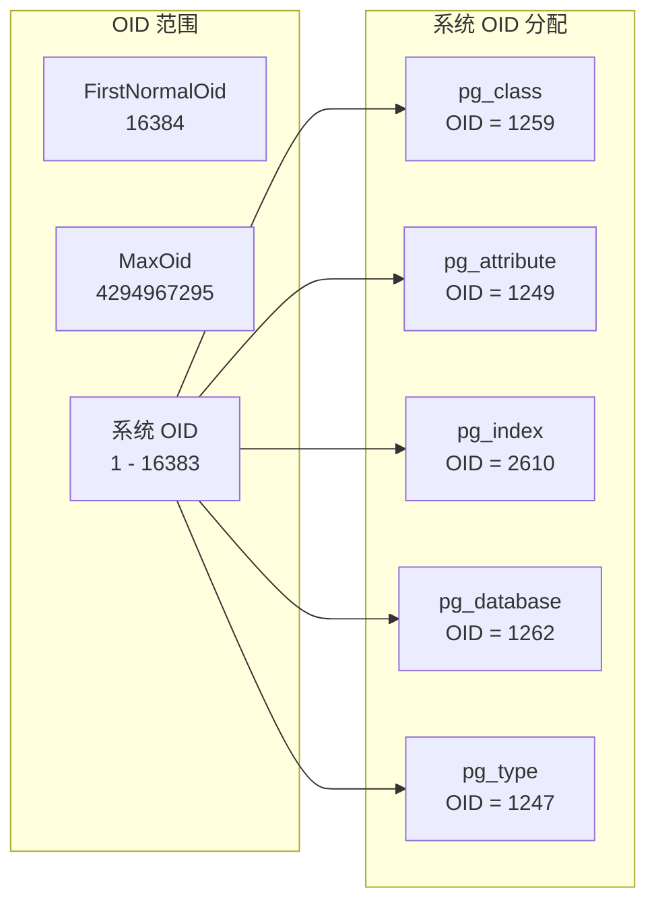

---

## 四、CRUD 操作流程

### 4.1 创建表

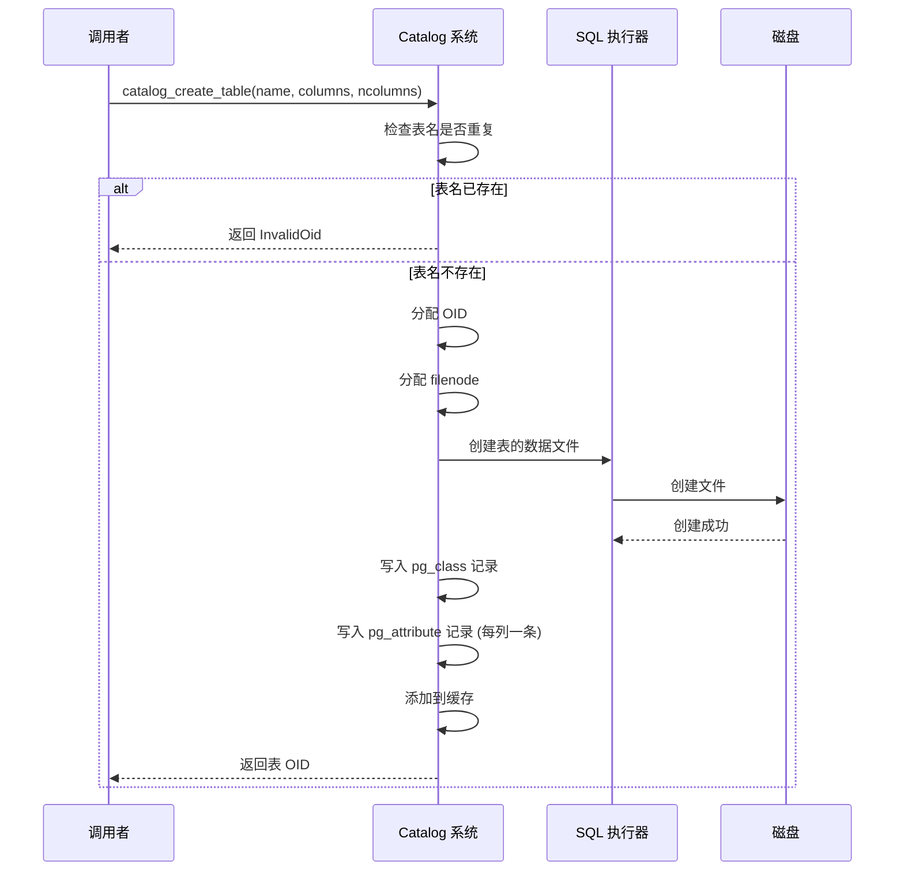

### 4.2 查找表

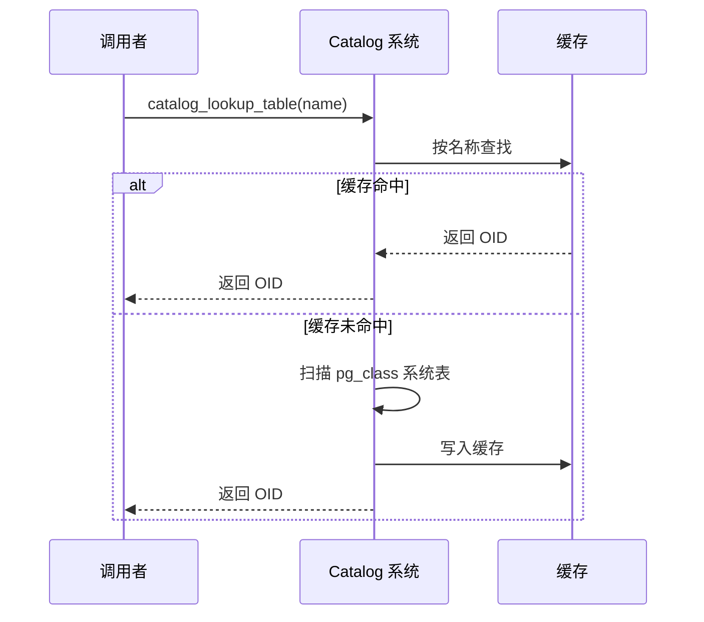

### 4.3 获取列信息

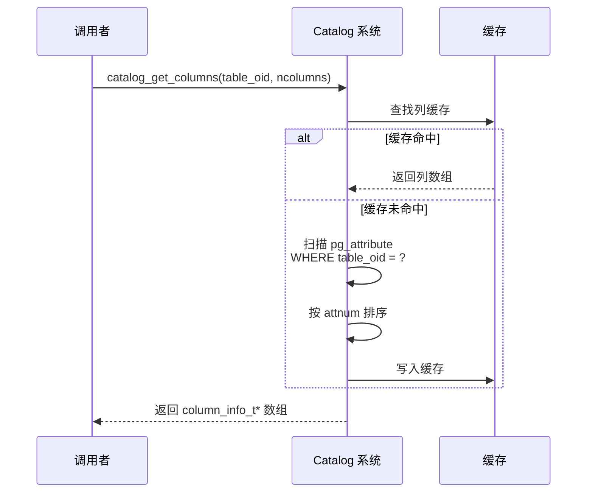

### 4.4 删除表

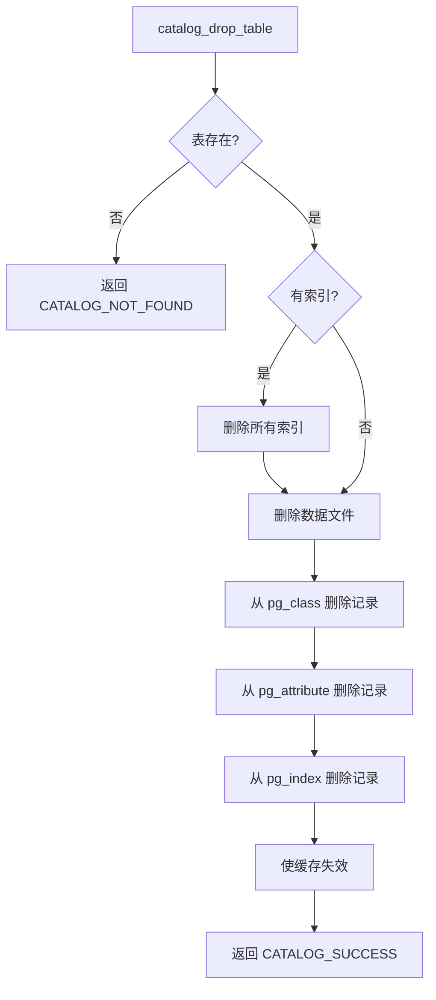

---

## 五、缓存管理

### 5.1 缓存结构

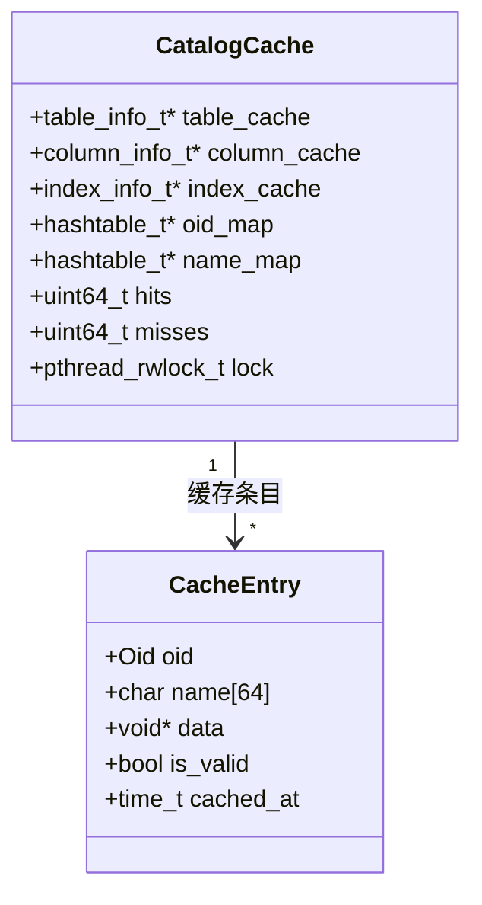

### 5.2 缓存失效策略

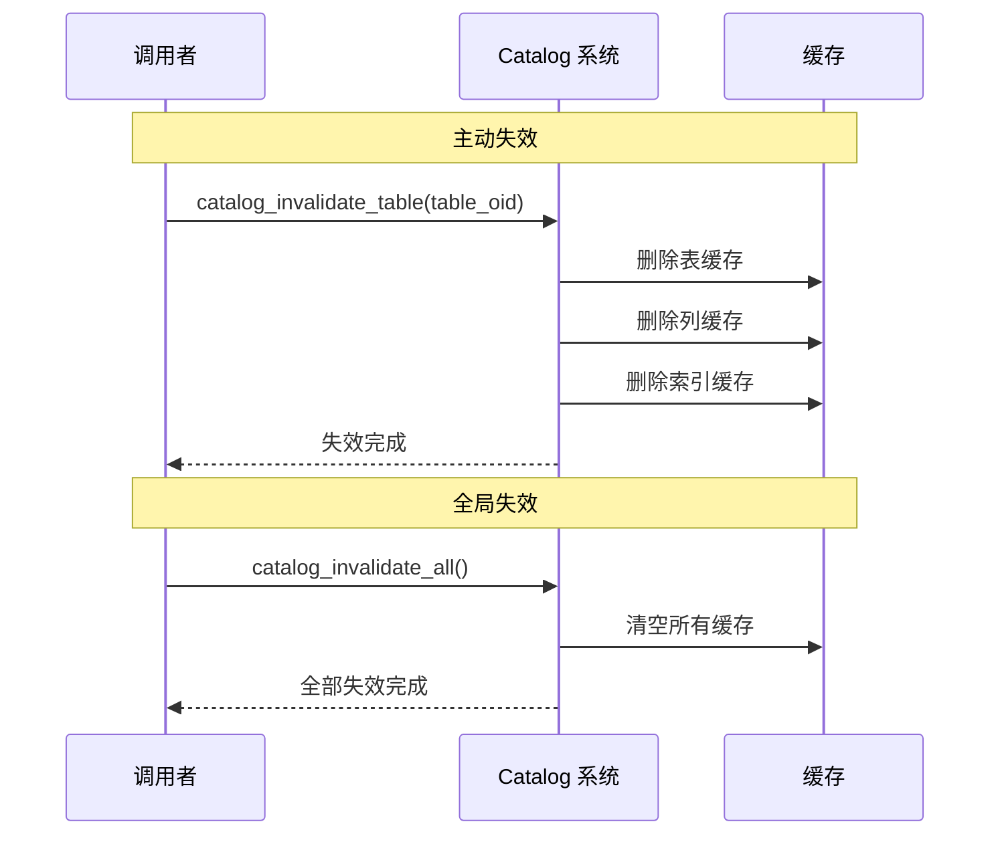

---

## 六、结果码

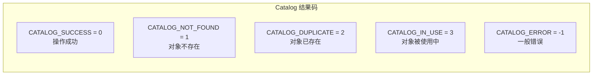

---

## 七、性能指标

| 指标 | 目标值 | 说明 |
|------|--------|------|
| 表查找 (按 OID) | O(1) | Hash 缓存 |
| 表查找 (按名称) | O(1) | Hash 缓存 |
| 列信息获取 | O(1) | 缓存命中 |
| 缓存命中率 | > 99% | 启动后稳定 |
| OID 分配 | O(1) | 原子递增 |
| 系统表插入 | < 1ms | 顺序追加 |

---

## 八、关键代码位置

| 功能 | 头文件 | 源文件 |
|------|--------|--------|
| Catalog 公共接口 | `engineering/include/db/catalog.h` | `engineering/src/db/storage/catalog/catalog.c` |
| 系统表定义 | `engineering/include/db/catalog.h` | `engineering/src/db/storage/catalog/catalog.c` |
| 缓存管理 | `engineering/include/db/catalog.h` | `engineering/src/db/storage/catalog/catalog.c` |
| OID 分配 | `engineering/include/db/catalog.h` | `engineering/src/db/storage/catalog/catalog.c` |