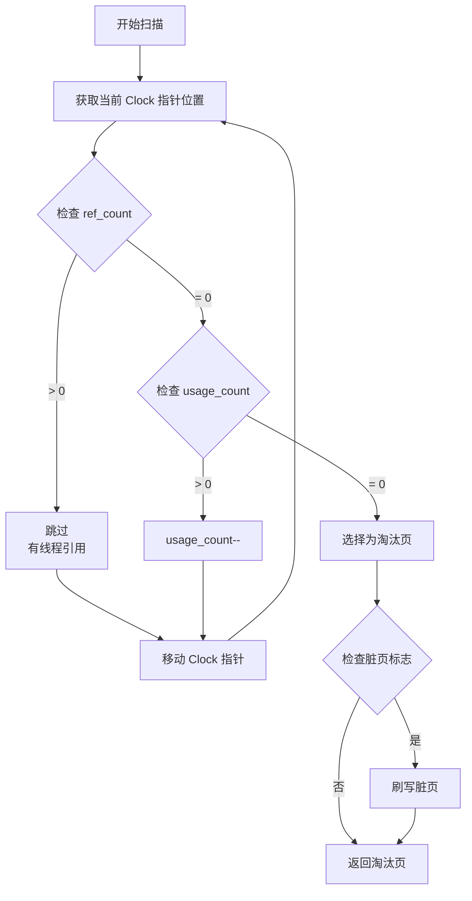
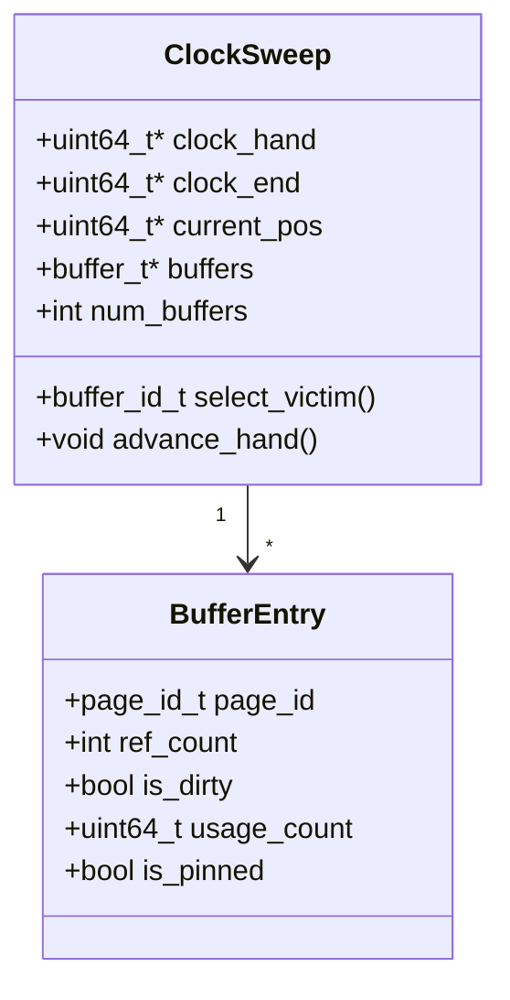
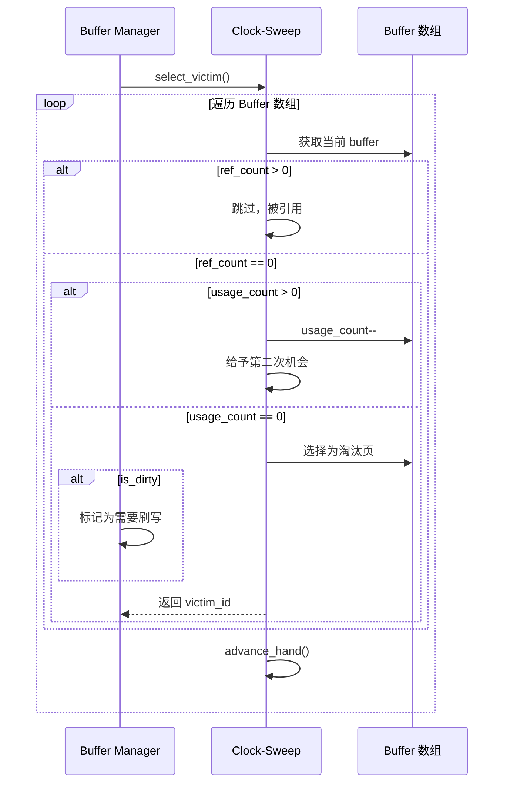

# Clock-Sweep 置换算法

## 概述

本文档详细描述 Buffer Pool 使用的 Clock-Sweep 页面置换算法。

---

## 一、算法原理



---

## 二、数据结构



---

## 三、算法流程详解

### 3.1 扫描过程



### 3.2 访问次数更新

```mermaid
flowchart TD
    Start[页面被访问] --> GetPage[get_page(page_id)]
    GetPage --> CheckHit{页面在缓存中?}

    CheckHit -->|是| UpdateRef[ref_count++]
    UpdateRef --> UpdateUsage[usage_count++]
    UpdateUsage --> ReturnPage[返回页面]

    CheckHit -->|否| LoadPage[从磁盘加载]
    LoadPage --> SetRef[ref_count = 1]
    SetRef --> SetUsage[usage_count = 1]
    SetUsage --> ReturnPage
```

---

## 四、与 FIFO/LRU 对比

| 算法 | 优点 | 缺点 | 适用场景 |
|------|------|------|----------|
| **FIFO** | 简单、开销小 | 不考虑访问频率 | 顺序访问模式 |
| **LRU** | 考虑最近访问 | 需要维护链表，开销大 | 局部性强的场景 |
| **Clock-Sweep** | 近似 LRU，开销小 | 不是精确 LRU | 通用场景，平衡性能 |

---

## 五、性能特征

```mermaid
flowchart LR
    subgraph "Clock-Sweep 性能指标"
        AVG_SCAN[平均扫描长度<br/>num_buffers / 2]
        HIT_RATE[命中率<br/>> 95%]
        OVERHEAD[每次扫描开销<br/>O(num_buffers)]
    end
```

---

## 六、关键代码位置

| 功能 | 源文件 |
|------|--------|
| Clock-Sweep 实现 | `engineering/src/db/storage/buffer/bufmgr.c` |
| Buffer 管理 | `engineering/include/db/buf.h` |