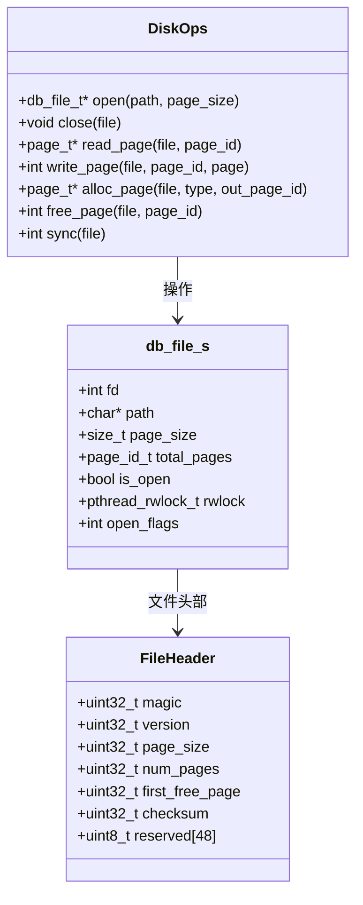
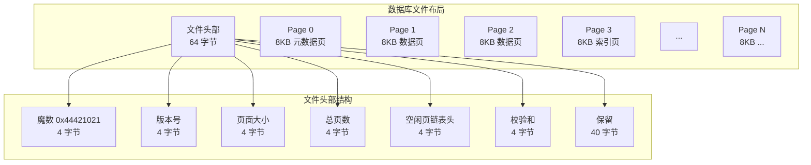
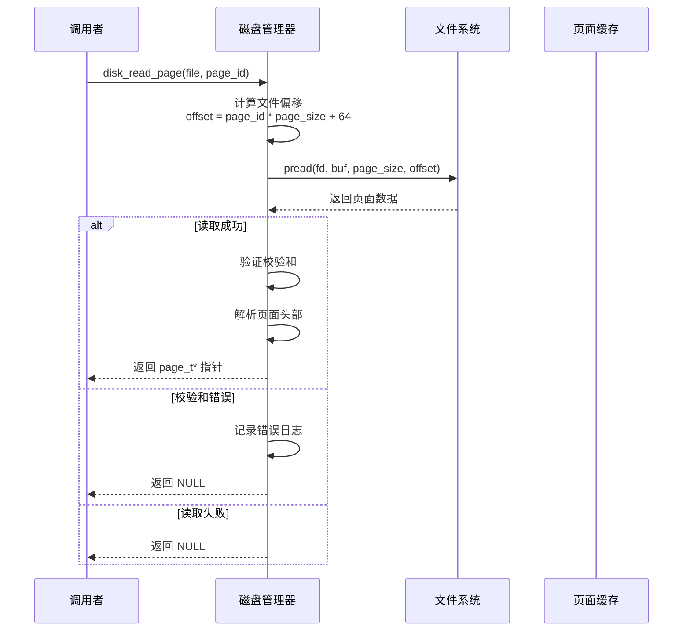
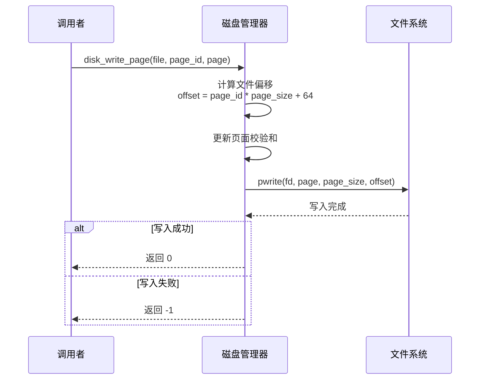
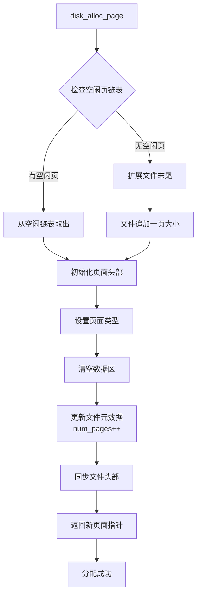
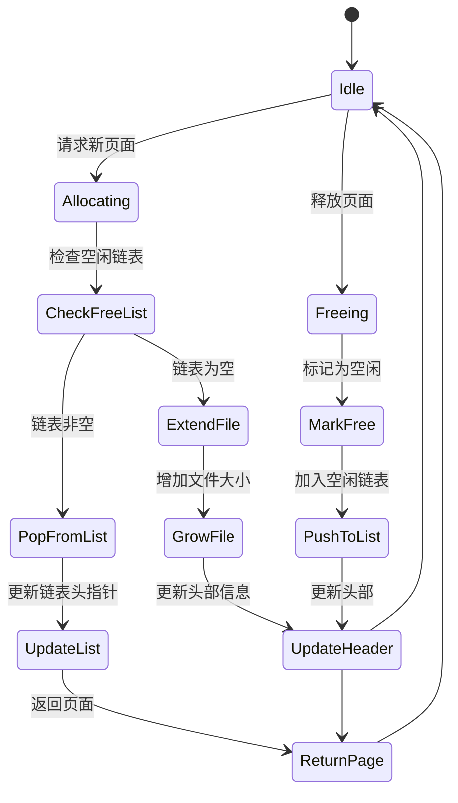
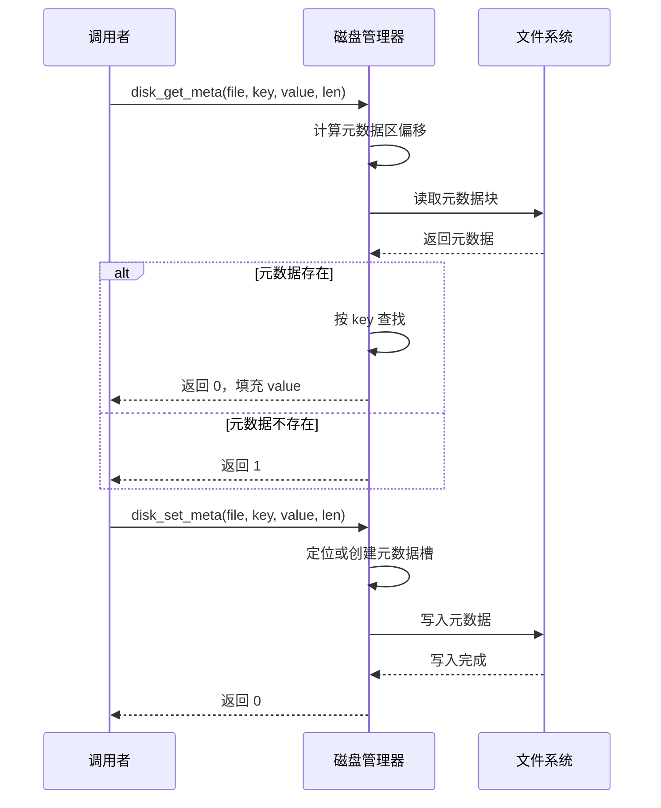
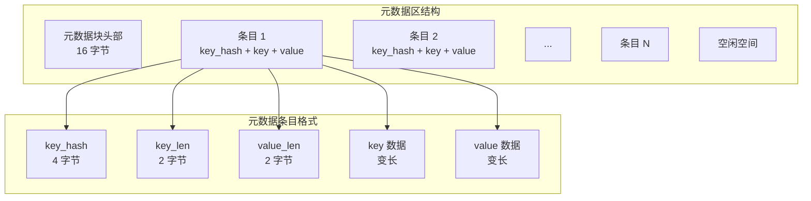
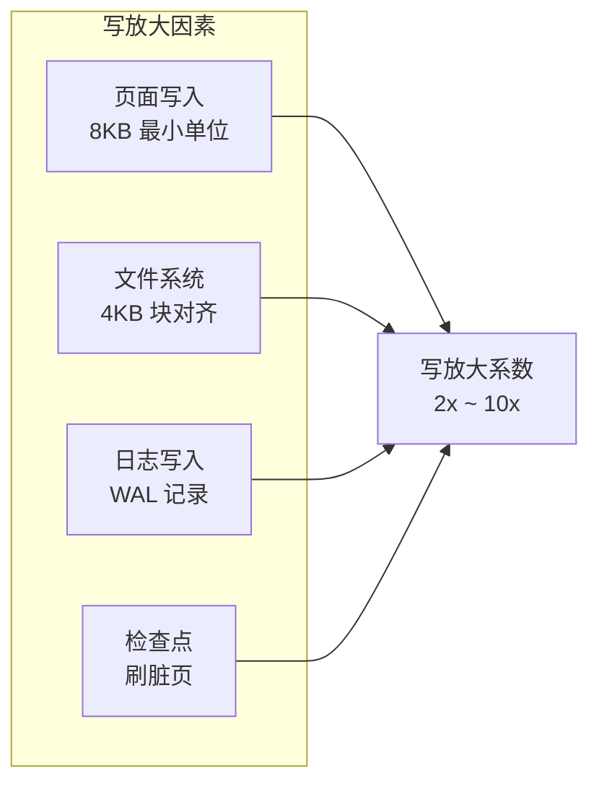
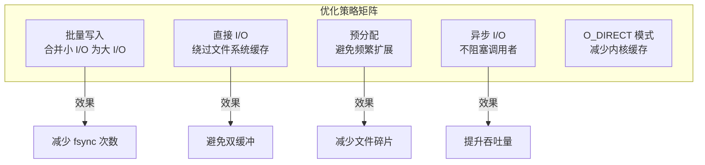

# 磁盘 I/O 管理

## 概述

本文档描述数据库存储引擎的磁盘 I/O 子系统，负责底层文件读写、页面分配和元数据管理。

---

## 一、磁盘管理器结构

### 1.1 核心结构

### 1.2 文件布局

---

## 二、读写流程

### 2.1 页面读取

### 2.2 页面写入

### 2.3 页面分配

---

## 三、空闲空间管理

### 3.1 空闲页链表

### 3.2 分配与释放

---

## 四、元数据操作

### 4.1 元数据读写

### 4.2 元数据存储格式

---

## 五、写放大与优化

### 5.1 写放大问题

### 5.2 优化策略

---

## 六、性能指标

| 指标 | 目标值 | 说明 |
|------|--------|------|
| 顺序读取吞吐 | > 500 MB/s | SSD 上 |
| 随机读取延迟 | < 100 μs | 页面命中文件系统缓存 |
| 随机写入延迟 | < 500 μs | 页面写入 |
| 写入放大系数 | < 3x | 不含 WAL |
| 空闲页分配 | O(1) | 从空闲链表头取出 |
| 文件扩展 | O(1) 均摊 | 预分配减少频繁扩展 |

---

## 七、关键代码位置

| 功能 | 头文件 | 源文件 |
|------|--------|--------|
| 磁盘 I/O 主接口 | `engineering/include/db/disk.h` | `engineering/src/db/storage/kv/disk.c` |
| 空闲页面管理 | `engineering/include/db/disk.h` | `engineering/src/db/storage/kv/disk.c` |
| 元数据读写 | `engineering/include/db/disk.h` | `engineering/src/db/storage/kv/disk.c` |