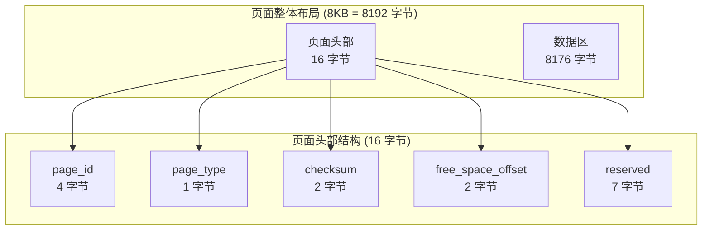
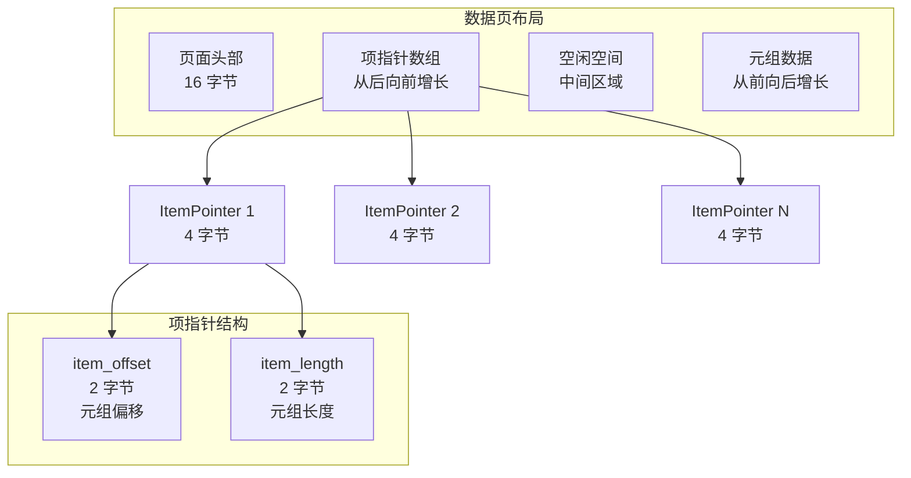
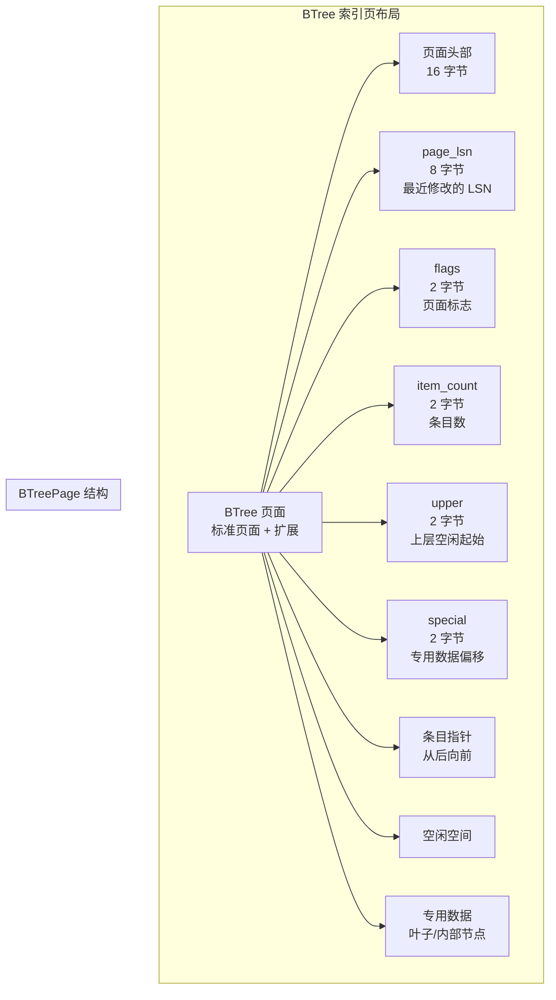
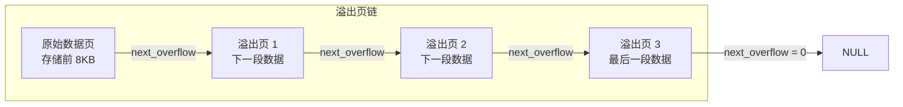
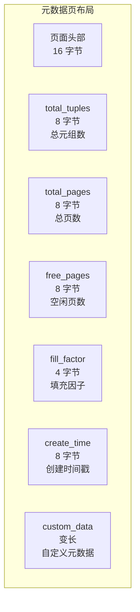
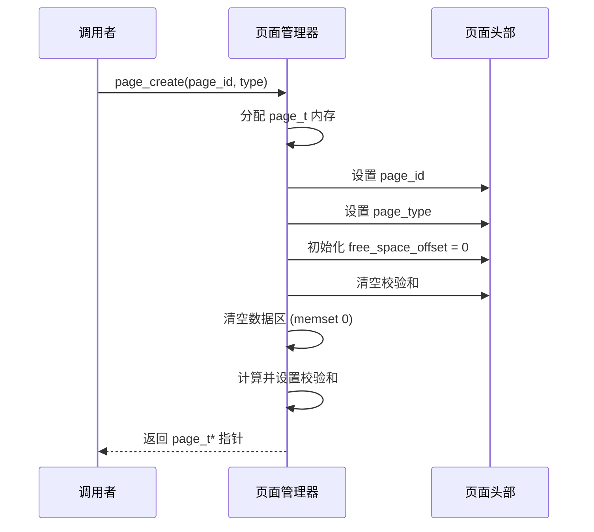
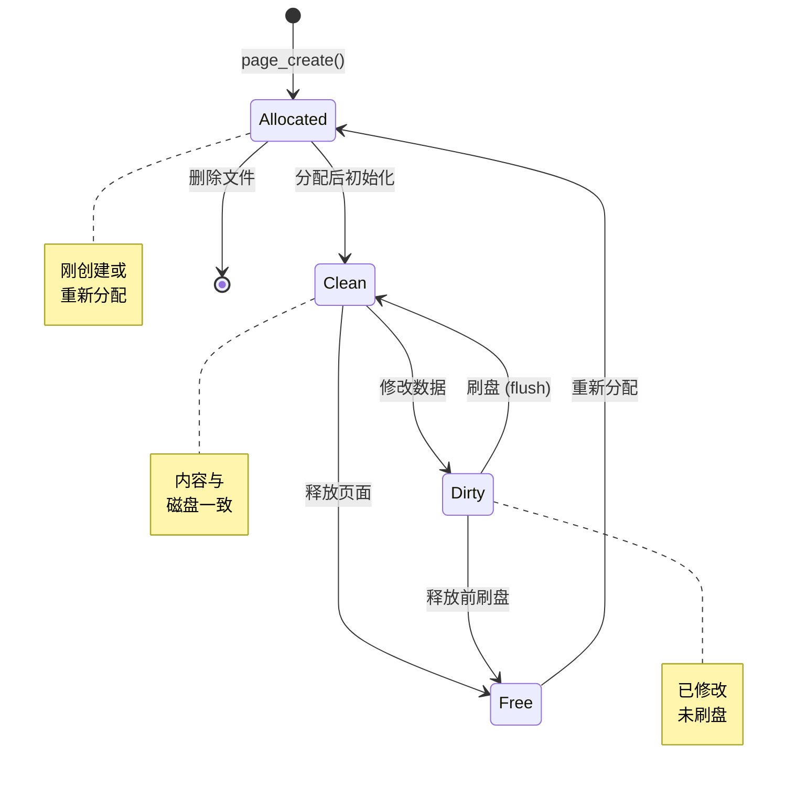

# 页面结构

## 概述

本文档描述数据库存储引擎的页面结构，页面是存储的基本单位，默认大小为 8KB。

---

## 一、页面布局

### 1.1 整体结构



### 1.2 页面类型


---

## 二、页面类型详解

### 2.1 数据页 (DATA)



### 2.2 索引页 (INDEX)



### 2.3 溢出页 (OVERFLOW)



### 2.4 元数据页 (META)



---

## 三、页面操作流程

### 3.1 页面创建



### 3.2 空间分配

```mermaid
flowchart TD
    Start[page_alloc_space(page, size)] --> Align[对齐 size 到 4 字节]

    Align --> Check{检查空闲空间<br/>PAGE_DATA_SIZE - free_off >= size?}

    Check -->|足够| Alloc[current_off = free_off<br/>free_off += size]
    Check -->|不足| Fail[返回 (uint16_t)-1]

    Alloc --> Return[current_off]

    Fail --> Return
```

### 3.3 校验和计算

```mermaid
flowchart TD
    Start[page_set_checksum(page)] --> Calc[使用 CRC16 计算<br/>头部 + 数据区]

    Calc --> Hash[计算校验和值]
    Hash --> Store[写入 header.checksum]
    Store --> Done[完成]

    Start2[page_verify_checksum(page)] --> Read[读取 header.checksum]
    Read --> Recalc[重新计算校验和]
    Recalc --> Compare{比较}

    Compare -->|相等| Valid[返回 true]
    Compare -->|不等| Invalid[返回 false]
```

---

## 四、页面生命周期



---

## 五、页面操作 API

| 函数 | 功能 | 复杂度 |
|------|------|--------|
| `page_create()` | 创建新页面 | O(1) |
| `page_free()` | 释放页面 | O(1) |
| `page_get_free_space()` | 获取空闲空间 | O(1) |
| `page_get_used_space()` | 获取已用空间 | O(1) |
| `page_alloc_space()` | 分配空间 | O(1) |
| `page_set_checksum()` | 设置校验和 | O(n) |
| `page_verify_checksum()` | 验证校验和 | O(n) |
| `page_write_data()` | 写入数据 | O(1) |
| `page_read_data()` | 读取数据 | O(1) |

---

## 六、关键代码位置

| 功能 | 头文件 | 源文件 |
|------|--------|--------|
| 页面结构定义 | `engineering/include/db/page.h` | - |
| 页面操作实现 | `engineering/include/db/page.h` | `engineering/src/db/storage/page/page.c` |
| 项指针管理 | `engineering/include/db/page.h` | `engineering/src/db/storage/page/page.c` |
| 校验和计算 | `engineering/include/db/page.h` | `engineering/src/db/storage/page/page.c` |