# WAL 恢复流程

## 概述

本文档描述 WAL 的恢复流程，包括崩溃恢复算法、redo/undo 过程和检查点回放。

---

## 一、恢复策略概览

### 1.1 恢复三阶段

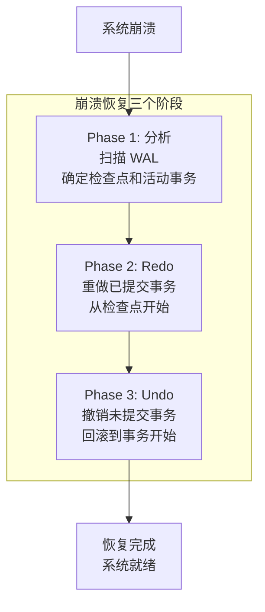

### 1.2 恢复入口点

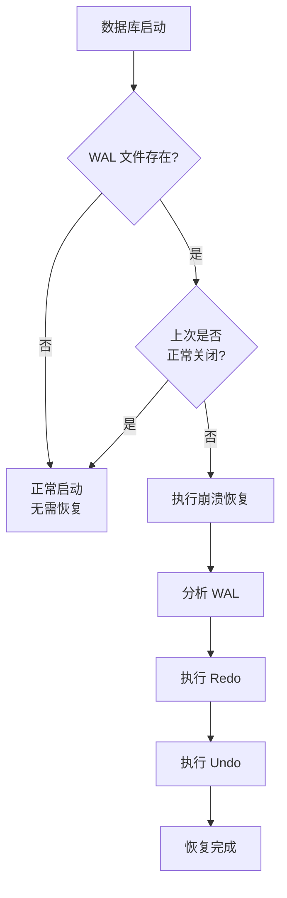

---

## 二、分析阶段 (Analyze)

### 2.1 分析流程

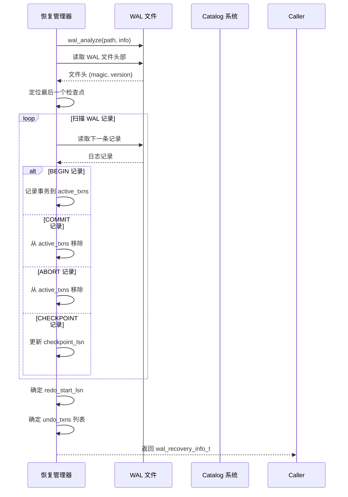

### 2.2 确定 Redo 起点

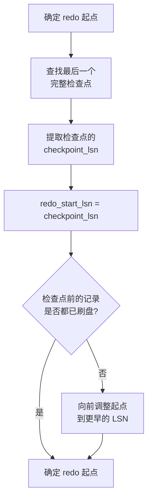

---

## 三、Redo 阶段

### 3.1 Redo 执行流程

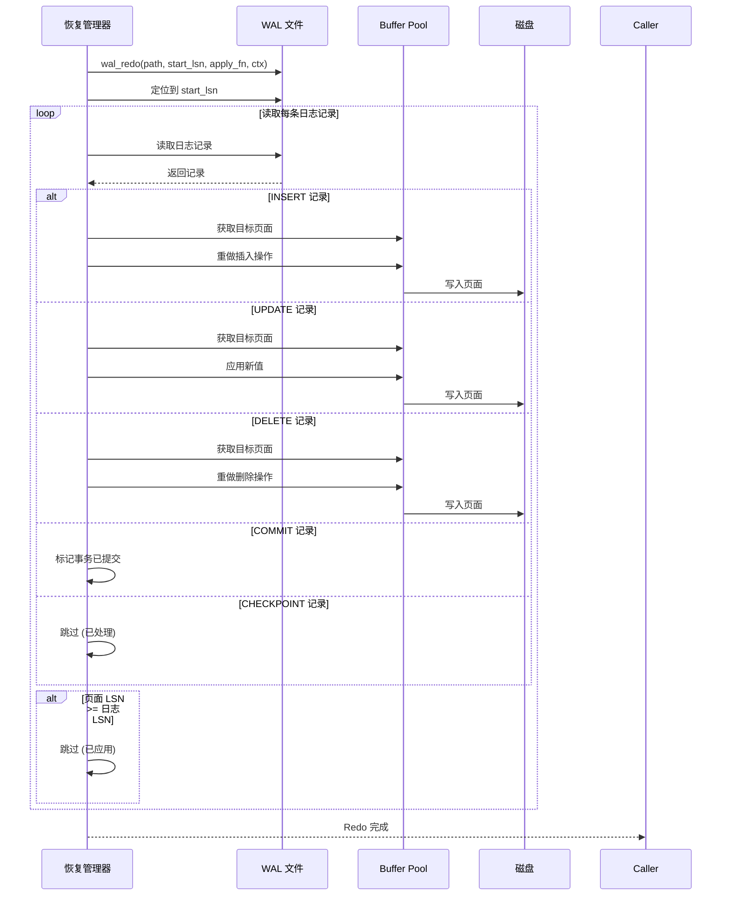

### 3.2 Redo 幂等性

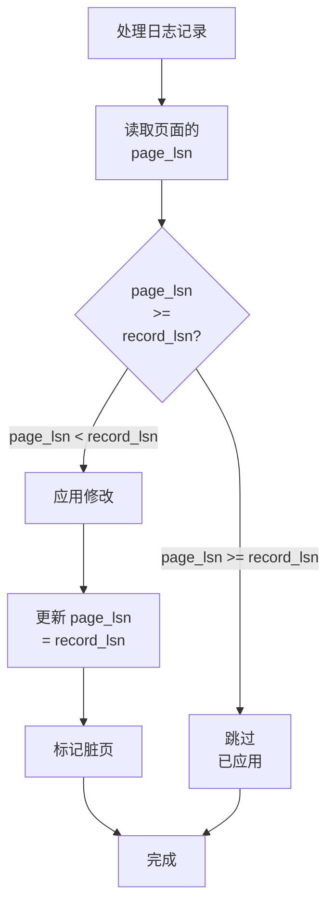

---

## 四、Undo 阶段

### 4.1 Undo 执行流程

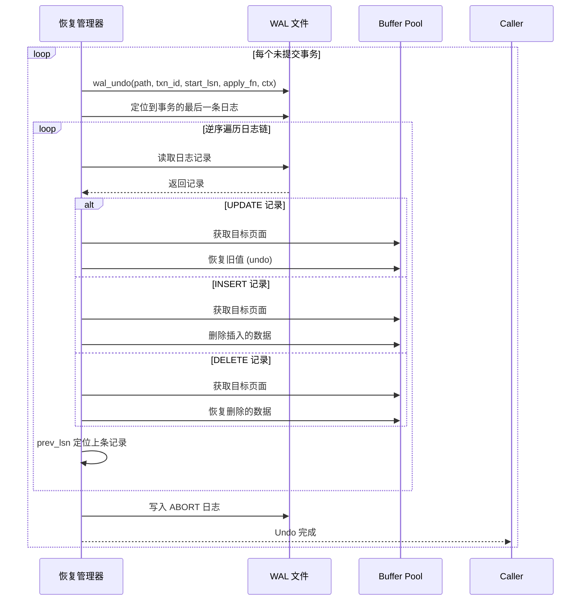

### 4.2 逆序撤销

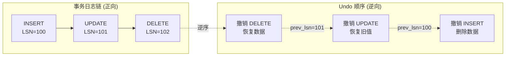

---

## 五、检查点回放

### 5.1 检查点记录结构

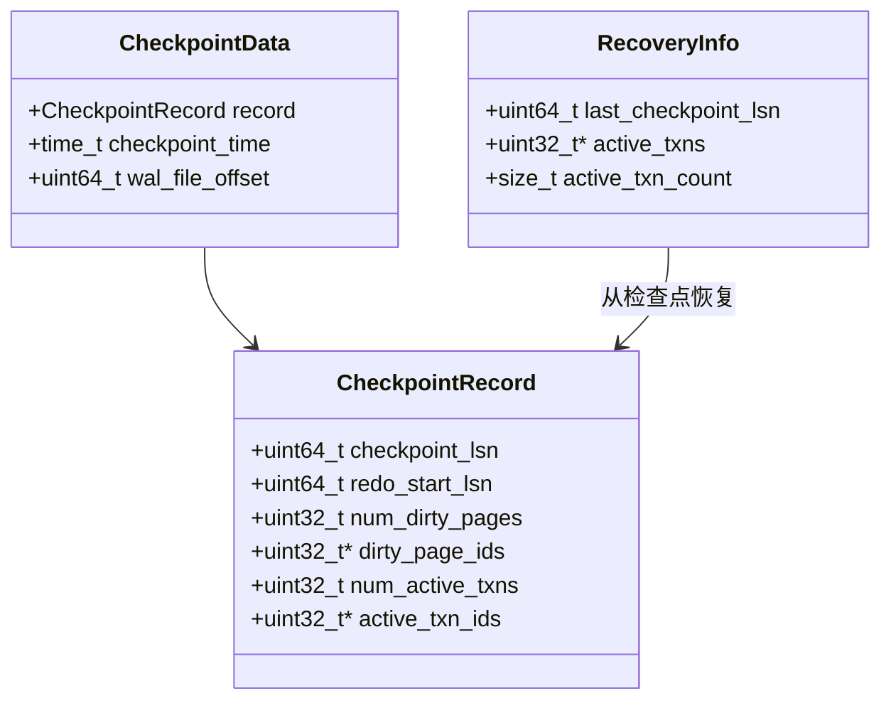

### 5.2 检查点回放流程

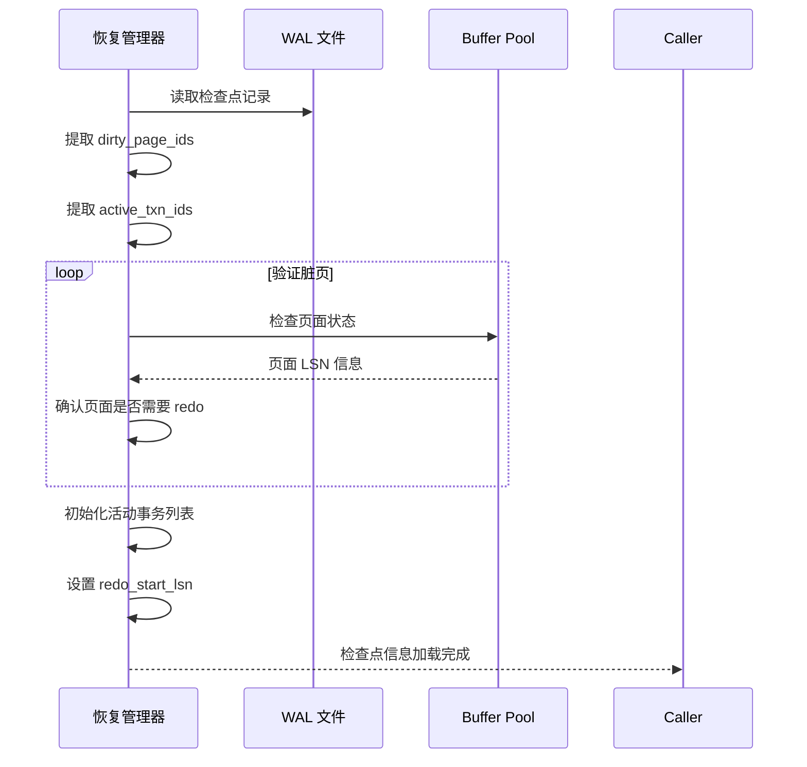

---

## 六、恢复状态机

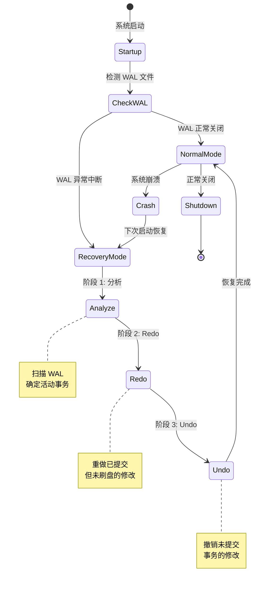

---

## 七、恢复性能指标

| 指标 | 目标值 | 说明 |
|------|--------|------|
| 恢复时间目标 (RTO) | < 30 秒 | 从崩溃到可用 |
| 恢复点目标 (RPO) | 0 (不丢数据) | 同步提交模式 |
| WAL 分析速度 | > 100 MB/s | 扫描 WAL 文件 |
| Redo 速度 | > 50 MB/s | 重做日志记录 |
| 检查点间隔 | 5 分钟 | 控制恢复时间 |

---

## 八、关键代码位置

| 功能 | 头文件 | 源文件 |
|------|--------|--------|
| WAL 恢复主接口 | `engineering/include/db/wal.h` | `engineering/src/db/storage/wal/wal.c` |
| 恢复分析 | `engineering/include/db/wal.h` | `engineering/src/db/storage/wal/wal.c` |
| Redo 执行 | `engineering/include/db/wal.h` | `engineering/src/db/storage/wal/wal.c` |
| Undo 执行 | `engineering/include/db/wal.h` | `engineering/src/db/storage/wal/wal.c` |
| WAL-Buffer 协调恢复 | `engineering/include/db/wal_buf.h` | `engineering/src/db/storage/wal/wal_buf.c` |