# WAL 写入流程

## 概述

本文档描述 WAL (Write-Ahead Logging) 的写入流程，包括日志记录格式、写入路径、刷盘策略和检查点机制。

---

## 一、WAL 文件结构

### 1.1 整体布局

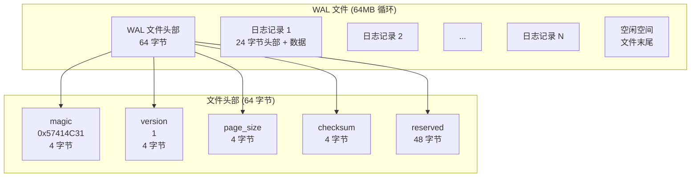

### 1.2 日志记录格式

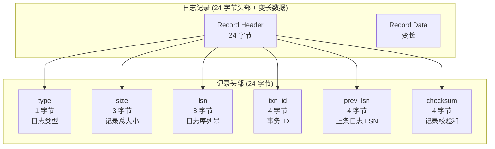

---

## 二、日志类型

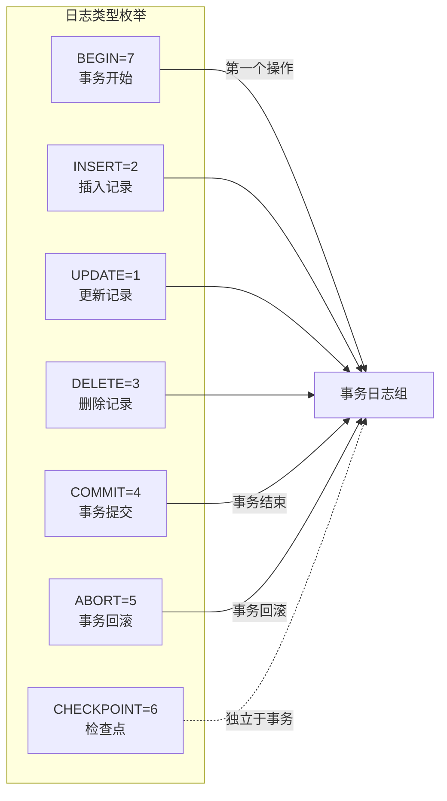

---

## 三、写入流程

### 3.1 完整写入路径

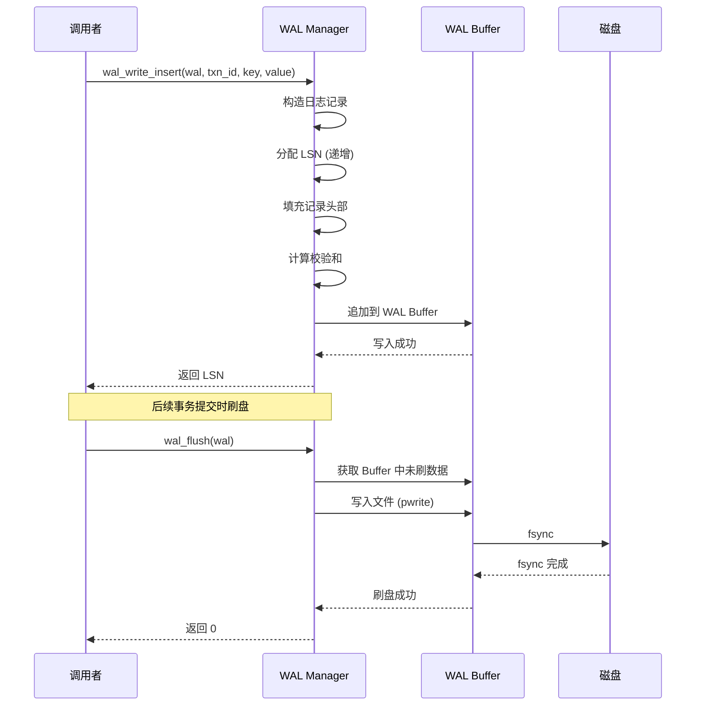

### 3.2 组提交流程

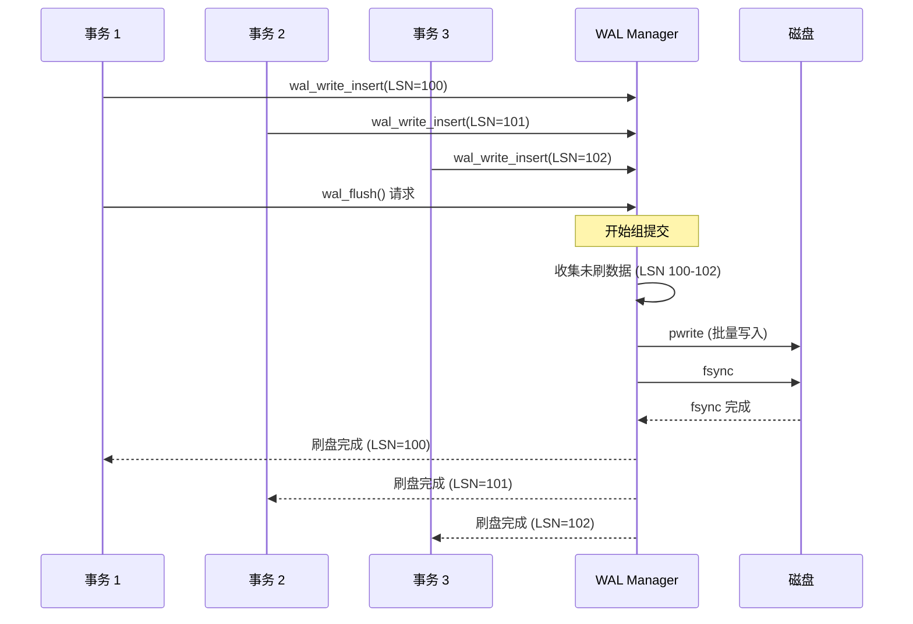

---

## 四、事务日志示例

### 4.1 完整事务日志链

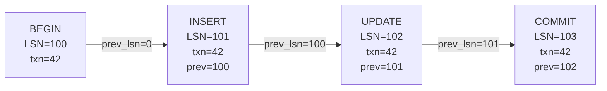

### 4.2 并发事务日志交错

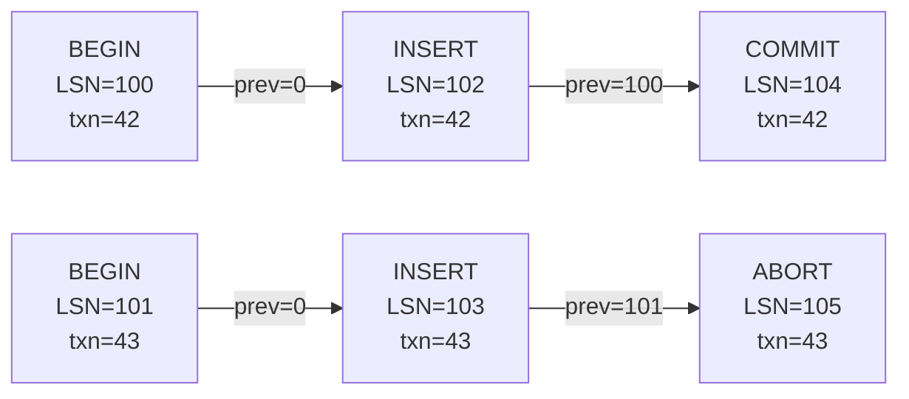

---

## 五、检查点机制

### 5.1 检查点触发条件

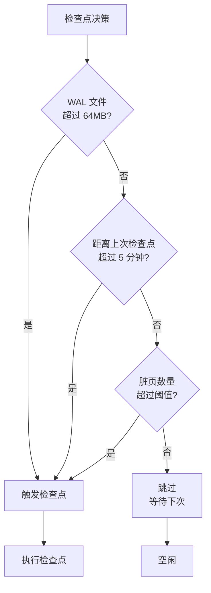

### 5.2 检查点执行流程

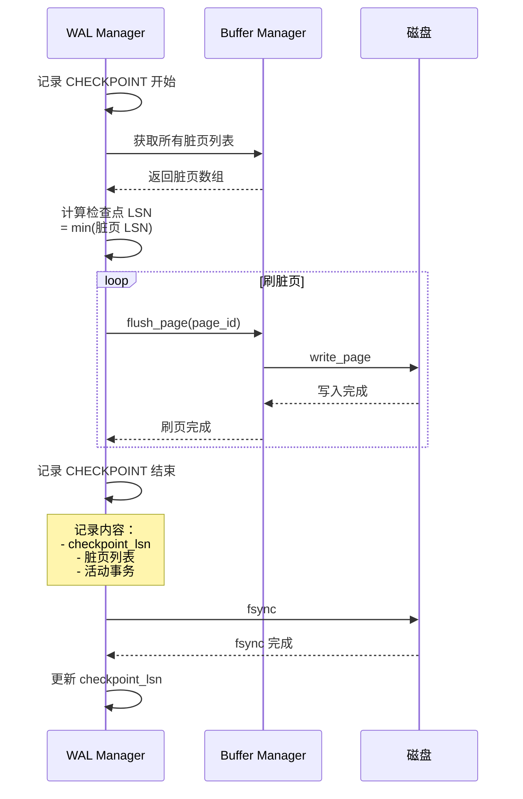

---

## 六、WAL Buffer 管理

### 6.1 Buffer 结构

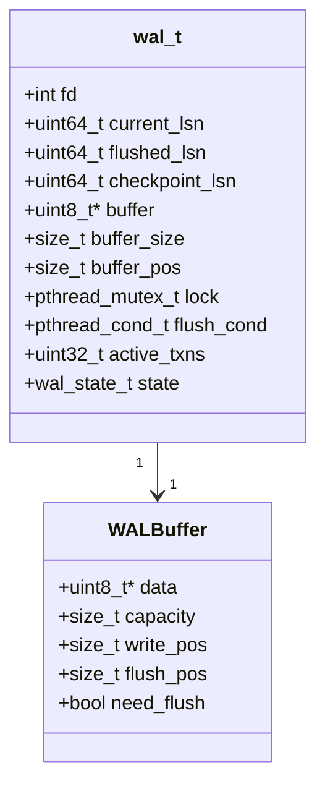

### 6.2 Buffer 状态机

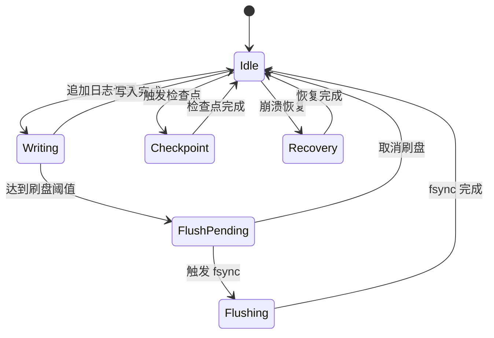

---

## 七、性能优化

### 7.1 批量写入

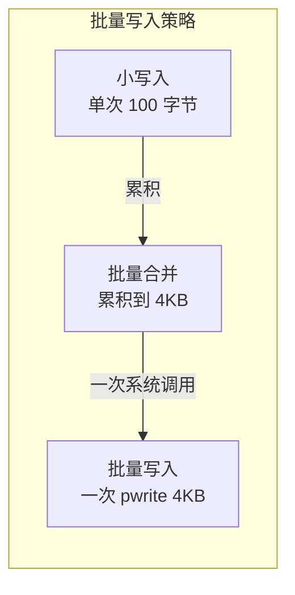

### 7.2 延迟刷盘

| 策略 | 说明 | 优势 | 风险 |
|------|------|------|------|
| **同步提交** | 每次 COMMIT 都 fsync | 最大可靠性 | 性能差 |
| **异步提交** | 延迟 fsync (默认 200ms) | 性能好 | 崩溃丢数据 |
| **组提交** | 多个事务共享一次 fsync | 平衡性能与可靠性 | 实现复杂 |

---

## 八、关键代码位置

| 功能 | 头文件 | 源文件 |
|------|--------|--------|
| WAL 主接口 | `engineering/include/db/wal.h` | `engineering/src/db/storage/wal/wal.c` |
| WAL Buffer | `engineering/include/db/wal_buf.h` | `engineering/src/db/storage/wal/wal_buf.c` |
| 日志记录写入 | `engineering/include/db/wal.h` | `engineering/src/db/storage/wal/wal.c` |
| 检查点 | `engineering/include/db/wal.h` | `engineering/src/db/storage/wal/wal.c` |
| 组提交 | `engineering/include/db/wal_buf.h` | `engineering/src/db/storage/wal/wal_buf.c` |