# 事务与并发子系统 - 架构设计

## 概述

事务与并发子系统负责管理数据库事务的 ACID 属性，包括事务生命周期、锁管理、MVCC 多版本并发控制、死锁检测和 VACUUM 垃圾回收。

---

## 一、子系统架构概览

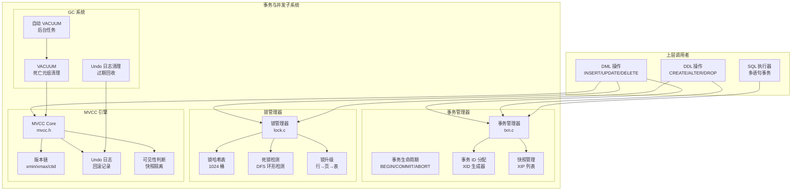

---

## 二、事务管理器

### 2.1 事务核心结构

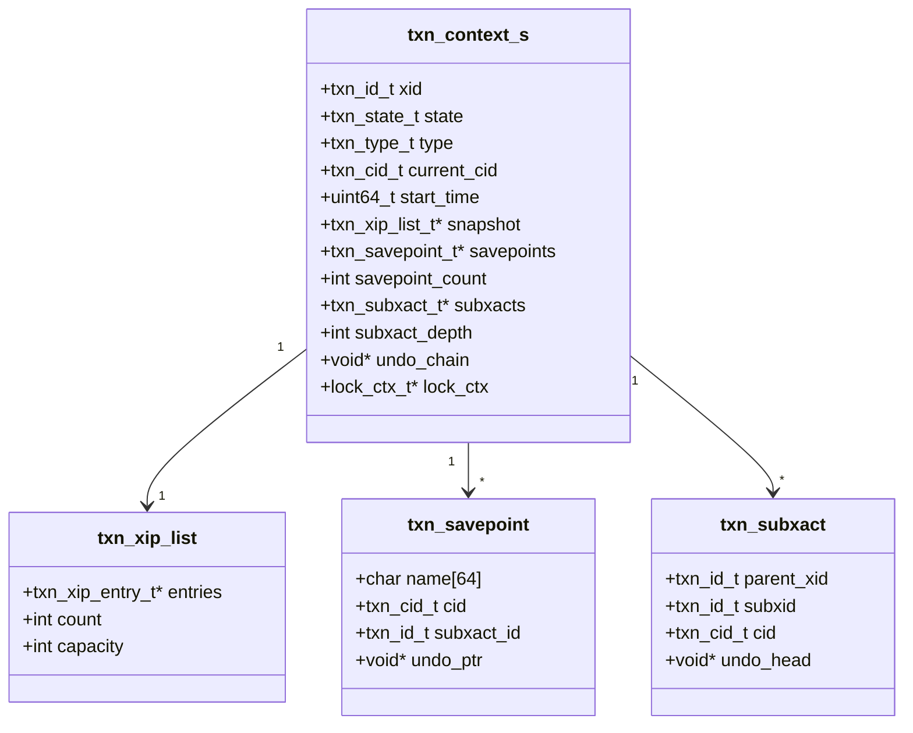

### 2.2 事务状态机

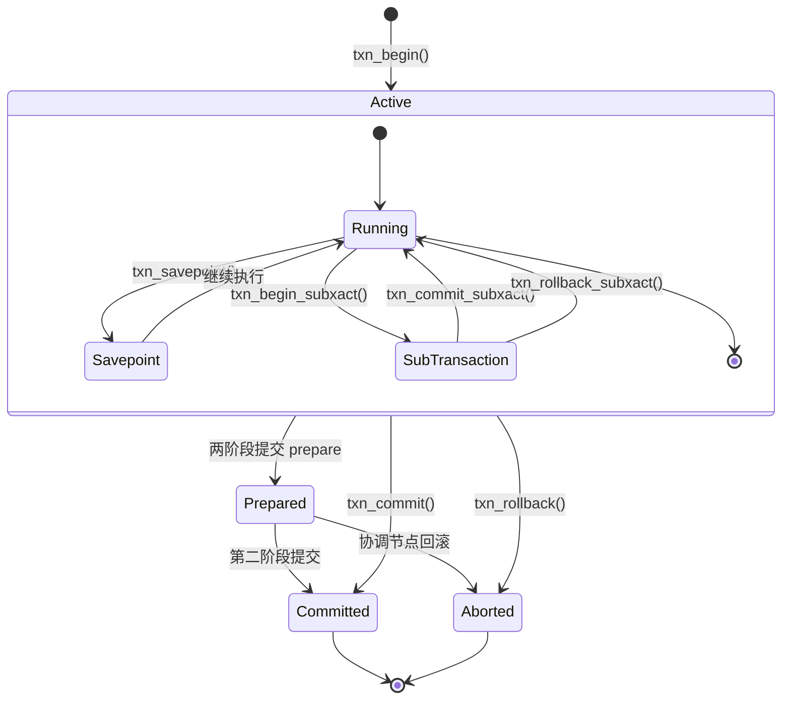

### 2.3 事务生命周期

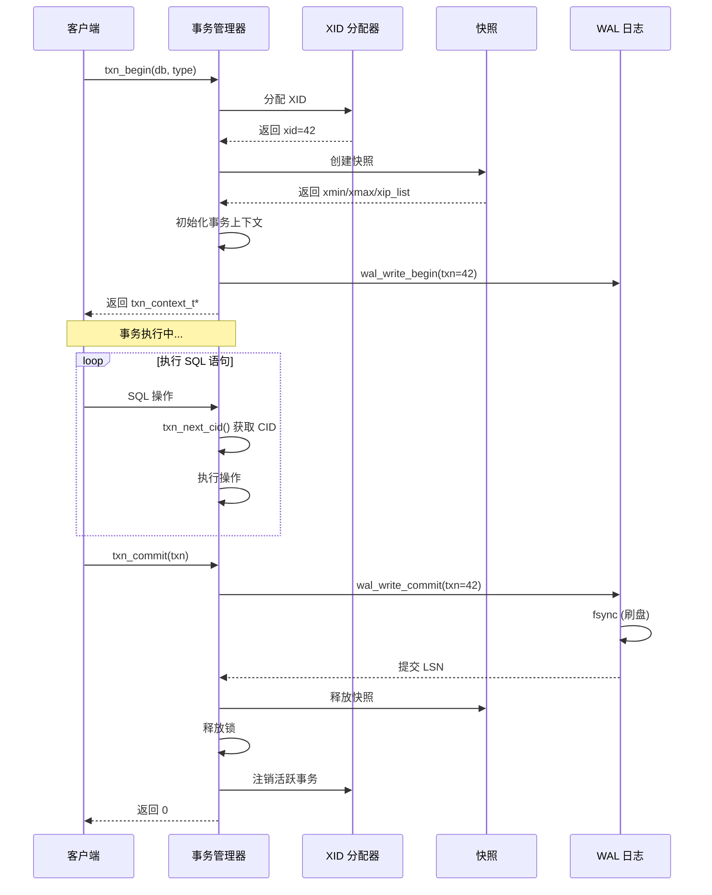

---

## 三、锁管理器

### 3.1 锁结构

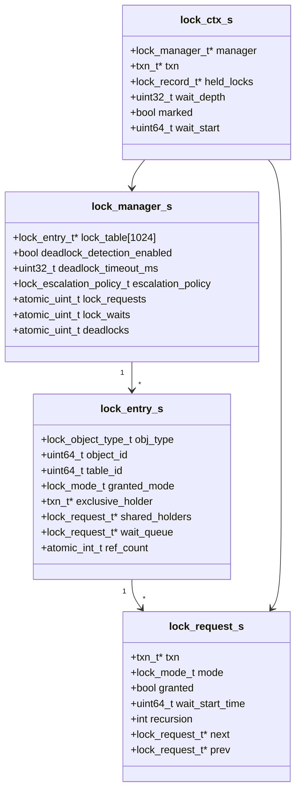

### 3.2 锁兼容矩阵

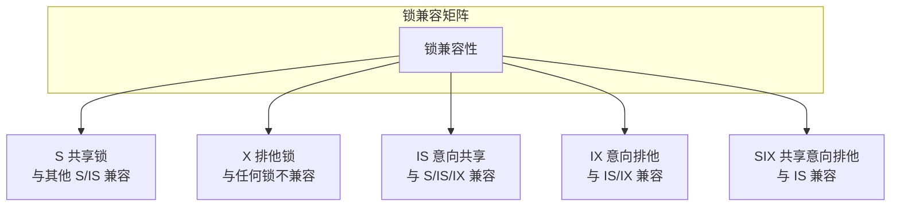

| 请求\已授予 | S | X | IS | IX | SIX |
|------------|---|---|----|----|-----|
| **S** | ✓ | ✗ | ✓ | ✗ | ✗ |
| **X** | ✗ | ✗ | ✗ | ✗ | ✗ |
| **IS** | ✓ | ✗ | ✓ | ✓ | ✓ |
| **IX** | ✗ | ✗ | ✓ | ✓ | ✗ |
| **SIX** | ✗ | ✗ | ✓ | ✗ | ✗ |

### 3.3 锁获取流程

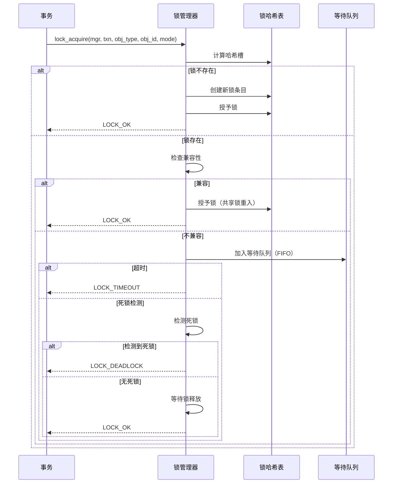

### 3.4 死锁检测

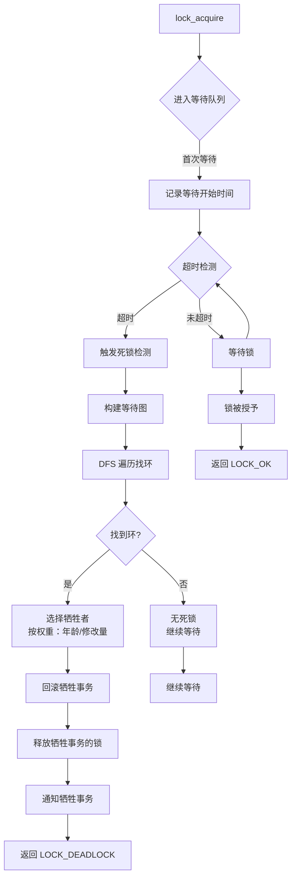

---

## 四、MVCC 多版本并发控制

### 4.1 MVCC 版本链

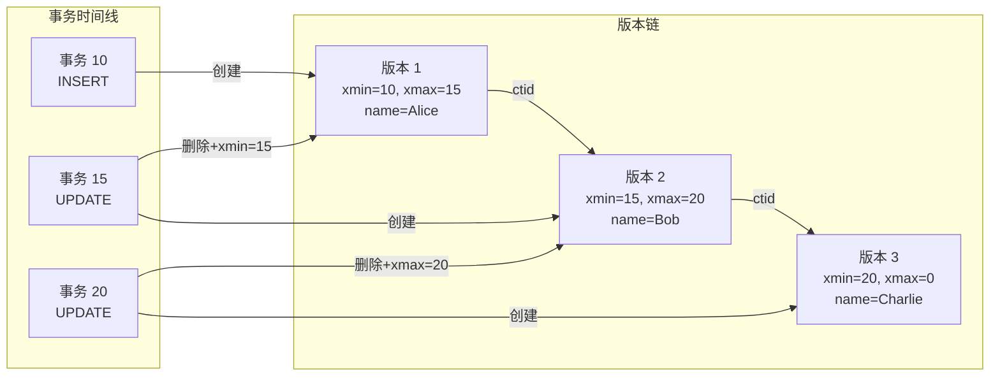

### 4.2 可见性判断

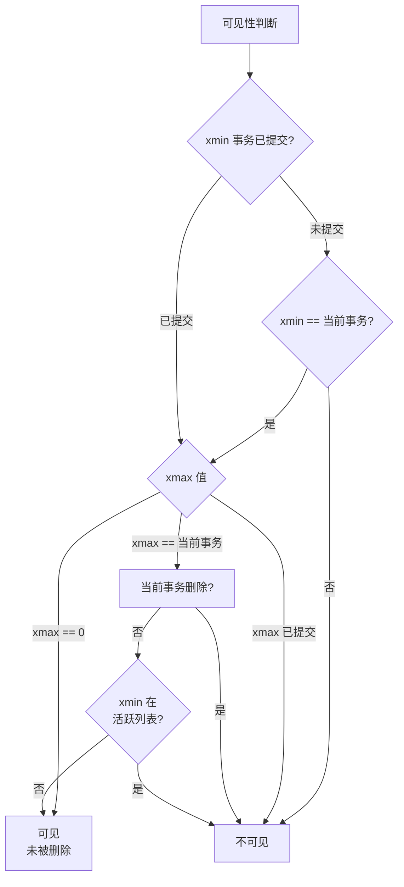

### 4.3 快照隔离

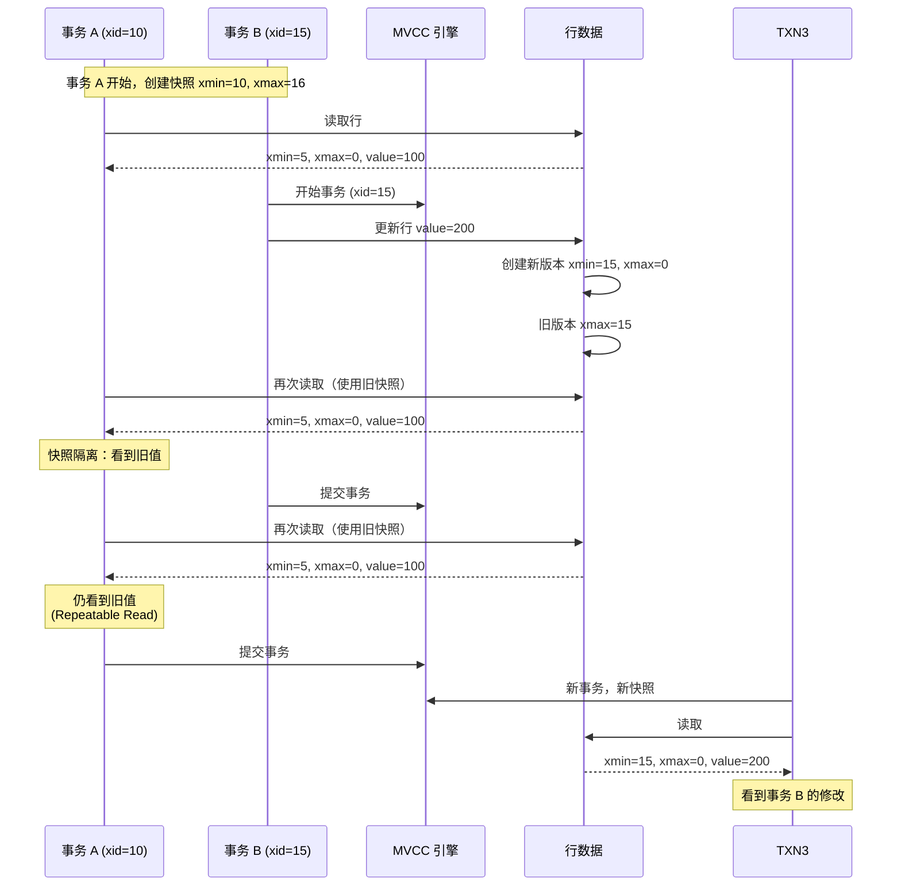

---

## 五、Undo 日志

### 5.1 Undo 链

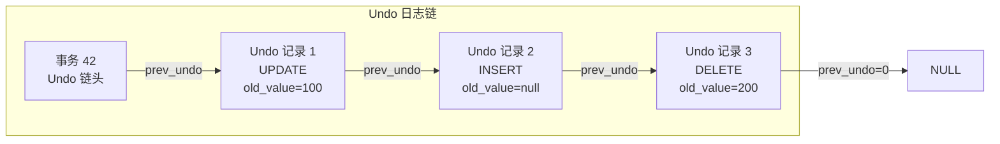

### 5.2 回滚流程

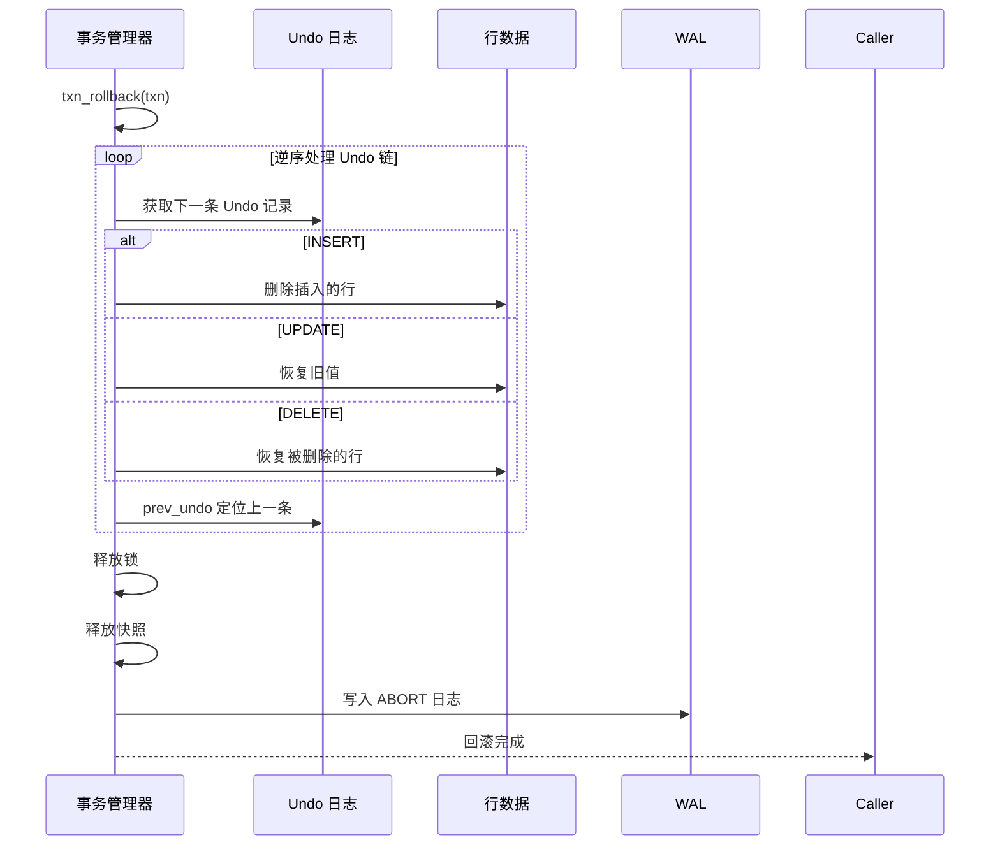

---

## 六、VACUUM 垃圾回收

### 6.1 GC 触发条件

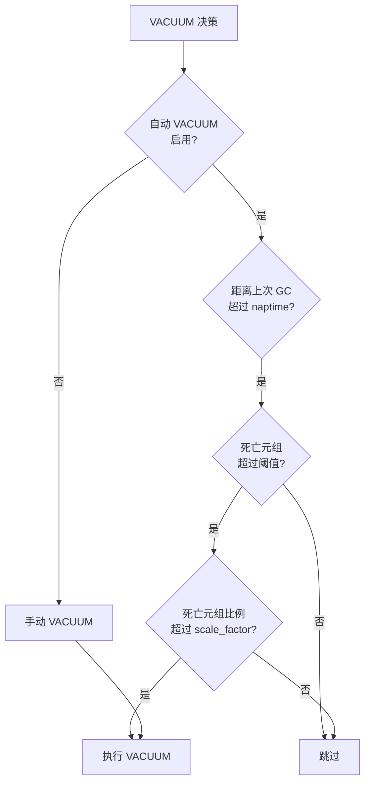

### 6.2 VACUUM 执行流程

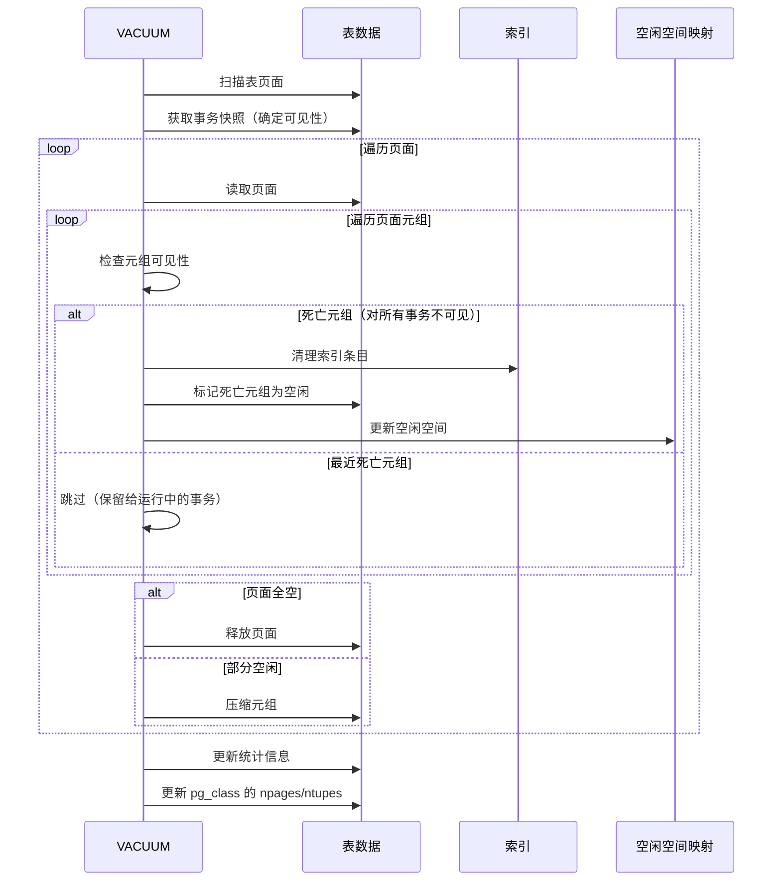

---

## 七、事务隔离级别

| 隔离级别 | 脏读 | 不可重复读 | 幻读 | 实现方式 |
|---------|------|-----------|------|---------|
| **Read Uncommitted** | 可能 | 可能 | 可能 | 不检查 xmax |
| **Read Committed** | 避免 | 可能 | 可能 | 每语句新快照 |
| **Repeatable Read** | 避免 | 避免 | 可能 | 事务开始快照 |
| **Serializable** | 避免 | 避免 | 避免 | 快照 + 冲突检测 |

---

## 八、性能指标

| 指标 | 目标值 | 说明 |
|------|--------|------|
| 事务吞吐量 | > 1000 tps | 短事务 |
| 锁获取延迟 | < 10 μs | 无冲突 |
| 死锁检测 | < 1 ms | 100 个活跃事务 |
| MVCC 可见性判断 | < 1 μs | 缓存命中 |
| VACUUM 速率 | > 1000 死亡元组/s | 正常负载 |
| 最大并发事务 | 1024 | TXN_MAX_ACTIVE |

---

## 九、关键代码位置

| 功能 | 头文件 | 源文件 |
|------|--------|--------|
| 事务管理器 | `engineering/include/db/txn.h` | `engineering/src/db/txn/` |
| 锁管理器 | `engineering/include/db/lock.h` | `engineering/src/db/lock/` |
| MVCC 引擎 | `engineering/include/db/concurrency/mvcc.h` | `engineering/src/db/concurrency/` |
| 乐观锁 | `engineering/include/db/optimistic.h` | `engineering/src/db/optimistic/` |