# Games 游戏子系统架构设计

本文档描述 Games 游戏子系统的整体架构、核心组件和关键流程。

## 1. 子系统架构概览

Games 子系统采用「游戏中心 + 独立游戏 + 共享组件」的三层架构。

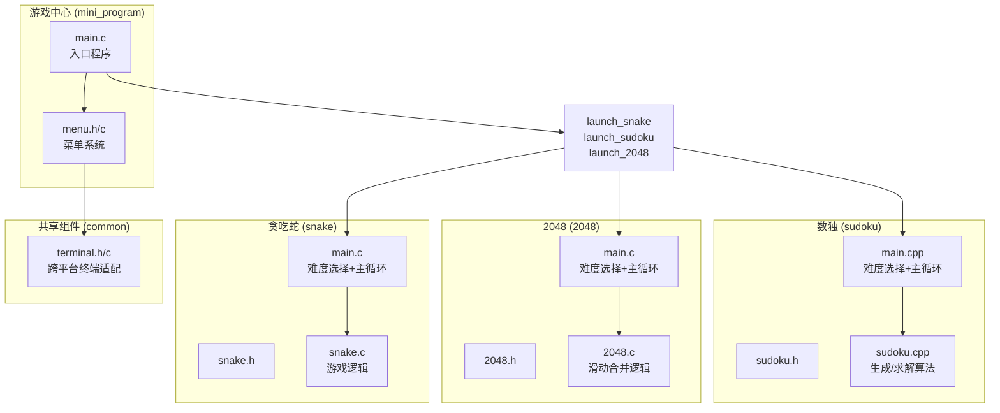

**设计要点：**

- **游戏中心**：统一入口，通过 `system()` 启动独立游戏进程
- **独立游戏**：每个游戏自成一个可执行文件，独立运行
- **共享组件**：`menu` 和 `terminal` 提供通用能力，被游戏中心和各游戏复用

---

## 2. 游戏中心

游戏中心是用户入口，负责游戏选择和启动。

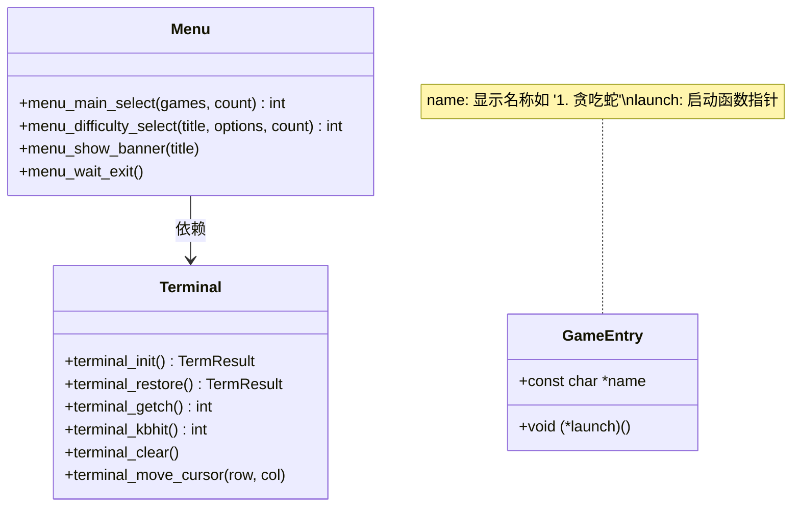

**启动流程：**

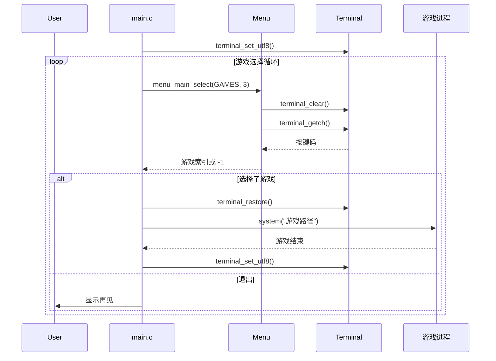

---

## 3. 贪吃蛇游戏

### 3.1 核心数据结构

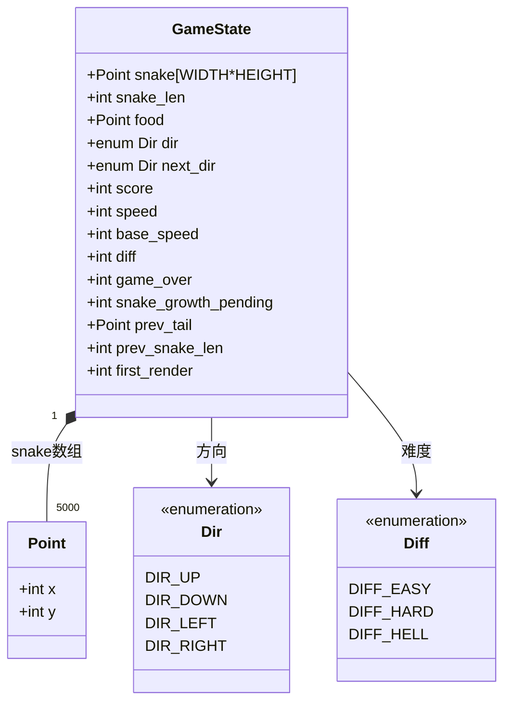

### 3.2 游戏循环

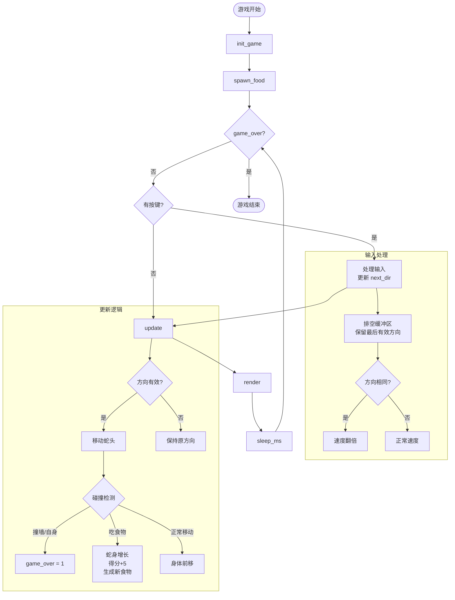

### 3.3 玩家操作响应

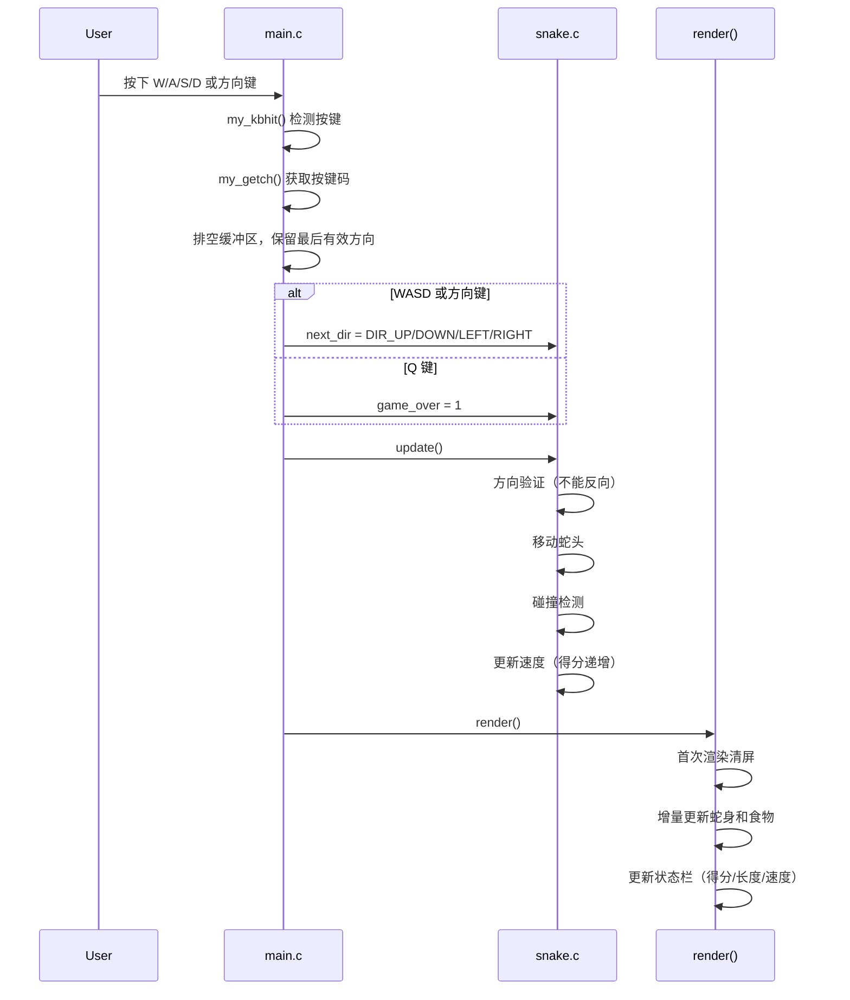

---

## 4. 2048 游戏

### 4.1 核心数据结构

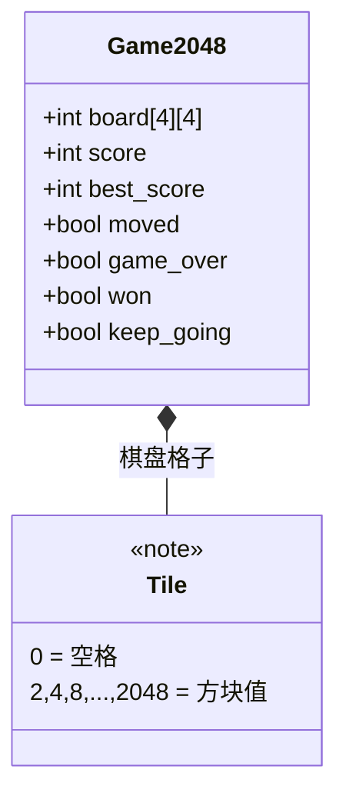

### 4.2 移动合并逻辑

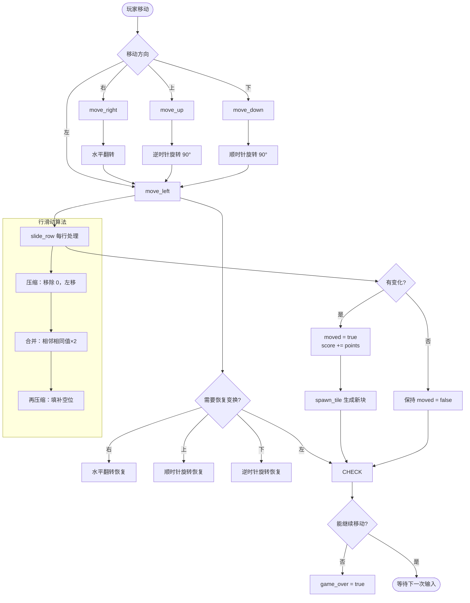

**核心技巧：** 通过旋转/翻转变换，所有方向的移动都复用 `move_left` 算法。

---

## 5. 数独游戏

### 5.1 核心数据结构

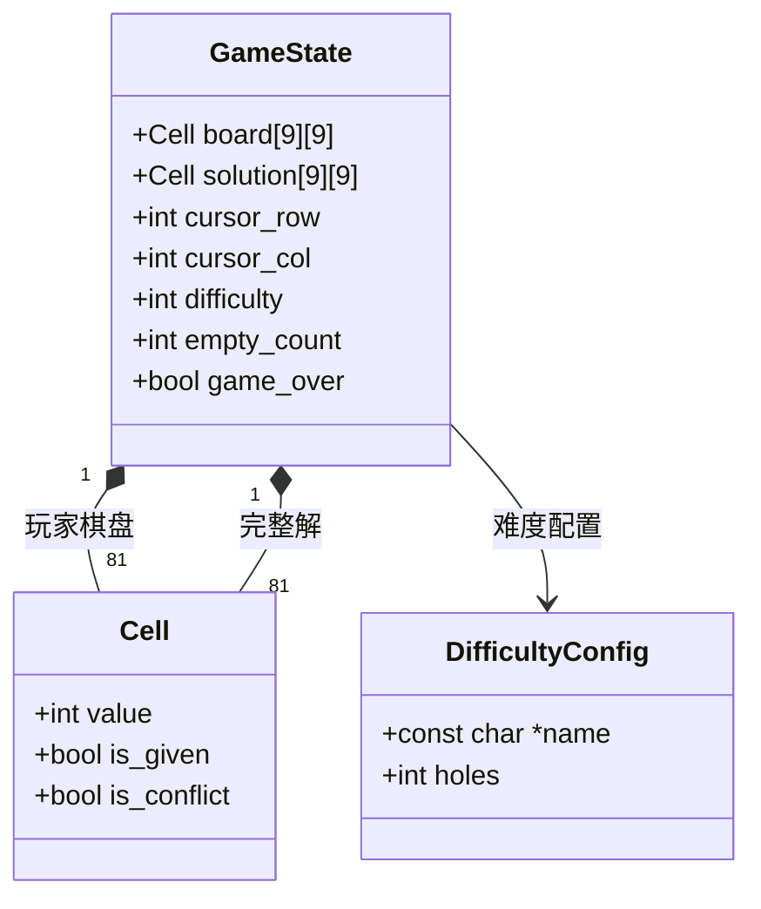

### 5.2 题目生成与求解流程

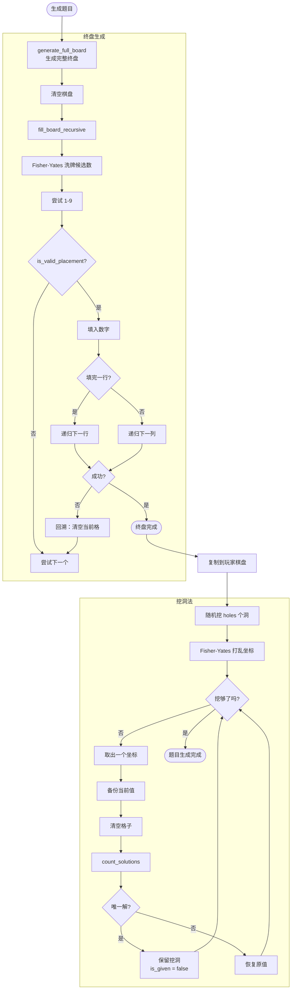

### 5.3 玩家操作流程

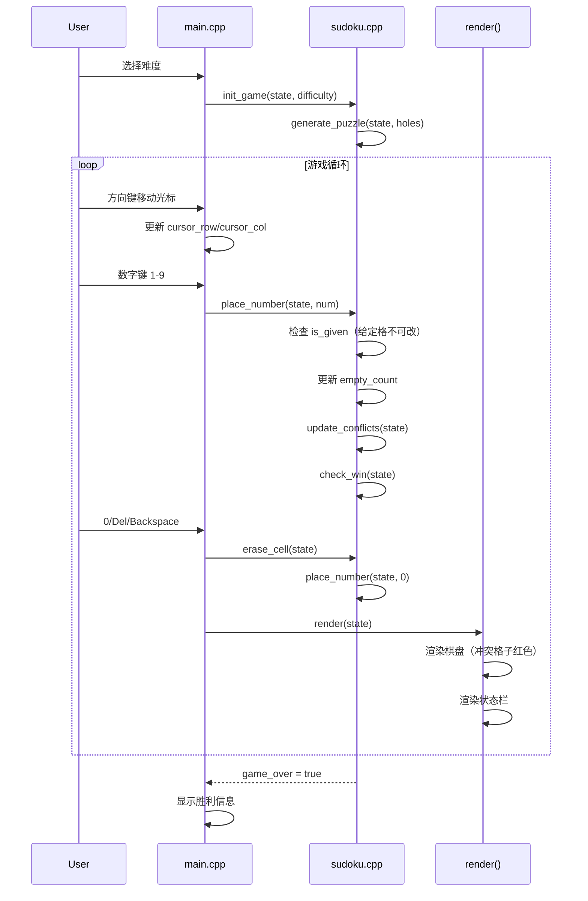

---

## 6. 共享组件

### 6.1 Menu 菜单系统

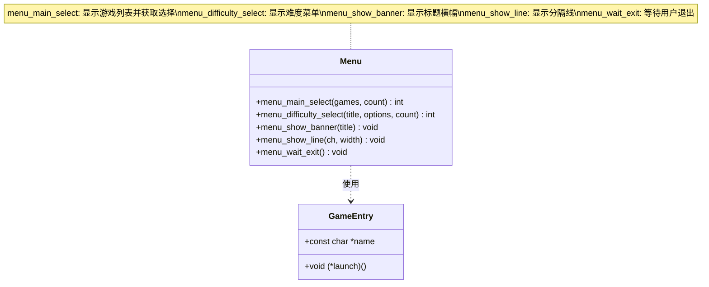

### 6.2 Terminal 终端适配器

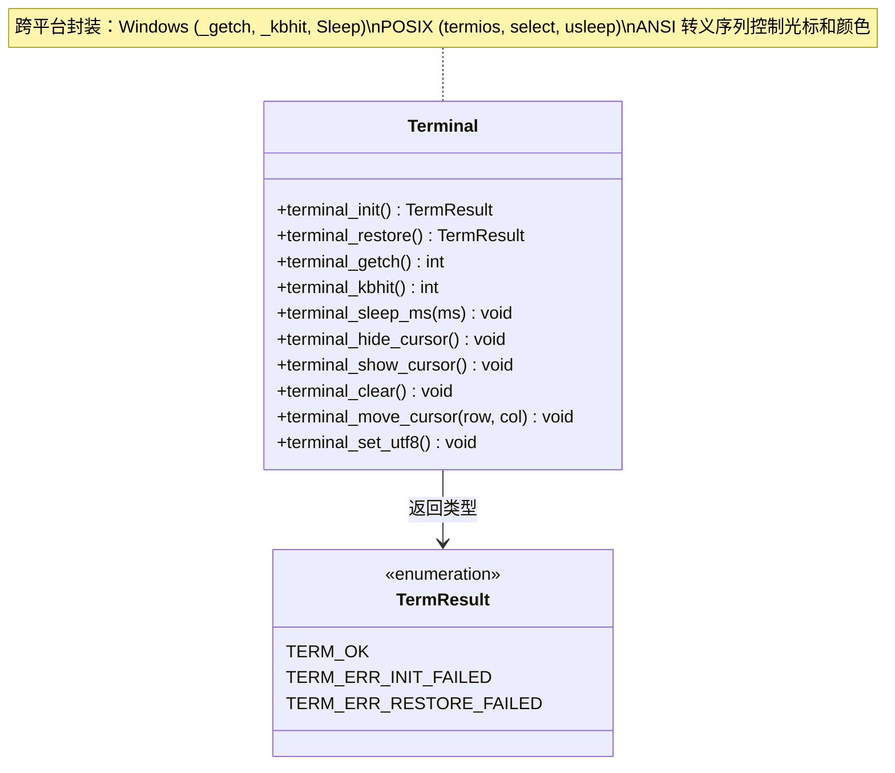

**平台适配矩阵：**

| 功能 | Windows | POSIX |
|------|---------|-------|
| UTF-8 编码 | SetConsoleOutputCP(65001) | setlocale(LC_ALL, "en_US.UTF-8") |
| 原始输入 | SetConsoleMode(ENABLE_LINE_INPUT off) | tcsetattr(ICANON off) |
| 非阻塞检测 | _kbhit() | select() with timeout=0 |
| 单字符读取 | _getch() | getchar() in raw mode |
| 毫秒延时 | Sleep(ms) | usleep(ms*1000) |
| ANSI 颜色 | ENABLE_VIRTUAL_TERMINAL_PROCESSING | 原生支持 |

---

## 7. 关键代码位置

| 组件 | 头文件 | 源文件 |
|------|--------|--------|
| **游戏中心** | — | `engineering/apps/games/mini_program/main.c` |
| **菜单系统** | `engineering/apps/common/menu.h` | `engineering/apps/common/menu.c` |
| **终端适配** | `engineering/apps/common/terminal.h` | `engineering/apps/common/terminal.c` |
| **贪吃蛇** | `engineering/apps/games/snake/snake.h` | `engineering/apps/games/snake/snake.c` `engineering/apps/games/snake/main.c` |
| **2048** | `engineering/apps/games/2048/2048.h` | `engineering/apps/games/2048/2048.c` `engineering/apps/games/2048/main.c` |
| **数独** | `engineering/apps/games/sudoku/sudoku.h` | `engineering/apps/games/sudoku/sudoku.cpp` `engineering/apps/games/sudoku/main.cpp` |

---

## 8. 架构设计要点总结

1. **进程隔离**：每个游戏独立进程，游戏中心通过 `system()` 启动，避免内存泄漏和状态干扰
2. **增量渲染**：贪吃蛇和 2048 采用增量渲染，只更新变化的格子，减少闪烁
3. **平台适配**：通过条件编译封装 Windows/POSIX 差异，上层代码无需关心平台
4. **算法复用**：2048 通过旋转变换复用 `move_left` 算法；数独的生成/求解共享回溯框架
5. **难度分级**：三个游戏都支持 3 级难度，通过参数（速度/初始块数/挖洞数）控制