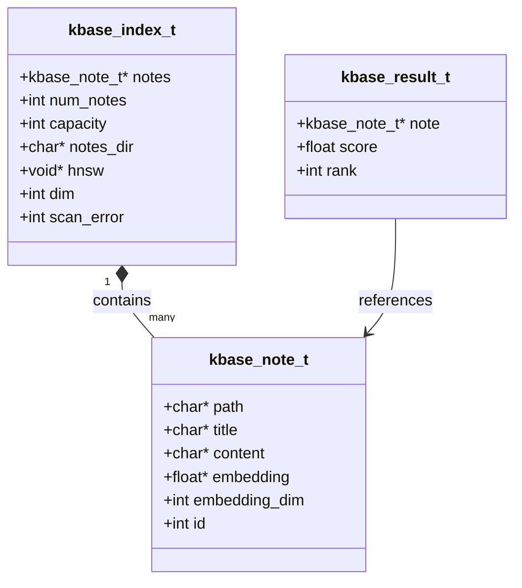
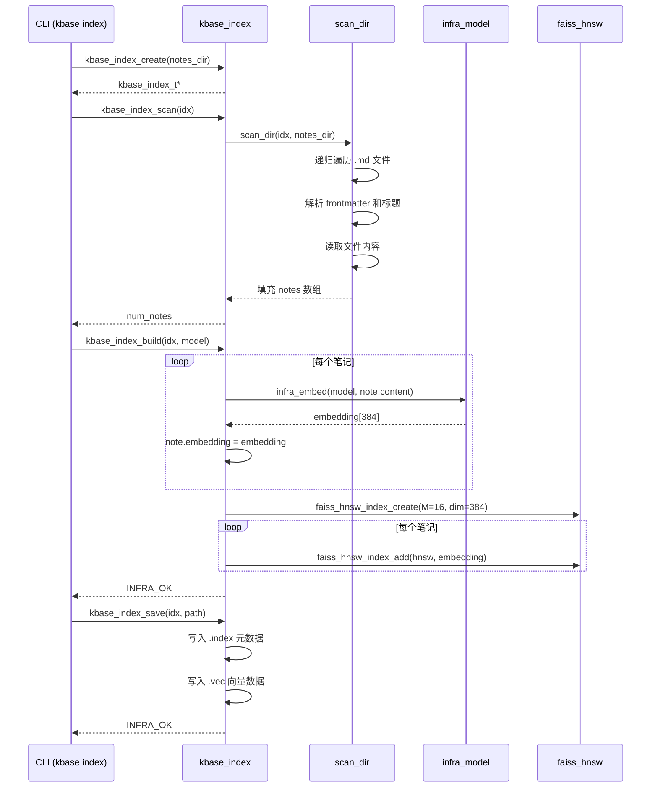
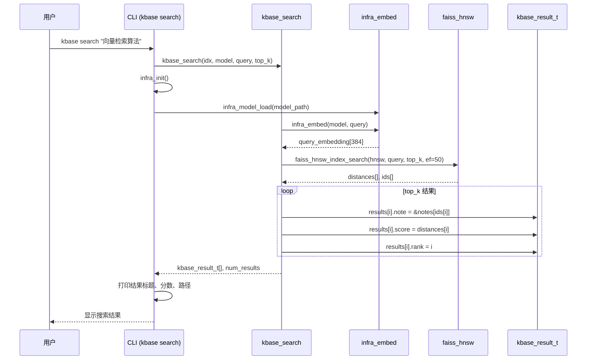
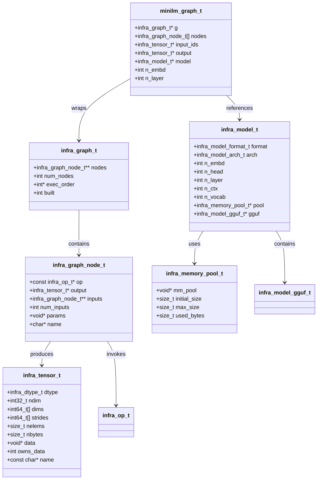
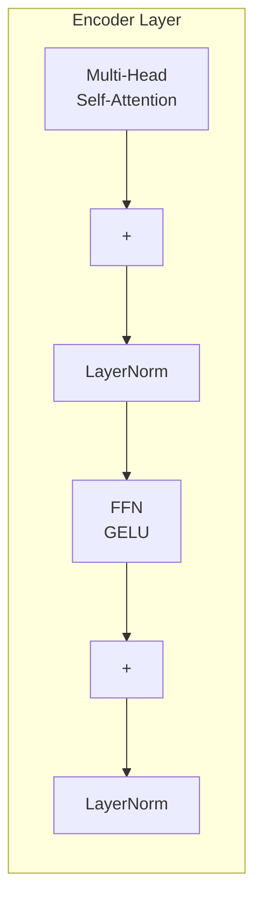
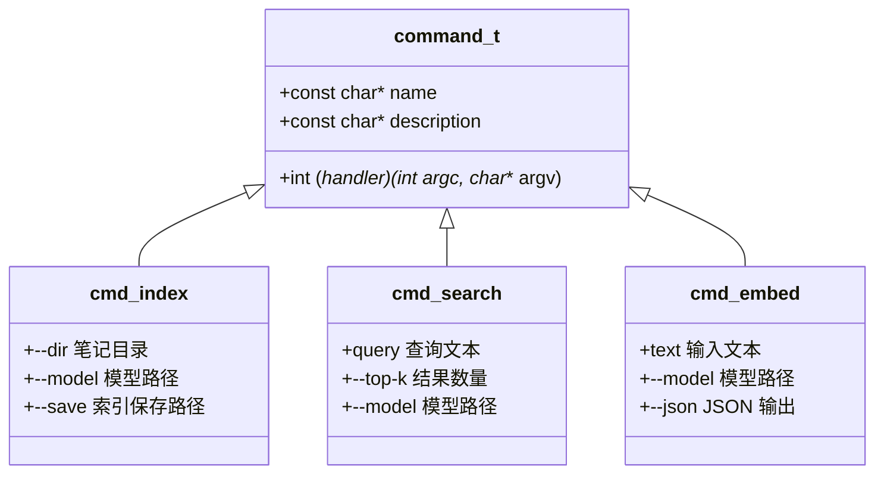

# 知识库基础子系统 - 架构设计

本文档描述 kbase 子系统的架构设计，提供本地知识库的语义索引和搜索能力。

## 1. 子系统架构概览

kbase 子系统采用分层架构，从上层 CLI 工具到底层推理基础设施，各层职责清晰。

## 2. 数据模型

核心数据结构包括笔记条目、索引和搜索结果。



### 数据结构说明

| 结构体 | 字段 | 说明 |
|--------|------|------|
| `kbase_note_t` | `path` | 笔记文件的相对路径 |
| | `title` | 笔记标题（从 `# ` 标题行提取） |
| | `content` | 笔记正文内容 |
| | `embedding` | 384 维向量嵌入 |
| | `embedding_dim` | 向量维度（默认 384） |
| | `id` | 在 HNSW 索引中的位置 |
| `kbase_index_t` | `notes` | 笔记数组 |
| | `hnsw` | HNSW 索引指针 (`faiss_hnsw_t*`) |
| | `dim` | 向量维度 |
| `kbase_result_t` | `score` | 相似度分数（L2 距离） |
| | `rank` | 排名（从 0 开始） |

## 3. 索引构建流程

索引构建过程包括目录扫描、模型编码和 HNSW 索引构建三个阶段。



### 索引构建步骤

1. **目录扫描** (`kbase_index_scan`)
   - 递归遍历笔记目录下的所有 `.md` 文件
   - 跳过隐藏文件（`.` 或 `_` 开头）以及 `README.md`、`_index.md`
   - 解析 frontmatter（YAML 头部）后提取第一个 `# ` 标题行作为标题
   - 读取完整文件内容到 `content` 字段

2. **Embedding 生成** (`kbase_index_build`)
   - 调用 `infra_embed` 对每个笔记内容生成 384 维向量
   - 使用 MiniLM-L6 模型进行编码

3. **HNSW 索引构建**
   - 创建 HNSW 索引：`M=16`, `ef_construction=200`
   - 逐个添加笔记向量到索引中
   - 记录笔记 ID 与 HNSW 位置的映射

## 4. 搜索流程

语义搜索通过查询编码、向量检索和结果排序完成。



### 搜索参数

| 参数 | 默认值 | 说明 |
|------|--------|------|
| `top_k` | 10 | 返回结果数量 |
| `ef` | 50 | HNSW 搜索宽度 |
| `model` | `reference/models/minilm-l6-q4_k_m.gguf` | 模型路径 |

## 5. 推理基础设施

推理基础设施（infra）从 llama.cpp 启发，提供本地推理引擎能力。



### 数据类型支持

```c
typedef enum {
    INFRA_DTYPE_F32   = 0,  // 32-bit 浮点
    INFRA_DTYPE_F16   = 1,  // 16-bit 浮点（存储用）
    INFRA_DTYPE_Q8_0  = 2,  // 8-bit 量化 (block 32)
    INFRA_DTYPE_Q4_0  = 3,  // 4-bit 量化 (block 32)
    INFRA_DTYPE_Q4_1  = 4,  // 4-bit 量化 (block 32, 偏移)
    INFRA_DTYPE_I32   = 5,  // 32-bit 整数
    INFRA_DTYPE_I64   = 6,  // 64-bit 整数
} infra_dtype_t;
```

### 模型架构识别

```c
typedef enum {
    INFRA_ARCH_BERT = 0,    // MiniLM 属于此架构
    INFRA_ARCH_LLAMA = 1,   // LLaMA 系列
    INFRA_ARCH_UNKNOWN = -1,
} infra_model_arch_t;
```

## 6. 算子系统

算子系统采用注册表模式，算子通过统一接口注册和调用。

```mermaid
flowchart LR
    subgraph Registry["算子注册表"]
        registry["op_registry.c<br/>全局哈希表"]
        register["infra_op_register()<br/>注册算子"]
        find["infra_op_find()<br/>按名查找"]
    end

    subgraph Ops["已注册算子"]
        matmul["op_matmul<br/>矩阵乘法<br/>min_inputs:2 max_inputs:2"]
        add["op_add<br/>逐元素加法<br/>min_inputs:2"]
        mul["op_mul<br/>逐元素乘法<br/>min_inputs:2"]
        norm["op_norm<br/>层归一化<br/>eps, gamma, beta"]
        softmax["op_softmax<br/>Softmax<br/>min_inputs:1"]
        activations["op_activations<br/>GELU / ReLU / SiLU"]
        attention["op_attention<br/>多头注意力<br/>num_heads, scale"]
        gather["op_gather<br/>按索引选取"]
        reshape["op_reshape<br/>重塑形状"]
        transpose["op_transpose<br/>转置"]
        l2norm["op_l2norm<br/>L2 归一化"]
    end

    subgraph GraphExec["计算图执行"]
        graph["infra_graph_t"]
        build["infra_graph_build()<br/>拓扑排序"]
        execute["infra_graph_execute()<br/>逐节点执行"]
    end

    register --> registry
    find --> registry
    registry --> Ops

    graph --> find
    graph --> execute
    execute --> matmul
    execute --> add
    execute --> norm
```

### 算子接口

```c
// 算子函数签名
typedef infra_status_t (*infra_op_func_t)(
    infra_tensor_t** inputs, int num_inputs,
    infra_tensor_t** outputs, int num_outputs,
    const void* params);

// 算子描述符
typedef struct {
    const char* name;
    infra_op_func_t func;
    int min_inputs, max_inputs;
    int min_outputs, max_outputs;
    const char* description;
} infra_op_t;
```

### MiniLM-L6 计算图

MiniLM-L6 的推理过程通过 6 层 Transformer Encoder 编码后经 Pooler 输出向量：

```mermaid
flowchart LR
    input["input_ids<br/>[seq_len]"]
    tok_emb["Token Embedding<br/>(gather)"]
    pos_emb["Position Embedding<br/>(gather + add)"]
    enc1["Encoder Layer 1<br/>12 heads"]
    enc2["Encoder Layer 2<br/>12 heads"]
    enc3["..."]
    enc6["Encoder Layer 6<br/>12 heads"]
    pooler["Pooler<br/>(mean pooling)"]
    l2["L2 Normalize"]
    output["output<br/>[384]"]

    input --> tok_emb
    tok_emb --> pos_emb
    pos_emb --> enc1
    enc1 --> enc2
    enc2 --> enc3
    enc3 --> enc6
    enc6 --> pooler
    pooler --> l2
    l2 --> output
```



每层 Encoder 内部展开：



### MiniLM-L6 默认超参数

| 参数 | 值 |
|------|-----|
| 层数 (n_layer) | 6 |
| 注意力头数 (n_head) | 12 |
| 隐藏维度 (n_embd) | 384 |
| 最大上下文 (n_ctx) | 512 |

## 7. CLI 工具

kbase CLI 提供三个核心命令：索引构建、语义搜索和 Embedding 推理。



### 命令用法

#### 索引构建

```bash
kbase index --dir learning/notes --model reference/models/minilm-l6-q4_k_m.gguf --save kbase
```

输出文件：
- `kbase.index`: 元数据（笔记数量、维度、路径-标题映射）
- `kbase.vec`: 向量数据（二进制）

#### 语义搜索

```bash
kbase search "向量检索算法" --top-k 10 --model reference/models/minilm-l6-q4_k_m.gguf
```

输出格式：
```
搜索结果（top-10）：
[0] 向量数据库索引设计 (score: 0.842)
    📄 learning/notes/vector-db/index-design.md
[1] HNSW 索引原理 (score: 0.756)
    📄 learning/notes/algorithm/hnsw.md
...
```

#### Embedding 推理

```bash
kbase embed "这是一段测试文本" --model reference/models/minilm-l6-q4_k_m.gguf --json
```

输出格式（JSON 模式）：
```json
{"dim":384,"vector":[0.012345, -0.067890, ...]}
```

## 8. 关键代码位置

| 模块 | 头文件 | 源文件 | 说明 |
|------|--------|--------|------|
| **索引层** | | | |
| 笔记索引 | `include/kbase/kbase_index.h` | `src/kbase/kbase_index.c` | 目录扫描、索引构建、持久化 |
| 语义搜索 | `include/kbase/kbase_search.h` | `src/kbase/kbase_search.c` | 查询编码、向量检索、结果排序 |
| 工具函数 | `include/kbase/kbase_utils.h` | - | 占位 |
| **推理基础设施** | | | |
| 数据类型 | `include/kbase/infra/types.h` | `src/kbase/infra/infra.c` | dtype 枚举、状态码 |
| 模型加载 | `include/kbase/infra/model.h` | `src/kbase/infra/model_gguf.c` | GGUF 格式加载 |
| | | `src/kbase/infra/model_loader.c` | 模型加载器 |
| 张量操作 | `include/kbase/infra/tensor.h` | `src/kbase/infra/tensor.c` | 张量创建、重塑、复制 |
| 计算图 | `include/kbase/infra/graph.h` | `src/kbase/infra/graph.c` | 图构建、拓扑排序、执行 |
| 分词器 | `include/kbase/infra/tokenizer.h` | `src/kbase/infra/tokenizer.c` | WordPiece 分词 |
| 内存池 | `include/kbase/infra/memory.h` | `src/kbase/infra/memory.c` | 内存池封装 |
| MiniLM 图 | `include/kbase/infra/minilm_graph.h` | `src/kbase/infra/minilm_graph.c` | MiniLM-L6 计算图 |
| 总入口 | `include/kbase/infra/infra.h` | `src/kbase/infra/infra.c` | 初始化、Embedding API |
| **算子系统** | | | |
| 算子注册 | `include/kbase/infra/op.h` | `src/kbase/infra/ops/op_registry.c` | 注册表 |
| 矩阵乘法 | - | `src/kbase/infra/ops/op_matmul.c` | MatMul |
| 加法 | - | `src/kbase/infra/ops/op_add.c` | 逐元素加 |
| 乘法 | - | `src/kbase/infra/ops/op_mul.c` | 逐元素乘 |
| 归一化 | - | `src/kbase/infra/ops/op_norm.c` | LayerNorm |
| Softmax | - | `src/kbase/infra/ops/op_softmax.c` | Softmax |
| 激活函数 | - | `src/kbase/infra/ops/op_activations.c` | GELU/ReLU/SiLU |
| 注意力 | - | `src/kbase/infra/ops/op_attention.c` | 多头注意力 |
| Gather | - | `src/kbase/infra/ops/op_gather.c` | 按索引选取 |
| Reshape | - | `src/kbase/infra/ops/op_reshape.c` | 形状重塑 |
| 转置 | - | `src/kbase/infra/ops/op_transpose.c` | 维度转置 |
| L2 归一化 | - | `src/kbase/infra/ops/op_l2norm.c` | L2 Norm |
| **CLI 工具** | | | |
| 入口 | - | `apps/kbase/main.c` | 命令路由 |
| 索引命令 | - | `apps/kbase/cmd_index.c` | `kbase index` |
| 搜索命令 | - | `apps/kbase/cmd_search.c` | `kbase search` |
| Embedding | - | `apps/kbase/cmd_embed.c` | `kbase embed` |

