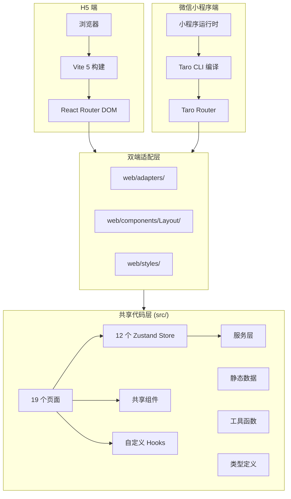
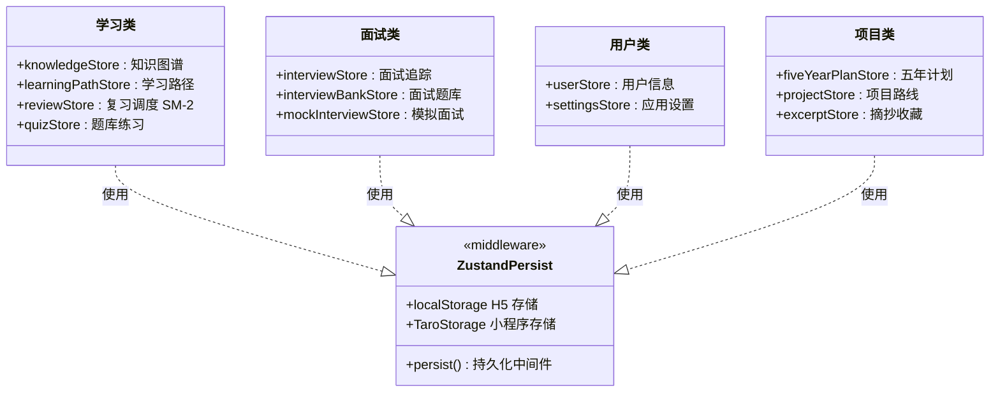
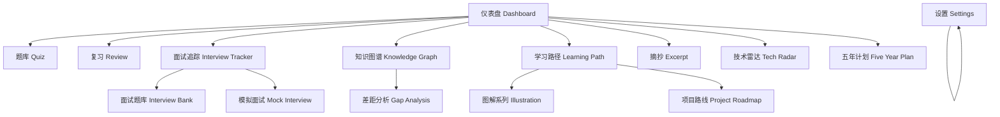
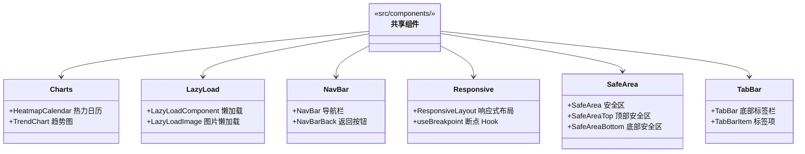
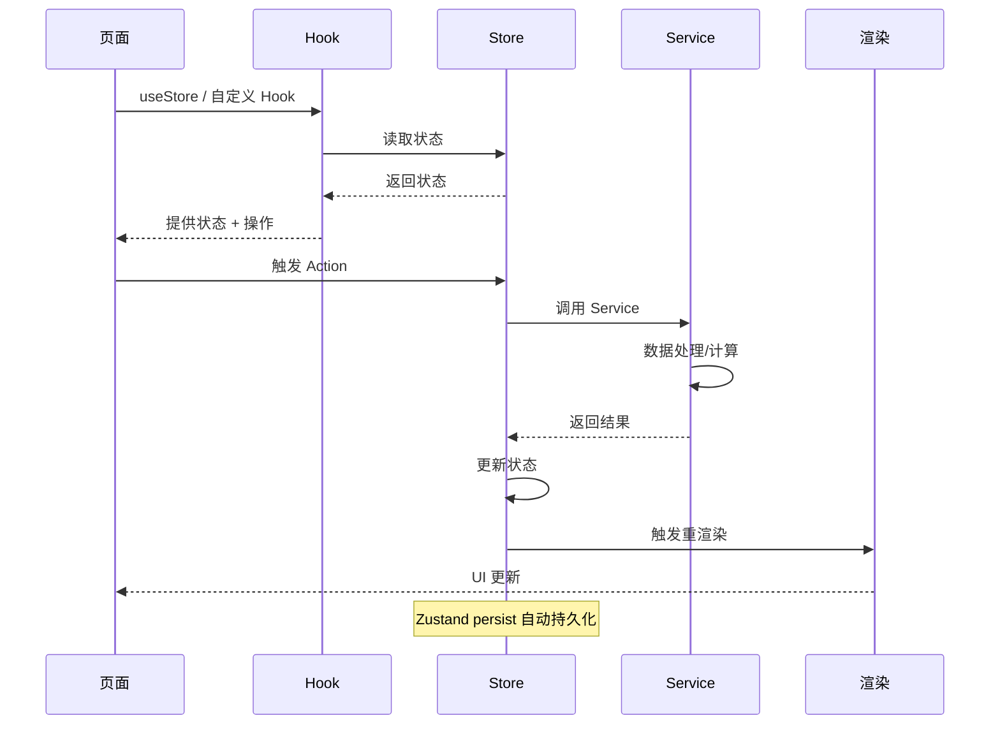
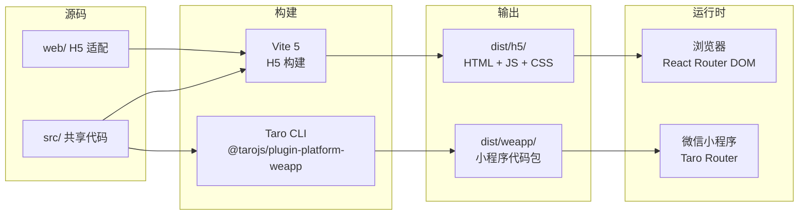

# Knowledge Hub 架构设计

> 知识中心 — 基于 Taro 3.6 + React 18 的 H5 + 微信小程序双端学习追踪平台

## 1. 架构概览

## 2. 技术栈

| 层级 | 技术 | 版本 | 用途 |
|------|------|------|------|
| 框架 | Taro | 3.6 | 跨端统一框架 |
| 前端框架 | React | 18 | UI 组件库 |
| 状态管理 | Zustand | 最新 | 全局状态 + persist 持久化 |
| 路由 (H5) | React Router DOM | 6.x | 浏览器端路由 |
| 路由 (小程序) | Taro Router | 内置 | 小程序页面栈 |
| 样式 | SCSS | Dart Sass | 样式预处理 |
| 样式变量 | CSS Variables | CSS 标准 | 主题切换 |
| 构建 (H5) | Vite | 5 | 快速开发/生产构建 |
| 构建 (小程序) | Taro CLI | 内置 | 小程序编译打包 |
| 测试 | Playwright | 最新 | E2E 测试 |
| 小程序平台 | @tarojs/plugin-platform-weapp | 内置 | 微信小程序编译 |

## 3. 状态管理层

12 个 Zustand Store 按职责分为 4 大类：

### Store 详情

| Store | 职责 | 核心状态 | 持久化 |
|-------|------|----------|--------|
| userStore | 用户信息与认证 | 用户名、头像、登录状态 | 是 |
| settingsStore | 应用配置 | 主题、语言、通知偏好 | 是 |
| quizStore | 题库练习 | 题目列表、答题记录、正确率 | 是 |
| reviewStore | 复习调度 | 复习计划、SM-2 参数、到期队列 | 是 |
| knowledgeStore | 知识图谱 | 节点、边、标签、搜索 | 是 |
| learningPathStore | 学习路径 | 路径节点、进度、依赖关系 | 是 |
| excerptStore | 摘抄收藏 | 摘抄内容、分类、标签 | 是 |
| interviewStore | 面试追踪 | 面试记录、状态、反馈 | 是 |
| interviewBankStore | 面试题库 | 题目分类、难度、标签 | 是 |
| mockInterviewStore | 模拟面试 | 模拟场景、评分、报告 | 是 |
| fiveYearPlanStore | 五年计划 | 年度目标、里程碑、进度 | 是 |
| projectStore | 项目路线 | 项目列表、技术栈、状态 | 是 |

## 4. 页面路由

19 个页面的导航结构：

### 页面清单

| 页面 | 路径 | 功能 |
|------|------|------|
| 仪表盘 | / | 学习概览、今日任务、进度统计 |
| 题库 | /quiz | 分类题库、答题、错题本 |
| 复习 | /review | SM-2 间隔复习、到期提醒 |
| 面试追踪 | /interview-tracker | 面试记录、状态跟踪 |
| 面试题库 | /interview-bank | 题目分类、难度筛选 |
| 模拟面试 | /mock-interview | 模拟场景、评分反馈 |
| 知识图谱 | /knowledge-graph | 节点关系、标签搜索 |
| 学习路径 | /learning-path | 路径规划、进度追踪 |
| 图解系列 | /illustration | 可视化图解 |
| 摘抄 | /excerpt | 收藏摘抄、分类管理 |
| 差距分析 | /gap-analysis | 技能差距、补强建议 |
| 技术雷达 | /tech-radar | 技术趋势、掌握度 |
| 五年计划 | /five-year-plan | 年度目标、里程碑 |
| 项目路线 | /project-roadmap | 项目规划、技术栈 |
| 设置 | /settings | 主题、语言、数据管理 |

## 5. 组件体系

### 组件职责

| 组件 | 职责 | 双端差异 |
|------|------|----------|
| HeatmapCalendar | 学习热力图日历 | H5 用 SVG，小程序用 Canvas |
| TrendChart | 学习趋势折线图 | H5 用 SVG，小程序用 Canvas |
| LazyLoad | 组件/图片懒加载 | H5 用 IntersectionObserver，小程序用 Taro API |
| NavBar | 顶部导航栏 | H5 自定义，小程序用 Taro NavBar |
| Responsive | 响应式布局 | H5 用 CSS Media Query，小程序用 Taro.getSystemInfo |
| SafeArea | 安全区适配 | H5 用 env()，小程序用 Taro SafeArea |
| TabBar | 底部标签栏 | H5 自定义，小程序用 Taro TabBar |

## 6. 数据流

### 数据流原则

1. **单向数据流**：页面 → Hook → Store → Service → Store → 渲染
2. **Store 为单一数据源**：所有共享状态集中在 Zustand Store
3. **Service 无状态**：Service 只做数据处理和计算，不持有状态
4. **Hook 封装逻辑**：页面通过 Hook 访问 Store，不直接 import Store
5. **持久化透明**：persist 中间件自动同步 localStorage / Taro Storage

## 7. 双端适配

### 适配策略

| 差异点 | H5 方案 | 小程序方案 | 适配文件 |
|--------|---------|------------|----------|
| 路由 | React Router DOM | Taro Router | web/adapters/router.ts |
| 存储 | localStorage | Taro Storage | web/adapters/storage.ts |
| 导航栏 | 自定义 NavBar | Taro 原生 NavBar | web/adapters/nav.ts |
| 底部栏 | 自定义 TabBar | Taro 原生 TabBar | web/adapters/tab.ts |
| 安全区 | CSS env() | Taro SafeArea | web/adapters/safearea.ts |
| 图片懒加载 | IntersectionObserver | Taro.createIntersectionObserver | web/adapters/lazyload.ts |

## 8. 关键代码位置

| 模块 | 路径 | 说明 |
|------|------|------|
| H5 入口 | web/main.tsx | React 启动入口 |
| H5 App | web/App.tsx | 路由配置 + 错误边界 |
| 小程序入口 | src/app.config.ts | 小程序配置 |
| 路由配置 | web/config/routes.ts | H5 路由表 |
| 状态管理 | src/stores/*.ts | 12 个 Zustand Store |
| 页面组件 | src/pages/*/index.tsx | 19 个页面 |
| 共享组件 | src/components/*/*.tsx | 7 大类组件 |
| H5 适配 | web/adapters/*.ts | Taro → H5 适配层 |
| 布局组件 | web/components/Layout/*.tsx | H5 布局 |
| 全局样式 | src/styles/*.scss | 全局 SCSS |
| H5 样式 | web/styles/*.scss | H5 专用样式 |
| 静态数据 | src/data/*.ts | 题库、面试题等静态数据 |
| 自定义 Hook | src/hooks/*.ts | 业务逻辑封装 |
| 服务层 | src/services/*.ts | 数据处理和计算 |
| 类型定义 | src/types/*.ts | TypeScript 类型 |
| 工具函数 | src/utils/*.ts | 通用工具 |
| E2E 测试 | e2e/*.spec.ts | Playwright 测试 |
| 文档 | docs/*.md | 项目文档 |

---

> **项目位置**：`engineering/apps/web/knowledge_hub/`