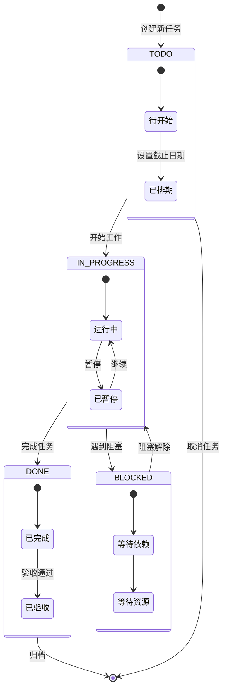

# Reading Radar 架构设计

> 阅读雷达 — 纯前端 SPA + Node.js 后端的个人学习与面试追踪系统

## 1. 架构概览

```mermaid
flowchart TB
    subgraph FRONTEND["前端 SPA"]
        HTML["11 个 HTML 页面"]
        CSS["全局样式"]
        JS["内联/独立 JavaScript"]
    end

    subgraph BACKEND["后端服务"]
        SERVER["server.js\nNode.js HTTP 服务"]
        ROUTES["路由处理\n静态文件 + API"]
    end

    subgraph DATA["数据层"]
        DATA_APP["data/app/\n应用数据"]
        DATA_CONTENT["data/content/\n学习内容"]
        DATA_EXCERPT["data/excerpt/\n摘抄数据"]
        DATA_INTERVIEW["data/interview/\n面试数据"]
        DATA_QUIZ["data/quiz/\n题库数据"]
        PROGRESS["*-progress.md\n进度文件"]
    end

    subgraph CACHE["缓存层 (可选)"]
        REDIS["Redis\n会话/热点缓存"]
    end

    BROWSER["浏览器"] --> FRONTEND
    FRONTEND --> SERVER
    SERVER --> DATA
    SERVER -.-> REDIS
    DATA --> PROGRESS

## 2. 页面功能

| 页面 | 文件 | 功能 |
|------|------|------|
| 主入口 | index.html | 导航首页、功能入口 |
| 仪表盘 | dashboard.html | 学习概览、进度统计 |
| 学习页 | learn.html | 学习内容、分类浏览 |
| 面试页 | interview.html | 面试准备、题目分类 |
| 面试追踪 | interview-tracker.html | 面试记录、状态跟踪 |
| 练习页 | practice.html | 编程练习、代码题目 |
| 题库系统 | quiz-system.html | 答题系统、错题管理 |
| 五年计划 | five-year-plan.html | 年度目标、里程碑 |
| 摘抄 | excerpt.html | 收藏摘抄、分类管理 |
| 技术雷达 | grok.html | 技术趋势、掌握度 |
| 学习看板 | learning-kanban.html | 看板视图、任务管理 |

## 3. 数据模型

```mermaid
classDiagram
    direction TB

    class 应用数据 {
        <<data/app/>>
        +config.json 应用配置
        +user.json 用户信息
        +settings.json 设置项
    }

    class 学习内容 {
        <<data/content/>>
        +categories.json 分类
        +articles.json 文章列表
        +resources.json 资源链接
    }

    class 摘抄数据 {
        <<data/excerpt/>>
        +excerpts.json 摘抄列表
        +categories.json 分类
        +tags.json 标签
    }

    class 面试数据 {
        <<data/interview/>>
        +companies.json 公司列表
        +positions.json 职位列表
        +timeline.json 面试时间线
    }

    class 面试题 {
        <<data/interview-questions/>>
        +backend.json 后端题目
        +frontend.json 前端题目
        +database.json 数据库题目
        +system.json 系统设计题目
    }

    class 面试追踪 {
        <<data/interview-tracker/>>
        +records.json 面试记录
        +feedback.json 面试反馈
        +stats.json 统计数据
    }

    class 题库数据 {
        <<data/quiz/>>
        +questions.json 题目列表
        +answers.json 答案
        +progress.json 答题进度
    }

    class 进度文件 {
        <<*-progress.md>>
        +learning-progress.md 学习进度
        +interview-progress.md 面试进度
        +project-progress.md 项目进度
    }

## 4. 前端架构

```mermaid
flowchart TB
    subgraph NAV["导航结构"]
        INDEX["index.html\n导航首页"]
    end

    subgraph CORE["核心功能"]
        DASHBOARD["dashboard.html\n仪表盘"]
        LEARN["learn.html\n学习页"]
        INTERVIEW["interview.html\n面试页"]
        PRACTICE["practice.html\n练习页"]
    end

    subgraph EXTENDED["扩展功能"]
        TRACKER["interview-tracker.html\n面试追踪"]
        QUIZ["quiz-system.html\n题库系统"]
        KANBAN["learning-kanban.html\n学习看板"]
        FIVE_YEAR["five-year-plan.html\n五年计划"]
        EXCERPT["excerpt.html\n摘抄"]
        GROK["grok.html\n技术雷达"]
    end

    INDEX --> DASHBOARD
    INDEX --> LEARN
    INDEX --> INTERVIEW
    INDEX --> PRACTICE

    DASHBOARD --> TRACKER
    DASHBOARD --> QUIZ
    DASHBOARD --> KANBAN
    DASHBOARD --> FIVE_YEAR

    LEARN --> EXCERPT
    INTERVIEW --> TRACKER
    PRACTICE --> QUIZ
    LEARN --> GROK

## 5. 后端服务

```mermaid
sequenceDiagram
    participant B as 浏览器
    participant S as server.js
    participant F as 文件系统
    participant R as Redis (可选)

    B->>S: GET /index.html
    S->>F: 读取静态文件
    F-->>S: 返回 HTML
    S-->>B: 200 OK + HTML

    B->>S: GET /api/quiz/questions
    S->>F: 读取 data/quiz/questions.json
    F-->>S: 返回 JSON 数据
    S-->>B: 200 OK + JSON

    B->>S: POST /api/quiz/submit
    S->>S: 验证答案
    S->>F: 更新 data/quiz/progress.json
    F-->>S: 写入成功
    S-->>B: 200 OK + 结果

    B->>S: GET /api/dashboard/stats
    S->>R: 查询缓存
    alt 有缓存
        R-->>S: 返回缓存数据
    else 无缓存
        S->>F: 读取多个数据文件
        F-->>S: 返回数据
        S->>S: 聚合统计
        S->>R: 写入缓存 (TTL 5min)
    end
    S-->>B: 200 OK + 统计数据

    B->>S: PUT /api/excerpt/save
    S->>F: 更新 data/excerpt/excerpts.json
    F-->>S: 写入成功
    S-->>B: 200 OK + 确认
```

### 后端 API

| 端点 | 方法 | 功能 | 数据文件 |
|------|------|------|----------|
| /api/quiz/questions | GET | 获取题库 | data/quiz/questions.json |
| /api/quiz/submit | POST | 提交答案 | data/quiz/progress.json |
| /api/excerpt/list | GET | 获取摘抄 | data/excerpt/excerpts.json |
| /api/excerpt/save | PUT | 保存摘抄 | data/excerpt/excerpts.json |
| /api/interview/records | GET | 获取面试记录 | data/interview-tracker/records.json |
| /api/dashboard/stats | GET | 仪表盘统计 | 聚合多个数据文件 |
| /api/learning-kanban | GET | 学习看板 | data/app/ 看板数据 |

## 6. 学习看板状态机



### 状态定义

| 状态 | 标签 | 说明 | 可转换状态 |
|------|------|------|------------|
| TODO | 待办 | 任务已创建但未开始 | IN_PROGRESS, [*] |
| IN_PROGRESS | 进行中 | 正在执行 | DONE, BLOCKED |
| BLOCKED | 阻塞 | 因依赖或资源问题暂停 | IN_PROGRESS |
| DONE | 完成 | 任务已完成 | [*] |

### 状态流转规则

1. **TODO → IN_PROGRESS**：点击"开始"按钮
2. **IN_PROGRESS → DONE**：点击"完成"按钮
3. **IN_PROGRESS → BLOCKED**：点击"标记阻塞"并填写阻塞原因
4. **BLOCKED → IN_PROGRESS**：阻塞解除后手动恢复
5. **DONE → [*]**：归档已完成任务（可选）
6. **TODO → [*]**：取消任务

## 7. 关键代码位置

| 模块 | 路径 | 说明 |
|------|------|------|
| 主入口 | index.html | 导航首页 |
| 仪表盘 | dashboard.html | 学习概览 |
| 学习页 | learn.html | 学习内容浏览 |
| 面试页 | interview.html | 面试准备 |
| 面试追踪 | interview-tracker.html | 面试记录 |
| 练习页 | practice.html | 编程练习 |
| 题库系统 | quiz-system.html | 答题系统 |
| 五年计划 | five-year-plan.html | 年度目标 |
| 摘抄 | excerpt.html | 收藏管理 |
| 技术雷达 | grok.html | 技术趋势 |
| 学习看板 | learning-kanban.html | 看板管理 |
| 后端服务 | server.js | Node.js HTTP 服务 |
| 应用数据 | data/app/ | 应用配置、用户信息 |
| 学习内容 | data/content/ | 文章、资源、分类 |
| 摘抄数据 | data/excerpt/ | 摘抄列表、分类 |
| 面试数据 | data/interview/ | 公司、职位、时间线 |
| 面试题 | data/interview-questions/ | 各方向面试题 |
| 面试追踪 | data/interview-tracker/ | 面试记录、反馈 |
| 题库数据 | data/quiz/ | 题目、答案、进度 |
| 进度文件 | data/*-progress.md | 学习/面试/项目进度 |
| 脚本 | scripts/ | 辅助脚本 |
| Redis 配置 | Redis/ | 缓存配置 |

---

> **项目位置**：`engineering/apps/web/reading-radar/`