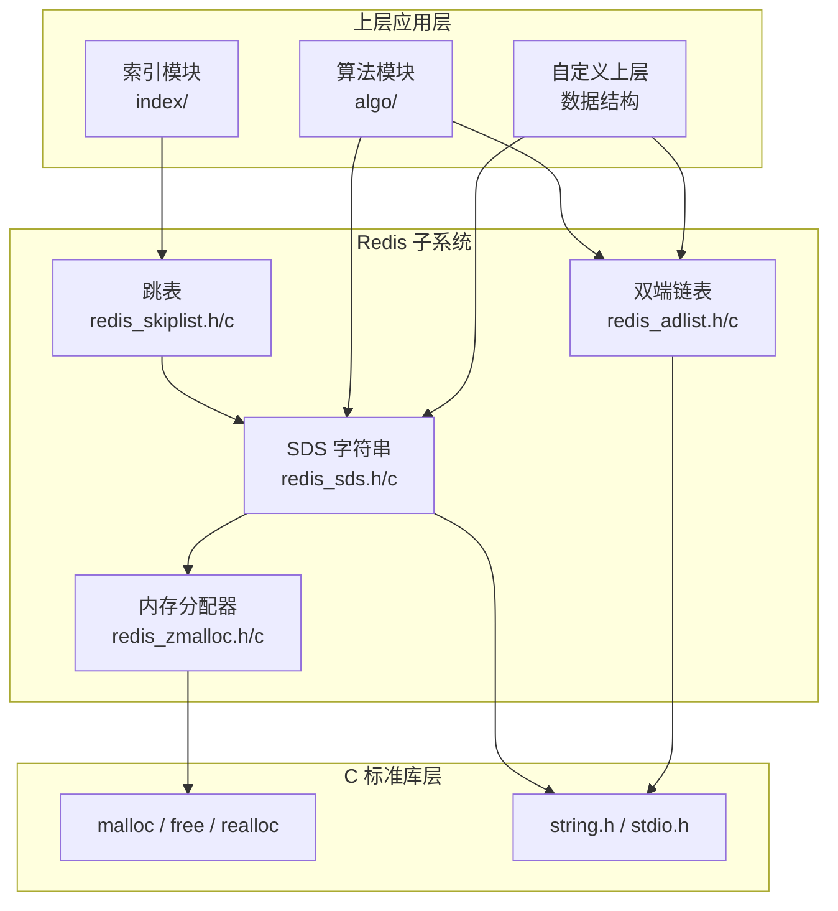
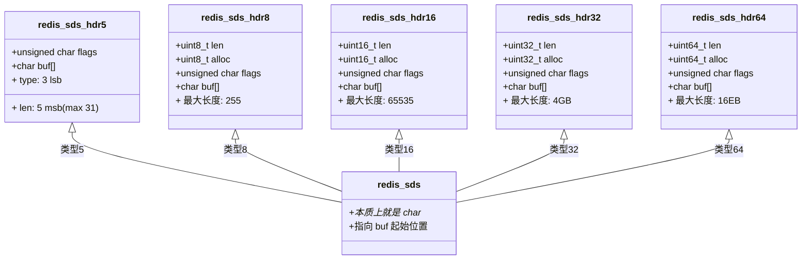
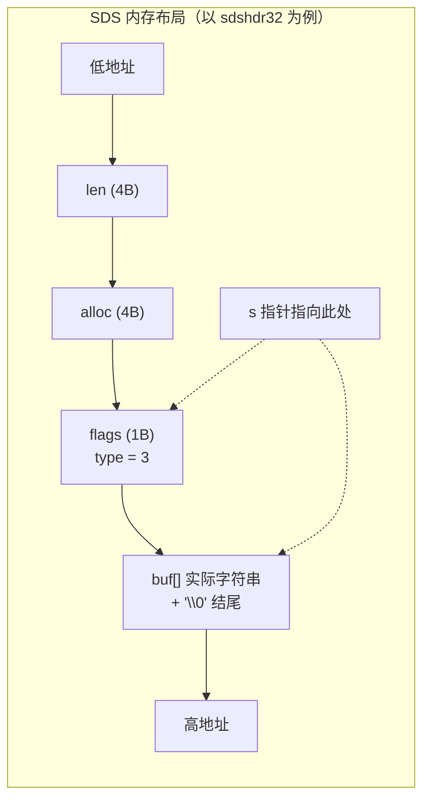
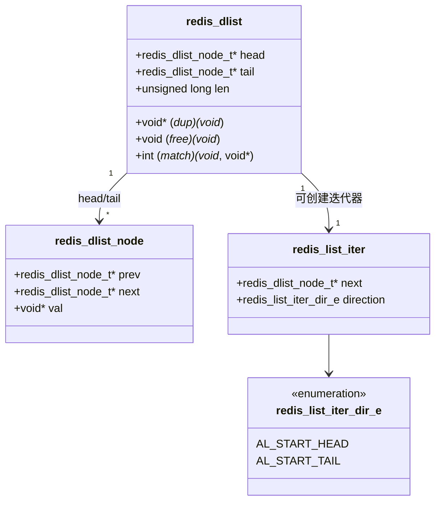
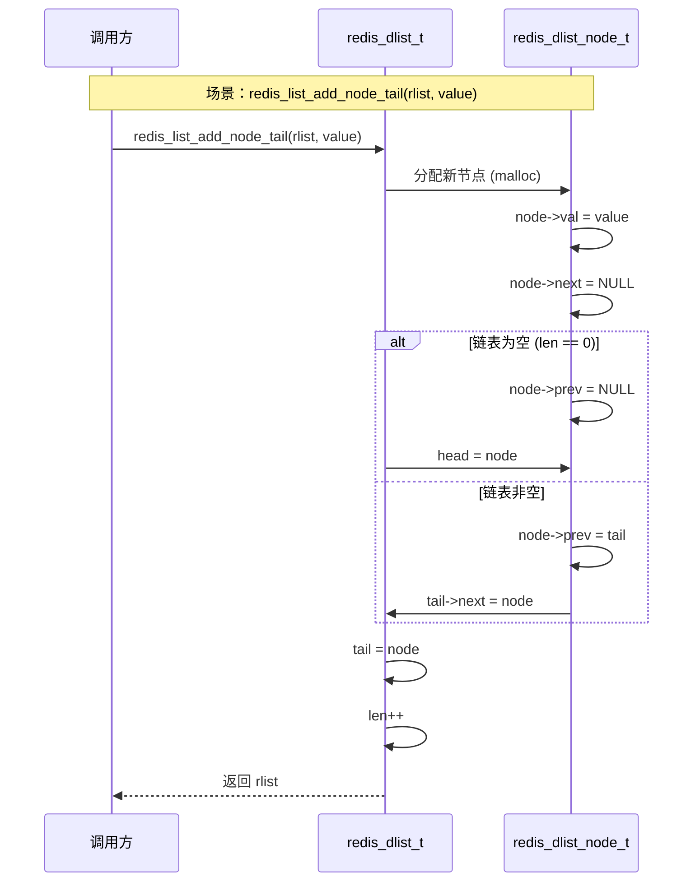
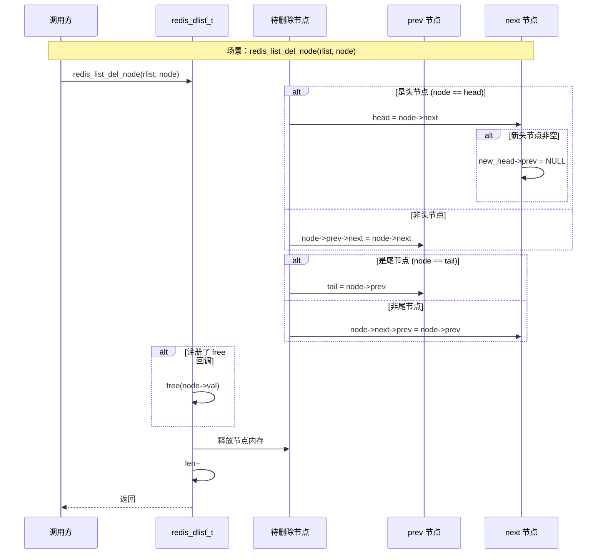
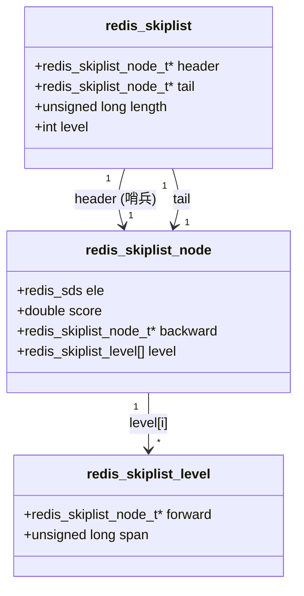
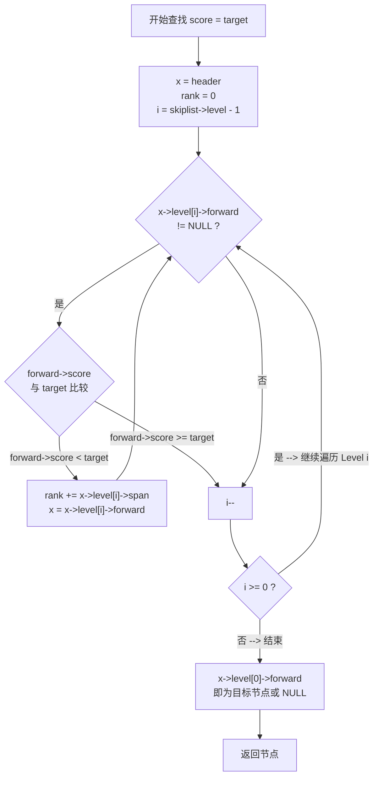
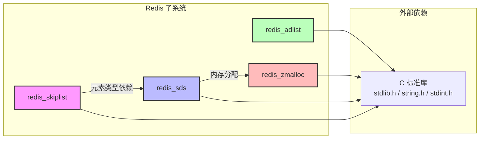

# Redis 子系统架构设计

> 所属项目：book 仓库 | 工程轨道：`engineering/` | 模块：`redis/`
> 源码路径：`engineering/include/redis/`（头文件）、`engineering/src/redis/`（实现）
> 最后更新：2026-07-16

---

## 目录

1. [子系统架构概览](#1-子系统架构概览)
2. [SDS 模块](#2-sds-模块)
3. [双端链表模块](#3-双端链表模块)
4. [跳表模块](#4-跳表模块)
5. [模块间依赖关系](#5-模块间依赖关系)
6. [关键代码位置](#6-关键代码位置)

---

## 1. 子系统架构概览

Redis 子系统是本仓库中对 Redis 核心数据结构的移植实现，包含四个基础组件，构成了所有上层数据结构模块的基石。



**设计原则：**

- **轻量无依赖**：每个模块仅依赖 C 标准库，`redis_skiplist` 额外依赖 `redis_sds` 作为元素类型
- **内存兼容**：`redis_zmalloc` 提供统一的内存分配接口，当前为空壳直通 `malloc`，预留统计扩展点
- **指针安全**：SDS 采用"指针指向 buf 而非 header"的惯例，与 Redis 官方一致，通过负偏移访问 header

---

## 2. SDS 模块

### 2.1 类型体系

SDS（Simple Dynamic String）是 Redis 自研的动态字符串，替代 C 的 `char*`，提供 O(1) 长度获取和预分配机制。



**类型选择策略：**

| 长度范围 | 使用的类型 | 头开销 | 说明 |
|----------|-----------|--------|------|
| 0-31 | sdshdr5 | 1 字节 | 长度编码在 flags 的高 5 位，无 alloc 字段 |
| 32-255 | sdshdr8 | 3 字节 | len 和 alloc 各 1 字节 |
| 256-65535 | sdshdr16 | 5 字节 | len 和 alloc 各 2 字节 |
| 65536-4GB | sdshdr32 | 9 字节 | len 和 alloc 各 4 字节 |
| 4GB+ | sdshdr64 | 17 字节 | len 和 alloc 各 8 字节 |

### 2.2 内存布局

SDS 的核心设计亮点：`s` 指针指向 `buf[]` 起始位置，而非 header 起始位置，使得 SDS 可以直接传递给 C 标准库的字符串函数。



**关键宏与内联函数：**

```c
// 从 s 指针获取 header 结构体指针
#define REDIS_SDS_HDR(T, s) \
    ((struct redis_sds_hdr##T *)((s) - (sizeof(struct redis_sds_hdr##T))))

// 获取长度：通过 s[-1] 读取 flags 字节，再根据 type 分发
static inline size_t redis_sds_len(const redis_sds s) {
    unsigned char flags = s[-1];
    switch(flags & REDIS_SDS_TYPE_MASK) { ... }
}
```

**预分配策略：** `REDIS_SDS_MAX_PREALLOC = 1024 * 1024`（1MB），当字符串长度小于 1MB 时按 2 倍扩容，超过时按每次 1MB 增量扩容，避免频繁 realloc。

### 2.3 核心 API

| API 声明 | 功能 |
|----------|------|
| `redis_sds_new_len(init, len)` | 根据指定长度创建 SDS |
| `redis_sds_try_new_len(init, len)` | 尝试创建，失败返回 NULL |
| `redis_sds_new(init)` | 根据 C 字符串创建 SDS |

---

## 3. 双端链表模块

### 3.1 数据结构



### 3.2 节点插入操作



### 3.3 节点删除操作



### 3.4 迭代器模式

链表提供独立的迭代器类型，支持正向（从头到尾）和反向（从尾到头）两种遍历方向：

```c
redis_list_iter_t *iter = redis_list_get_iter(list, AL_START_HEAD);
redis_dlist_node_t *node;
while ((node = redis_list_next(iter)) != NULL) {
    // 处理 node->val
}
redis_list_release_iter(iter);
```

### 3.5 核心 API 分类

| 分类 | API | 说明 |
|------|-----|------|
| 创建/释放 | `redis_list_create()` | 创建空链表 |
| | `redis_list_release()` | 释放整个链表（含节点和值） |
| 头尾插入 | `redis_list_add_node_head()` | 头插 |
| | `redis_list_add_node_tail()` | 尾插 |
| 任意位置 | `redis_list_insert_node()` | 在指定节点前/后插入 |
| 删除 | `redis_list_del_node()` | 删除指定节点 |
| 旋转 | `redis_list_rotate_head_to_tail()` | 头节点移到尾部 |
| 查找 | `redis_list_search_key()` | 按 key 查找（match 回调） |
| | `redis_list_index()` | 按索引查找 |
| 合并 | `redis_list_join()` | 合并两个链表 |
| 复制 | `redis_list_dup()` | 深拷贝（dup 回调） |

---

## 4. 跳表模块

### 4.1 数据结构

跳表是一种概率性平衡数据结构，支持 O(log N) 的查找、插入和删除。Redis 将其用作有序集合（zset）的底层实现。



**字段说明：**

| 字段 | 类型 | 说明 |
|------|------|------|
| `ele` | `redis_sds` | 节点存储的元素值（SDS 字符串） |
| `score` | `double` | 排序分值 |
| `backward` | `redis_skiplist_node_t*` | 回退指针（仅 Level 0 使用） |
| `level[].forward` | `redis_skiplist_node_t*` | 各层前进指针 |
| `level[].span` | `unsigned long` | 当前层到下一个节点的跨度（节点数） |
| `header` | `redis_skiplist_node_t*` | 哨兵头节点，不存储实际元素 |
| `tail` | `redis_skiplist_node_t*` | 尾节点指针 |
| `length` | `unsigned long` | 节点总数 |
| `level` | `int` | 当前最大层数 |

**span 的作用：** 记录从当前节点到同层下一个节点之间的"跳跃步数"，用于快速计算排名（rank）—— 在查找过程中累加 span 即可在 O(log N) 时间内得到目标元素的排名。

### 4.2 查找过程



**查找过程文字描述：**

1. 从当前最高层（`skiplist->level - 1`）开始，从 `header` 出发
2. 在当前层遍历，如果 `forward` 节点的 score 小于目标值，则前进并累加 span
3. 如果 `forward` 节点的 score 大于等于目标值，则下降到下一层
4. 重复步骤 2-3，直到 Level 0 遍历完毕
5. `x->level[0]->forward` 即为目标节点（或 NULL 表示不存在）

### 4.3 层高概率分布

跳表使用随机层高，Redis 的实现使用 `1/4` 的概率增长层数，与标准跳表一致：

```
P(level = 1) = 3/4
P(level = 2) = 3/4 * 1/4
P(level = 3) = 3/4 * (1/4)^2
...
P(level = n) = 3/4 * (1/4)^(n-1)
```

最大层数限制为 32（Redis 官方 ZSKIPLIST_MAXLEVEL = 32）。

---

## 5. 模块间依赖关系



**依赖分析：**

| 模块 | 依赖 | 被依赖 | 说明 |
|------|------|--------|------|
| `redis_sds` | `zmalloc`, C 标准库 | `redis_skiplist` | 核心基础模块，供跳表作为元素类型 |
| `redis_adlist` | C 标准库 | 无 | 完全独立，不依赖其他 Redis 模块 |
| `redis_skiplist` | `redis_sds`, C 标准库 | 无 | 使用 SDS 作为元素存储，无反向依赖 |
| `redis_zmalloc` | C 标准库 | `redis_sds` | 内存分配接口，当前为空壳直通 `malloc` |

**依赖图汇总：**

```
redis_skiplist  ──→  redis_sds  ──→  redis_zmalloc  ──→  malloc
redis_adlist    ──→  malloc（直接调用，不经过 zmalloc）
```

---

## 6. 关键代码位置

| 文件 | 模块 | 关键内容 |
|------|------|---------|
| `engineering/include/redis/redis_sds.h` | SDS | 5 种 header 结构体定义、类型宏、内联访问函数（`redis_sds_len`、`redis_sds_avail` 等）、API 声明 |
| `engineering/src/redis/redis_sds.c` | SDS | SDS 创建、扩容、释放等实现 |
| `engineering/include/redis/redis_adlist.h` | 双端链表 | `redis_dlist_node_t`、`redis_dlist_t`、`redis_list_iter_t` 结构体定义、宏函数、API 声明 |
| `engineering/src/redis/redis_adlist.c` | 双端链表 | 链表创建/释放、节点插入/删除、迭代器、旋转、合并、复制实现 |
| `engineering/include/redis/redis_skiplist.h` | 跳表 | `redis_skiplist_node_t`（含 level 柔性数组）、`redis_skiplist_t` 结构体定义 |
| `engineering/src/redis/redis_skiplist.c` | 跳表 | 跳表创建/插入/删除/查找/排名计算实现 |
| `engineering/include/redis/redis_zmalloc.h` | 内存分配器 | 空壳接口，预留统计扩展点 |
| `engineering/src/redis/redis_zmalloc.c` | 内存分配器 | `zmalloc` / `zfree` / `zrealloc` 实现，当前直通标准库 |

---

## 附录：与 Redis 官方的差异

| 特性 | 官方 Redis | 本项目 |
|------|-----------|--------|
| SDS 类型 | 5 种（sdshdr5/8/16/32/64） | 完全相同 |
| 预分配策略 | `SDS_MAX_PREALLOC` = 1MB | 相同 |
| 跳表层高 | 32 层，1/4 概率 | 相同 |
| 内存统计 | `zmalloc` 带统计 | 空壳，直通 `malloc` |
| 链表回调 | dup/free/match | 完全相同 |
| 应用场景 | 完整 Redis 服务器 | 数据结构子集，供索引/算法模块复用 |