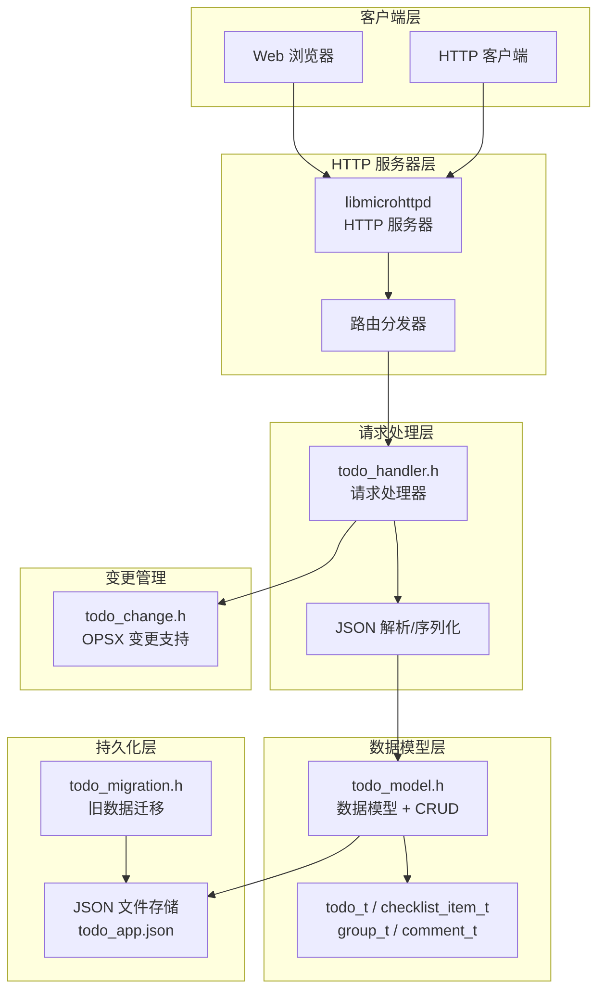
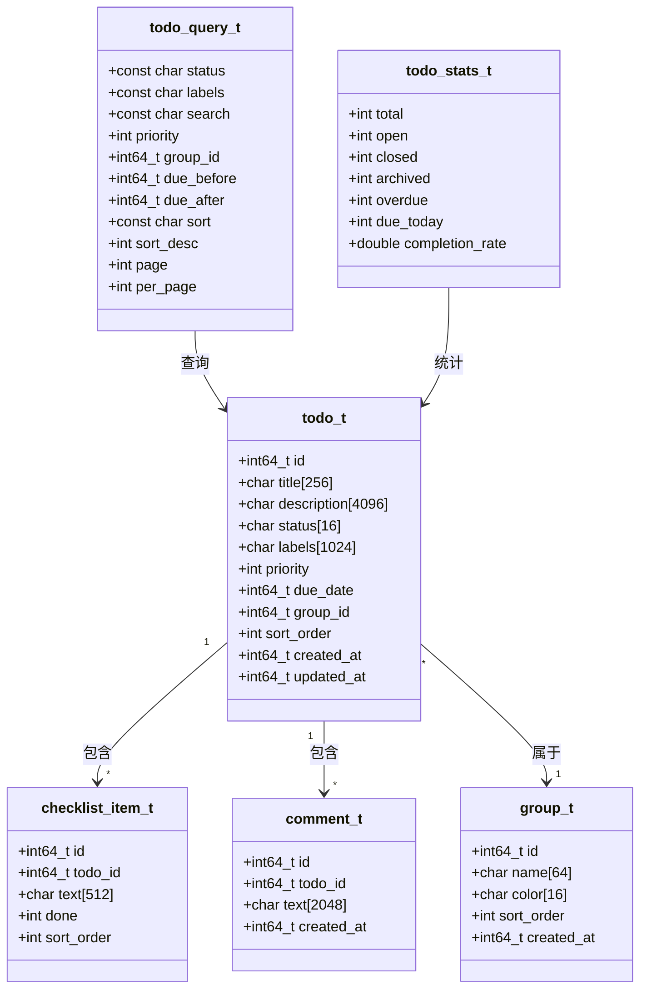
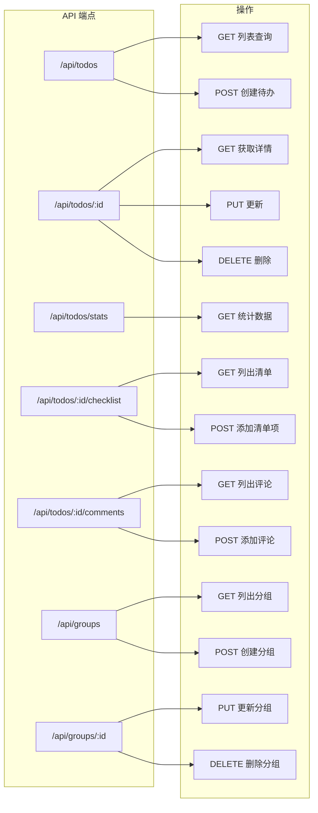
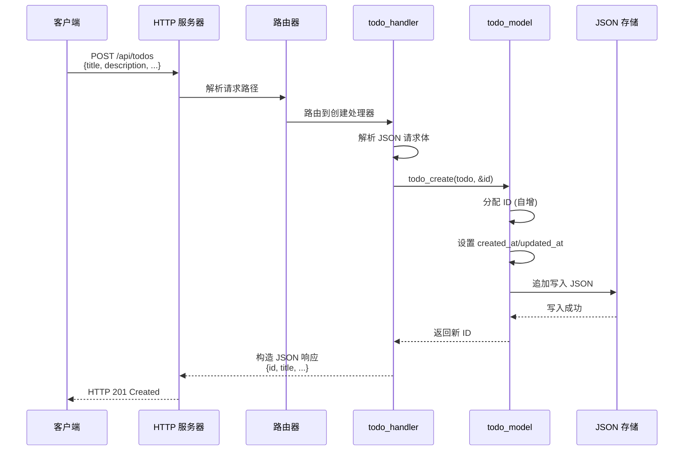
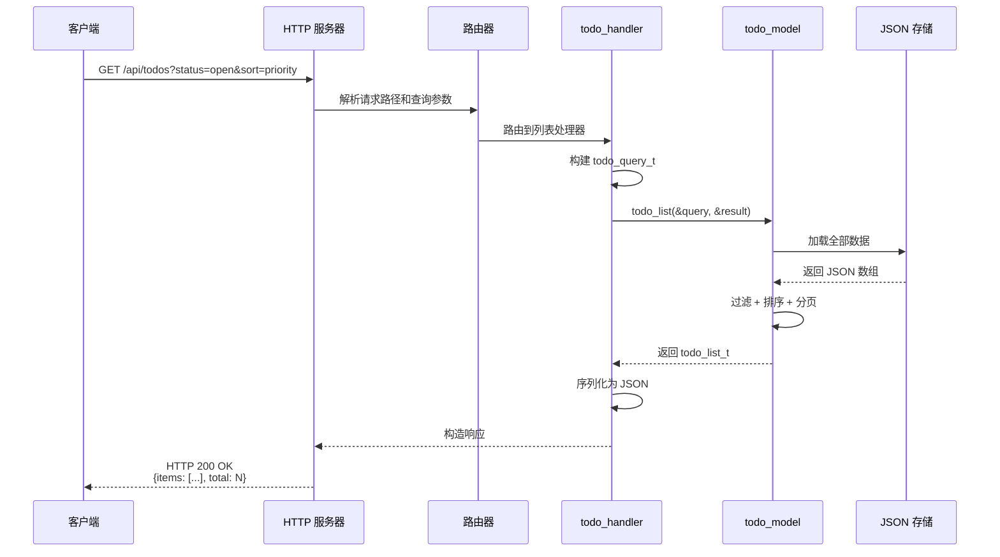
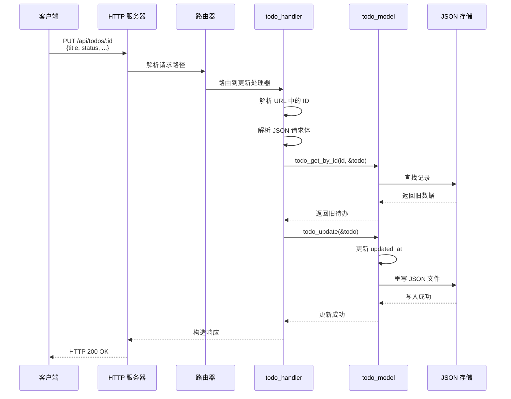
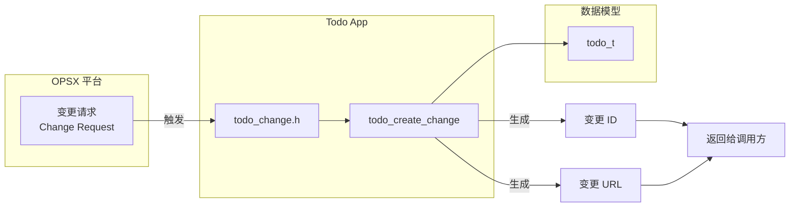

# Todo App 架构设计

## 1. 架构概览



## 2. 数据模型



**优先级常量定义：**

| 常量 | 值 | 含义 |
|------|---|------|
| `PRIORITY_URGENT` | 0 | 紧急 |
| `PRIORITY_HIGH` | 1 | 高 |
| `PRIORITY_MEDIUM` | 2 | 中 |
| `PRIORITY_LOW` | 3 | 低 |
| `PRIORITY_NONE` | 4 | 无优先级 |

## 3. HTTP 路由



**RESTful API 映射表：**

| 端点 | 方法 | 功能 | 对应函数 |
|------|------|------|----------|
| `/api/todos` | GET | 列表查询 | `todo_list()` |
| `/api/todos` | POST | 创建待办 | `todo_create()` |
| `/api/todos/:id` | GET | 获取详情 | `todo_get_by_id()` |
| `/api/todos/:id` | PUT | 更新待办 | `todo_update()` |
| `/api/todos/:id` | DELETE | 删除待办 | `todo_delete()` |
| `/api/todos/stats` | GET | 统计数据 | `todo_get_stats()` |
| `/api/todos/:id/checklist` | GET | 列出清单 | `checklist_list()` |
| `/api/todos/:id/checklist` | POST | 添加清单项 | `checklist_add()` |
| `/api/todos/:id/comments` | GET | 列出评论 | `comment_list()` |
| `/api/todos/:id/comments` | POST | 添加评论 | `comment_add()` |
| `/api/groups` | GET | 列出分组 | `group_list()` |
| `/api/groups` | POST | 创建分组 | `group_create()` |
| `/api/groups/:id` | PUT | 更新分组 | `group_update()` |
| `/api/groups/:id` | DELETE | 删除分组 | `group_delete()` |

## 4. 请求处理流程

### 4.1 创建待办



### 4.2 查询列表



### 4.3 更新待办



## 5. 持久化

```mermaid
flowchart TB
    subgraph 启动流程
        A[main.c 启动] --> B{检查旧数据?}
        B -->|是| C[todo_migrate_from_legacy]
        B -->|否| D[todo_db_load]
        C --> D
        D --> E[加载 JSON 到内存]
        E --> F[构建内存索引]
    end

    subgraph 运行时
        G[CRUD 操作] --> H[修改内存数据]
        H --> I[立即持久化<br/>todo_db_save]
        I --> J[覆盖写 JSON 文件]
    end

    subgraph JSON 结构
        K["{"<br/>  \"todos\": [...],<br/>  \"checklist_items\": [...],<br/>  \"groups\": [...],<br/>  \"comments\": [...],<br/>  \"next_ids\": {...}<br/>}"]
    end

    F --> G
    J --> K
```

**JSON 文件结构：**

```json
{
  "todos": [
    {
      "id": 1,
      "title": "完成架构文档",
      "description": "编写 Todo App 和 vdb_cli 架构设计",
      "status": "open",
      "labels": "[\"文档\", \"架构\"]",
      "priority": 1,
      "due_date": 1723996800,
      "group_id": 2,
      "sort_order": 0,
      "created_at": 1723824000,
      "updated_at": 1723824000
    }
  ],
  "checklist_items": [
    {
      "id": 1,
      "todo_id": 1,
      "text": "读取源码",
      "done": 1,
      "sort_order": 0
    }
  ],
  "groups": [
    {
      "id": 1,
      "name": "工作",
      "color": "#f85149",
      "sort_order": 0,
      "created_at": 1723824000
    }
  ],
  "comments": [
    {
      "id": 1,
      "todo_id": 1,
      "text": "已完成初稿",
      "created_at": 1723824000
    }
  ],
  "next_ids": {
    "todo": 2,
    "checklist_item": 2,
    "group": 2,
    "comment": 2
  }
}
```

## 6. OPSX 变更集成



**OPSX 变更 API：**

```c
/**
 * @brief 创建 OPSX 变更
 * @param todo_id 待办 ID
 * @param out_change_id 输出变更 ID
 * @param change_id_size out_change_id 缓冲区大小
 * @param out_url 输出变更 URL
 * @param url_size out_url 缓冲区大小
 * @return 0 成功，-1 失败
 */
int todo_create_change(int64_t todo_id, 
                       char *out_change_id, size_t change_id_size,
                       char *out_url, size_t url_size);
```

## 7. 关键代码位置

| 模块 | 文件路径 | 核心功能 |
|------|----------|----------|
| 数据模型 | `engineering/apps/todo-app/todo_model.h` | 4 个实体结构体定义 + CRUD API |
| 数据模型实现 | `engineering/apps/todo-app/todo_model.c` | JSON 序列化/反序列化 + 内存管理 |
| HTTP 处理 | `engineering/apps/todo-app/todo_handler.h` | HTTP 服务器初始化/启动/停止 |
| HTTP 处理实现 | `engineering/apps/todo-app/todo_handler.c` | 路由分发 + 请求处理 + 响应构造 |
| 数据迁移 | `engineering/apps/todo-app/todo_migration.h` | 旧版数据迁移接口 |
| 数据迁移实现 | `engineering/apps/todo-app/todo_migration.c` | 检测旧数据 + 格式转换 |
| OPSX 变更 | `engineering/apps/todo-app/todo_change.h` | 变更创建接口 |
| OPSX 变更实现 | `engineering/apps/todo-app/todo_change.c` | 变更 ID/URL 生成 |
| 服务器入口 | `engineering/apps/todo-app/main.c` | 命令行参数解析 + 启动流程 |