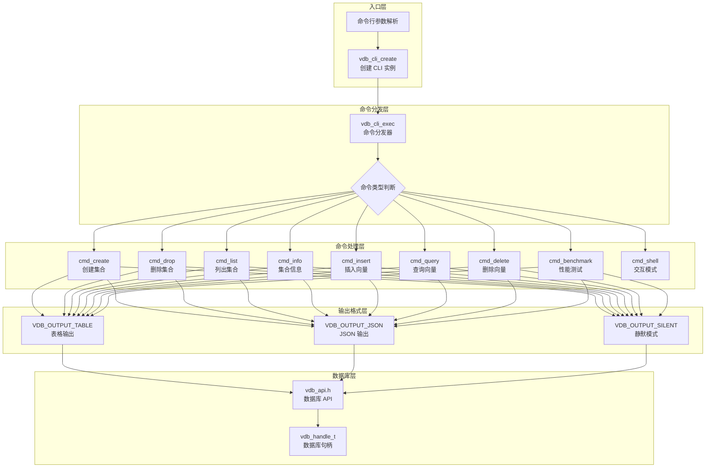
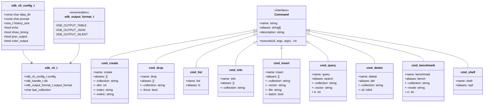
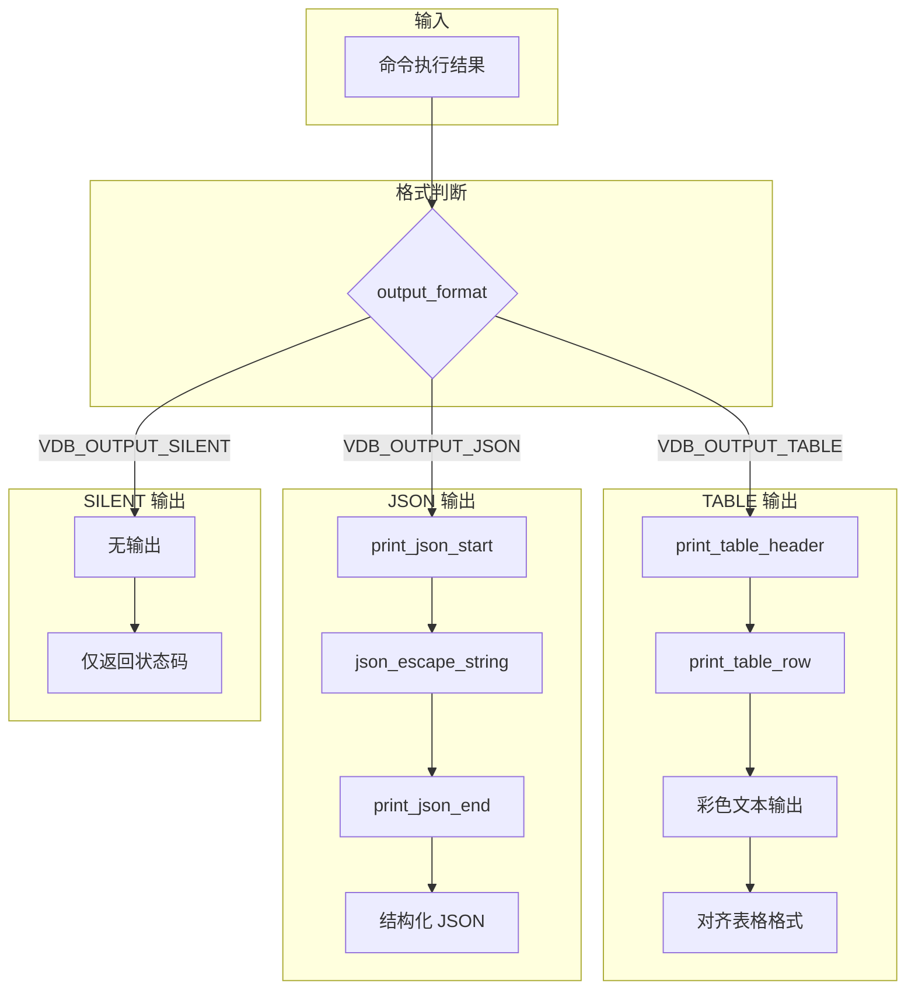
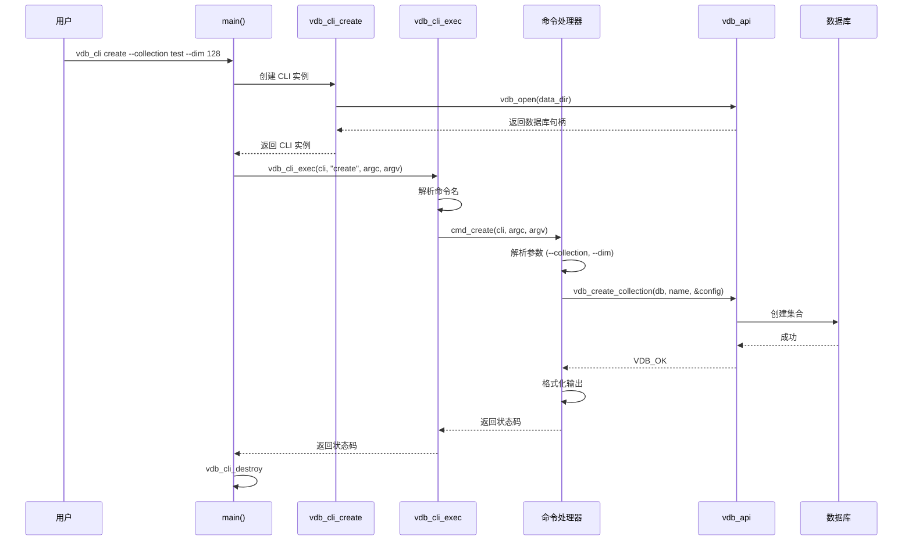
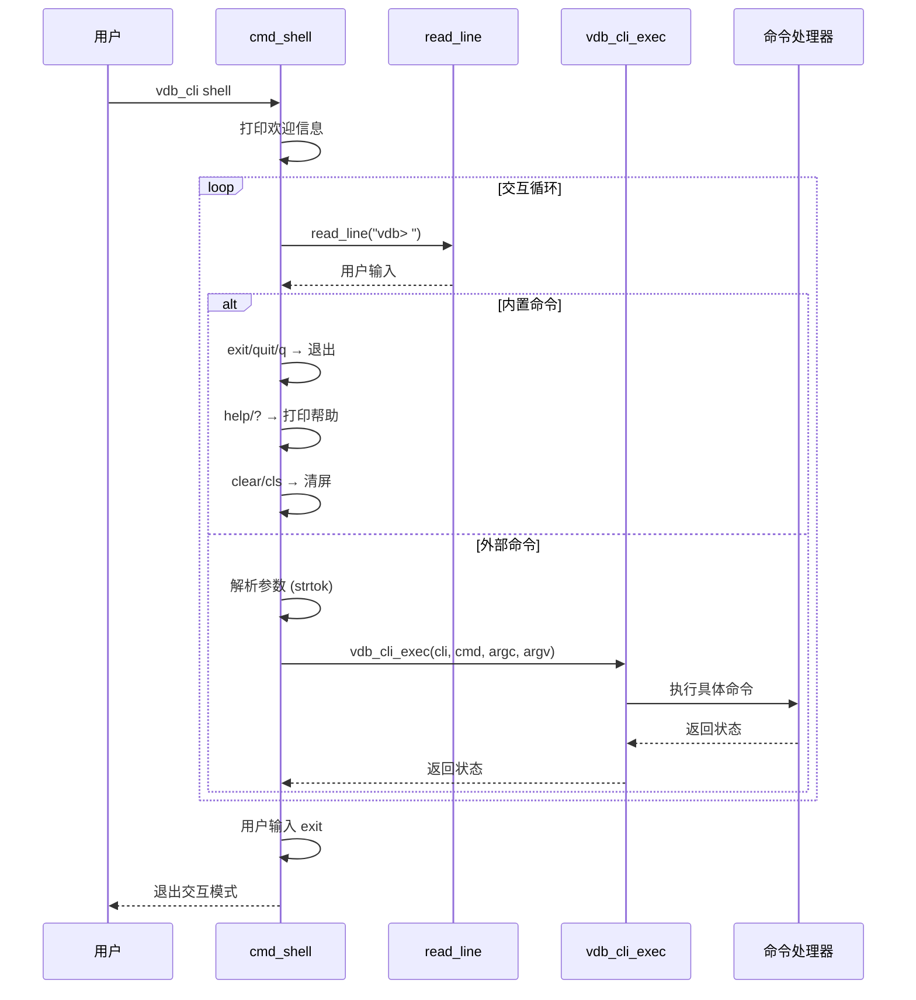
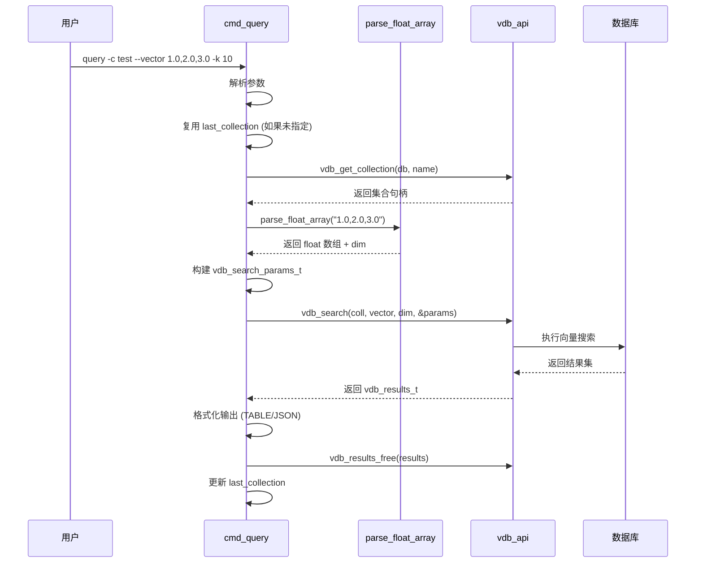

# vdb_cli 架构设计

## 1. 架构概览



## 2. 命令体系



**命令列表：**

| 命令 | 别名 | 功能 | 核心参数 |
|------|------|------|----------|
| `create` | - | 创建集合 | `--collection`, `--dim`, `--index`, `--metric` |
| `drop` | - | 删除集合 | `--collection`, `--force` |
| `list` | `ls` | 列出所有集合 | - |
| `info` | - | 显示集合信息 | `--collection` |
| `insert` | - | 插入向量 | `--collection`, `--vector`, `--file` |
| `query` | `search` | 查询向量 | `--collection`, `--vector`, `-k` |
| `delete` | `del` | 删除向量 | `--collection`, `--id` |
| `benchmark` | `bench` | 性能测试 | `--collection`, `--mode`, `-n` |
| `shell` | `repl` | 交互式模式 | - |

## 3. 输出格式



**TABLE 输出示例：**

```
+------------------+------------------+------------------+
| 集合名称         | 向量数           | 维度             |
+------------------+------------------+------------------+
| test             | 1000             | 128              |
| myvec            | 500              | 256              |
+------------------+------------------+------------------+
共 2 个集合。
```

**JSON 输出示例：**

```json
{
  "success": true,
  "command": "list",
  "collections": ["test", "myvec"],
  "count": 2
}
```

**格式切换：**

```c
// 设置输出格式
void vdb_cli_set_output_format(vdb_cli_t *cli, vdb_output_format_t format);

// 获取当前格式
vdb_output_format_t vdb_cli_get_output_format(vdb_cli_t *cli);
```

## 4. 命令执行流程

### 4.1 单次命令执行



### 4.2 交互模式 (shell)



### 4.3 向量查询流程



## 5. 核心数据结构

### 5.1 CLI 配置

```c
typedef struct vdb_cli_config_s {
    const char *data_dir;        // 数据目录路径
    const char *prompt;          // 命令提示符
    size_t history_size;         // 历史记录条数
    bool echo;                   // 回显命令
    bool show_timing;            // 显示执行时间
    bool json_output;            // JSON 输出模式
    bool color_output;           // 彩色输出
} vdb_cli_config_t;

// 默认配置
#define VDB_CLI_DEFAULT_CONFIG { \
    .data_dir = "./vdb_data",   \
    .prompt = "vdb> ",          \
    .history_size = 100,        \
    .echo = true,               \
    .show_timing = true,        \
    .json_output = false,       \
    .color_output = true        \
}
```

### 5.2 CLI 实例

```c
struct vdb_cli_s {
    vdb_cli_config_t config;           // 配置
    vdb_handle_t *db;                  // 数据库句柄
    vdb_output_format_t output_format; // 输出格式
    char *last_collection;             // 上次使用的集合名
};
```

### 5.3 输出格式枚举

```c
typedef enum {
    VDB_OUTPUT_TABLE,   // 表格输出
    VDB_OUTPUT_JSON,    // JSON 输出
    VDB_OUTPUT_SILENT   // 静默模式
} vdb_output_format_t;
```

## 6. 关键代码位置

| 模块 | 文件路径 | 核心功能 |
|------|----------|----------|
| CLI 接口定义 | `engineering/apps/vdb_cli/vdb_cli.h` | 配置结构体、上下文、输出格式、公共 API |
| CLI 实现 | `engineering/apps/vdb_cli/vdb_cli.c` | 9 个命令处理函数、JSON/表格输出、命令分发 |
| 数据库 API | `engineering/include/db/vdb_api.h` | vdb_open/close、集合管理、向量操作 |
| 日志模块 | `engineering/include/db/log.h` | 日志输出 |

**vdb_cli.c 核心函数：**

| 函数名 | 行号 | 功能 |
|--------|------|------|
| `cmd_create` | 187-264 | 创建集合命令处理 |
| `cmd_drop` | 270-310 | 删除集合命令处理 |
| `cmd_list` | 316-381 | 列出集合命令处理 |
| `cmd_info` | 387-443 | 集合信息命令处理 |
| `cmd_insert` | 449-584 | 插入向量命令处理 |
| `cmd_query` | 590-701 | 查询向量命令处理 |
| `cmd_delete` | 707-761 | 删除向量命令处理 |
| `cmd_benchmark` | 767-882 | 性能测试命令处理 |
| `cmd_shell` | 901-955 | 交互式模式 |
| `vdb_cli_exec` | 1125-1159 | 命令分发器 |
| `vdb_cli_create` | 1086-1112 | 创建 CLI 实例 |
| `vdb_cli_destroy` | 1114-1119 | 销毁 CLI 实例 |
| `parse_float_array` | 82-112 | 解析逗号分隔的浮点数组 |
| `print_table_header/row` | 158-181 | 表格输出辅助函数 |
| `print_json_start/end` | 146-152 | JSON 输出辅助函数 |