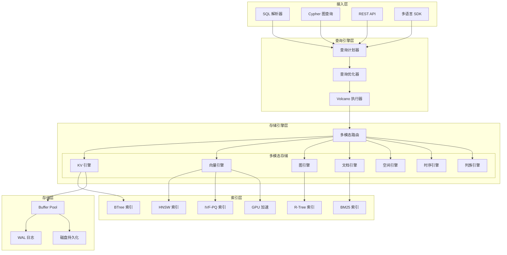
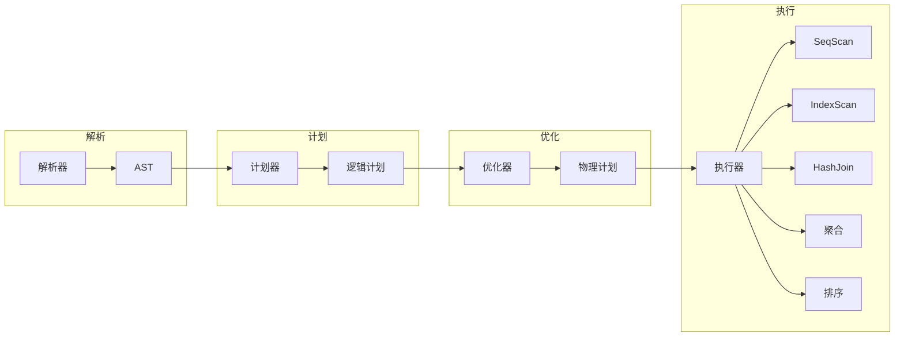
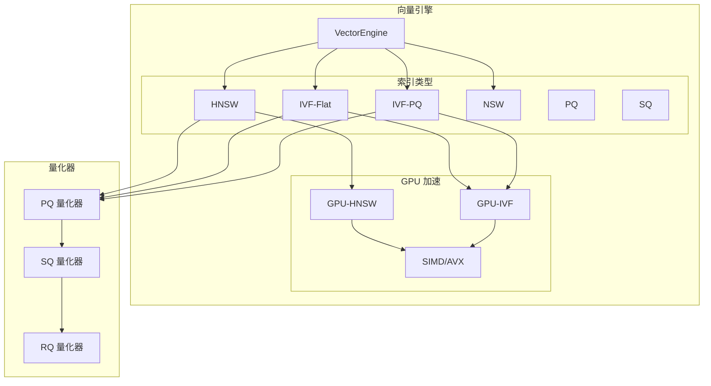
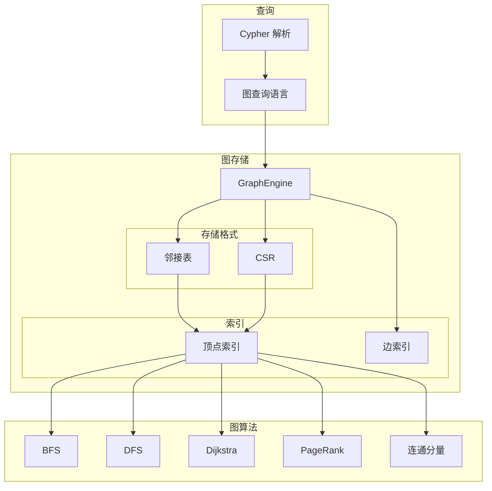
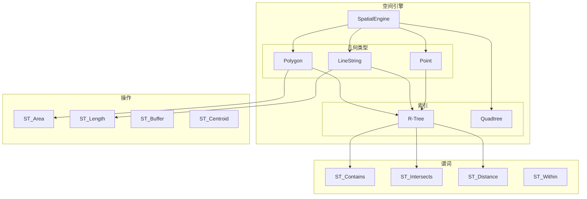
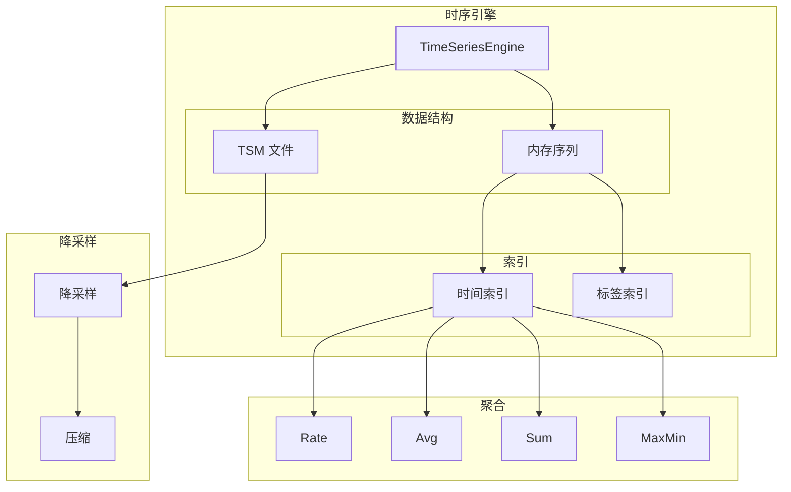
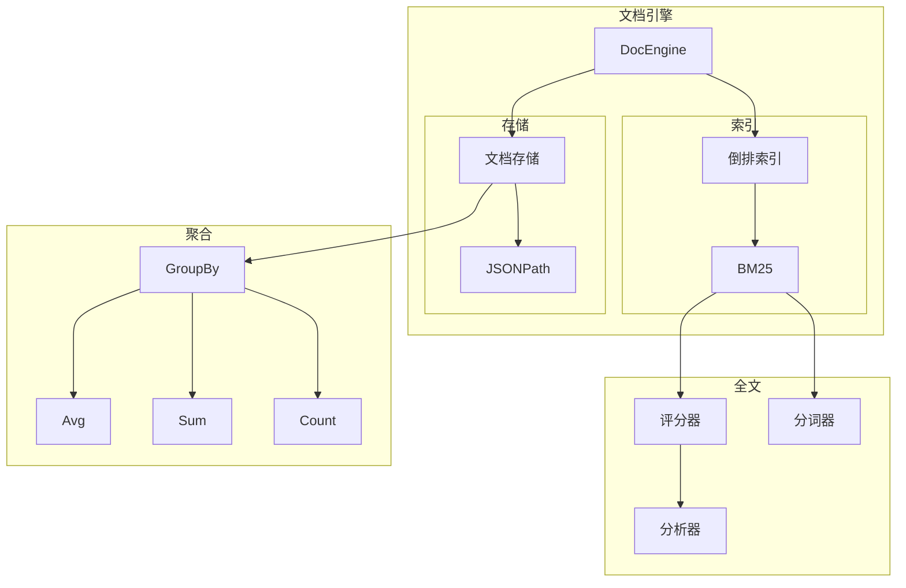
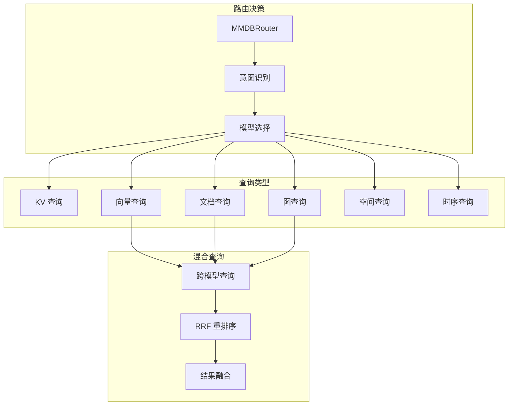
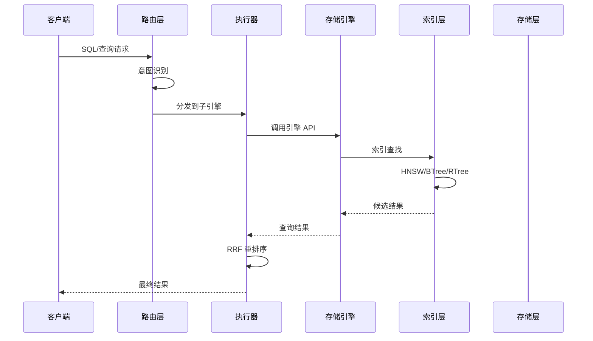

# 多模态数据库架构

## 整体架构

```mermaid
graph TB
    subgraph "接入层"
        SQL[SQL 解析器]
        Cypher[Cypher 图查询]
        REST[REST API]
        SDK[多语言 SDK]
    end

    subgraph "查询引擎层"
        Planner[查询计划器]
        Optimizer[查询优化器]
        Executor[Volcano 执行器]
    end

    subgraph "存储引擎层"
        subgraph "多模态存储"
            KV[KV 引擎]
            Vector[向量引擎]
            Graph[图引擎]
            Doc[文档引擎]
            Spatial[空间引擎]
            TS[时序引擎]
            CF[列族引擎]
        end
        MM[多模态路由]
    end

    subgraph "索引层"
        HNSW[HNSW 索引]
        IVF_PQ[IVF-PQ 索引]
        BTree[BTree 索引]
        RTree[R-Tree 索引]
        BM25[BM25 索引]
        GPU[GPU 加速]
    end

    subgraph "存储层"
        Buffer[Buffer Pool]
        WAL[WAL 日志]
        Disk[磁盘持久化]
    end

    SQL --> Planner
    Cypher --> Planner
    REST --> Planner
    SDK --> Planner
    Planner --> Optimizer
    Optimizer --> Executor
    Executor --> MM
    MM --> KV
    MM --> Vector
    MM --> Graph
    MM --> Doc
    MM --> Spatial
    MM --> TS
    MM --> CF
    Vector --> HNSW
    Vector --> IVF_PQ
    Vector --> GPU
    Graph --> RTree
    Doc --> BM25
    KV --> BTree
    KV --> Buffer
    Buffer --> WAL
    Buffer --> Disk
```

## 子模块架构

### 1. SQL 执行引擎

```mermaid
graph LR
    subgraph "解析"
        Parser[解析器]
        AST[AST]
    end

    subgraph "计划"
        Planner[计划器]
        Plan[逻辑计划]
    end

    subgraph "优化"
        Optimizer[优化器]
        PhysPlan[物理计划]
    end

    subgraph "执行"
        Executor[执行器]
        SeqScan[SeqScan]
        IndexScan[IndexScan]
        HashJoin[HashJoin]
        Agg[聚合]
        Sort[排序]
    end

    Parser --> AST --> Planner --> Plan --> Optimizer --> PhysPlan --> Executor
    Executor --> SeqScan
    Executor --> IndexScan
    Executor --> HashJoin
    Executor --> Agg
    Executor --> Sort
```

### 2. 向量存储引擎

```mermaid
graph TB
    subgraph "向量引擎"
        VE[VectorEngine]
        subgraph "索引类型"
            HNSW[HNSW]
            IVF[IVF-Flat]
            IVF_PQ[IVF-PQ]
            NSW[NSW]
            PQ[PQ]
            SQ[SQ]
        end
        subgraph "GPU 加速"
            GPU_HNSW[GPU-HNSW]
            GPU_IVF[GPU-IVF]
            SIMD[SIMD/AVX]
        end
    end

    subgraph "量化器"
        PQ_Codec[PQ 量化器]
        SQ_Codec[SQ 量化器]
        RQ_Codec[RQ 量化器]
    end

    VE --> HNSW
    VE --> IVF
    VE --> IVF_PQ
    VE --> NSW
    HNSW --> GPU_HNSW
    IVF --> GPU_IVF
    IVF_PQ --> GPU_IVF
    HNSW --> PQ_Codec
    IVF --> PQ_Codec
    IVF_PQ --> PQ_Codec
    PQ_Codec --> SQ_Codec
    SQ_Codec --> RQ_Codec
    GPU_HNSW --> SIMD
    GPU_IVF --> SIMD
```

### 3. 图存储引擎

```mermaid
graph TB
    subgraph "图存储"
        GE[GraphEngine]
        subgraph "存储格式"
            AdjList[邻接表]
            CSR[CSR]
        end
        subgraph "索引"
            VertexIndex[顶点索引]
            EdgeIndex[边索引]
        end
    end

    subgraph "图算法"
        BFS[BFS]
        DFS[DFS]
        Dijkstra[Dijkstra]
        PageRank[PageRank]
        CC[连通分量]
    end

    subgraph "查询"
        Cypher[Cypher 解析]
        GQL[图查询语言]
    end

    GE --> AdjList
    GE --> CSR
    AdjList --> VertexIndex
    CSR --> VertexIndex
    GE --> EdgeIndex
    VertexIndex --> BFS
    VertexIndex --> DFS
    VertexIndex --> Dijkstra
    VertexIndex --> PageRank
    VertexIndex --> CC
    Cypher --> GQL
    GQL --> GE
```

### 4. 空间存储引擎

```mermaid
graph TB
    subgraph "空间引擎"
        SE[SpatialEngine]
        subgraph "几何类型"
            Point[Point]
            Line[LineString]
            Poly[Polygon]
        end
        subgraph "索引"
            RTree[R-Tree]
            Quad[Quadtree]
        end
    end

    subgraph "谓词"
        ST_Contains[ST_Contains]
        ST_Intersects[ST_Intersects]
        ST_Distance[ST_Distance]
        ST_Within[ST_Within]
    end

    subgraph "操作"
        ST_Area[ST_Area]
        ST_Length[ST_Length]
        ST_Buffer[ST_Buffer]
        ST_Centroid[ST_Centroid]
    end

    SE --> Point
    SE --> Line
    SE --> Poly
    Point --> RTree
    Line --> RTree
    Poly --> RTree
    SE --> Quad
    RTree --> ST_Contains
    RTree --> ST_Intersects
    RTree --> ST_Distance
    Poly --> ST_Area
    Line --> ST_Length
```

### 5. 时序存储引擎

```mermaid
graph TB
    subgraph "时序引擎"
        TSE[TimeSeriesEngine]
        subgraph "数据结构"
            TSM[TSM 文件]
            MemSeries[内存序列]
        end
        subgraph "索引"
            TSIndex[时间索引]
            TagIndex[标签索引]
        end
    end

    subgraph "聚合"
        Rate[Rate]
        Avg[Avg]
        Sum[Sum]
        MaxMin[MaxMin]
    end

    subgraph "降采样"
        Downsample[降采样]
        Compaction[压缩]
    end

    TSE --> TSM
    TSE --> MemSeries
    MemSeries --> TSIndex
    MemSeries --> TagIndex
    TSIndex --> Rate
    TSIndex --> Avg
    TSIndex --> Sum
    TSIndex --> MaxMin
    TSM --> Downsample
    Downsample --> Compaction
```

### 6. 文档存储引擎

```mermaid
graph TB
    subgraph "文档引擎"
        DE[DocEngine]
        subgraph "索引"
            Inverted[倒排索引]
            BM25[BM25]
        end
        subgraph "存储"
            DocStore[文档存储]
            JSONPath[JSONPath]
        end
    end

    subgraph "聚合"
        GroupBy[GroupBy]
        Count[Count]
        Sum[Sum]
        Avg[Avg]
    end

    subgraph "全文"
        Tokenizer[分词器]
        Analyzer[分析器]
        Scorer[评分器]
    end

    DE --> Inverted
    DE --> DocStore
    Inverted --> BM25
    DocStore --> JSONPath
    BM25 --> Tokenizer
    BM25 --> Scorer
    Scorer --> Analyzer
    DocStore --> GroupBy
    GroupBy --> Count
    GroupBy --> Sum
    GroupBy --> Avg
```

### 7. 多模态路由

```mermaid
graph TB
    subgraph "路由决策"
        Router[MMDBRouter]
        Intent[意图识别]
        Select[模型选择]
    end

    subgraph "查询类型"
        KV_Q[KV 查询]
        Vec_Q[向量查询]
        Graph_Q[图查询]
        Doc_Q[文档查询]
        Spatial_Q[空间查询]
        TS_Q[时序查询]
    end

    subgraph "混合查询"
        CrossModel[跨模型查询]
        RRF[RRF 重排序]
        Fusion[结果融合]
    end

    Router --> Intent
    Intent --> Select
    Select --> KV_Q
    Select --> Vec_Q
    Select --> Graph_Q
    Select --> Doc_Q
    Select --> Spatial_Q
    Select --> TS_Q
    Vec_Q --> CrossModel
    Doc_Q --> CrossModel
    Graph_Q --> CrossModel
    CrossModel --> RRF
    RRF --> Fusion
```

## 数据流

```mermaid
sequenceDiagram
    participant Client as 客户端
    participant Router as 路由层
    participant Executor as 执行器
    participant Engine as 存储引擎
    participant Index as 索引层
    participant Storage as 存储层

    Client->>Router: SQL/查询请求
    Router->>Router: 意图识别
    Router->>Executor: 分发到子引擎
    Executor->>Engine: 调用引擎 API
    Engine->>Index: 索引查找
    Index->>Index: HNSW/BTree/RTree
    Index-->>Engine: 候选结果
    Engine-->>Executor: 查询结果
    Executor->>Executor: RRF 重排序
    Executor-->>Client: 最终结果
```
