# CCEH 索引设计与实现文档

## 1. 概述

### 1.1 什么是 CCEH

CCEH（Cache-Conscious Extendible Hashing，缓存感知的可扩展哈希）是一种高性能内存哈希索引算法。它结合了以下特性：

| 特性 | 描述 |
|------|------|
| **可扩展性** | 通过目录扩容动态适应数据增长 |
| **缓存友好** | 按 Cache Line (64B) 对齐，减少伪共享 |
| **并发安全** | 支持多线程并发读写 |
| **Copy-On-Write** | 写操作使用克隆策略，保证原子性 |

### 1.2 项目位置

```
engineering/
|--- include/db/index/hash/
|    +--- cceh.h           # 公共 API
|--- src/db/index/hash/cceh/
     +--- cceh_hash_core.c      # 核心辅助 + 生命周期
     +--- cceh_hash_insert.c    # 插入 + 分裂逻辑
     +--- cceh_hash_search.c    # 无锁查找
     +--- cceh_hash_delete.c    # 删除操作
     +--- cceh_hash_private.h   # 内部声明
```

---

## 2. 核心数据结构

### 2.1 整体架构图

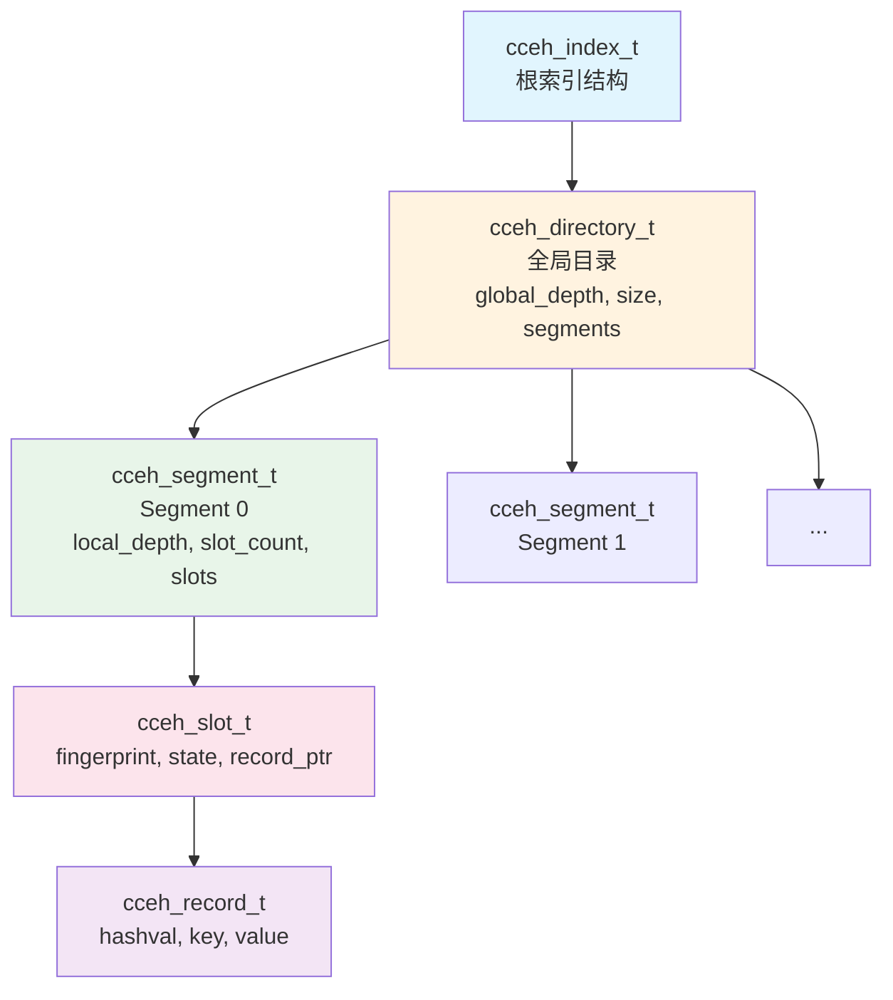

### 2.2 数据结构定义

#### 2.2.1 索引主结构

```c
struct cceh_index {
    atomic_uint        n_total;              /* 活跃记录数 */
    uint32_t           segment_capacity;     /* 每个 segment 的固定容量 */
    atomic_uint        segment_count;        /* 已分配 segment 数 */
    atomic_uint        persist_epoch;        /* 持久化发布序号 */
    atomic_uint        global_epoch;         /* 并发读保护用全局 epoch */
    atomic_flag        directory_latch;      /* 目录扩容/替换锁 */
    atomic_uintptr_t   directory_root;        /* 当前生效目录 */
    
    /* 线程 epoch 注册表 */
    cceh_thread_epoch_t *thread_epochs;
    
    /* 延迟回收链表 */
    cceh_retired_directory_t  *retired_directories;
    cceh_retired_segment_t    *retired_segments;
    cceh_retired_record_t     *retired_records;
};
```

#### 2.2.2 目录结构

```c
typedef struct cceh_directory {
    uint32_t         version;       /* 版本号，用于一致性检测 */
    uint32_t         global_depth;  /* 全局深度 */
    uint32_t         size;          /* 目录大小 = 2^global_depth */
    cceh_segment_t **segments;      /* segment 指针数组 */
} cceh_directory_t;
```

#### 2.2.3 Segment 结构

```c
typedef struct cceh_segment {
    atomic_flag  latch;             /* 段锁 */
    atomic_uint  pin_count;         /* 读者 pin 计数 */
    atomic_uint  version;           /* 版本号（奇数表示正在写入） */
    atomic_bool  retired;           /* 是否已退休 */
    uint32_t     persist_epoch;     /* 持久化发布序号 */
    uint32_t     local_depth;       /* 局部深度 */
    uint32_t     slot_count;        /* 已用槽数 */
    uint32_t     capacity;          /* 槽容量 */
    cceh_slot_t *slots;             /* 槽位数组 */
} cceh_segment_t;
```

#### 2.2.4 Slot 和 Record

```c
/* 槽位：fingerprint 用于快速过滤，record_ptr 指向真实记录 */
typedef struct cceh_slot {
    atomic_uchar     fingerprint;   /* 指纹（哈希值的一部分） */
    atomic_uchar     state;         /* EMPTY=0, LIVE=1 */
    uint16_t         reserved16;
    uint32_t         reserved32;
    atomic_uintptr_t record_ptr;    /* 指向 cceh_record_t */
} cceh_slot_t;

/* 实际记录：存储 key-value 对 */
typedef struct cceh_record {
    uint32_t hashval;   /* 缓存哈希值，避免重复计算 */
    void    *key;
    uint32_t keylen;
    void    *value;
    uint32_t valuelen;
} cceh_record_t;
```

---

## 3. 核心原理

### 3.1 可扩展哈希的基本思想

CCEH 是**可扩展哈希**（Extendible Hashing）的变体，核心思想：

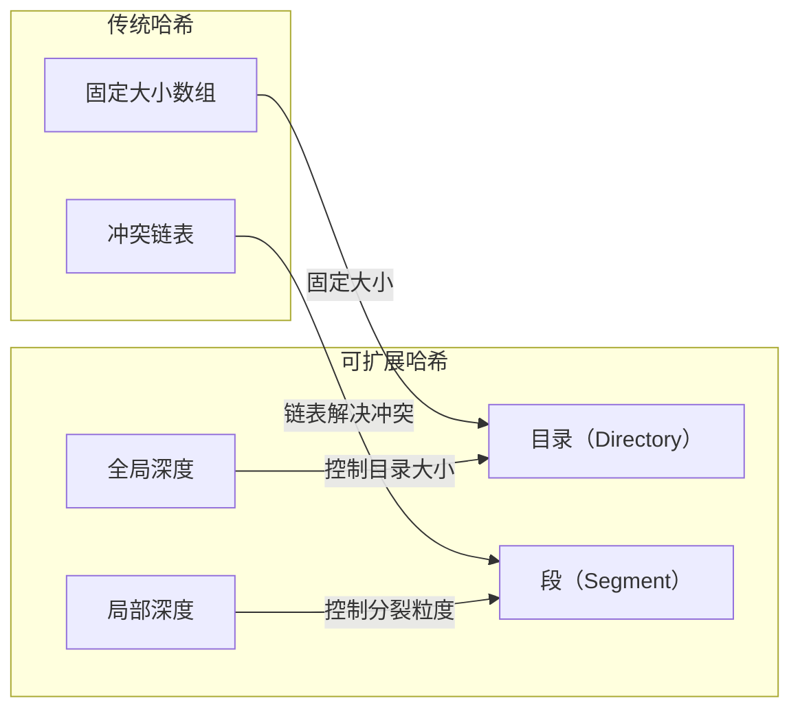

### 3.2 目录索引计算

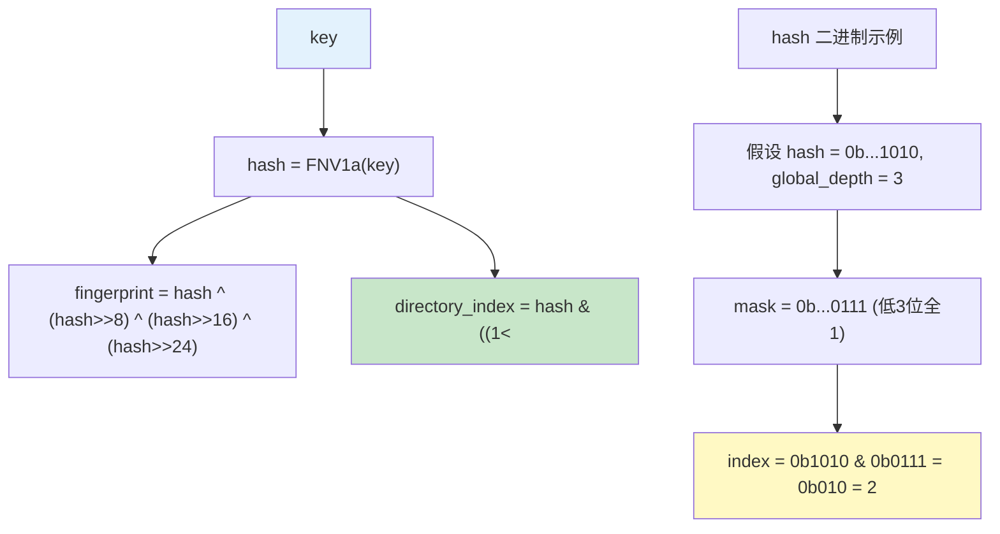

### 3.3 局部深度与全局深度

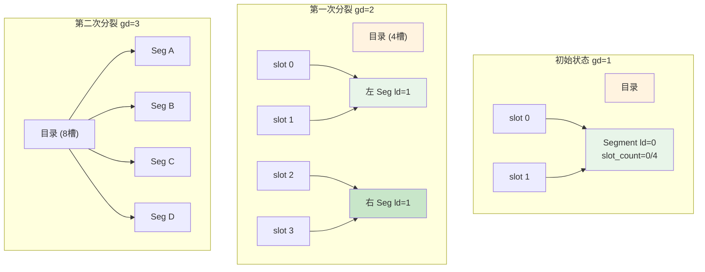

**关键公式：**

| 概念 | 公式 |
|------|------|
| 目录大小 | `size = 2^global_depth` |
| 目录索引 | `index = hash & (size - 1)` |
| Segment 分配 | `split_bit = 1 << local_depth`<br/>`segment = (hash & split_bit) ? right : left` |
| 触发目录扩容 | `当 old_local_depth == global_depth 时`<br/>`new_global_depth = global_depth + 1` |

---

## 4. 操作流程详解

### 4.1 Insert 操作

#### 4.1.1 Insert 完整流程图

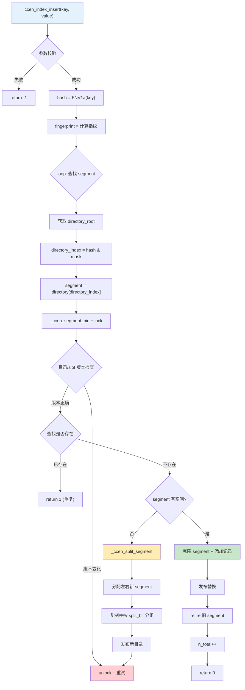

#### 4.1.2 分裂操作详解

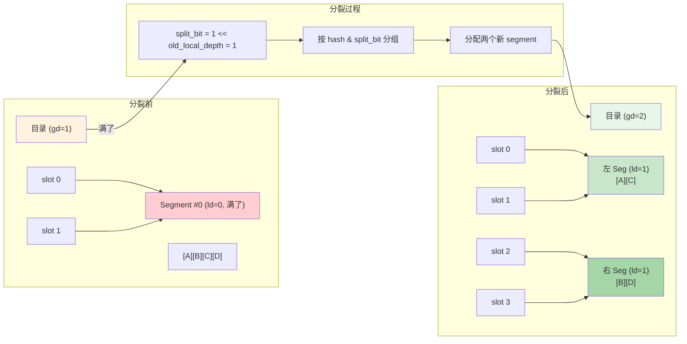

#### 4.1.3 Copy-On-Write 机制

```mermaid
sequenceDiagram
    participant Thread as 写线程
    participant OldSeg as 旧 Segment
    participant NewSeg as 新 Segment
    participant Dir as 目录
    
    Thread->>OldSeg: _cceh_segment_lock()
    Thread->>+OldSeg: 读取所有记录
    Thread->>NewSeg: _cceh_segment_create()
    Thread->>NewSeg: 克隆记录 + 新记录
    Thread->>+Dir: _cceh_directory_lock()
    
    Note over Dir: 更新 segment 指针
    Dir->>Dir: segments[i] = NewSeg
    
    Thread->>Dir: 原子发布新目录
    Thread->>-Dir: _cceh_directory_unlock()
    
    Thread->>OldSeg: 标记 retired
    Thread->>Thread: 加入 retired_segments 链表
    
    Note over Thread,OldSeg: 旧 segment 被延迟回收
```

### 4.2 Lookup 操作

#### 4.2.1 无锁查找流程

```mermaid
flowchart TD
    A["cceh_index_lookup(key)"] --> B["hash = FNV1a(key)"]
    B --> C["fingerprint = 计算指纹"]
    
    C --> D["_cceh_reader_enter<br/>(注册 epoch)"]
    
    E["loop: 查找记录"]
    E --> F["获取 directory_root"]
    F --> G["directory_index = hash & mask"]
    G --> H["segment = directory[directory_index]"]
    
    H --> I["_cceh_segment_pin()"]
    I --> J["version_before = version"]
    J --> K{"version 是奇数?"}
    K -->|是 (正在写入)| L["unpin + continue"]
    L --> E
    K -->|否| M["_cceh_segment_find_record"]
    
    M --> N{"找到?"}
    N -->|是| O["读取 record"]
    O --> P["version_after = version"]
    P --> Q{"version 一致?"}
    Q -->|是| R["return 0 + value"]
    Q -->|否| L
    N -->|否| S["unpin + return -1"]
    
    style A fill:#e1f5fe
    style D fill:#fff9c4
    style L fill:#ffcdd2
    style R fill:#c8e6c9
```

#### 4.2.2 版本检测机制

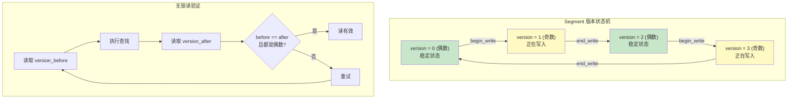

### 4.3 Update (Upsert) 操作

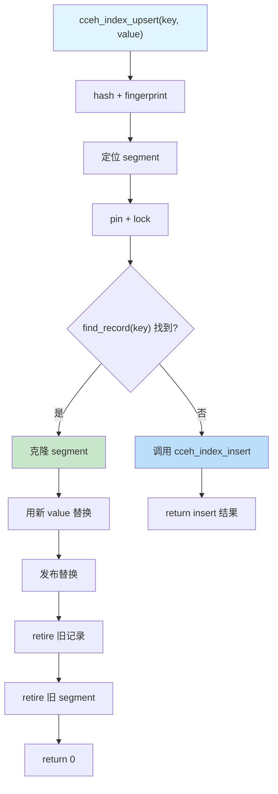

### 4.4 Delete 操作

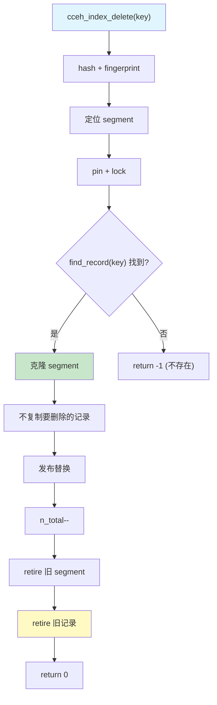

---

## 5. 并发控制机制

### 5.1 多层锁机制


### 5.2 Epoch 延迟回收机制

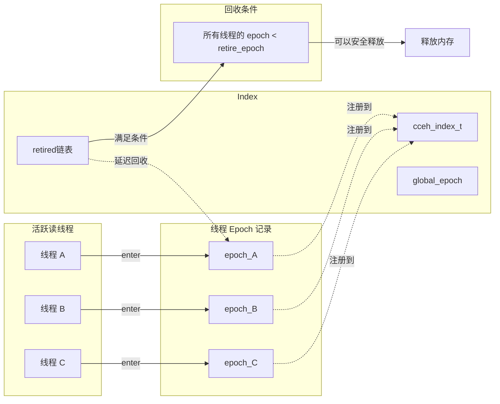

#### 5.2.1 Epoch 回收伪代码

```c
void _cceh_reclaim_retired(cceh_index_t *index) {
    uint32_t min_active_epoch = _cceh_min_active_epoch(index);
    
    // 遍历所有 retired 链表
    // 如果 retire_epoch < min_active_epoch 且没有活跃读者，可以回收
    for (node in retired_segments) {
        if (node->retire_epoch < min_active_epoch &&
            atomic_load(&node->segment->pin_count) == 0) {
            _cceh_segment_drop(node->segment, drop_records);
            free(node);
        }
    }
}
```

### 5.3 持久化支持

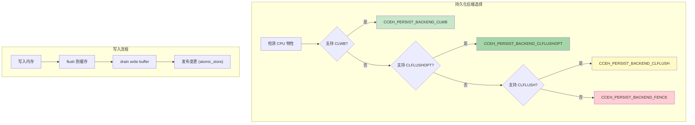

| 后端 | 指令 | 说明 |
|------|------|------|
| CLWB | `_mm_clwb()` | 最优：写回但不失效缓存 |
| CLFLUSHOPT | `_mm_clflushopt()` | 优化版 flush |
| CLFLUSH | `_mm_clflush()` | 标准 flush |
| FENCE | `sfence()` | 仅保证顺序，无持久化 |

---

## 6. 完整示例：插入流程演示

### 6.1 初始状态

```
┌────────────────────────────────────────────────────────────────┐
│  初始状态: cceh_index_create(segment_capacity=4, gd=1)        │
│                                                                │
│  directory:                                                    │
│  ┌────────┬────────┐                                          │
│  │ slot 0 │ slot 1 │    global_depth = 1                      │
│  └────┬───┴───┬────┘    size = 2                              │
│       │       │                                                │
│       ▼       ▼                                                │
│  ┌─────────────────────────────────────────────┐              │
│  │          Segment #0                          │              │
│  │  local_depth: 0                              │              │
│  │  capacity: 4                                 │              │
│  │  slot_count: 0/4                            │              │
│  │  ┌────┬────┬────┬────┐                      │              │
│  │  │    │    │    │    │  ← 全部空            │              │
│  │  └────┴────┴────┴────┘                      │              │
│  └─────────────────────────────────────────────┘              │
│                                                                │
│  注意: 两个目录槽指向同一个 segment                              │
└────────────────────────────────────────────────────────────────┘
```

### 6.2 插入 4 条记录后

```
┌────────────────────────────────────────────────────────────────┐
│  插入 4 条记录后的状态                                          │
│                                                                │
│  假设记录:                                                      │
│  - A: hash = 0b...1000  (bit0=0, bit1=0)                     │
│  - B: hash = 0b...1001  (bit0=1, bit1=0)                     │
│  - C: hash = 0b...1010  (bit0=0, bit1=1)                     │
│  - D: hash = 0b...1011  (bit0=1, bit1=1)                     │
│                                                                │
│  directory:                                                    │
│  ┌────────┬────────┐                                          │
│  │ slot 0 │ slot 1 │                                          │
│  └────┬───┴───┬────┘                                          │
│       │       │                                                │
│       ▼       ▼                                                │
│  ┌─────────────────────────────────────────────┐              │
│  │          Segment #0                          │              │
│  │  ┌────┬────┬────┬────┐                      │              │
│  │  │ A  │ C  │ B  │ D  │  ← 物理上按顺序存储   │              │
│  │  └────┴────┴────┴────┘                      │              │
│  │  slot_count: 4/4 ← 满了！                    │              │
│  └─────────────────────────────────────────────┘              │
│                                                                │
│  逻辑分布 (按 bit0):                                            │
│  - slot 0: A, C  (bit0=0)                                     │
│  - slot 1: B, D  (bit0=1)                                     │
└────────────────────────────────────────────────────────────────┘
```

### 6.3 触发分裂 (插入第 5 条)

```
┌────────────────────────────────────────────────────────────────┐
│  插入第 5 条 (假设 hash=0b...1100，bit0=0)                     │
│  → 路由到 slot 0，但 Segment 已满，触发分裂                     │
│                                                                │
│  分裂步骤:                                                     │
│  1. old_local_depth(0) == global_depth(1) → 需要扩容目录       │
│  2. split_bit = 1 << 0 = 1                                    │
│  3. 创建 left_segment 和 right_segment (local_depth=1)        │
│  4. 按 (hash & split_bit) 分组:                               │
│     - A(1000 & 1=0): left                                    │
│     - B(1001 & 1=1): right                                   │
│     - C(1010 & 1=0): left                                    │
│     - D(1011 & 1=1): right                                   │
│  5. 扩容目录: new_global_depth=2, new_size=4                   │
│  6. 复制并替换目录槽                                            │
│                                                                │
│  分裂后状态:                                                   │
│  ┌────────────────────────────────────────────────────────┐    │
│  │ directory (gd=2)                                       │    │
│  │ ┌────┬────┬────┬────┐                                │    │
│  │ │ L  │ L  │ R  │ R  │                                │    │
│  │ └──┬─┴──┬─┴──┬─┴──┬┘                                │    │
│  │    │    │    │    │                                 │    │
│  │    ▼    ▼    ▼    ▼                                 │    │
│  │ ┌────────────────┐  ┌────────────────┐              │    │
│  │ │ left_segment   │  │ right_segment  │              │    │
│  │ │ local_depth=1  │  │ local_depth=1  │              │    │
│  │ │ ┌────┬────┐   │  │ ┌────┬────┐   │              │    │
│  │ │ │ A  │ C  │   │  │ │ B  │ D  │   │              │    │
│  │ │ └────┴────┘   │  │ └────┴────┘   │              │    │
│  │ │ slot_count=2/4│  │ slot_count=2/4│              │    │
│  │ └────────────────┘  └────────────────┘              │    │
│  └────────────────────────────────────────────────────────┘    │
│                                                                │
│  目录路由验证:                                                 │
│  - index 0 (hash & 3 = 0): bit1=0 → left ✓                   │
│  - index 1 (hash & 3 = 1): bit1=0 → left ✓                   │
│  - index 2 (hash & 3 = 2): bit1=1 → right ✓                  │
│  - index 3 (hash & 3 = 3): bit1=1 → right ✓                  │
└────────────────────────────────────────────────────────────────┘
```

### 6.4 继续插入直到再满

```
┌────────────────────────────────────────────────────────────────┐
│  继续插入直到某个 segment 再满:                                 │
│                                                                │
│  假设 right_segment 再满，触发第二次分裂:                       │
│                                                                │
│  分裂前 (right_segment local_depth=1, 已满):                    │
│  - right_segment: [B][D][E][F] (bit1=1 的记录)               │
│                                                                │
│  分裂步骤:                                                     │
│  1. old_local_depth(1) < global_depth(2) → 不需要扩容目录       │
│  2. split_bit = 1 << 1 = 2                                    │
│  3. 按 (hash & split_bit) 分组:                               │
│     - B(bit1=0): left                                         │
│     - D(bit1=1): right                                        │
│     - E(bit1=0): left                                         │
│     - F(bit1=1): right                                        │
│                                                                │
│  分裂后:                                                       │
│  ┌────────────────────────────────────────────────────────┐    │
│  │ directory (gd=2, 不变)                                 │    │
│  │ ┌────┬────┬────┬────┐                                │    │
│  │ │ L  │ L1 │ R1 │ R  │                                │    │
│  │ └──┬─┴──┬─┴──┬─┴──┬┘                                │    │
│  │    │    │    │    │                                 │    │
│  │    ▼    ▼    ▼    ▼                                 │    │
│  │ ┌────┐┌────┐┌────┐┌────┐                          │    │
│  │ │Seg0││Seg1││Seg2││Seg3│                          │    │
│  │ │ld=1││ld=2││ld=2││ld=1│                          │    │
│  │ └────┘└────┘└────┘└────┘                          │    │
│  │   │      │      │      │                              │    │
│  │   ▼      ▼      ▼      ▼                              │    │
│  │ [A,C] [B,E] [D,F] [B,D] ← 数据分布                      │    │
│  └────────────────────────────────────────────────────────┘    │
│                                                                │
│  分裂后所有 segment 的 local_depth = 2 = global_depth         │
└────────────────────────────────────────────────────────────────┘
```

---

## 7. 设计权衡

### 7.1 为什么没有缩容逻辑？

| 决策 | 原因 |
|------|------|
| **简化实现** | 缩容需要复杂的协调逻辑 |
| **哈希表特性** | 动态哈希表的缩容很少发生 |
| **性能考虑** | 缩容本身有开销，频繁收缩降低性能 |
| **空间换时间** | 保留额外空间换取稳定 O(1) 性能 |
| **工程权衡** | 大多数应用删除不会导致大幅收缩 |

### 7.2 与 Linear Hashing 的对比

| 特性 | CCEH | Linear Hashing |
|------|------|----------------|
| **分裂粒度** | Segment 级别 | Bucket 级别 |
| **目录结构** | 有目录层 | 无目录，直接指向 bucket |
| **分裂时机** | Segment 满 | Load factor 超过阈值 |
| **扩容策略** | 倍增 (2^) | 渐进 (+1) |
| **内存局部性** | 更好 (Cache Line 对齐) | 一般 |
| **实现复杂度** | 较高 | 较低 |

### 7.3 Copy-On-Write 的代价

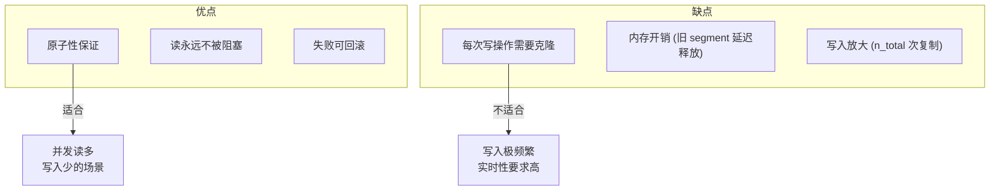

---

## 8. API 参考

### 8.1 公共接口

```c
/* 创建索引 */
cceh_index_t *cceh_index_create(uint32_t segment_capacity, 
                                  uint32_t initial_global_depth);

/* 销毁索引 */
void cceh_index_drop(cceh_index_t *index);

/* 插入 (key 已存在返回 1，成功返回 0) */
int cceh_index_insert(cceh_index_t *index,
                      const void *key,   uint32_t keylen,
                      const void *value, uint32_t valuelen);

/* 插入或更新 */
int cceh_index_upsert(cceh_index_t *index,
                      const void *key,   uint32_t keylen,
                      const void *value, uint32_t valuelen);

/* 删除 (存在返回 0，不存在返回 -1) */
int cceh_index_delete(cceh_index_t *index,
                      const void *key, uint32_t keylen);

/* 查找 (存在返回 0，value_out/valuelen_out 可为 NULL) */
int cceh_index_lookup(const cceh_index_t *index,
                      const void *key, uint32_t keylen,
                      void **value_out, uint32_t *valuelen_out);

/* 统计信息 */
uint32_t cceh_index_size(const cceh_index_t *index);
uint32_t cceh_index_global_depth(const cceh_index_t *index);
uint32_t cceh_index_directory_size(const cceh_index_t *index);
uint32_t cceh_index_segment_count(const cceh_index_t *index);
```

### 8.2 返回码说明

| 返回值 | 含义 |
|--------|------|
| 0 | 成功 |
| 1 | 已存在 (insert) 或 成功更新 (insert) |
| -1 | 失败 (参数错误、内存分配失败等) |

---

## 9. 测试覆盖

```bash
# 构建测试
cd build/engineering
cmake .. -DENGINEERING_BUILD=ON
make cceh_hash_test

# 运行测试
ctest -R cceh -V

# 测试用例
# ✓ 创建/销毁
# ✓ 基本插入/查找
# ✓ 重复插入
# ✓ 更新
# ✓ 删除
# ✓ 分裂触发
# ✓ 边界条件
# ✓ 并发测试 (可选)
```

---

## 10. 总结

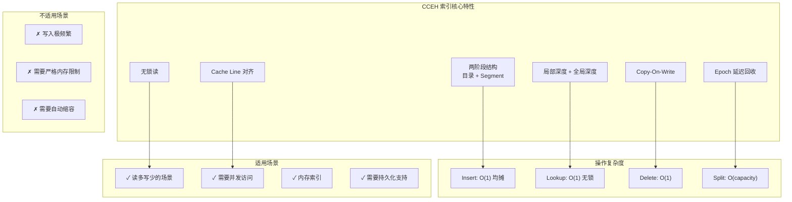

---

## 附录 A：关键常量

```c
#define CCEH_DEFAULT_SEGMENT_CAPACITY 8u   /* 默认 segment 容量 */
#define CCEH_DEFAULT_GLOBAL_DEPTH     1u   /* 默认全局深度 */
#define CCEH_MIN_SEGMENT_CAPACITY     2u   /* 最小容量 */
#define CCEH_CACHELINE_SIZE          64u   /* Cache Line 大小 */
#define CCEH_SLOT_EMPTY              0u    /* 空槽 */
#define CCEH_SLOT_LIVE               1u    /* 活跃槽 */
```

## 附录 B：哈希函数

```c
/* FNV-1a 哈希算法 */
uint32_t _cceh_hash_func(const void *key, uint32_t keylen) {
    const uint8_t *data = (const uint8_t *)key;
    uint32_t hash = 2166136261u;  /* FNV offset basis */
    
    for (uint32_t i = 0; i < keylen; i++) {
        hash ^= (uint32_t)data[i];
        hash *= 16777619u;         /* FNV prime */
    }
    return hash;
}

/* 指纹计算：从哈希值提取 8 位指纹 */
uint8_t _cceh_fingerprint(uint32_t hashval) {
    uint8_t fp = (uint8_t)(hashval ^ (hashval >> 8) ^ 
                           (hashval >> 16) ^ (hashval >> 24));
    return fp == 0u ? 1u : fp;  /* 避免 fingerprint 为 0 */
}
```

---

*文档版本: 1.0*
*创建日期: 2026-07-15*
*更新日期: 2026-07-15*
