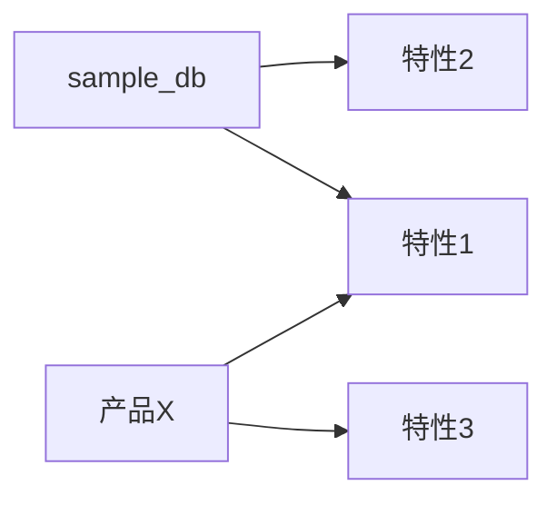
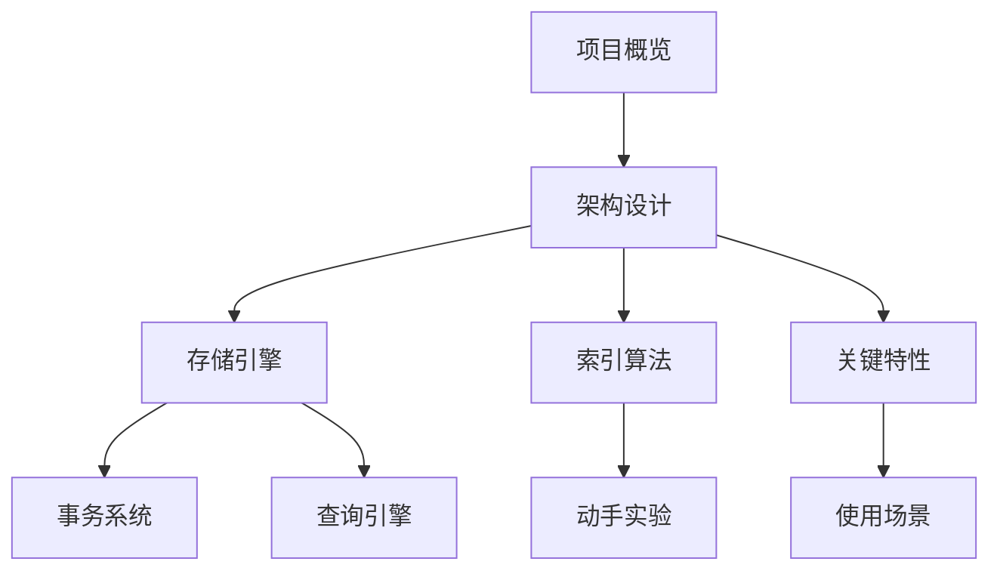

# sample_db 项目概览

## 学习目标
- 了解 sample_db 的定位和历史背景
- 掌握其核心设计理念和适用场景

## 项目定位

> 一句话描述：sample_db 是什么、解决什么问题。

**基本信息**：
- 开发方/作者：[公司/个人]
- 首次发布：[年份]
- 开源协议：[协议名]
- 最新版本：[版本]
- GitHub Stars：[数量]

## 核心设计理念

[2-3 段说明项目的核心设计哲学]

## 与其他产品的对比

## 学习路线图

建议按以下顺序学习 sample_db：

## 要点总结

- sample_db 的核心优势是什么
- 学习时重点关注什么

## 思考题

1. sample_db 为什么选择这种架构？
2. 与同类产品相比，它的决定性差异是什么？