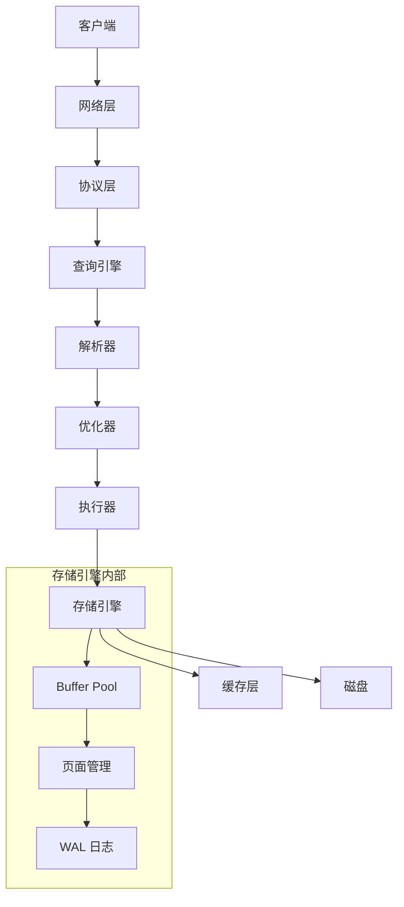
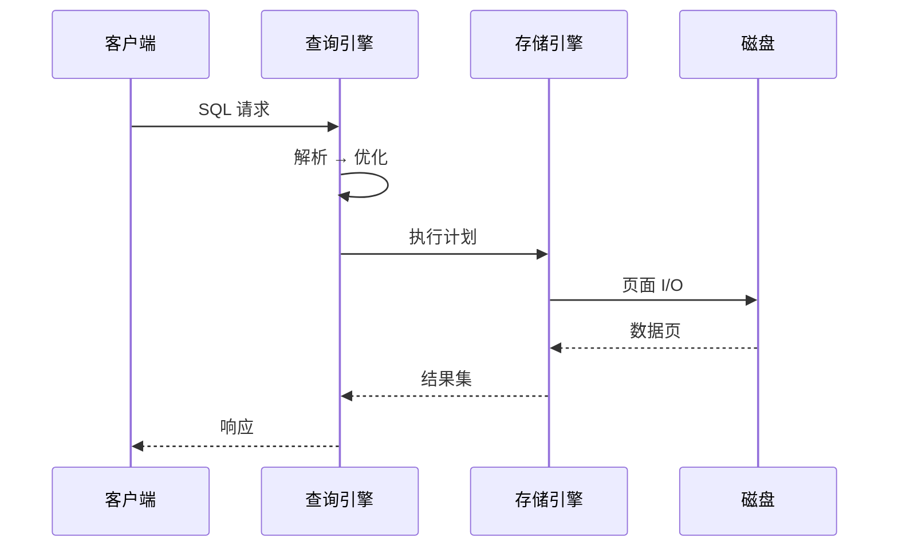

# sample_db 架构设计

## 学习目标
- 理解 sample_db 的整体架构分层
- 掌握各层之间的数据流

## 整体架构

## 各层职责

### 网络层
[说明]
### 协议层
[说明]
### 查询引擎
[说明]
### 存储引擎
[说明]
### 工具层
[说明]

## 关键数据流

## 要点总结

- 架构的核心分层思路
- 各层间的接口设计

## 思考题

1. 为什么 sample_db 选择这种分层？
2. 如果去掉某一层会有什么后果？