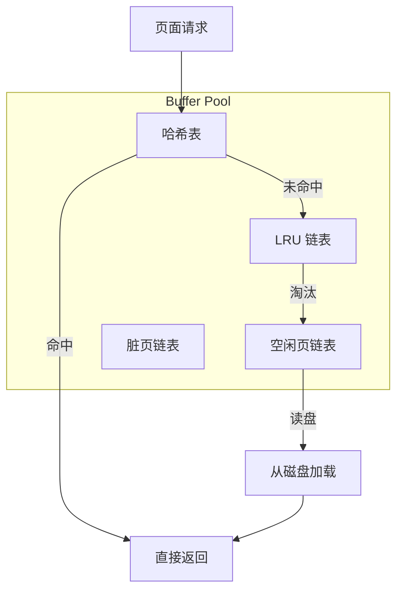
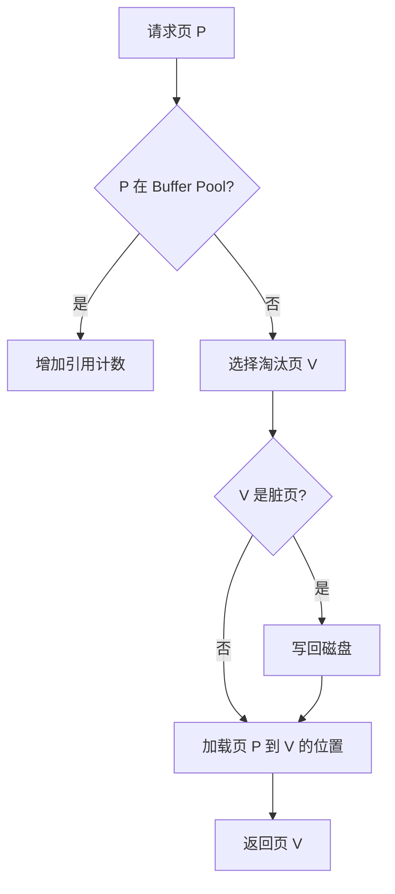

# Buffer Pool 实现

## 学习目标
- 理解 Buffer Pool 在数据库中的角色
- 掌握缓存淘汰算法和并发控制

## 核心概念

- **Buffer Pool**：内存中的页面缓存区，减少磁盘 I/O
- **Page**：最小的数据单元，通常 4KB-16KB
- **Dirty Page**：被修改后尚未写盘的页面
- **淘汰策略**：LRU/Clock/ARC 等

## 架构设计

## 淘汰算法

## 要点总结

- Buffer Pool 的核心组件：哈希表、链表、脏页管理
- 淘汰策略的选择影响 I/O 性能

## 思考题

1. LRU 和 Clock 算法的优劣对比？
2. 如何处理 Buffer Pool 的并发访问？