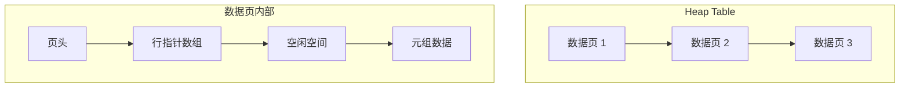
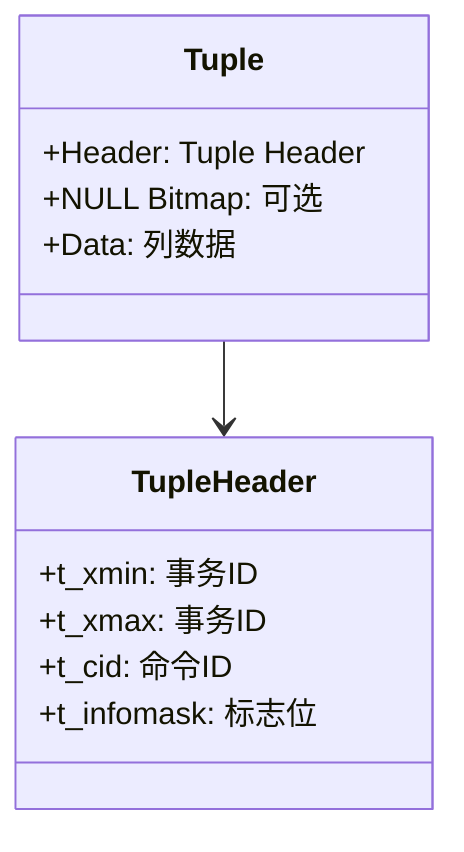

# 堆表存储

## 学习目标
- 理解堆表（Heap Table）的存储结构
- 掌握 Tuple 的布局和变长字段处理

## 核心概念

- **Heap Table**：无序存储的表，记录按插入顺序排列
- **Tuple**：表中的一行数据
- **Tuple ID (TID)**：行的唯一标识，通常为 (页号, 行号)

## 堆表结构

## Tuple 布局

## 要点总结

- 堆表是无序存储，适合 OLTP 场景
- Tuple 包含头部信息、NULL 位图和实际数据

## 思考题

1. 堆表与索引组织表的区别是什么？
2. 变长字段如何存储？