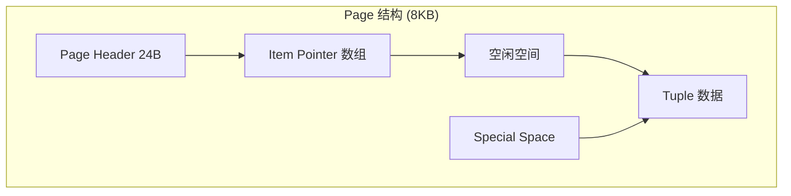
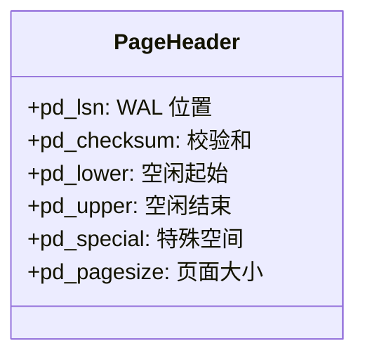
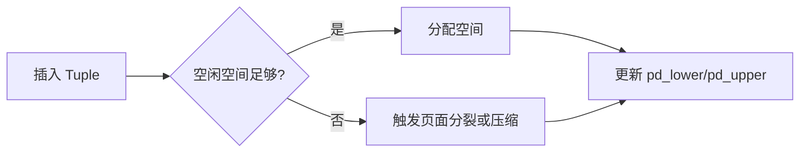

# 页面结构

## 学习目标
- 理解数据页的物理布局
- 掌握页面组织方式和空闲空间管理

## 核心概念

- **Page**：磁盘 I/O 的最小单位，通常 8KB
- **Page Header**：页面元数据
- **Item Pointer**：指向 Tuple 的指针

## 页面整体布局

## Page Header 结构

## 空闲空间管理

## 要点总结

- 页面采用头尾双端增长布局
- Item Pointer 从前往后，Tuple 从后往前

## 思考题

1. 为什么 Item Pointer 和 Tuple 从两端增长？
2. 如何判断一个页面是否有足够空闲空间？