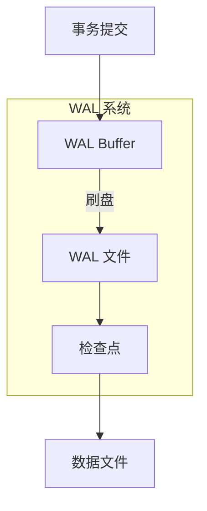
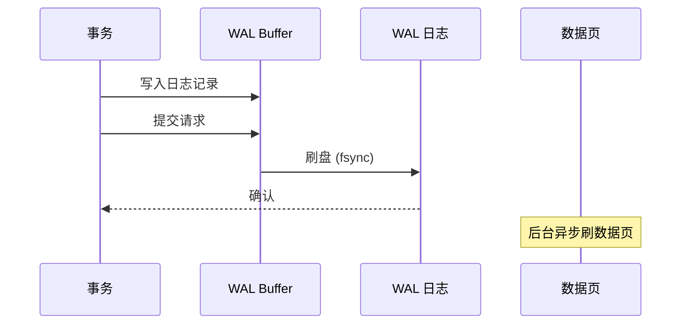
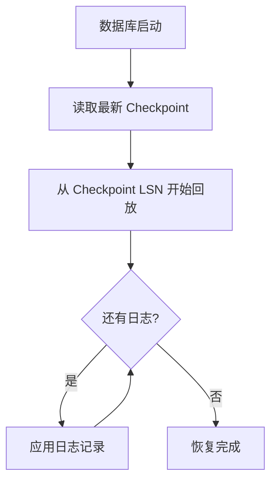

# WAL 日志

## 学习目标
- 理解 WAL（Write-Ahead Logging）的作用和原理
- 掌握 WAL 的写入流程和恢复机制

## 核心概念

- **WAL**：写前日志，先写日志再写数据，保证持久性
- **LSN**：日志序列号，单调递增
- **Checkpoint**：检查点，标记哪些日志已刷盘

## WAL 架构

## 写入流程

## 恢复流程

## 要点总结

- WAL 保证事务持久性，先日志后数据
- Checkpoint 减少恢复时需要回放的日志量

## 思考题

1. 为什么 WAL 刷盘必须在数据页刷盘之前？
2. 检查点频率如何影响性能和恢复时间？