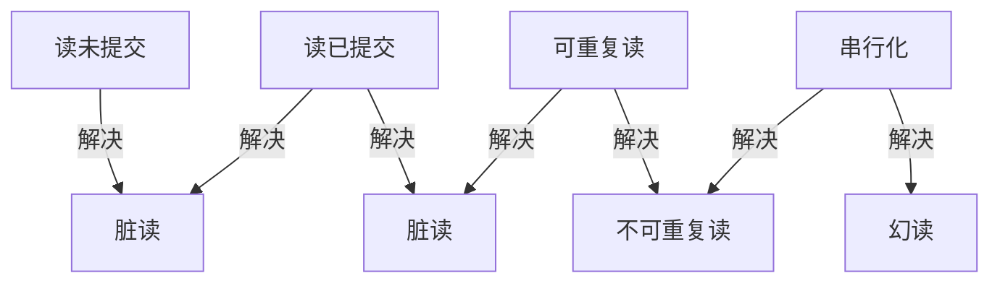
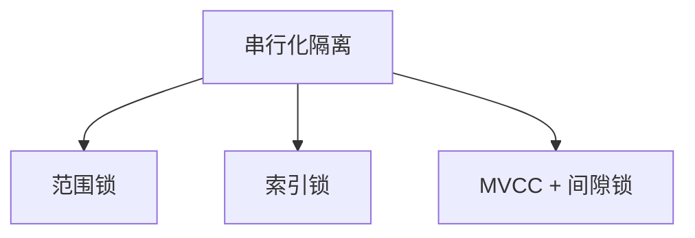

# 隔离级别

## 学习目标
- 理解四种隔离级别的定义和区别
- 掌握各隔离级别解决的问题

## 核心概念

- **脏读**：读取未提交的数据
- **不可重复读**：同一事务内两次读取结果不同
- **幻读**：同一事务内两次查询结果集不同

## 隔离级别对比

## 各级别实现

| 隔离级别 | 脏读 | 不可重复读 | 幻读 | 实现方式 |
|----------|------|------------|------|----------|
| 读未提交 | 可能 | 可能 | 可能 | 无锁 |
| 读已提交 | 不可能 | 可能 | 可能 | MVCC 快照 |
| 可重复读 | 不可能 | 不可能 | 可能 | MVCC 快照 |
| 串行化 | 不可能 | 不可能 | 不可能 | 范围锁 |

## 幻读解决方式

## 要点总结

- 隔离级别从低到高依次解决脏读、不可重复读、幻读
- MVCC 实现了读已提交和可重复读

## 思考题

1. 为什么串行化隔离级别性能最差？
2. 如何选择合适的隔离级别？