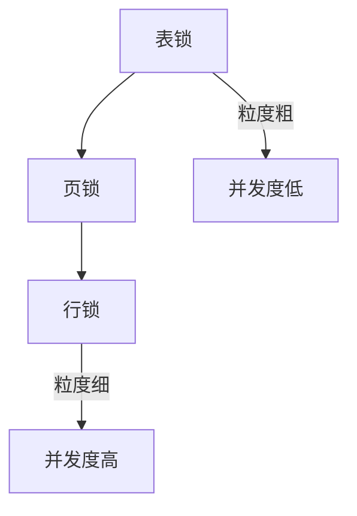
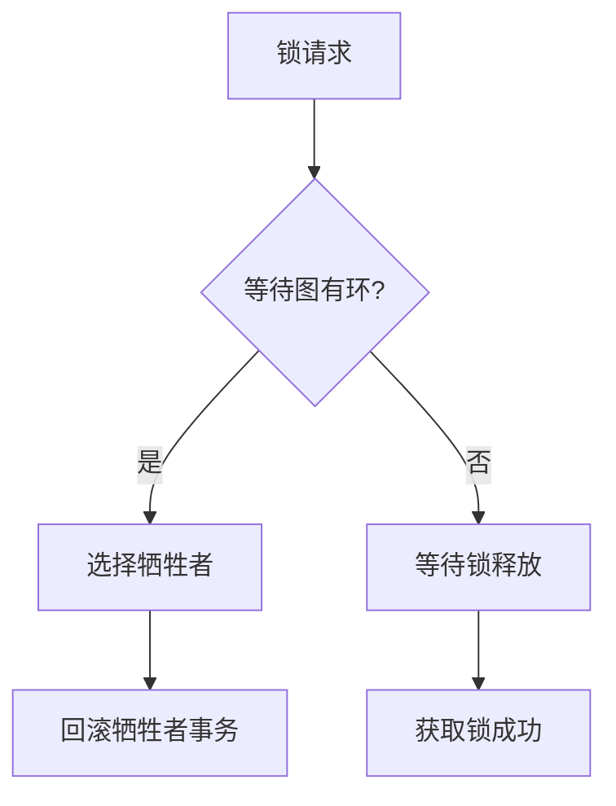

# 锁机制

## 学习目标
- 理解数据库锁的层级和类型
- 掌握锁的兼容矩阵和死锁检测

## 核心概念

- **锁层级**：表锁、行锁、页锁
- **锁类型**：共享锁(S)、排他锁(X)、意向锁
- **死锁**：多个事务相互等待对方释放锁

## 锁层级

## 锁兼容矩阵

| 请求\持有 | S | X | IS | IX |
|----------|---|---|----|----|
| S | ✅ | ❌ | ✅ | ❌ |
| X | ❌ | ❌ | ❌ | ❌ |
| IS | ✅ | ❌ | ✅ | ✅ |
| IX | ❌ | ❌ | ✅ | ✅ |

## 死锁检测

## 要点总结

- 锁层级影响并发度和锁管理开销
- 死锁检测通过等待图环检测实现

## 思考题

1. 意向锁的作用是什么？
2. 如何减少死锁发生概率？