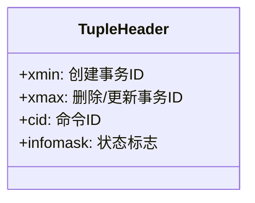
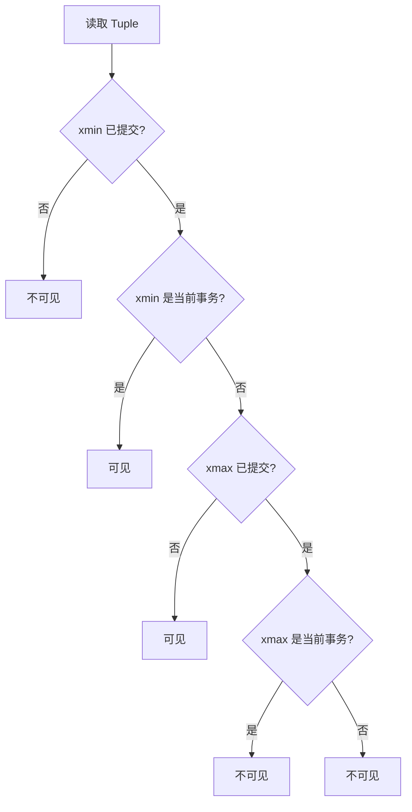

# MVCC 多版本并发控制

## 学习目标
- 理解 MVCC 的核心思想和实现方式
- 掌握版本链的管理和可见性判断

## 核心概念

- **MVCC**：多版本并发控制，读不阻塞写，写不阻塞读
- **版本链**：同一行的多个版本通过指针链接
- **可见性**：根据事务 ID 判断哪个版本对当前事务可见

## 版本链结构

## Tuple 头部信息

## 可见性判断

## 要点总结

- MVCC 通过版本链实现读写并发
- 可见性判断基于事务 ID 和提交状态

## 思考题

1. MVCC 如何处理 Update 操作？
2. 版本链过长如何优化？