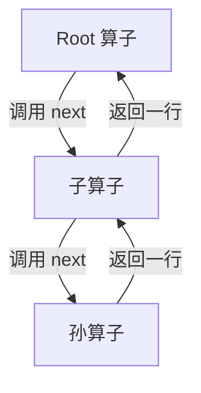
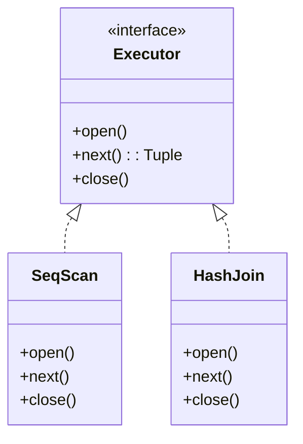
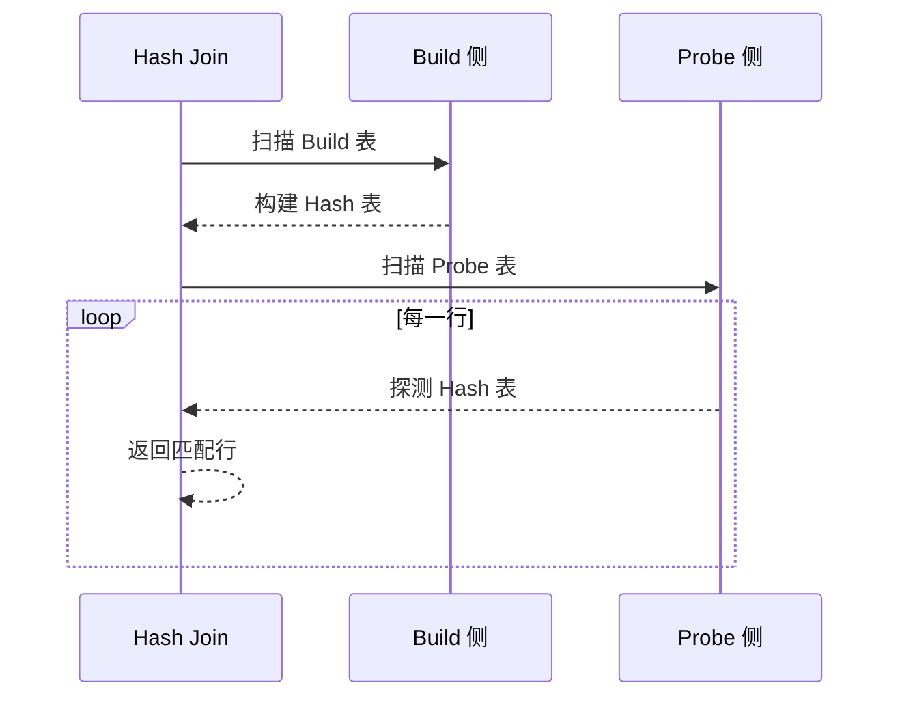

# 执行器

## 学习目标
- 理解火山模型执行器的原理
- 掌握常见执行算子的实现

## 核心概念

- **火山模型**：迭代器模型，每个算子实现 open-next-close 接口
- **执行算子**：Scan、Join、Agg、Sort 等
- **向量化执行**：批量处理多行数据

## 火山模型

## 算子接口

## Hash Join 执行流程

## 要点总结

- 火山模型是流水线式拉取执行
- 每个算子独立实现，易于扩展

## 思考题

1. 火山模型的性能瓶颈在哪里？
2. 向量化执行如何提升性能？