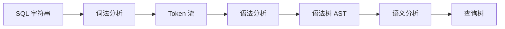
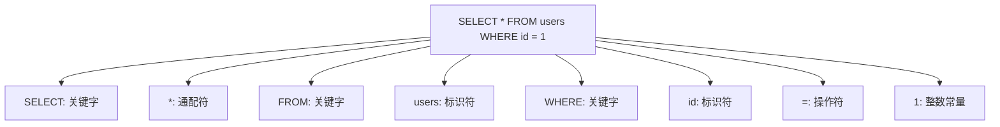
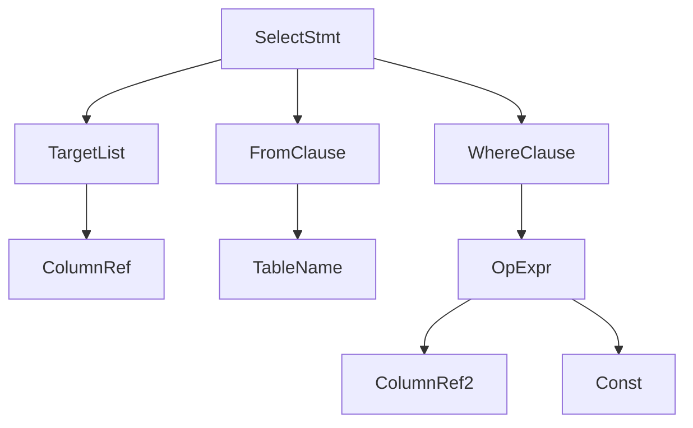

# SQL 解析

## 学习目标
- 理解 SQL 语句的解析流程
- 掌握词法分析和语法分析的作用

## 核心概念

- **词法分析**：将 SQL 字符串拆分为 Token
- **语法分析**：根据语法规则构建语法树
- **AST**：抽象语法树，SQL 的结构化表示

## 解析流程

## 词法分析示例

## AST 结构

## 要点总结

- 解析分为词法分析、语法分析和语义分析
- AST 是后续优化和执行的基础

## 思考题

1. 如何处理 SQL 语法错误？
2. AST 如何支持复杂的嵌套查询？