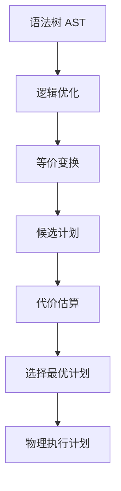
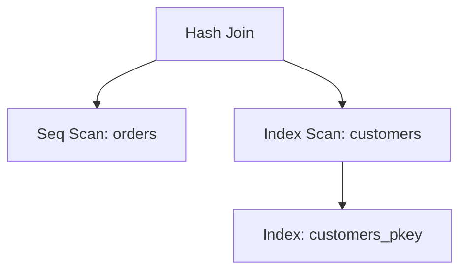
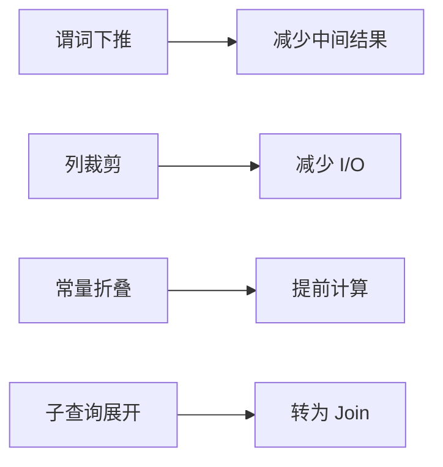

# 查询规划

## 学习目标
- 理解查询优化器的作用和工作原理
- 掌握查询计划的生成和选择

## 核心概念

- **查询优化器**：选择最优执行计划
- **逻辑优化**：基于规则的变换（如谓词下推）
- **物理优化**：基于代价的选择（如索引选择）
- **执行计划**：具体的执行步骤树

## 优化流程

## 查询计划树示例

## 常见优化规则

## 代价估算

| 操作 | 代价公式 |
|------|----------|
| 顺序扫描 | N_pages * seq_page_cost |
| 索引扫描 | N_index_pages + N_tuples * cpu_tuple_cost |
| Hash Join | build_cost + probe_cost |

## 要点总结

- 优化器分为逻辑优化和物理优化
- 代价模型基于统计信息估算

## 思考题

1. 统计信息不准确会影响优化效果吗？
2. 如何强制使用特定索引？