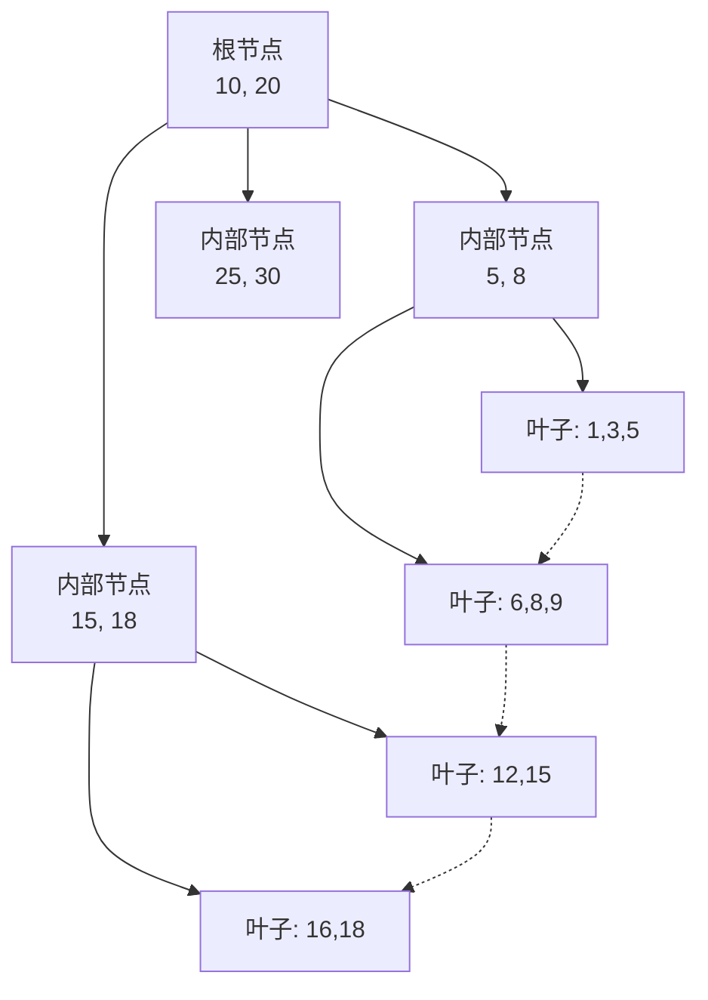
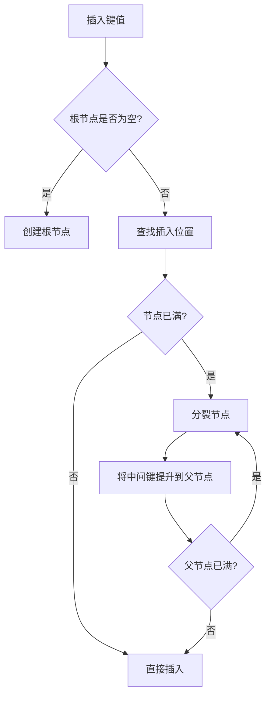
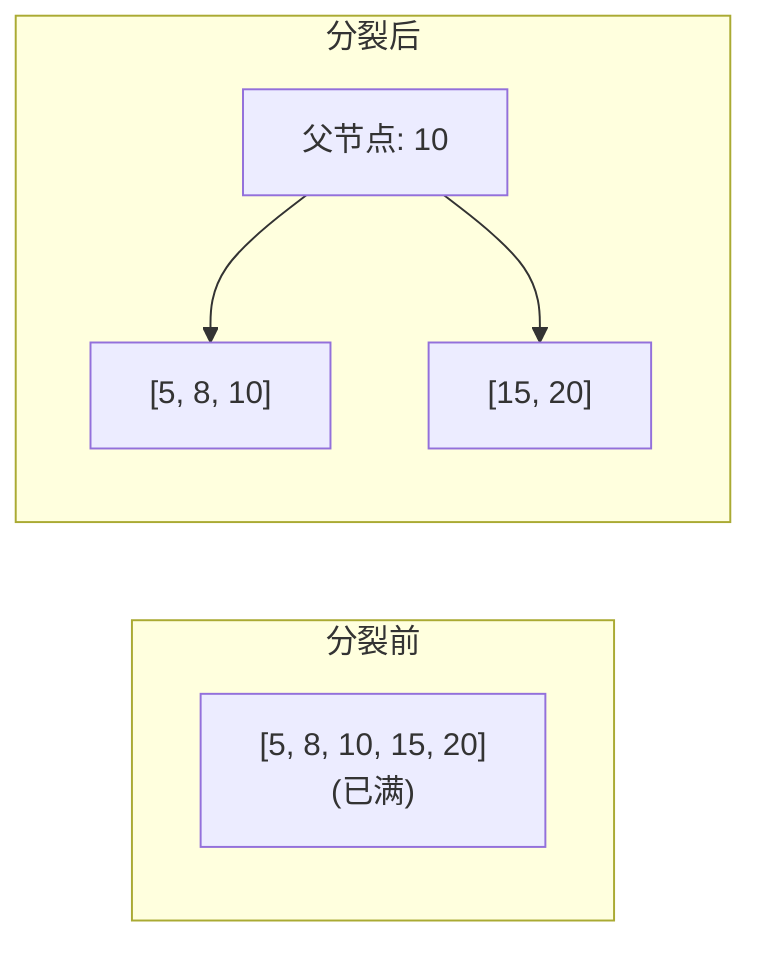

# BTree 索引

## 学习目标
- 理解 BTree/B+Tree 的结构和特性
- 掌握插入和分裂流程

## 核心概念

- **B+Tree**：平衡多路搜索树，非叶子节点只存键值
- **Page**：树中的每个节点对应一个页
- **分裂**：节点满时分裂为两个节点

## B+Tree 结构

## 插入流程

## 分裂过程

## 要点总结

- B+Tree 所有数据在叶子节点，叶子节点链表连接
- 分裂向上传播，可能影响树高

## 思考题

1. B+Tree 与 BTree 的核心区别是什么？
2. 分裂频率如何影响写入性能？