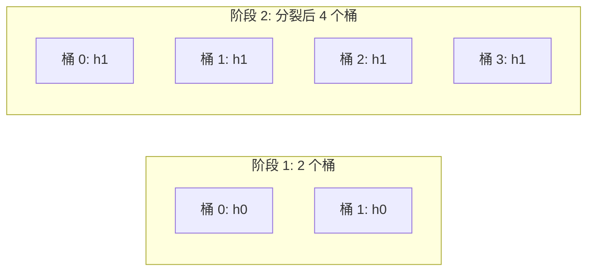

# Hash 索引

## 学习目标
- 理解 Hash 索引的结构和工作原理
- 掌握动态哈希和静态哈希的区别

## 核心概念

- **Hash 函数**：将键映射为桶号
- **桶**：存储哈希值相同（或冲突）的条目
- **冲突解决**：链地址法、开放地址法、线性哈希

## Hash 索引结构

```mermaid
graph TD
    Key["键"] --> HashFunc[Hash 函数]
    HashFunc --> Bucket["桶数组"]
    Bucket --> Slot1[槽 0]
    Bucket --> Slot2[槽 1]
    Bucket --> Slot3[槽 2]
    Slot1 --> Chain1[链: (k1,v1) → (k4,v4)]
    Slot2 --> Chain2[链: (k2,v2)]
    Slot3 --> Chain3[链: (k3,v3) → (k5,v5)]
```

## 查找流程

```mermaid
flowchart TD
    A[给定键 K] --> B[计算 Hash(K)]
    B --> C[定位桶 B]
    C --> D[遍历桶内链表]
    D --> E{找到匹配键?}
    E -->|是| F[返回值]
    E -->|否| G[返回未找到]
```

## 动态哈希：线性哈希



## 要点总结

- Hash 索引适合等值查询，不适合范围查询
- 动态哈希避免静态哈希的扩容代价

## 思考题

1. Hash 索引为什么不适合范围查询？
2. 线性哈希如何平滑扩容？