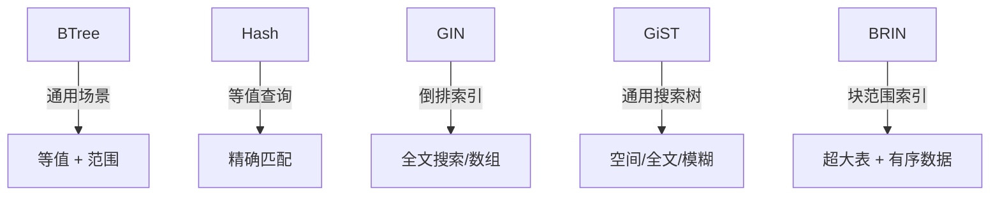
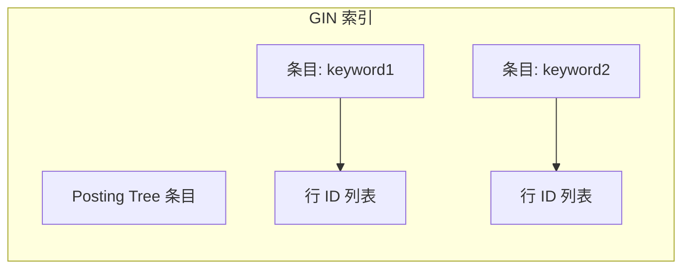
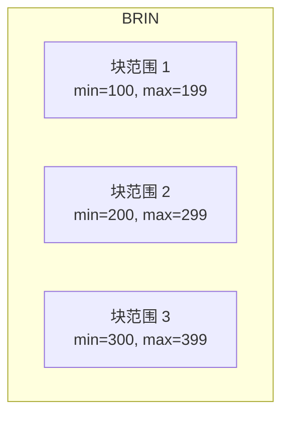

# 其他索引

## 学习目标
- 了解 GIN、GiST、BRIN 等索引的工作原理
- 掌握不同索引的适用场景

## 索引类型对比

## GIN 索引结构

## GiST 索引

GiST 是一棵平衡搜索树，支持自定义数据类型：
- **空间数据**：R-Tree 风格的 bounding box
- **全文搜索**：相似度查询
- **范围类型**：重叠检查

## BRIN 索引

适用于按物理顺序有序的大表：

## 索引选型建议

| 场景 | 推荐索引 | 说明 |
|------|----------|------|
| 等值 + 范围 | BTree | 通用首选 |
| 全文搜索 | GIN | 倒排索引 |
| 空间查询 | GiST | R-Tree |
| 超大有序表 | BRIN | 极省空间 |

## 要点总结

- 不同索引适用于不同场景
- 索引选择直接影响查询性能

## 思考题

1. 一张表可以同时创建多个不同类型的索引吗？
2. BRIN 索引为什么不适合乱序数据？