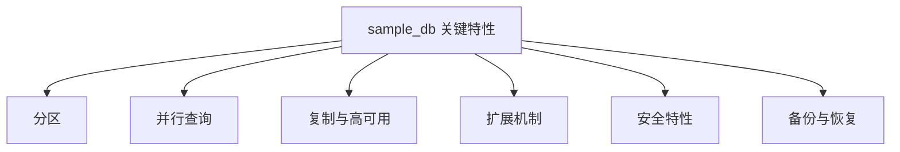
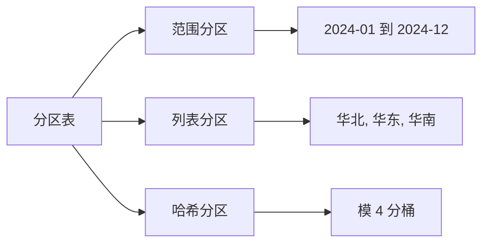
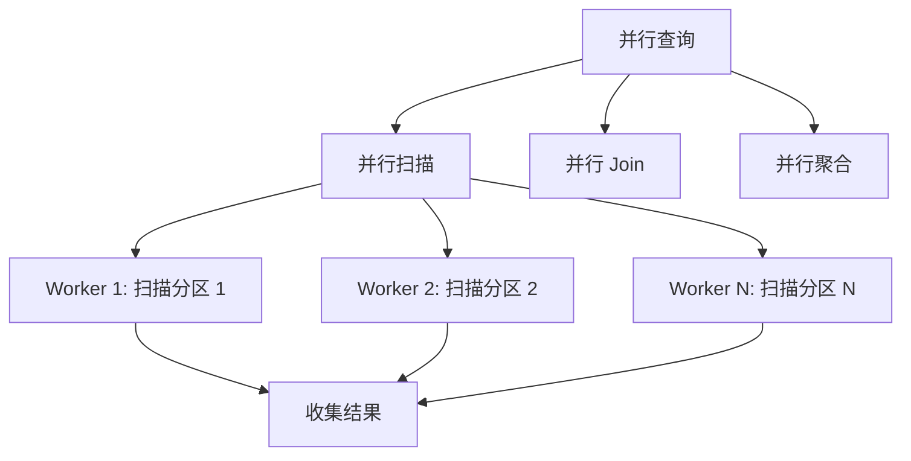
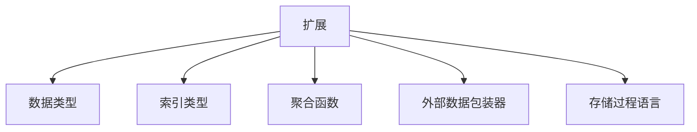

# 关键特性

## 学习目标
- 了解 sample_db 的关键特性
- 掌握这些特性解决的问题和使用场景

## 核心概念

- **分区**：将大表拆分为更小的物理存储单元
- **并行查询**：利用多核 CPU 加速查询
- **扩展机制**：插件、扩展、自定义函数

## 特性总览

## 分区策略

## 并行查询

## 扩展机制

## 要点总结

- 分区提升大表的管理和查询效率
- 并行查询利用多核资源加速

## 思考题

1. 分区键如何选择？
2. 并行度如何设置？