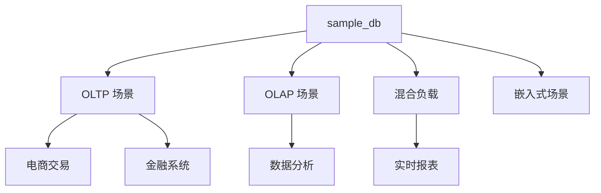
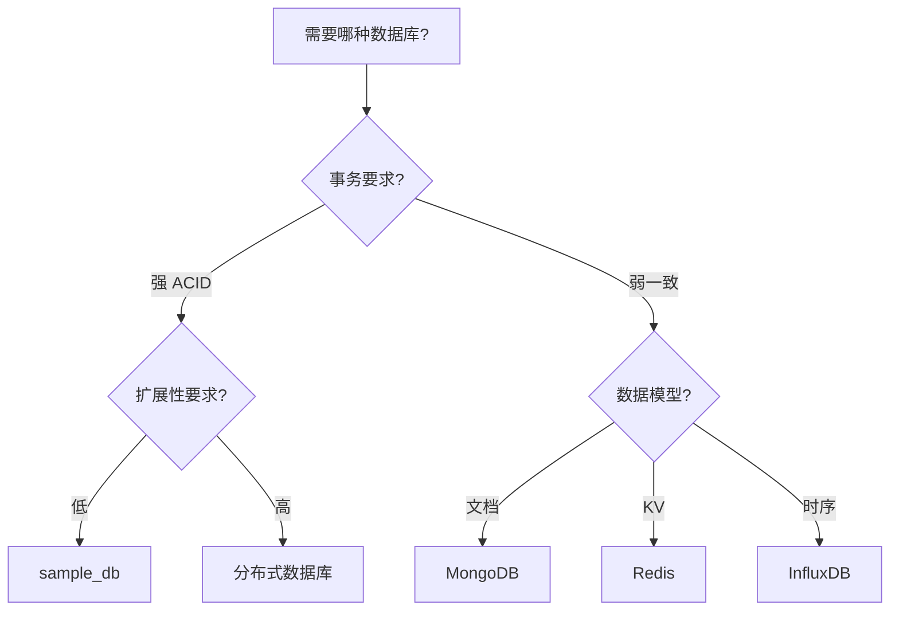

# 使用场景与选型对比

## 学习目标
- 理解 sample_db 的最佳适用场景
- 掌握与其他数据库的选型对比

## 核心概念

- **选型维度**：性能、一致性、可用性、扩展性、运维成本
- **CAP**：一致性、可用性、分区容忍性的权衡

## 适用场景

## 选型对比

| 维度 | sample_db | 产品 A | 产品 B |
|------|-----------|--------|--------|
| 事务支持 | 强 ACID | 强 ACID | 最终一致性 |
| 性能 | 中 | 高 | 高 |
| 扩展性 | 垂直为主 | 水平扩展 | 水平扩展 |
| 运维复杂度 | 低 | 中 | 高 |
| 社区活跃度 | 高 | 高 | 中 |

## 决策流程

## 要点总结

- 选型没有银弹，需根据具体场景权衡
- 事务一致性、扩展性、性能是核心选择维度

## 思考题

1. 什么场景下 sample_db 不适合？
2. 如何评估迁移成本？