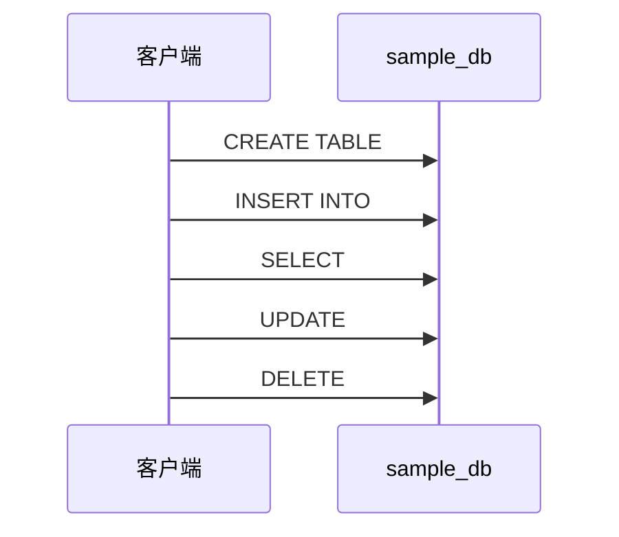

# 动手实验

## 学习目标
- 掌握 sample_db 的安装部署方法
- 通过实验验证核心功能

## 实验环境要求

- 操作系统：[推荐系统]
- 内存：[最低要求]
- 磁盘：[存储要求]
- 依赖：[依赖列表]

## 实验一：安装部署

```bash
# 安装命令
# 创建数据库
# 连接数据库
```

## 实验二：CRUD 操作



## 实验三：索引与性能

```sql
-- 创建表
CREATE TABLE test_table (id INT, data VARCHAR(100));

-- 插入测试数据
INSERT INTO test_table SELECT generate_series(1, 100000), 'data';

-- 无索引查询
EXPLAIN ANALYZE SELECT * FROM test_table WHERE id = 50000;

-- 创建索引
CREATE INDEX idx_test ON test_table(id);

-- 有索引查询
EXPLAIN ANALYZE SELECT * FROM test_table WHERE id = 50000;
```

## 实验四：Benchmark


## 实验对比

| 实验 | 工具 | 指标 | 预期结果 |
|------|------|------|----------|
| 写入性能 | pgbench | TPS | 见具体文档 |
| 读取性能 | pgbench | TPS | 见具体文档 |
| 并发 | sysbench | 连接数 | 见具体文档 |

## 要点总结

- 动手实验加深对数据库的理解
- Benchmark 提供性能基准参考

## 思考题

1. 如何优化 TPS？
2. 缓存预热对 Benchmark 结果的影响？